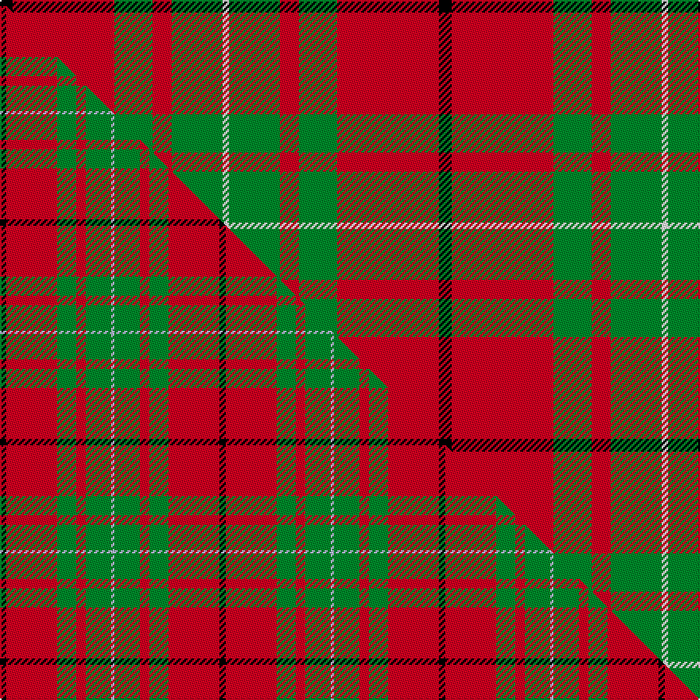

This is one **variant** — a specific cloth: this exact thread count and colourway, with its own
provenance below. It is one weaving of the [sett](/setts/k2r16g6r3g8w1/) (the scale-free proportion — the
same cloth at any scale or shade), whose colour order is pattern [KRGRGW](/stripes/krgrgw/).

Part of the [MacAulay](/tartans/macaulay/) tartan — the named design grouping this sett with its other cloths.

Sourced from tartans-authority.  It is a [6 stripe tartan](/stripes/stripes6/).

Original link [https://www.tartanregister.gov.uk/tartanDetails.aspx?ref=1164](https://www.tartanregister.gov.uk/tartanDetails.aspx?ref=1164)

Dataset <small>— provenance for this record, inherited from the source manifest</small>

<dl class="dataset-prov">
<dt>source</dt><dd><a href="/sources/tartans-authority/">Scottish Tartans Authority</a></dd>
<dt>data captured from</dt><dd><a href="https://github.com/thetartan/tartan-database/blob/master/data/tartans-authority/data.csv">https://github.com/thetartan/tartan-database/blob/master/data/tartans-authority/data.csv</a></dd>
<dt>data date</dt><dd>pre 1880 <small>(this record)</small></dd>
<dt>licence</dt><dd><a href="https://creativecommons.org/licenses/by-nc-nd/4.0/">CC BY-NC-ND 4.0</a></dd>
</dl>

Capture chain <small>— the hands this data passed through, oldest first; each capture carries its own licence</small>

<ol class="capture-chain">
<li><a href="https://www.tartansauthority.com/">Scottish Tartans Authority</a> <small>the heritage body's archive — its tartan-ferret record browser is retired (links repaired to the SRT, above)</small></li>
<li><a href="https://github.com/thetartan/tartan-database">thetartan/tartan-database</a> <small>2016-2017</small> · <a href="https://creativecommons.org/licenses/by-nc-nd/4.0/">CC BY-NC-ND 4.0</a> <small>Levko Kravets's frozen compilation — the capture we vendored, and where its CC licence text came from</small></li>
<li>this dictionary <small>captured 2026-06-10 · commit 5bf86c7566</small> <small>each re-capture is a git commit to data/sources</small></li>
</ol>

## Register references

External register numbers recorded for this tartan.

- Scottish Tartans Authority (ITI): 1164

## Thread count
K/8 R64 G24 R12 G32 W/4

One full sett is **276 threads**.

## Palette
<table><thead><tr><th>Colour</th><th>Shade</th><th>OKLCh</th></tr></thead><tbody><tr><td>G</td><td><code style="background-color:#008B2A;">#008B2A</code> <small style="color:#888">#008B2A</small></td><td><small style="color:#888">oklch(55.4% 0.170 145.9)</small></td></tr><tr><td>K</td><td><code style="background-color:#000000;">#000000</code> <small style="color:#888">#000000</small></td><td><small style="color:#888">oklch(0.0% 0.000 0.0)</small></td></tr><tr><td>W</td><td><code style="background-color:#F7F7F7;">#F7F7F7</code> <small style="color:#888">#F7F7F7</small></td><td><small style="color:#888">oklch(97.6% 0.000 89.9)</small></td></tr><tr><td>R</td><td><code style="background-color:#D60020;">#D60020</code> <small style="color:#888">#D60020</small></td><td><small style="color:#888">oklch(55.2% 0.224 25.5)</small></td></tr></tbody></table>

# Sample pattern

## Compared to the master

This cloth is one sett of its design; the master sett (the exemplar the design is anchored on) is below for comparison.

Its **ΔTartan distance** from the master is **0.30** — the same measure the nearest-tartans table ranks by (0 is identical; a re-scale of the same cloth is near 0, a recolour or a different proportion further).

<figure class="master-compare" style="margin:0">

this sett
master sett ★

<figcaption style="color:#888;font-size:smaller">One weave of this sett against the <a href="/setts/k2r16g6r3g8lb1/">master sett ★</a>, split on the diagonal: a shared proportion runs seamlessly across it with only the shades shifting; a different proportion breaks on it.</figcaption>
</figure>

## Nearest tartan variants

The nearest existing variants by ΔTartan distance, with this cloth at the top so the swatches line up against it.

ΔTartan

Threads

Variant

Sett

—

276

<a href="/variants/s6/k2r16g6r3g8w1~x4/">MacAulay (Clan)</a>

<a href="/ttd/edit/#slug=k2r16g6r3g8w1&amp;base=k2r16g6r3g8w1~x4" title="compare in the TTD">0.00</a>

69

<a href="/variants/s6/k2r16g6r3g8w1/">MacAulay</a>

<a href="/ttd/edit/#slug=k2r16g6r3g8w1~x2&amp;base=k2r16g6r3g8w1~x4" title="compare in the TTD">0.00</a>

138

<a href="/variants/s6/k2r16g6r3g8w1~x2/">MacAulay Tartan</a>

<a href="/ttd/edit/#slug=k2r16g6r3g8lb1~x2&amp;base=k2r16g6r3g8w1~x4" title="compare in the TTD">0.30</a>

138

<a href="/variants/s6/k2r16g6r3g8lb1~x2/">MacAulay</a>

<a href="/ttd/edit/#slug=r35g16r5g5w2k3~x2&amp;base=k2r16g6r3g8w1~x4" title="compare in the TTD">0.48</a>

188

<a href="/variants/s6/r35g16r5g5w2k3~x2/">MacGregor</a>

<a href="/ttd/edit/#slug=g9r2g9r14k1w2~x2&amp;base=k2r16g6r3g8w1~x4" title="compare in the TTD">0.49</a>

126

<a href="/variants/s6/g9r2g9r14k1w2~x2/">MacGregor of Balquhidder Clan Tartan</a>

<a href="/ttd/edit/#slug=g9r2g9r14k1w2~x4&amp;base=k2r16g6r3g8w1~x4" title="compare in the TTD">0.49</a>

252

<a href="/variants/s6/g9r2g9r14k1w2~x4/">MacGregor of Balquidder - 1831 (Clan</a>

<a href="/ttd/edit/#slug=g10r4g46r69k2w6&amp;base=k2r16g6r3g8w1~x4" title="compare in the TTD">0.55</a>

258

<a href="/variants/s6/g10r4g46r69k2w6/">Colchester &amp; District Pipes &amp; Drums</a>

<a href="/ttd/edit/#slug=g16r5g2r18k2&amp;base=k2r16g6r3g8w1~x4" title="compare in the TTD">0.75</a>

68

<a href="/variants/s5/g16r5g2r18k2/">MacDonald of Sleat</a>

<a href="/ttd/edit/#slug=g16r5g2r18k2~x2&amp;base=k2r16g6r3g8w1~x4" title="compare in the TTD">0.75</a>

136

<a href="/variants/s5/g16r5g2r18k2~x2/">MacDonald, Lord of The Isles (Artef)</a>

<a href="/ttd/edit/#slug=g7r3g1r9k1~x2&amp;base=k2r16g6r3g8w1~x4" title="compare in the TTD">0.78</a>

68

<a href="/variants/s5/g7r3g1r9k1~x2/">MacDonald of Sleat</a>

## Neighbour map

Every grey dot is one of 13621 variants placed by the first two principal components of the ΔTartan feature space (42% of its variance). Red is this tartan; blue dots are its nearest — click one to open its page.

<svg viewBox="0 0 640 380" role="img" style="max-width:100%;height:auto;border:1px solid #e0e0e0;border-radius:4px;display:block" xmlns="http://www.w3.org/2000/svg"><image href="/nn/cloud.v1.png" width="640" height="380"/><a href="/variants/s6/k2r16g6r3g8w1/"><circle cx="292.5" cy="173.1" r="4" fill="#3465a4"><title>MacAulay</title></circle></a><a href="/variants/s6/k2r16g6r3g8w1~x2/"><circle cx="292.5" cy="173.1" r="4" fill="#3465a4"><title>MacAulay Tartan</title></circle></a><a href="/variants/s6/k2r16g6r3g8lb1~x2/"><circle cx="297.3" cy="174.6" r="4" fill="#3465a4"><title>MacAulay</title></circle></a><a href="/variants/s6/r35g16r5g5w2k3~x2/"><circle cx="351.7" cy="150.4" r="4" fill="#3465a4"><title>MacGregor</title></circle></a><a href="/variants/s6/g9r2g9r14k1w2~x2/"><circle cx="271.4" cy="189.6" r="4" fill="#3465a4"><title>MacGregor of Balquhidder Clan Tartan</title></circle></a><a href="/variants/s6/g9r2g9r14k1w2~x4/"><circle cx="271.4" cy="189.6" r="4" fill="#3465a4"><title>MacGregor of Balquidder - 1831 (Clan</title></circle></a><a href="/variants/s6/g10r4g46r69k2w6/"><circle cx="353.4" cy="129.1" r="4" fill="#3465a4"><title>Colchester &amp; District Pipes &amp; Drums</title></circle></a><a href="/variants/s5/g16r5g2r18k2/"><circle cx="315.9" cy="221.0" r="4" fill="#3465a4"><title>MacDonald of Sleat</title></circle></a><a href="/variants/s5/g16r5g2r18k2~x2/"><circle cx="315.9" cy="221.0" r="4" fill="#3465a4"><title>MacDonald, Lord of The Isles (Artef)</title></circle></a><a href="/variants/s5/g7r3g1r9k1~x2/"><circle cx="329.1" cy="222.3" r="4" fill="#3465a4"><title>MacDonald of Sleat</title></circle></a><circle cx="292.5" cy="173.1" r="5" fill="#c00000"/><text x="320" y="376" text-anchor="middle" font-size="11" fill="#999">ground</text><text x="11" y="190" text-anchor="middle" font-size="11" fill="#999" transform="rotate(-90 11 190)">complexity</text></svg>

ID: /variants/s6/k2r16g6r3g8w1~x4/
