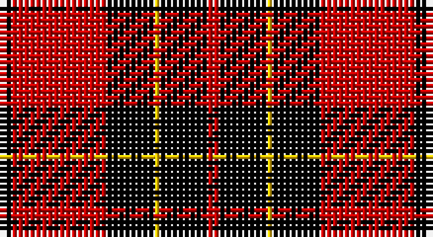

This page is one **sett** — a single exact thread-count. It belongs to the [tartan](/setts/k2r16k8ly1k8r2/)
(the same proportion at any scale), whose colour order is pattern [KRKYKR](/stripes/krkykr/).

Part of the [Brodie Dress](/tartans/brodie-dress/) tartan — the named design grouping this sett with its other cloths.

Sourced from weddslist.  It is a [6 stripe tartan](/stripes/stripes6/).

Original link http://www.weddslist.com/cgi-bin/tartans/pg.pl?source=rb

## Also known as

This cloth is also recorded under:

- Brodie

2 attestations — the source records this cloth was collapsed from (oldest owns this page)

<ul>
<li>undated — Brodie Dress (weddslist, <a href="http://www.weddslist.com/cgi-bin/tartans/pg.pl?source=rb">record</a>)</li>
<li>undated — Brodie Dress (weddslist, <a href="http://www.weddslist.com/cgi-bin/tartans/pg.pl?source=x">record</a>)</li>
</ul>

## Thread count
K/2 R16 K8 Y1 K8 R/2

One full sett is **70 threads**.

## Palette

Palette: <strong>Tartan Register</strong> <small style="color:#888">(2 of 3 colours)</small>
<table><thead><tr><th>Colour</th><th>Threads</th><th>Shade</th><th>Base</th><th>OKLCh</th></tr></thead><tbody><tr><td>K/</td><td style="text-align:right;font-variant-numeric:tabular-nums">2</td><td><code style="background-color:#000000;">#000000</code> <small style="color:#888">#000000</small></td><td>K <code style="background-color:#000000;">#000000</code></td><td><small style="color:#888">oklch(0.0% 0.000 0.0)</small></td></tr><tr><td>R</td><td style="text-align:right;font-variant-numeric:tabular-nums">16</td><td><code style="background-color:#C80000;">#C80000</code> <small style="color:#888">#C80000</small></td><td>R <code style="background-color:#CC0000;">#CC0000</code></td><td><small style="color:#888">oklch(52.3% 0.215 29.2)</small></td></tr><tr><td>K</td><td style="text-align:right;font-variant-numeric:tabular-nums">8</td><td><code style="background-color:#000000;">#000000</code> <small style="color:#888">#000000</small></td><td>K <code style="background-color:#000000;">#000000</code></td><td><small style="color:#888">oklch(0.0% 0.000 0.0)</small></td></tr><tr><td>Y</td><td style="text-align:right;font-variant-numeric:tabular-nums">1</td><td><code style="background-color:#FFC800;">#FFC800</code> <small style="color:#888">#FFC800</small></td><td>Y <code style="background-color:#F2BF00;">#F2BF00</code></td><td><small style="color:#888">oklch(85.7% 0.175 88.5)</small></td></tr><tr><td>K</td><td style="text-align:right;font-variant-numeric:tabular-nums">8</td><td><code style="background-color:#000000;">#000000</code> <small style="color:#888">#000000</small></td><td>K <code style="background-color:#000000;">#000000</code></td><td><small style="color:#888">oklch(0.0% 0.000 0.0)</small></td></tr><tr><td>R/</td><td style="text-align:right;font-variant-numeric:tabular-nums">2</td><td><code style="background-color:#C80000;">#C80000</code> <small style="color:#888">#C80000</small></td><td>R <code style="background-color:#CC0000;">#CC0000</code></td><td><small style="color:#888">oklch(52.3% 0.215 29.2)</small></td></tr></tbody></table>

# Sample pattern

## Compared to the master

This cloth is one sett of its design; the master sett (the exemplar the design is anchored on) is below for comparison.

<figure style="margin:0"><figcaption style="color:#888;font-size:smaller">this sett</figcaption></figure>
<figure style="margin:0"><figcaption style="color:#888;font-size:smaller"><a href="/setts/k6r33k18w20db6/">master sett →</a></figcaption></figure>

## Nearest tartans

The nearest existing variants by ΔTartan distance, with this tartan at the top so the swatches line up against it.

ΔTartan

Tartan

Sett

—

<a href="/ttd/edit/#slug=k2r16k8ly1k8r2">Brodie Dress</a> <a class="nn-out" href="/variants/s6/k2r16k8ly1k8r2/" title="open its dictionary page">↗</a>

0.12

<a href="/ttd/edit/#slug=k2r16k8ly1k8r2~x2&amp;base=k2r16k8ly1k8r2">Brodie</a> <a class="nn-out" href="/variants/s6/k2r16k8ly1k8r2~x2/" title="open its dictionary page">↗</a>

0.85

<a href="/ttd/edit/#slug=k2r6k2r6k12ly1~x2&amp;base=k2r16k8ly1k8r2">MacQueen</a> <a class="nn-out" href="/variants/s6/k2r6k2r6k12ly1~x2/" title="open its dictionary page">↗</a>

0.89

<a href="/ttd/edit/#slug=k18r4k18r32lb3&amp;base=k2r16k8ly1k8r2">Munro VS</a> <a class="nn-out" href="/variants/s5/k18r4k18r32lb3/" title="open its dictionary page">↗</a>

0.99

<a href="/ttd/edit/#slug=k18r4k18r32lr3~x2&amp;base=k2r16k8ly1k8r2">Munro VS</a> <a class="nn-out" href="/variants/s5/k18r4k18r32lr3~x2/" title="open its dictionary page">↗</a>

0.99

<a href="/ttd/edit/#slug=k18r4k18r32lr3&amp;base=k2r16k8ly1k8r2">Munro VS</a> <a class="nn-out" href="/variants/s5/k18r4k18r32lr3/" title="open its dictionary page">↗</a>

1.02

<a href="/ttd/edit/#slug=r4k8r4k8r12k1ly2~x2&amp;base=k2r16k8ly1k8r2">MacIain</a> <a class="nn-out" href="/variants/s7/r4k8r4k8r12k1ly2~x2/" title="open its dictionary page">↗</a>

1.09

<a href="/ttd/edit/#slug=k2r16k8ly1k8r2~x4&amp;base=k2r16k8ly1k8r2">Brodie (Clan)</a> <a class="nn-out" href="/variants/s6/k2r16k8ly1k8r2~x4/" title="open its dictionary page">↗</a>

1.09

<a href="/ttd/edit/#slug=k16r2k2r12w1~x2&amp;base=k2r16k8ly1k8r2">MacIver</a> <a class="nn-out" href="/variants/s5/k16r2k2r12w1~x2/" title="open its dictionary page">↗</a>

1.19

<a href="/ttd/edit/#slug=k8r1k8r11ly1r1~x4&amp;base=k2r16k8ly1k8r2">Swanstrom (Personal)</a> <a class="nn-out" href="/variants/s6/k8r1k8r11ly1r1~x4/" title="open its dictionary page">↗</a>

1.21

<a href="/ttd/edit/#slug=k2r6k2r6k12ly1~x4&amp;base=k2r16k8ly1k8r2">MacQueen</a> <a class="nn-out" href="/variants/s6/k2r6k2r6k12ly1~x4/" title="open its dictionary page">↗</a>

## Neighbour map

Every grey dot is one of 14360 variants placed by the first two principal components of the ΔTartan feature space (44% of its variance). Red is this tartan; blue dots are its nearest — click one to open its page.

<svg viewBox="0 0 640 380" role="img" style="max-width:100%;height:auto;border:1px solid #e0e0e0;border-radius:4px;display:block" xmlns="http://www.w3.org/2000/svg"><image href="/nn/cloud.v1.png" width="640" height="380"/><a href="/variants/s6/k2r16k8ly1k8r2~x2/"><circle cx="321.3" cy="195.1" r="4" fill="#3465a4"><title>Brodie</title></circle></a><a href="/variants/s6/k2r6k2r6k12ly1~x2/"><circle cx="323.7" cy="213.9" r="4" fill="#3465a4"><title>MacQueen</title></circle></a><a href="/variants/s5/k18r4k18r32lb3/"><circle cx="288.4" cy="226.4" r="4" fill="#3465a4"><title>Munro VS</title></circle></a><a href="/variants/s5/k18r4k18r32lr3~x2/"><circle cx="296.2" cy="233.6" r="4" fill="#3465a4"><title>Munro VS</title></circle></a><a href="/variants/s5/k18r4k18r32lr3/"><circle cx="296.2" cy="233.6" r="4" fill="#3465a4"><title>Munro VS</title></circle></a><a href="/variants/s7/r4k8r4k8r12k1ly2~x2/"><circle cx="287.0" cy="211.1" r="4" fill="#3465a4"><title>MacIain</title></circle></a><a href="/variants/s6/k2r16k8ly1k8r2~x4/"><circle cx="340.2" cy="199.5" r="4" fill="#3465a4"><title>Brodie (Clan)</title></circle></a><a href="/variants/s5/k16r2k2r12w1~x2/"><circle cx="359.3" cy="196.1" r="4" fill="#3465a4"><title>MacIver</title></circle></a><a href="/variants/s6/k8r1k8r11ly1r1~x4/"><circle cx="335.5" cy="215.7" r="4" fill="#3465a4"><title>Swanstrom (Personal)</title></circle></a><a href="/variants/s6/k2r6k2r6k12ly1~x4/"><circle cx="341.5" cy="217.7" r="4" fill="#3465a4"><title>MacQueen</title></circle></a><circle cx="319.6" cy="193.3" r="5" fill="#c00000"/></svg>

ID: /variants/s6/k2r16k8ly1k8r2/
