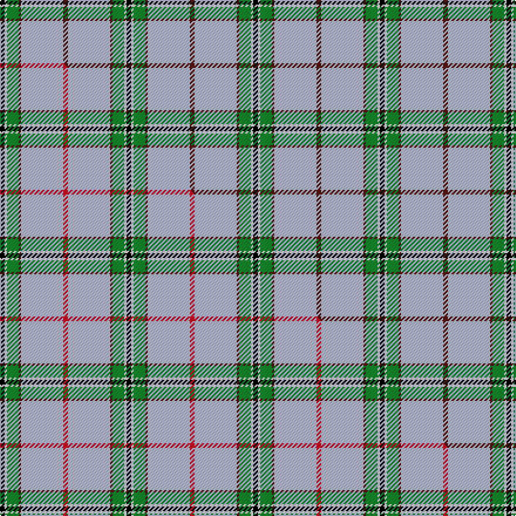

This page is one **sett** — a single exact thread-count. It belongs to the [tartan](/setts/k2w1g5dr1lb18dr2/)
(the same proportion at any scale), whose colour order is pattern [BWBGWK](/stripes/bwbgwk/).

Part of the [Norris](/tartans/norris/) tartan — the named design grouping this sett with its other cloths.

Sourced from tartans-authority.  It is a [6 stripe tartan](/stripes/stripes6/).

Original link http://www.tartansauthority.com/tartan-ferret/display/5942/

## Register references

External register numbers recorded for this tartan.

- Scottish Tartans Authority (ITI): 5942

## Thread count
K/4 W2 G10 DR2 LB36 DR/4

One full sett is **108 threads**.

## Palette
<table><thead><tr><th>Colour</th><th>Shade</th><th>OKLCh</th></tr></thead><tbody><tr><td>LB</td><td><code style="background-color:#B5BBDE;">#B5BBDE</code> <small style="color:#888">#B5BBDE</small></td><td><small style="color:#888">oklch(79.9% 0.050 277.6)</small></td></tr><tr><td>DR</td><td><code style="background-color:#55120C;">#55120C</code> <small style="color:#888">#55120C</small></td><td><small style="color:#888">oklch(30.0% 0.099 29.3)</small></td></tr><tr><td>G</td><td><code style="background-color:#008B2A;">#008B2A</code> <small style="color:#888">#008B2A</small></td><td><small style="color:#888">oklch(55.4% 0.170 145.9)</small></td></tr><tr><td>K</td><td><code style="background-color:#000000;">#000000</code> <small style="color:#888">#000000</small></td><td><small style="color:#888">oklch(0.0% 0.000 0.0)</small></td></tr><tr><td>W</td><td><code style="background-color:#F7F7F7;">#F7F7F7</code> <small style="color:#888">#F7F7F7</small></td><td><small style="color:#888">oklch(97.6% 0.000 89.9)</small></td></tr></tbody></table>

# Sample pattern

## Compared to the master

This cloth is one sett of its design; the master sett (the exemplar the design is anchored on) is below for comparison.

Its **ΔTartan distance** from the master is **0.96** — the same measure the nearest-tartans table ranks by (0 is identical; a re-scale of the same cloth is near 0, a recolour or a different proportion further).

<figure class="master-compare" style="margin:0">

this sett
master sett ★

<figcaption style="color:#888;font-size:smaller">One weave of this sett against the <a href="/setts/k2w1g5dr1lb18r2/">master sett ★</a>, split on the diagonal: a shared proportion runs seamlessly across it with only the shades shifting; a different proportion breaks on it.</figcaption>
</figure>

## Nearest tartan variants

The nearest existing variants by ΔTartan distance, with this cloth at the top so the swatches line up against it.

ΔTartan

Threads

Variant

Sett

—

108

<a href="/variants/s6/k2w1g5dr1lb18dr2~x2/">Norris (1998) (Name)</a>

<a href="/ttd/edit/#slug=k2w1g5dr1lb18r2~x2&amp;base=k2w1g5dr1lb18dr2~x2" title="compare in the TTD">0.30</a>

108

<a href="/variants/s6/k2w1g5dr1lb18r2~x2/">Norris (1998)</a>

<a href="/ttd/edit/#slug=k2lb36g12w3r2~x2&amp;base=k2w1g5dr1lb18dr2~x2" title="compare in the TTD">1.07</a>

212

<a href="/variants/s5/k2lb36g12w3r2~x2/">Cleland</a>

<a href="/ttd/edit/#slug=k2lb28g7w3r2~x2&amp;base=k2w1g5dr1lb18dr2~x2" title="compare in the TTD">1.25</a>

160

<a href="/variants/s5/k2lb28g7w3r2~x2/">Cleland Corporate Tartan</a>

<a href="/ttd/edit/#slug=k3lb2g13w2lb24dr3~x4&amp;base=k2w1g5dr1lb18dr2~x2" title="compare in the TTD">1.95</a>

352

<a href="/variants/s6/k3lb2g13w2lb24dr3~x4/">Vance (Name?)</a>

<a href="/ttd/edit/#slug=k3t2g13w2t24dr3~x4~t2405244-g2408144&amp;base=k2w1g5dr1lb18dr2~x2" title="compare in the TTD">1.95</a>

352

<a href="/variants/s6/k3t2g13w2t24dr3~x4~t2405244-g2408144/">Vance</a>

<a href="/ttd/edit/#slug=k5w2y36lb47r3~x2&amp;base=k2w1g5dr1lb18dr2~x2" title="compare in the TTD">1.98</a>

356

<a href="/variants/s5/k5w2y36lb47r3~x2/">Oliver Dress Pink</a>

<a href="/ttd/edit/#slug=k2w1n8dr1lb28dr2~x2&amp;base=k2w1g5dr1lb18dr2~x2" title="compare in the TTD">2.05</a>

160

<a href="/variants/s6/k2w1n8dr1lb28dr2~x2/">Norris Hunting</a>

<a href="/ttd/edit/#slug=r1lb12k1w2k5r1~x4&amp;base=k2w1g5dr1lb18dr2~x2" title="compare in the TTD">2.39</a>

168

<a href="/variants/s6/r1lb12k1w2k5r1~x4/">Rui (Personal)</a>

<a href="/ttd/edit/#slug=db10k3lb65dg56y6&amp;base=k2w1g5dr1lb18dr2~x2" title="compare in the TTD">2.59</a>

264

<a href="/variants/s5/db10k3lb65dg56y6/">Phoenix Police Honor Guard</a>

<a href="/ttd/edit/#slug=n62w11k4lg17~x2&amp;base=k2w1g5dr1lb18dr2~x2" title="compare in the TTD">2.63</a>

218

<a href="/variants/s4/n62w11k4lg17~x2/">Thunderlord (Corporate)</a>

## Neighbour map

Every grey dot is one of 13620 variants placed by the first two principal components of the ΔTartan feature space (42% of its variance). Red is this tartan; blue dots are its nearest — click one to open its page.

<svg viewBox="0 0 640 380" role="img" style="max-width:100%;height:auto;border:1px solid #e0e0e0;border-radius:4px;display:block" xmlns="http://www.w3.org/2000/svg"><image href="/nn/cloud.v1.png" width="640" height="380"/><a href="/variants/s6/k2w1g5dr1lb18r2~x2/"><circle cx="294.0" cy="114.9" r="4" fill="#3465a4"><title>Norris (1998)</title></circle></a><a href="/variants/s5/k2lb36g12w3r2~x2/"><circle cx="363.2" cy="148.0" r="4" fill="#3465a4"><title>Cleland</title></circle></a><a href="/variants/s5/k2lb28g7w3r2~x2/"><circle cx="352.4" cy="153.6" r="4" fill="#3465a4"><title>Cleland Corporate Tartan</title></circle></a><a href="/variants/s6/k3lb2g13w2lb24dr3~x4/"><circle cx="260.7" cy="164.5" r="4" fill="#3465a4"><title>Vance (Name?)</title></circle></a><a href="/variants/s6/k3t2g13w2t24dr3~x4~t2405244-g2408144/"><circle cx="274.9" cy="172.6" r="4" fill="#3465a4"><title>Vance</title></circle></a><a href="/variants/s5/k5w2y36lb47r3~x2/"><circle cx="291.6" cy="147.8" r="4" fill="#3465a4"><title>Oliver Dress Pink</title></circle></a><a href="/variants/s6/k2w1n8dr1lb28dr2~x2/"><circle cx="383.9" cy="110.7" r="4" fill="#3465a4"><title>Norris Hunting</title></circle></a><a href="/variants/s6/r1lb12k1w2k5r1~x4/"><circle cx="242.1" cy="154.5" r="4" fill="#3465a4"><title>Rui (Personal)</title></circle></a><a href="/variants/s5/db10k3lb65dg56y6/"><circle cx="241.6" cy="153.8" r="4" fill="#3465a4"><title>Phoenix Police Honor Guard</title></circle></a><a href="/variants/s4/n62w11k4lg17~x2/"><circle cx="368.5" cy="191.2" r="4" fill="#3465a4"><title>Thunderlord (Corporate)</title></circle></a><circle cx="313.4" cy="131.8" r="5" fill="#c00000"/><text x="320" y="376" text-anchor="middle" font-size="11" fill="#999">ground</text><text x="11" y="190" text-anchor="middle" font-size="11" fill="#999" transform="rotate(-90 11 190)">complexity</text></svg>

ID: /variants/s6/k2w1g5dr1lb18dr2~x2/
