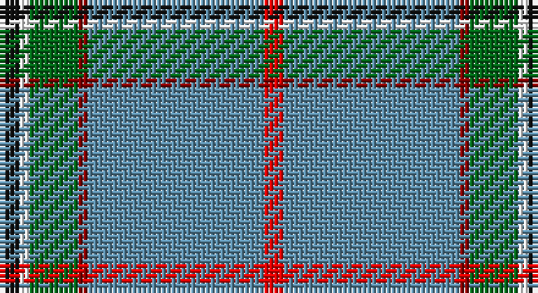

This page is one **sett** — a single exact thread-count. It belongs to the [tartan](/setts/k2w1g5ri1t18r2/)
(the same proportion at any scale), whose colour order is pattern [KWGRBR](/stripes/kwgrbr/).

Sourced from register-of-tartans.  It is a [6 stripe tartan](/stripes/stripes6/).

Original link https://www.tartanregister.gov.uk/tartanDetails.aspx?ref=3150

## Register references

External register numbers recorded for this tartan.

- Scottish Register of Tartans: [3150](https://www.tartanregister.gov.uk/tartanDetails.aspx?ref=3150)
- Scottish Tartans Authority (ITI): 5942

## Thread count
K/4 W2 G10 DR2 B36 R/4

One full sett is **108 threads**.

## Palette

Palette: <strong>Tartan Register</strong>
<table><thead><tr><th>Colour</th><th>Threads</th><th>Shade</th><th>Base</th><th>OKLCh</th></tr></thead><tbody><tr><td>K/</td><td style="text-align:right;font-variant-numeric:tabular-nums">4</td><td><code style="background-color:#101010;">#101010</code> <small style="color:#888">#101010</small></td><td>K <code style="background-color:#000000;">#000000</code></td><td><small style="color:#888">oklch(17.3% 0.000 89.9)</small></td></tr><tr><td>W</td><td style="text-align:right;font-variant-numeric:tabular-nums">2</td><td><code style="background-color:#FFFFFF;">#FFFFFF</code> <small style="color:#888">#FFFFFF</small></td><td>W <code style="background-color:#F7F7F7;">#F7F7F7</code></td><td><small style="color:#888">oklch(100.0% 0.000 89.9)</small></td></tr><tr><td>G</td><td style="text-align:right;font-variant-numeric:tabular-nums">10</td><td><code style="background-color:#006818;">#006818</code> <small style="color:#888">#006818</small></td><td>G <code style="background-color:#006100;">#006100</code></td><td><small style="color:#888">oklch(45.0% 0.142 145.0)</small></td></tr><tr><td>DR</td><td style="text-align:right;font-variant-numeric:tabular-nums">2</td><td><code style="background-color:#880000;">#880000</code> <small style="color:#888">#880000</small></td><td>R <code style="background-color:#CC0000;">#CC0000</code></td><td><small style="color:#888">oklch(39.4% 0.162 29.2)</small></td></tr><tr><td>B</td><td style="text-align:right;font-variant-numeric:tabular-nums">36</td><td><code style="background-color:#5C8CA8;">#5C8CA8</code> <small style="color:#888">#5C8CA8</small></td><td>B <code style="background-color:#2A418A;">#2A418A</code></td><td><small style="color:#888">oklch(61.7% 0.067 235.0)</small></td></tr><tr><td>R/</td><td style="text-align:right;font-variant-numeric:tabular-nums">4</td><td><code style="background-color:#FF0000;">#FF0000</code> <small style="color:#888">#FF0000</small></td><td>R <code style="background-color:#CC0000;">#CC0000</code></td><td><small style="color:#888">oklch(62.8% 0.258 29.2)</small></td></tr></tbody></table>

# Sample pattern

## Nearest tartans

The nearest existing variants by ΔTartan distance, with this tartan at the top so the swatches line up against it.

ΔTartan

Tartan

Sett

—

<a href="/ttd/edit/#slug=k2w1g5ri1t18r2~x2">Norris (1998)</a> <a class="nn-out" href="/variants/s6/k2w1g5ri1t18r2~x2/" title="open its dictionary page">↗</a>

0.93

<a href="/ttd/edit/#slug=k2w1g5r1t18r2~x2&amp;base=k2w1g5ri1t18r2~x2">Norris (1998) (Name)</a> <a class="nn-out" href="/variants/s6/k2w1g5r1t18r2~x2/" title="open its dictionary page">↗</a>

1.12

<a href="/ttd/edit/#slug=g55ly4db15w3r3w5~x2&amp;base=k2w1g5ri1t18r2~x2">Spencer (2013)</a> <a class="nn-out" href="/variants/s6/g55ly4db15w3r3w5~x2/" title="open its dictionary page">↗</a>

1.19

<a href="/ttd/edit/#slug=o55b8w8b8g5o8ly4w4k4~x2&amp;base=k2w1g5ri1t18r2~x2">Ofsharick, Matthew (Personal)</a> <a class="nn-out" href="/variants/s9/o55b8w8b8g5o8ly4w4k4~x2/" title="open its dictionary page">↗</a>

1.20

<a href="/ttd/edit/#slug=w8r6lo2g34b3~x2&amp;base=k2w1g5ri1t18r2~x2">Milling-Kristensen (Personal)</a> <a class="nn-out" href="/variants/s5/w8r6lo2g34b3~x2/" title="open its dictionary page">↗</a>

1.20

<a href="/ttd/edit/#slug=k2t36dg12w3r2~x2&amp;base=k2w1g5ri1t18r2~x2">Cleland (Name)</a> <a class="nn-out" href="/variants/s5/k2t36dg12w3r2~x2/" title="open its dictionary page">↗</a>

1.20

<a href="/ttd/edit/#slug=r2b4lb18n2lb2n41w2~x2&amp;base=k2w1g5ri1t18r2~x2">Haddrell (2013)</a> <a class="nn-out" href="/variants/s7/r2b4lb18n2lb2n41w2~x2/" title="open its dictionary page">↗</a>

1.31

<a href="/ttd/edit/#slug=n68k4n18o20k3w3k10lb8lo4&amp;base=k2w1g5ri1t18r2~x2">Carbon (Corporate)</a> <a class="nn-out" href="/variants/s9/n68k4n18o20k3w3k10lb8lo4/" title="open its dictionary page">↗</a>

1.34

<a href="/ttd/edit/#slug=k2t28g7w3r2~x2&amp;base=k2w1g5ri1t18r2~x2">Cleland Corporate Tartan</a> <a class="nn-out" href="/variants/s5/k2t28g7w3r2~x2/" title="open its dictionary page">↗</a>

1.39

<a href="/ttd/edit/#slug=k2n36g12w3r2~x2&amp;base=k2w1g5ri1t18r2~x2">Cleland</a> <a class="nn-out" href="/variants/s5/k2n36g12w3r2~x2/" title="open its dictionary page">↗</a>

1.41

<a href="/ttd/edit/#slug=db3g6db2b11r3ly4r3b28w3~x2&amp;base=k2w1g5ri1t18r2~x2">Bains of Caithness</a> <a class="nn-out" href="/variants/s9/db3g6db2b11r3ly4r3b28w3~x2/" title="open its dictionary page">↗</a>

## Neighbour map

Every grey dot is one of 14360 variants placed by the first two principal components of the ΔTartan feature space (44% of its variance). Red is this tartan; blue dots are its nearest — click one to open its page.

<svg viewBox="0 0 640 380" role="img" style="max-width:100%;height:auto;border:1px solid #e0e0e0;border-radius:4px;display:block" xmlns="http://www.w3.org/2000/svg"><image href="/nn/cloud.v1.png" width="640" height="380"/><a href="/variants/s6/k2w1g5r1t18r2~x2/"><circle cx="367.5" cy="156.5" r="4" fill="#3465a4"><title>Norris (1998) (Name)</title></circle></a><a href="/variants/s6/g55ly4db15w3r3w5~x2/"><circle cx="372.2" cy="144.0" r="4" fill="#3465a4"><title>Spencer (2013)</title></circle></a><a href="/variants/s9/o55b8w8b8g5o8ly4w4k4~x2/"><circle cx="317.5" cy="118.4" r="4" fill="#3465a4"><title>Ofsharick, Matthew (Personal)</title></circle></a><a href="/variants/s5/w8r6lo2g34b3~x2/"><circle cx="367.9" cy="169.8" r="4" fill="#3465a4"><title>Milling-Kristensen (Personal)</title></circle></a><a href="/variants/s5/k2t36dg12w3r2~x2/"><circle cx="399.3" cy="169.9" r="4" fill="#3465a4"><title>Cleland (Name)</title></circle></a><a href="/variants/s7/r2b4lb18n2lb2n41w2~x2/"><circle cx="380.4" cy="134.1" r="4" fill="#3465a4"><title>Haddrell (2013)</title></circle></a><a href="/variants/s9/n68k4n18o20k3w3k10lb8lo4/"><circle cx="362.7" cy="116.1" r="4" fill="#3465a4"><title>Carbon (Corporate)</title></circle></a><a href="/variants/s5/k2t28g7w3r2~x2/"><circle cx="395.0" cy="179.5" r="4" fill="#3465a4"><title>Cleland Corporate Tartan</title></circle></a><a href="/variants/s5/k2n36g12w3r2~x2/"><circle cx="406.0" cy="177.8" r="4" fill="#3465a4"><title>Cleland</title></circle></a><a href="/variants/s9/db3g6db2b11r3ly4r3b28w3~x2/"><circle cx="307.9" cy="137.5" r="4" fill="#3465a4"><title>Bains of Caithness</title></circle></a><circle cx="339.7" cy="134.4" r="5" fill="#c00000"/></svg>

ID: /variants/s6/k2w1g5ri1t18r2~x2/
