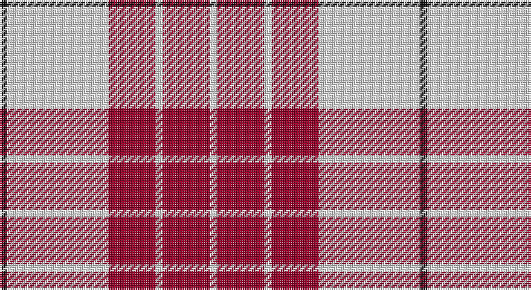

This page is one **sett** — a single exact thread-count. It belongs to the [tartan](/setts/k2w28r13w2r13w2/)
(the same proportion at any scale), whose colour order is pattern [KWRWRW](/stripes/kwrwrw/).

Sourced from register-of-tartans.  It is a [6 stripe tartan](/stripes/stripes6/).

Original link https://www.tartanregister.gov.uk/tartanDetails.aspx?ref=418

## Also known as

This cloth is also recorded under:

- Buchanan #5

2 attestations — the source records this cloth was collapsed from (oldest owns this page)

<ul>
<li>undated — Buchanan #5 (register-of-tartans, <a href="https://www.tartanregister.gov.uk/tartanDetails.aspx?ref=418">record</a>)</li>
<li>undated — Buchanan 4 (weddslist, <a href="http://www.weddslist.com/cgi-bin/tartans/pg.pl?source=sts">record</a>)</li>
</ul>

## Register references

External register numbers recorded for this tartan.

- Scottish Register of Tartans: [418](https://www.tartanregister.gov.uk/tartanDetails.aspx?ref=418)
- Scottish Tartans World Register: 1261

## Thread count
K/4 LN56 DR26 LN4 DR26 LN/4

One full sett is **232 threads**.

## Palette

Palette: <strong>Tartan Register</strong>
<table><thead><tr><th>Colour</th><th>Threads</th><th>Shade</th><th>Base</th><th>OKLCh</th></tr></thead><tbody><tr><td>K/</td><td style="text-align:right;font-variant-numeric:tabular-nums">4</td><td><code style="background-color:#101010;">#101010</code> <small style="color:#888">#101010</small></td><td>K <code style="background-color:#000000;">#000000</code></td><td><small style="color:#888">oklch(17.3% 0.000 89.9)</small></td></tr><tr><td>LN</td><td style="text-align:right;font-variant-numeric:tabular-nums">56</td><td><code style="background-color:#E0E0E0;">#E0E0E0</code> <small style="color:#888">#E0E0E0</small></td><td>W <code style="background-color:#F7F7F7;">#F7F7F7</code></td><td><small style="color:#888">oklch(90.7% 0.000 89.9)</small></td></tr><tr><td>DR</td><td style="text-align:right;font-variant-numeric:tabular-nums">26</td><td><code style="background-color:#960028;">#960028</code> <small style="color:#888">#960028</small></td><td>R <code style="background-color:#CC0000;">#CC0000</code></td><td><small style="color:#888">oklch(42.7% 0.171 18.3)</small></td></tr><tr><td>LN</td><td style="text-align:right;font-variant-numeric:tabular-nums">4</td><td><code style="background-color:#E0E0E0;">#E0E0E0</code> <small style="color:#888">#E0E0E0</small></td><td>W <code style="background-color:#F7F7F7;">#F7F7F7</code></td><td><small style="color:#888">oklch(90.7% 0.000 89.9)</small></td></tr><tr><td>DR</td><td style="text-align:right;font-variant-numeric:tabular-nums">26</td><td><code style="background-color:#960028;">#960028</code> <small style="color:#888">#960028</small></td><td>R <code style="background-color:#CC0000;">#CC0000</code></td><td><small style="color:#888">oklch(42.7% 0.171 18.3)</small></td></tr><tr><td>LN/</td><td style="text-align:right;font-variant-numeric:tabular-nums">4</td><td><code style="background-color:#E0E0E0;">#E0E0E0</code> <small style="color:#888">#E0E0E0</small></td><td>W <code style="background-color:#F7F7F7;">#F7F7F7</code></td><td><small style="color:#888">oklch(90.7% 0.000 89.9)</small></td></tr></tbody></table>

# Sample pattern

## Nearest tartans

The nearest existing variants by ΔTartan distance, with this tartan at the top so the swatches line up against it.

ΔTartan

Tartan

Sett

—

<a href="/ttd/edit/#slug=k2w28r13w2r13w2~x2">Buchanan #5</a> <a class="nn-out" href="/variants/s6/k2w28r13w2r13w2~x2/" title="open its dictionary page">↗</a>

0.96

<a href="/ttd/edit/#slug=r5w2r25w25r2w5~x2&amp;base=k2w28r13w2r13w2~x2">Erskine Dress Burgandy Clan Tartan</a> <a class="nn-out" href="/variants/s6/r5w2r25w25r2w5~x2/" title="open its dictionary page">↗</a>

0.99

<a href="/ttd/edit/#slug=r6w2r29w29r2w6~x2&amp;base=k2w28r13w2r13w2~x2">Erskine, Burgundy (Dance)</a> <a class="nn-out" href="/variants/s6/r6w2r29w29r2w6~x2/" title="open its dictionary page">↗</a>

1.17

<a href="/ttd/edit/#slug=w4k2w25r21w3r8ly3~x2&amp;base=k2w28r13w2r13w2~x2">MacPherson Dress Burgundy (Dance)</a> <a class="nn-out" href="/variants/s7/w4k2w25r21w3r8ly3~x2/" title="open its dictionary page">↗</a>

1.22

<a href="/ttd/edit/#slug=w5k2w30r24w3r8dt3~x2&amp;base=k2w28r13w2r13w2~x2">Arduaine, Red (Dance)</a> <a class="nn-out" href="/variants/s7/w5k2w30r24w3r8dt3~x2/" title="open its dictionary page">↗</a>

1.25

<a href="/ttd/edit/#slug=lb45r2g9lb2r30~x2&amp;base=k2w28r13w2r13w2~x2">Malaysian Unknown (Artefact)</a> <a class="nn-out" href="/variants/s5/lb45r2g9lb2r30~x2/" title="open its dictionary page">↗</a>

1.34

<a href="/ttd/edit/#slug=w5r2w34r34k2r2ly4~x2&amp;base=k2w28r13w2r13w2~x2">Cunningham Dress Burgundy (Dance)</a> <a class="nn-out" href="/variants/s7/w5r2w34r34k2r2ly4~x2/" title="open its dictionary page">↗</a>

1.35

<a href="/ttd/edit/#slug=w26dri2w3dri15dri26dr2dri3~x2&amp;base=k2w28r13w2r13w2~x2">Gavin (Personal)</a> <a class="nn-out" href="/variants/s7/w26dri2w3dri15dri26dr2dri3~x2/" title="open its dictionary page">↗</a>

1.41

<a href="/ttd/edit/#slug=lb2r4lb2r4lb9k1~x2&amp;base=k2w28r13w2r13w2~x2">Buchanan VS</a> <a class="nn-out" href="/variants/s6/lb2r4lb2r4lb9k1~x2/" title="open its dictionary page">↗</a>

1.42

<a href="/ttd/edit/#slug=r8ri3r28w32ri3w4~x2&amp;base=k2w28r13w2r13w2~x2">Ailsa, Red V2 (Dance)</a> <a class="nn-out" href="/variants/s6/r8ri3r28w32ri3w4~x2/" title="open its dictionary page">↗</a>

1.44

<a href="/ttd/edit/#slug=w18r9w1r1w2r1w1r9db3r4~x4&amp;base=k2w28r13w2r13w2~x2">Swiss Red</a> <a class="nn-out" href="/variants/s10/w18r9w1r1w2r1w1r9db3r4~x4/" title="open its dictionary page">↗</a>

## Neighbour map

Every grey dot is one of 14360 variants placed by the first two principal components of the ΔTartan feature space (44% of its variance). Red is this tartan; blue dots are its nearest — click one to open its page.

<svg viewBox="0 0 640 380" role="img" style="max-width:100%;height:auto;border:1px solid #e0e0e0;border-radius:4px;display:block" xmlns="http://www.w3.org/2000/svg"><image href="/nn/cloud.v1.png" width="640" height="380"/><a href="/variants/s6/r5w2r25w25r2w5~x2/"><circle cx="340.0" cy="192.9" r="4" fill="#3465a4"><title>Erskine Dress Burgandy Clan Tartan</title></circle></a><a href="/variants/s6/r6w2r29w29r2w6~x2/"><circle cx="331.1" cy="179.4" r="4" fill="#3465a4"><title>Erskine, Burgundy (Dance)</title></circle></a><a href="/variants/s7/w4k2w25r21w3r8ly3~x2/"><circle cx="263.6" cy="153.4" r="4" fill="#3465a4"><title>MacPherson Dress Burgundy (Dance)</title></circle></a><a href="/variants/s7/w5k2w30r24w3r8dt3~x2/"><circle cx="295.3" cy="141.5" r="4" fill="#3465a4"><title>Arduaine, Red (Dance)</title></circle></a><a href="/variants/s5/lb45r2g9lb2r30~x2/"><circle cx="334.3" cy="164.6" r="4" fill="#3465a4"><title>Malaysian Unknown (Artefact)</title></circle></a><a href="/variants/s7/w5r2w34r34k2r2ly4~x2/"><circle cx="279.5" cy="121.3" r="4" fill="#3465a4"><title>Cunningham Dress Burgundy (Dance)</title></circle></a><a href="/variants/s7/w26dri2w3dri15dri26dr2dri3~x2/"><circle cx="303.6" cy="152.3" r="4" fill="#3465a4"><title>Gavin (Personal)</title></circle></a><a href="/variants/s6/lb2r4lb2r4lb9k1~x2/"><circle cx="320.3" cy="206.4" r="4" fill="#3465a4"><title>Buchanan VS</title></circle></a><a href="/variants/s6/r8ri3r28w32ri3w4~x2/"><circle cx="291.5" cy="179.9" r="4" fill="#3465a4"><title>Ailsa, Red V2 (Dance)</title></circle></a><a href="/variants/s10/w18r9w1r1w2r1w1r9db3r4~x4/"><circle cx="318.2" cy="131.4" r="4" fill="#3465a4"><title>Swiss Red</title></circle></a><circle cx="321.5" cy="171.3" r="5" fill="#c00000"/></svg>

ID: /variants/s6/k2w28r13w2r13w2~x2/
