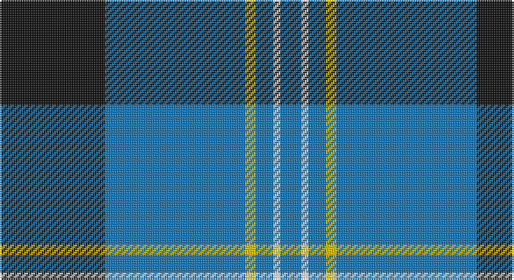

This page is one **sett** — a single exact thread-count. It belongs to the [tartan](/setts/k30b40ly3b5w2b6/)
(the same proportion at any scale), whose colour order is pattern [BWBYBK](/stripes/bwbybk/).

Sourced from register-of-tartans.  It is a [6 stripe tartan](/stripes/stripes6/).

Original link https://www.tartanregister.gov.uk/tartanDetails.aspx?ref=2946

2 attestations — the source records this cloth was collapsed from (oldest owns this page)

<ul>
<li>01/05/2000 — Micron (register-of-tartans, <a href="https://www.tartanregister.gov.uk/tartanDetails.aspx?ref=2946">record</a>)</li>
<li>pre 2002 — Micron (Corporate) (tartans-authority, <a href="http://www.tartansauthority.com/tartan-ferret/display/3822/">record</a>)</li>
</ul>

## Register references

External register numbers recorded for this tartan.

- Scottish Register of Tartans: [2946](https://www.tartanregister.gov.uk/tartanDetails.aspx?ref=2946)
- Scottish Tartans Authority (ITI): 3822
- Scottish Tartans World Register: 2706

## Thread count
K/60 B80 Y6 B10 W4 B/12

One full sett is **272 threads**.

## Palette

Palette: <strong>Tartan Register</strong>
<table><thead><tr><th>Colour</th><th>Threads</th><th>Shade</th><th>Base</th><th>OKLCh</th></tr></thead><tbody><tr><td>K/</td><td style="text-align:right;font-variant-numeric:tabular-nums">60</td><td><code style="background-color:#101010;">#101010</code> <small style="color:#888">#101010</small></td><td>K <code style="background-color:#000000;">#000000</code></td><td><small style="color:#888">oklch(17.3% 0.000 89.9)</small></td></tr><tr><td>B</td><td style="text-align:right;font-variant-numeric:tabular-nums">80</td><td><code style="background-color:#1474B4;">#1474B4</code> <small style="color:#888">#1474B4</small></td><td>B <code style="background-color:#2A418A;">#2A418A</code></td><td><small style="color:#888">oklch(54.0% 0.129 245.1)</small></td></tr><tr><td>Y</td><td style="text-align:right;font-variant-numeric:tabular-nums">6</td><td><code style="background-color:#E8C000;">#E8C000</code> <small style="color:#888">#E8C000</small></td><td>Y <code style="background-color:#F2BF00;">#F2BF00</code></td><td><small style="color:#888">oklch(81.9% 0.168 93.7)</small></td></tr><tr><td>B</td><td style="text-align:right;font-variant-numeric:tabular-nums">10</td><td><code style="background-color:#1474B4;">#1474B4</code> <small style="color:#888">#1474B4</small></td><td>B <code style="background-color:#2A418A;">#2A418A</code></td><td><small style="color:#888">oklch(54.0% 0.129 245.1)</small></td></tr><tr><td>W</td><td style="text-align:right;font-variant-numeric:tabular-nums">4</td><td><code style="background-color:#FCFCFC;">#FCFCFC</code> <small style="color:#888">#FCFCFC</small></td><td>W <code style="background-color:#F7F7F7;">#F7F7F7</code></td><td><small style="color:#888">oklch(99.1% 0.000 89.9)</small></td></tr><tr><td>B/</td><td style="text-align:right;font-variant-numeric:tabular-nums">12</td><td><code style="background-color:#1474B4;">#1474B4</code> <small style="color:#888">#1474B4</small></td><td>B <code style="background-color:#2A418A;">#2A418A</code></td><td><small style="color:#888">oklch(54.0% 0.129 245.1)</small></td></tr></tbody></table>

# Sample pattern

## Nearest tartans

The nearest existing variants by ΔTartan distance, with this tartan at the top so the swatches line up against it.

ΔTartan

Tartan

Sett

—

<a href="/ttd/edit/#slug=k30b40ly3b5w2b6~x2">Micron</a> <a class="nn-out" href="/variants/s6/k30b40ly3b5w2b6~x2/" title="open its dictionary page">↗</a>

1.02

<a href="/ttd/edit/#slug=db23w1db1w1db8g22r1db3~x4&amp;base=k30b40ly3b5w2b6~x2">Roxburgh, Green (District)</a> <a class="nn-out" href="/variants/s8/db23w1db1w1db8g22r1db3~x4/" title="open its dictionary page">↗</a>

1.05

<a href="/variants/s6/ly8k3b40ki12k3ly3~x2/">Wolverine Corporate Tartan</a>

1.14

<a href="/ttd/edit/#slug=ly8w3b40k12w3ly3~x2&amp;base=k30b40ly3b5w2b6~x2">Wolverine (Corporate)</a> <a class="nn-out" href="/variants/s6/ly8w3b40k12w3ly3~x2/" title="open its dictionary page">↗</a>

1.18

<a href="/ttd/edit/#slug=k1ly2k3n12k18w1~x2&amp;base=k30b40ly3b5w2b6~x2">Jon's Theme</a> <a class="nn-out" href="/variants/s6/k1ly2k3n12k18w1~x2/" title="open its dictionary page">↗</a>

1.20

<a href="/ttd/edit/#slug=r1b1k17b17k1w1~x4&amp;base=k30b40ly3b5w2b6~x2">Sorbie (Name)</a> <a class="nn-out" href="/variants/s6/r1b1k17b17k1w1~x4/" title="open its dictionary page">↗</a>

1.22

<a href="/ttd/edit/#slug=w2db35k9w3k9ly2~x2&amp;base=k30b40ly3b5w2b6~x2">Hannah (Personal)</a> <a class="nn-out" href="/variants/s6/w2db35k9w3k9ly2~x2/" title="open its dictionary page">↗</a>

1.24

<a href="/ttd/edit/#slug=g23db3k8db4g4db56ly8&amp;base=k30b40ly3b5w2b6~x2">Tern House</a> <a class="nn-out" href="/variants/s7/g23db3k8db4g4db56ly8/" title="open its dictionary page">↗</a>

1.27

<a href="/ttd/edit/#slug=db72k21g16t3g17t3~x2&amp;base=k30b40ly3b5w2b6~x2">MacRobart</a> <a class="nn-out" href="/variants/s6/db72k21g16t3g17t3~x2/" title="open its dictionary page">↗</a>

1.29

<a href="/ttd/edit/#slug=w4t28db49ly3~x2&amp;base=k30b40ly3b5w2b6~x2">McKerrell of Hillhouse</a> <a class="nn-out" href="/variants/s4/w4t28db49ly3~x2/" title="open its dictionary page">↗</a>

1.30

<a href="/ttd/edit/#slug=db60g16w8ly3~x2&amp;base=k30b40ly3b5w2b6~x2">Hsu (Personal)</a> <a class="nn-out" href="/variants/s4/db60g16w8ly3~x2/" title="open its dictionary page">↗</a>

## Neighbour map

Every grey dot is one of 14360 variants placed by the first two principal components of the ΔTartan feature space (44% of its variance). Red is this tartan; blue dots are its nearest — click one to open its page.

<svg viewBox="0 0 640 380" role="img" style="max-width:100%;height:auto;border:1px solid #e0e0e0;border-radius:4px;display:block" xmlns="http://www.w3.org/2000/svg"><image href="/nn/cloud.v1.png" width="640" height="380"/><a href="/variants/s8/db23w1db1w1db8g22r1db3~x4/"><circle cx="374.5" cy="158.4" r="4" fill="#3465a4"><title>Roxburgh, Green (District)</title></circle></a><a href="/variants/s6/ly8k3b40ki12k3ly3~x2/"><circle cx="314.0" cy="181.3" r="4" fill="#3465a4"><title>Wolverine Corporate Tartan</title></circle></a><a href="/variants/s6/ly8w3b40k12w3ly3~x2/"><circle cx="302.0" cy="171.7" r="4" fill="#3465a4"><title>Wolverine (Corporate)</title></circle></a><a href="/variants/s6/k1ly2k3n12k18w1~x2/"><circle cx="366.0" cy="187.5" r="4" fill="#3465a4"><title>Jon's Theme</title></circle></a><a href="/variants/s6/r1b1k17b17k1w1~x4/"><circle cx="315.5" cy="173.3" r="4" fill="#3465a4"><title>Sorbie (Name)</title></circle></a><a href="/variants/s6/w2db35k9w3k9ly2~x2/"><circle cx="349.3" cy="172.4" r="4" fill="#3465a4"><title>Hannah (Personal)</title></circle></a><a href="/variants/s7/g23db3k8db4g4db56ly8/"><circle cx="370.7" cy="175.4" r="4" fill="#3465a4"><title>Tern House</title></circle></a><a href="/variants/s6/db72k21g16t3g17t3~x2/"><circle cx="327.4" cy="173.5" r="4" fill="#3465a4"><title>MacRobart</title></circle></a><a href="/variants/s4/w4t28db49ly3~x2/"><circle cx="345.4" cy="211.7" r="4" fill="#3465a4"><title>McKerrell of Hillhouse</title></circle></a><a href="/variants/s4/db60g16w8ly3~x2/"><circle cx="410.3" cy="190.7" r="4" fill="#3465a4"><title>Hsu (Personal)</title></circle></a><circle cx="354.9" cy="175.7" r="5" fill="#c00000"/></svg>

ID: /variants/s6/k30b40ly3b5w2b6~x2/
