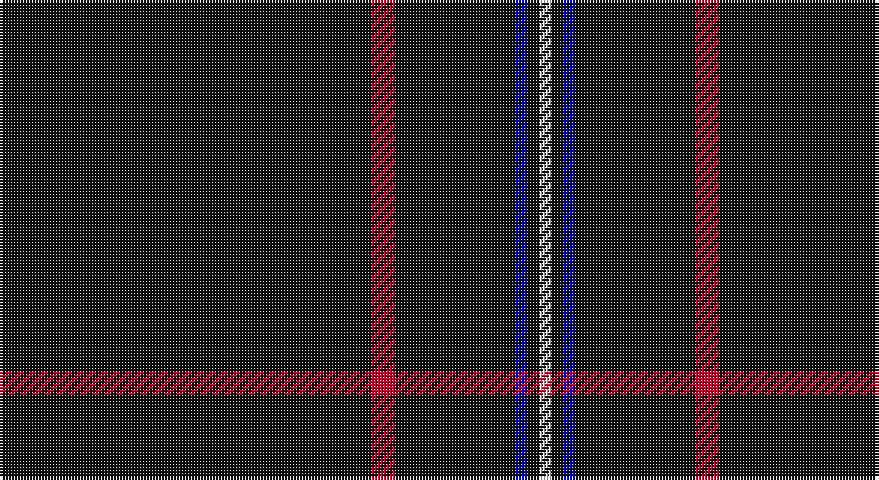

This page is one **sett** — a single exact thread-count. It belongs to the [tartan](/setts/k31r2k10db1k1w1/)
(the same proportion at any scale), whose colour order is pattern [KRKBKW](/stripes/krkbkw/).

Sourced from register-of-tartans.  It is a [6 stripe tartan](/stripes/stripes6/).

Original link https://www.tartanregister.gov.uk/tartanDetails.aspx?ref=11058

2 attestations — the source records this cloth was collapsed from (oldest owns this page)

<ul>
<li>05/06/2013 — NewGeneration Alchemy (NGA) Inc (register-of-tartans, <a href="https://www.tartanregister.gov.uk/tartanDetails.aspx?ref=11058">record</a>)</li>
<li>2014 — NewGeneration Alchemy (NGA) Inc (tartans-authority, <a href="http://www.tartansauthority.com/tartan-ferret/display/11058/">record</a>)</li>
</ul>

## Register references

External register numbers recorded for this tartan.

- Scottish Register of Tartans: [11058](https://www.tartanregister.gov.uk/tartanDetails?ref=11058)
- Scottish Tartans Authority (ITI): 11058

## Thread count
K/124 R8 K40 B4 K4 W/4

One full sett is **240 threads**.

## Palette

Palette: <strong>Tartan Register</strong>
<table><thead><tr><th>Colour</th><th>Threads</th><th>Shade</th><th>Base</th><th>OKLCh</th></tr></thead><tbody><tr><td>K/</td><td style="text-align:right;font-variant-numeric:tabular-nums">124</td><td><code style="background-color:#101010;">#101010</code> <small style="color:#888">#101010</small></td><td>K <code style="background-color:#000000;">#000000</code></td><td><small style="color:#888">oklch(17.3% 0.000 89.9)</small></td></tr><tr><td>R</td><td style="text-align:right;font-variant-numeric:tabular-nums">8</td><td><code style="background-color:#C8002C;">#C8002C</code> <small style="color:#888">#C8002C</small></td><td>R <code style="background-color:#CC0000;">#CC0000</code></td><td><small style="color:#888">oklch(52.6% 0.212 22.0)</small></td></tr><tr><td>K</td><td style="text-align:right;font-variant-numeric:tabular-nums">40</td><td><code style="background-color:#101010;">#101010</code> <small style="color:#888">#101010</small></td><td>K <code style="background-color:#000000;">#000000</code></td><td><small style="color:#888">oklch(17.3% 0.000 89.9)</small></td></tr><tr><td>B</td><td style="text-align:right;font-variant-numeric:tabular-nums">4</td><td><code style="background-color:#0000CD;">#0000CD</code> <small style="color:#888">#0000CD</small></td><td>B <code style="background-color:#2A418A;">#2A418A</code></td><td><small style="color:#888">oklch(38.3% 0.266 264.1)</small></td></tr><tr><td>K</td><td style="text-align:right;font-variant-numeric:tabular-nums">4</td><td><code style="background-color:#101010;">#101010</code> <small style="color:#888">#101010</small></td><td>K <code style="background-color:#000000;">#000000</code></td><td><small style="color:#888">oklch(17.3% 0.000 89.9)</small></td></tr><tr><td>W/</td><td style="text-align:right;font-variant-numeric:tabular-nums">4</td><td><code style="background-color:#FFFFFF;">#FFFFFF</code> <small style="color:#888">#FFFFFF</small></td><td>W <code style="background-color:#F7F7F7;">#F7F7F7</code></td><td><small style="color:#888">oklch(100.0% 0.000 89.9)</small></td></tr></tbody></table>

# Sample pattern

## Nearest tartans

The nearest existing variants by ΔTartan distance, with this tartan at the top so the swatches line up against it.

ΔTartan

Tartan

Sett

—

<a href="/ttd/edit/#slug=k31r2k10db1k1w1~x4">NewGeneration Alchemy (NGA) Inc</a> <a class="nn-out" href="/variants/s6/k31r2k10db1k1w1~x4/" title="open its dictionary page">↗</a>

1.36

<a href="/ttd/edit/#slug=k72r3k11t9k11r3k37&amp;base=k31r2k10db1k1w1~x4">Chafyn House (School)</a> <a class="nn-out" href="/variants/s7/k72r3k11t9k11r3k37/" title="open its dictionary page">↗</a>

1.61

<a href="/ttd/edit/#slug=k62r3k3lo3k3r3k9o5~x2&amp;base=k31r2k10db1k1w1~x4">Auld Bernensis</a> <a class="nn-out" href="/variants/s8/k62r3k3lo3k3r3k9o5~x2/" title="open its dictionary page">↗</a>

1.63

<a href="/ttd/edit/#slug=k72w3k11db9&amp;base=k31r2k10db1k1w1~x4">Dunnotar (School)</a> <a class="nn-out" href="/variants/s4/k72w3k11db9/" title="open its dictionary page">↗</a>

1.63

<a href="/ttd/edit/#slug=k8ly3k120ly3k40t2k4~x2&amp;base=k31r2k10db1k1w1~x4">Lochaber (Hesketh)</a> <a class="nn-out" href="/variants/s7/k8ly3k120ly3k40t2k4~x2/" title="open its dictionary page">↗</a>

1.69

<a href="/ttd/edit/#slug=k45db2r4ly1w1~x2&amp;base=k31r2k10db1k1w1~x4">McHattie (Personal)</a> <a class="nn-out" href="/variants/s5/k45db2r4ly1w1~x2/" title="open its dictionary page">↗</a>

1.69

<a href="/ttd/edit/#slug=k60t3k9g7&amp;base=k31r2k10db1k1w1~x4">Wallington (Corporate?)</a> <a class="nn-out" href="/variants/s4/k60t3k9g7/" title="open its dictionary page">↗</a>

1.72

<a href="/ttd/edit/#slug=k50db3p2r3w1~x4&amp;base=k31r2k10db1k1w1~x4">Fettes (Personal)</a> <a class="nn-out" href="/variants/s5/k50db3p2r3w1~x4/" title="open its dictionary page">↗</a>

1.74

<a href="/ttd/edit/#slug=k50dt3lp2r3w1~x2&amp;base=k31r2k10db1k1w1~x4">Fettes Personal Tartan</a> <a class="nn-out" href="/variants/s5/k50dt3lp2r3w1~x2/" title="open its dictionary page">↗</a>

1.75

<a href="/ttd/edit/#slug=k45b2r4ly1w1~x2&amp;base=k31r2k10db1k1w1~x4">McHattie (Personal)</a> <a class="nn-out" href="/variants/s5/k45b2r4ly1w1~x2/" title="open its dictionary page">↗</a>

1.78

<a href="/ttd/edit/#slug=k24w1r6k21lo2k24g1~x2&amp;base=k31r2k10db1k1w1~x4">Gourlay, George (Personal)</a> <a class="nn-out" href="/variants/s7/k24w1r6k21lo2k24g1~x2/" title="open its dictionary page">↗</a>

## Neighbour map

Every grey dot is one of 14360 variants placed by the first two principal components of the ΔTartan feature space (44% of its variance). Red is this tartan; blue dots are its nearest — click one to open its page.

<svg viewBox="0 0 640 380" role="img" style="max-width:100%;height:auto;border:1px solid #e0e0e0;border-radius:4px;display:block" xmlns="http://www.w3.org/2000/svg"><image href="/nn/cloud.v1.png" width="640" height="380"/><a href="/variants/s7/k72r3k11t9k11r3k37/"><circle cx="626.0" cy="214.1" r="4" fill="#3465a4"><title>Chafyn House (School)</title></circle></a><a href="/variants/s8/k62r3k3lo3k3r3k9o5~x2/"><circle cx="598.1" cy="152.5" r="4" fill="#3465a4"><title>Auld Bernensis</title></circle></a><a href="/variants/s4/k72w3k11db9/"><circle cx="626.0" cy="233.5" r="4" fill="#3465a4"><title>Dunnotar (School)</title></circle></a><a href="/variants/s7/k8ly3k120ly3k40t2k4~x2/"><circle cx="626.0" cy="169.4" r="4" fill="#3465a4"><title>Lochaber (Hesketh)</title></circle></a><a href="/variants/s5/k45db2r4ly1w1~x2/"><circle cx="619.8" cy="133.4" r="4" fill="#3465a4"><title>McHattie (Personal)</title></circle></a><a href="/variants/s4/k60t3k9g7/"><circle cx="626.0" cy="231.8" r="4" fill="#3465a4"><title>Wallington (Corporate?)</title></circle></a><a href="/variants/s5/k50db3p2r3w1~x4/"><circle cx="626.0" cy="135.3" r="4" fill="#3465a4"><title>Fettes (Personal)</title></circle></a><a href="/variants/s5/k50dt3lp2r3w1~x2/"><circle cx="622.9" cy="131.7" r="4" fill="#3465a4"><title>Fettes Personal Tartan</title></circle></a><a href="/variants/s5/k45b2r4ly1w1~x2/"><circle cx="611.4" cy="129.2" r="4" fill="#3465a4"><title>McHattie (Personal)</title></circle></a><a href="/variants/s7/k24w1r6k21lo2k24g1~x2/"><circle cx="581.4" cy="186.1" r="4" fill="#3465a4"><title>Gourlay, George (Personal)</title></circle></a><circle cx="626.0" cy="172.5" r="5" fill="#c00000"/></svg>

ID: /variants/s6/k31r2k10db1k1w1~x4/
