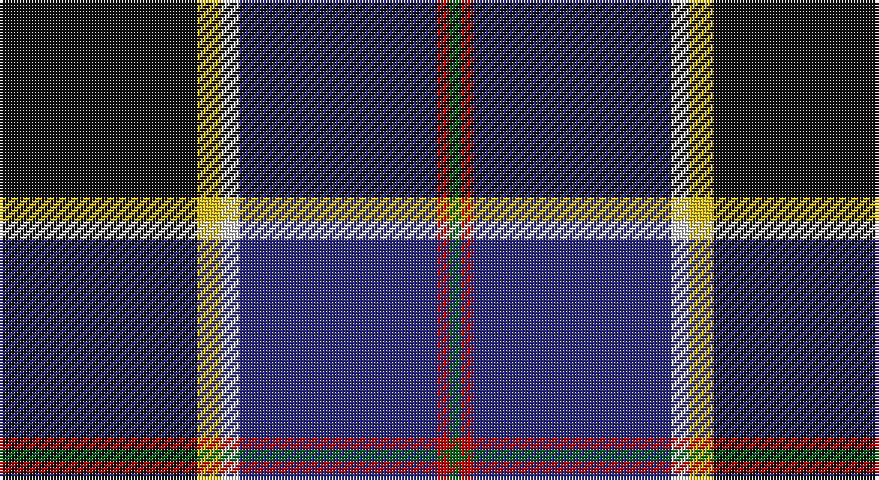

This page is one **sett** — a single exact thread-count. It belongs to the [tartan](/setts/k33ly4w3db33r2g2/)
(the same proportion at any scale), whose colour order is pattern [GRBWYK](/stripes/grbwyk/).

Sourced from tartans-authority.  It is a [6 stripe tartan](/stripes/stripes6/).

Original link http://www.tartansauthority.com/tartan-ferret/display/7344/

## Register references

External register numbers recorded for this tartan.

- Scottish Tartans Authority (ITI): 7344

## Thread count
K/66 Y8 LN6 DB66 R4 G/4

One full sett is **238 threads**.

## Palette

Palette: <strong>Tartan Register</strong>
<table><thead><tr><th>Colour</th><th>Threads</th><th>Shade</th><th>Base</th><th>OKLCh</th></tr></thead><tbody><tr><td>K/</td><td style="text-align:right;font-variant-numeric:tabular-nums">66</td><td><code style="background-color:#101010;">#101010</code> <small style="color:#888">#101010</small></td><td>K <code style="background-color:#000000;">#000000</code></td><td><small style="color:#888">oklch(17.3% 0.000 89.9)</small></td></tr><tr><td>Y</td><td style="text-align:right;font-variant-numeric:tabular-nums">8</td><td><code style="background-color:#E8C000;">#E8C000</code> <small style="color:#888">#E8C000</small></td><td>Y <code style="background-color:#F2BF00;">#F2BF00</code></td><td><small style="color:#888">oklch(81.9% 0.168 93.7)</small></td></tr><tr><td>LN</td><td style="text-align:right;font-variant-numeric:tabular-nums">6</td><td><code style="background-color:#E0E0E0;">#E0E0E0</code> <small style="color:#888">#E0E0E0</small></td><td>W <code style="background-color:#F7F7F7;">#F7F7F7</code></td><td><small style="color:#888">oklch(90.7% 0.000 89.9)</small></td></tr><tr><td>DB</td><td style="text-align:right;font-variant-numeric:tabular-nums">66</td><td><code style="background-color:#2C2C80;">#2C2C80</code> <small style="color:#888">#2C2C80</small></td><td>B <code style="background-color:#2A418A;">#2A418A</code></td><td><small style="color:#888">oklch(35.0% 0.138 276.6)</small></td></tr><tr><td>R</td><td style="text-align:right;font-variant-numeric:tabular-nums">4</td><td><code style="background-color:#C80000;">#C80000</code> <small style="color:#888">#C80000</small></td><td>R <code style="background-color:#CC0000;">#CC0000</code></td><td><small style="color:#888">oklch(52.3% 0.215 29.2)</small></td></tr><tr><td>G/</td><td style="text-align:right;font-variant-numeric:tabular-nums">4</td><td><code style="background-color:#006818;">#006818</code> <small style="color:#888">#006818</small></td><td>G <code style="background-color:#006100;">#006100</code></td><td><small style="color:#888">oklch(45.0% 0.142 145.0)</small></td></tr></tbody></table>

# Sample pattern

## Nearest tartans

The nearest existing variants by ΔTartan distance, with this tartan at the top so the swatches line up against it.

ΔTartan

Tartan

Sett

—

<a href="/ttd/edit/#slug=k33ly4w3db33r2g2~x2">Atlantic Police Academy (Corporate)</a> <a class="nn-out" href="/variants/s6/k33ly4w3db33r2g2~x2/" title="open its dictionary page">↗</a>

0.37

<a href="/ttd/edit/#slug=r3w2g5k35db40ly3~x2&amp;base=k33ly4w3db33r2g2~x2">Italian National</a> <a class="nn-out" href="/variants/s6/r3w2g5k35db40ly3~x2/" title="open its dictionary page">↗</a>

0.45

<a href="/ttd/edit/#slug=w4db54k53dp4t8ly4&amp;base=k33ly4w3db33r2g2~x2">Pipers' Trail, The</a> <a class="nn-out" href="/variants/s6/w4db54k53dp4t8ly4/" title="open its dictionary page">↗</a>

0.59

<a href="/ttd/edit/#slug=k33ly4w3db33r2dg2~x2&amp;base=k33ly4w3db33r2g2~x2">Atlantic Police Academy</a> <a class="nn-out" href="/variants/s6/k33ly4w3db33r2dg2~x2/" title="open its dictionary page">↗</a>

0.90

<a href="/ttd/edit/#slug=w4dt54k53dp4b8lo4&amp;base=k33ly4w3db33r2g2~x2">Pipers' Trail, The</a> <a class="nn-out" href="/variants/s6/w4dt54k53dp4b8lo4/" title="open its dictionary page">↗</a>

0.94

<a href="/ttd/edit/#slug=r3db38k13w3o20ly2~x2&amp;base=k33ly4w3db33r2g2~x2">LLoyd of Astargus Canadian Family Tartan</a> <a class="nn-out" href="/variants/s6/r3db38k13w3o20ly2~x2/" title="open its dictionary page">↗</a>

1.03

<a href="/ttd/edit/#slug=r3w6r2dg32db36k2db4lo2~x2&amp;base=k33ly4w3db33r2g2~x2">Canadian Centennial</a> <a class="nn-out" href="/variants/s8/r3w6r2dg32db36k2db4lo2~x2/" title="open its dictionary page">↗</a>

1.09

<a href="/ttd/edit/#slug=dg10w2dt10lo5db35r6~x2&amp;base=k33ly4w3db33r2g2~x2">Hatfield &amp; Mize (Personal)</a> <a class="nn-out" href="/variants/s6/dg10w2dt10lo5db35r6~x2/" title="open its dictionary page">↗</a>

1.15

<a href="/variants/s7/m5yii2k30yi26y2yi2ki4~x2/">Milne-Murtagh (2009)</a>

1.15

<a href="/ttd/edit/#slug=r5t2k30n26ly2n2db4~x2&amp;base=k33ly4w3db33r2g2~x2">Milne-Murtaugh (Personal)</a> <a class="nn-out" href="/variants/s7/r5t2k30n26ly2n2db4~x2/" title="open its dictionary page">↗</a>

1.18

<a href="/ttd/edit/#slug=k4lo2k34db10lr4db4dp4db23w3~x2&amp;base=k33ly4w3db33r2g2~x2">Heirloom Dark Alba (Fashion)</a> <a class="nn-out" href="/variants/s9/k4lo2k34db10lr4db4dp4db23w3~x2/" title="open its dictionary page">↗</a>

## Neighbour map

Every grey dot is one of 14360 variants placed by the first two principal components of the ΔTartan feature space (44% of its variance). Red is this tartan; blue dots are its nearest — click one to open its page.

<svg viewBox="0 0 640 380" role="img" style="max-width:100%;height:auto;border:1px solid #e0e0e0;border-radius:4px;display:block" xmlns="http://www.w3.org/2000/svg"><image href="/nn/cloud.v1.png" width="640" height="380"/><a href="/variants/s6/r3w2g5k35db40ly3~x2/"><circle cx="260.3" cy="144.0" r="4" fill="#3465a4"><title>Italian National</title></circle></a><a href="/variants/s6/w4db54k53dp4t8ly4/"><circle cx="232.4" cy="159.6" r="4" fill="#3465a4"><title>Pipers' Trail, The</title></circle></a><a href="/variants/s6/k33ly4w3db33r2dg2~x2/"><circle cx="239.6" cy="152.5" r="4" fill="#3465a4"><title>Atlantic Police Academy</title></circle></a><a href="/variants/s6/w4dt54k53dp4b8lo4/"><circle cx="245.6" cy="170.9" r="4" fill="#3465a4"><title>Pipers' Trail, The</title></circle></a><a href="/variants/s6/r3db38k13w3o20ly2~x2/"><circle cx="236.4" cy="146.3" r="4" fill="#3465a4"><title>LLoyd of Astargus Canadian Family Tartan</title></circle></a><a href="/variants/s8/r3w6r2dg32db36k2db4lo2~x2/"><circle cx="263.3" cy="133.1" r="4" fill="#3465a4"><title>Canadian Centennial</title></circle></a><a href="/variants/s6/dg10w2dt10lo5db35r6~x2/"><circle cx="254.0" cy="157.2" r="4" fill="#3465a4"><title>Hatfield &amp; Mize (Personal)</title></circle></a><a href="/variants/s7/m5yii2k30yi26y2yi2ki4~x2/"><circle cx="243.1" cy="148.9" r="4" fill="#3465a4"><title>Milne-Murtagh (2009)</title></circle></a><a href="/variants/s7/r5t2k30n26ly2n2db4~x2/"><circle cx="235.0" cy="144.9" r="4" fill="#3465a4"><title>Milne-Murtaugh (Personal)</title></circle></a><a href="/variants/s9/k4lo2k34db10lr4db4dp4db23w3~x2/"><circle cx="257.8" cy="146.5" r="4" fill="#3465a4"><title>Heirloom Dark Alba (Fashion)</title></circle></a><circle cx="244.8" cy="149.3" r="5" fill="#c00000"/></svg>

ID: /variants/s6/k33ly4w3db33r2g2~x2/
