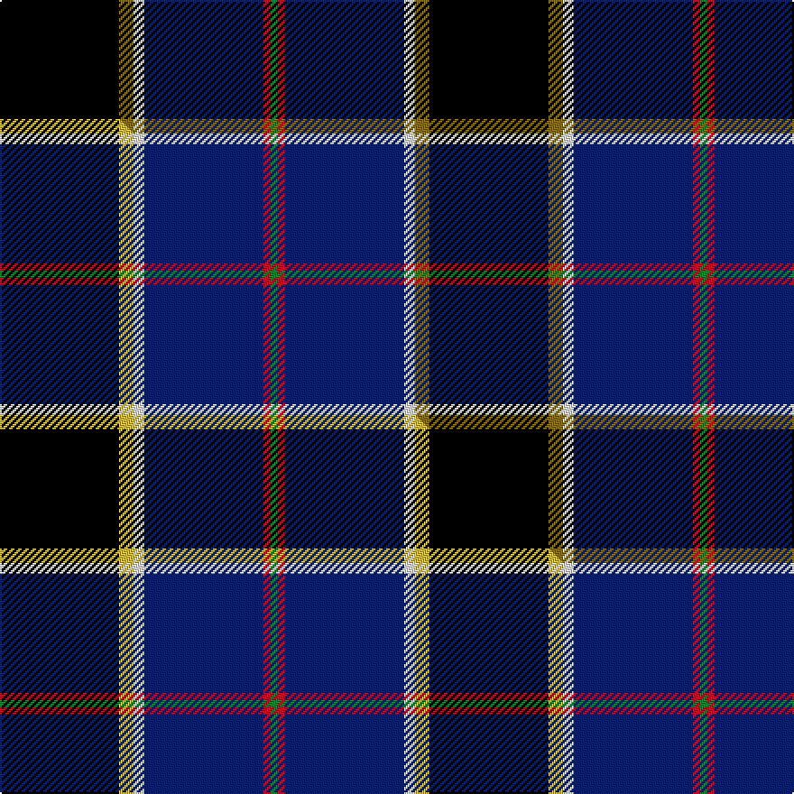

This page is one **sett** — a single exact thread-count. It belongs to the [tartan](/setts/k33y4w3db33r2g2/)
(the same proportion at any scale), whose colour order is pattern [GRBWGK](/stripes/grbwgk/).

Part of the [Atlantic Police Academy](/tartans/atlantic-police-academy/) tartan — the named design grouping this sett with its other cloths.

Sourced from tartans-authority.  It is a [6 stripe tartan](/stripes/stripes6/).

Original link http://www.tartansauthority.com/tartan-ferret/display/7344/

## Register references

External register numbers recorded for this tartan.

- Scottish Tartans Authority (ITI): 7344

## Thread count
K/66 Y8 W6 DB66 R4 G/4

One full sett is **238 threads**.

## Palette
<table><thead><tr><th>Colour</th><th>Shade</th><th>OKLCh</th></tr></thead><tbody><tr><td>DB</td><td><code style="background-color:#082077;">#082077</code> <small style="color:#888">#082077</small></td><td><small style="color:#888">oklch(30.0% 0.149 265.1)</small></td></tr><tr><td>G</td><td><code style="background-color:#008B2A;">#008B2A</code> <small style="color:#888">#008B2A</small></td><td><small style="color:#888">oklch(55.4% 0.170 145.9)</small></td></tr><tr><td>K</td><td><code style="background-color:#000000;">#000000</code> <small style="color:#888">#000000</small></td><td><small style="color:#888">oklch(0.0% 0.000 0.0)</small></td></tr><tr><td>W</td><td><code style="background-color:#F7F7F7;">#F7F7F7</code> <small style="color:#888">#F7F7F7</small></td><td><small style="color:#888">oklch(97.6% 0.000 89.9)</small></td></tr><tr><td>R</td><td><code style="background-color:#D60020;">#D60020</code> <small style="color:#888">#D60020</small></td><td><small style="color:#888">oklch(55.2% 0.224 25.5)</small></td></tr><tr><td>Y</td><td><code style="background-color:#8B6E00;">#8B6E00</code> <small style="color:#888">#8B6E00</small></td><td><small style="color:#888">oklch(55.1% 0.113 90.4)</small></td></tr></tbody></table>

# Sample pattern

## Compared to the master

This cloth is one sett of its design; the master sett (the exemplar the design is anchored on) is below for comparison.

Its **ΔTartan distance** from the master is **0.26** — the same measure the nearest-tartans table ranks by (0 is identical; a re-scale of the same cloth is near 0, a recolour or a different proportion further).

<figure class="master-compare" style="margin:0">

this sett
master sett ★

<figcaption style="color:#888;font-size:smaller">One weave of this sett against the <a href="/setts/k33ly4w3db33r2g2/">master sett ★</a>, split on the diagonal: a shared proportion runs seamlessly across it with only the shades shifting; a different proportion breaks on it.</figcaption>
</figure>

## Nearest tartan variants

The nearest existing variants by ΔTartan distance, with this cloth at the top so the swatches line up against it.

ΔTartan

Threads

Variant

Sett

—

238

<a href="/variants/s6/k33y4w3db33r2g2~x2/">Atlantic Police Academy (Corporate)</a>

<a href="/ttd/edit/#slug=k33ly4w3db33r2g2~x2&amp;base=k33y4w3db33r2g2~x2" title="compare in the TTD">0.00</a>

238

<a href="/variants/s6/k33ly4w3db33r2g2~x2/">Atlantic Police Academy</a>

<a href="/ttd/edit/#slug=ly4k28r2db22t8dy3~x2&amp;base=k33y4w3db33r2g2~x2" title="compare in the TTD">1.32</a>

254

<a href="/variants/s6/ly4k28r2db22t8dy3~x2/">Loch Long One Design (Corporate)</a>

<a href="/ttd/edit/#slug=dy3db40k35g5w2r3~x2&amp;base=k33y4w3db33r2g2~x2" title="compare in the TTD">1.46</a>

340

<a href="/variants/s6/dy3db40k35g5w2r3~x2/">Italian National</a>

<a href="/ttd/edit/#slug=dg10w2k10y5db35r6~x2&amp;base=k33y4w3db33r2g2~x2" title="compare in the TTD">1.48</a>

240

<a href="/variants/s6/dg10w2k10y5db35r6~x2/">Hatfield &amp; Mize (Personal)</a>

<a href="/ttd/edit/#slug=y4lb8dp4k53db54w4&amp;base=k33y4w3db33r2g2~x2" title="compare in the TTD">1.48</a>

246

<a href="/variants/s6/y4lb8dp4k53db54w4/">Pipers' Trail, The</a>

<a href="/ttd/edit/#slug=w4db54k53dp4lb8ly4&amp;base=k33y4w3db33r2g2~x2" title="compare in the TTD">1.48</a>

246

<a href="/variants/s6/w4db54k53dp4lb8ly4/">Pipers' Trail, The</a>

<a href="/ttd/edit/#slug=ly4t8dp4k53db54w2&amp;base=k33y4w3db33r2g2~x2" title="compare in the TTD">1.62</a>

244

<a href="/variants/s6/ly4t8dp4k53db54w2/">Pipers' Trail (Corporate)</a>

<a href="/ttd/edit/#slug=y4k28r2db22b8db3~x2&amp;base=k33y4w3db33r2g2~x2" title="compare in the TTD">1.94</a>

254

<a href="/variants/s6/y4k28r2db22b8db3~x2/">Loch Long One Design</a>

<a href="/ttd/edit/#slug=db48w2k20g22r3g4~x2&amp;base=k33y4w3db33r2g2~x2" title="compare in the TTD">2.12</a>

292

<a href="/variants/s6/db48w2k20g22r3g4~x2/">MacFadzean</a>

<a href="/ttd/edit/#slug=k8r4k36db48r6g3lo2~x2&amp;base=k33y4w3db33r2g2~x2" title="compare in the TTD">2.18</a>

408

<a href="/variants/s7/k8r4k36db48r6g3lo2~x2/">Royal Marines Condor</a>

## Neighbour map

Every grey dot is one of 13620 variants placed by the first two principal components of the ΔTartan feature space (42% of its variance). Red is this tartan; blue dots are its nearest — click one to open its page.

<svg viewBox="0 0 640 380" role="img" style="max-width:100%;height:auto;border:1px solid #e0e0e0;border-radius:4px;display:block" xmlns="http://www.w3.org/2000/svg"><image href="/nn/cloud.v1.png" width="640" height="380"/><a href="/variants/s6/k33ly4w3db33r2g2~x2/"><circle cx="201.3" cy="124.8" r="4" fill="#3465a4"><title>Atlantic Police Academy</title></circle></a><a href="/variants/s6/ly4k28r2db22t8dy3~x2/"><circle cx="160.7" cy="146.8" r="4" fill="#3465a4"><title>Loch Long One Design (Corporate)</title></circle></a><a href="/variants/s6/dy3db40k35g5w2r3~x2/"><circle cx="234.4" cy="124.9" r="4" fill="#3465a4"><title>Italian National</title></circle></a><a href="/variants/s6/dg10w2k10y5db35r6~x2/"><circle cx="230.0" cy="140.1" r="4" fill="#3465a4"><title>Hatfield &amp; Mize (Personal)</title></circle></a><a href="/variants/s6/y4lb8dp4k53db54w4/"><circle cx="199.7" cy="139.4" r="4" fill="#3465a4"><title>Pipers' Trail, The</title></circle></a><a href="/variants/s6/w4db54k53dp4lb8ly4/"><circle cx="195.2" cy="138.1" r="4" fill="#3465a4"><title>Pipers' Trail, The</title></circle></a><a href="/variants/s6/ly4t8dp4k53db54w2/"><circle cx="237.9" cy="115.3" r="4" fill="#3465a4"><title>Pipers' Trail (Corporate)</title></circle></a><a href="/variants/s6/y4k28r2db22b8db3~x2/"><circle cx="201.8" cy="163.9" r="4" fill="#3465a4"><title>Loch Long One Design</title></circle></a><a href="/variants/s6/db48w2k20g22r3g4~x2/"><circle cx="237.5" cy="139.1" r="4" fill="#3465a4"><title>MacFadzean</title></circle></a><a href="/variants/s7/k8r4k36db48r6g3lo2~x2/"><circle cx="250.5" cy="118.4" r="4" fill="#3465a4"><title>Royal Marines Condor</title></circle></a><circle cx="209.7" cy="127.3" r="5" fill="#c00000"/><text x="320" y="376" text-anchor="middle" font-size="11" fill="#999">ground</text><text x="11" y="190" text-anchor="middle" font-size="11" fill="#999" transform="rotate(-90 11 190)">complexity</text></svg>

ID: /variants/s6/k33y4w3db33r2g2~x2/
