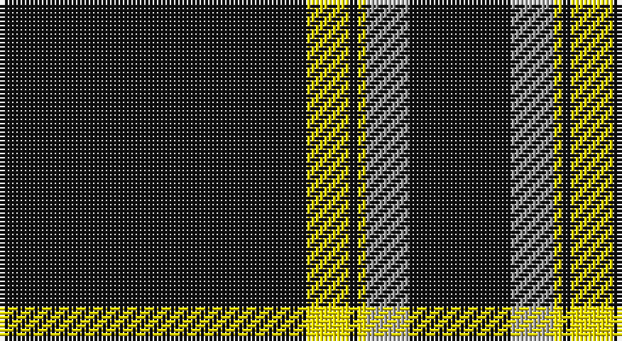

This page is one **sett** — a single exact thread-count. It belongs to the [tartan](/setts/k36ly5k1ly1lr5k12/)
(the same proportion at any scale), whose colour order is pattern [KYKYYK](/stripes/kykyyk/).

Sourced from register-of-tartans.  It is a [6 stripe tartan](/stripes/stripes6/).

Original link https://www.tartanregister.gov.uk/tartanDetails.aspx?ref=11543

## Register references

External register numbers recorded for this tartan.

- Scottish Register of Tartans: [11543](https://www.tartanregister.gov.uk/tartanDetails.aspx?ref=11543)

## Thread count
K/72 Y10 K2 Y2 N10 K/24

One full sett is **144 threads**.

## Palette

Palette: <strong>Tartan Register</strong>
<table><thead><tr><th>Colour</th><th>Threads</th><th>Shade</th><th>Base</th><th>OKLCh</th></tr></thead><tbody><tr><td>K/</td><td style="text-align:right;font-variant-numeric:tabular-nums">72</td><td><code style="background-color:#101010;">#101010</code> <small style="color:#888">#101010</small></td><td>K <code style="background-color:#000000;">#000000</code></td><td><small style="color:#888">oklch(17.3% 0.000 89.9)</small></td></tr><tr><td>Y</td><td style="text-align:right;font-variant-numeric:tabular-nums">10</td><td><code style="background-color:#FFE600;">#FFE600</code> <small style="color:#888">#FFE600</small></td><td>Y <code style="background-color:#F2BF00;">#F2BF00</code></td><td><small style="color:#888">oklch(91.7% 0.192 101.4)</small></td></tr><tr><td>K</td><td style="text-align:right;font-variant-numeric:tabular-nums">2</td><td><code style="background-color:#101010;">#101010</code> <small style="color:#888">#101010</small></td><td>K <code style="background-color:#000000;">#000000</code></td><td><small style="color:#888">oklch(17.3% 0.000 89.9)</small></td></tr><tr><td>Y</td><td style="text-align:right;font-variant-numeric:tabular-nums">2</td><td><code style="background-color:#FFE600;">#FFE600</code> <small style="color:#888">#FFE600</small></td><td>Y <code style="background-color:#F2BF00;">#F2BF00</code></td><td><small style="color:#888">oklch(91.7% 0.192 101.4)</small></td></tr><tr><td>N</td><td style="text-align:right;font-variant-numeric:tabular-nums">10</td><td><code style="background-color:#A0A0A0;">#A0A0A0</code> <small style="color:#888">#A0A0A0</small></td><td>Y <code style="background-color:#F2BF00;">#F2BF00</code></td><td><small style="color:#888">oklch(70.6% 0.000 89.9)</small></td></tr><tr><td>K/</td><td style="text-align:right;font-variant-numeric:tabular-nums">24</td><td><code style="background-color:#101010;">#101010</code> <small style="color:#888">#101010</small></td><td>K <code style="background-color:#000000;">#000000</code></td><td><small style="color:#888">oklch(17.3% 0.000 89.9)</small></td></tr></tbody></table>

# Sample pattern

## Nearest tartans

The nearest existing variants by ΔTartan distance, with this tartan at the top so the swatches line up against it.

ΔTartan

Tartan

Sett

—

<a href="/ttd/edit/#slug=k36ly5k1ly1lr5k12~x2">Merola (2016)</a> <a class="nn-out" href="/variants/s6/k36ly5k1ly1lr5k12~x2/" title="open its dictionary page">↗</a>

0.95

<a href="/ttd/edit/#slug=k44r2w10r3k6r1w2k18~x2&amp;base=k36ly5k1ly1lr5k12~x2">Mull Rugby Club</a> <a class="nn-out" href="/variants/s8/k44r2w10r3k6r1w2k18~x2/" title="open its dictionary page">↗</a>

1.19

<a href="/ttd/edit/#slug=k10lr2w5lr4k50b2~x2&amp;base=k36ly5k1ly1lr5k12~x2">London Fog Black</a> <a class="nn-out" href="/variants/s6/k10lr2w5lr4k50b2~x2/" title="open its dictionary page">↗</a>

1.29

<a href="/ttd/edit/#slug=k38lo1w7lo1k4lo2k3lo2~x2&amp;base=k36ly5k1ly1lr5k12~x2">Erck, Georges van (Personal),</a> <a class="nn-out" href="/variants/s8/k38lo1w7lo1k4lo2k3lo2~x2/" title="open its dictionary page">↗</a>

1.33

<a href="/ttd/edit/#slug=r4k16w4k16r4k42r20k83r2&amp;base=k36ly5k1ly1lr5k12~x2">Brand Ambassador</a> <a class="nn-out" href="/variants/s9/r4k16w4k16r4k42r20k83r2/" title="open its dictionary page">↗</a>

1.35

<a href="/ttd/edit/#slug=k75lb6k5lb18k2lb2k3~x2&amp;base=k36ly5k1ly1lr5k12~x2">Bargain Booze</a> <a class="nn-out" href="/variants/s7/k75lb6k5lb18k2lb2k3~x2/" title="open its dictionary page">↗</a>

1.43

<a href="/ttd/edit/#slug=k2w1k2r6k6r3k28w2~x2&amp;base=k36ly5k1ly1lr5k12~x2">Brockton</a> <a class="nn-out" href="/variants/s8/k2w1k2r6k6r3k28w2~x2/" title="open its dictionary page">↗</a>

1.45

<a href="/ttd/edit/#slug=k4r4k20r1k20w4~x6&amp;base=k36ly5k1ly1lr5k12~x2">Lanoir</a> <a class="nn-out" href="/variants/s6/k4r4k20r1k20w4~x6/" title="open its dictionary page">↗</a>

1.50

<a href="/ttd/edit/#slug=k4r11k32ly1k4~x2&amp;base=k36ly5k1ly1lr5k12~x2">Harvie</a> <a class="nn-out" href="/variants/s5/k4r11k32ly1k4~x2/" title="open its dictionary page">↗</a>

1.52

<a href="/ttd/edit/#slug=k20w1k1w3k1r1k1w1~x4&amp;base=k36ly5k1ly1lr5k12~x2">Volkswagen Black Trim (Fashion)</a> <a class="nn-out" href="/variants/s8/k20w1k1w3k1r1k1w1~x4/" title="open its dictionary page">↗</a>

1.53

<a href="/ttd/edit/#slug=k198lb9k17t13lb9k4lb13k4&amp;base=k36ly5k1ly1lr5k12~x2">London Fog Black (Fashion)</a> <a class="nn-out" href="/variants/s8/k198lb9k17t13lb9k4lb13k4/" title="open its dictionary page">↗</a>

## Neighbour map

Every grey dot is one of 14360 variants placed by the first two principal components of the ΔTartan feature space (44% of its variance). Red is this tartan; blue dots are its nearest — click one to open its page.

<svg viewBox="0 0 640 380" role="img" style="max-width:100%;height:auto;border:1px solid #e0e0e0;border-radius:4px;display:block" xmlns="http://www.w3.org/2000/svg"><image href="/nn/cloud.v1.png" width="640" height="380"/><a href="/variants/s8/k44r2w10r3k6r1w2k18~x2/"><circle cx="527.3" cy="132.2" r="4" fill="#3465a4"><title>Mull Rugby Club</title></circle></a><a href="/variants/s6/k10lr2w5lr4k50b2~x2/"><circle cx="538.4" cy="152.9" r="4" fill="#3465a4"><title>London Fog Black</title></circle></a><a href="/variants/s8/k38lo1w7lo1k4lo2k3lo2~x2/"><circle cx="529.6" cy="120.4" r="4" fill="#3465a4"><title>Erck, Georges van (Personal),</title></circle></a><a href="/variants/s9/r4k16w4k16r4k42r20k83r2/"><circle cx="573.0" cy="146.4" r="4" fill="#3465a4"><title>Brand Ambassador</title></circle></a><a href="/variants/s7/k75lb6k5lb18k2lb2k3~x2/"><circle cx="547.2" cy="148.4" r="4" fill="#3465a4"><title>Bargain Booze</title></circle></a><a href="/variants/s8/k2w1k2r6k6r3k28w2~x2/"><circle cx="520.9" cy="156.5" r="4" fill="#3465a4"><title>Brockton</title></circle></a><a href="/variants/s6/k4r4k20r1k20w4~x6/"><circle cx="537.3" cy="210.0" r="4" fill="#3465a4"><title>Lanoir</title></circle></a><a href="/variants/s5/k4r11k32ly1k4~x2/"><circle cx="538.5" cy="185.6" r="4" fill="#3465a4"><title>Harvie</title></circle></a><a href="/variants/s8/k20w1k1w3k1r1k1w1~x4/"><circle cx="525.2" cy="142.3" r="4" fill="#3465a4"><title>Volkswagen Black Trim (Fashion)</title></circle></a><a href="/variants/s8/k198lb9k17t13lb9k4lb13k4/"><circle cx="609.6" cy="116.1" r="4" fill="#3465a4"><title>London Fog Black (Fashion)</title></circle></a><circle cx="550.9" cy="162.0" r="5" fill="#c00000"/></svg>

ID: /variants/s6/k36ly5k1ly1lr5k12~x2/
