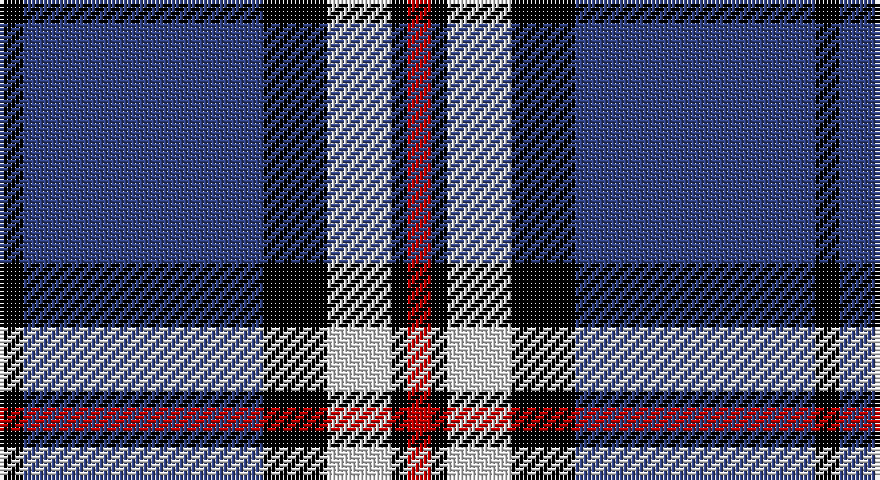

This page is one **sett** — a single exact thread-count. It belongs to the [tartan](/setts/k3db30k8w8k2r3/)
(the same proportion at any scale), whose colour order is pattern [KBKWKR](/stripes/kbkwkr/).

Part of the [Hydro-Electric](/tartans/hydro-electric/) tartan — the named design grouping this sett with its other cloths.

Sourced from weddslist.  It is a [6 stripe tartan](/stripes/stripes6/).

Original link http://www.weddslist.com/cgi-bin/tartans/pg.pl?source=sts

## Thread count
K/6 B60 K16 LN16 K4 R/6

One full sett is **204 threads**.

## Palette

Palette: <strong>Tartan Register</strong> <small style="color:#888">(2 of 4 colours)</small>
<table><thead><tr><th>Colour</th><th>Threads</th><th>Shade</th><th>Base</th><th>OKLCh</th></tr></thead><tbody><tr><td>K/</td><td style="text-align:right;font-variant-numeric:tabular-nums">6</td><td><code style="background-color:#000000;">#000000</code> <small style="color:#888">#000000</small></td><td>K <code style="background-color:#000000;">#000000</code></td><td><small style="color:#888">oklch(0.0% 0.000 0.0)</small></td></tr><tr><td>B</td><td style="text-align:right;font-variant-numeric:tabular-nums">60</td><td><code style="background-color:#304080;">#304080</code> <small style="color:#888">#304080</small></td><td>B <code style="background-color:#2A418A;">#2A418A</code></td><td><small style="color:#888">oklch(39.4% 0.109 270.2)</small></td></tr><tr><td>K</td><td style="text-align:right;font-variant-numeric:tabular-nums">16</td><td><code style="background-color:#000000;">#000000</code> <small style="color:#888">#000000</small></td><td>K <code style="background-color:#000000;">#000000</code></td><td><small style="color:#888">oklch(0.0% 0.000 0.0)</small></td></tr><tr><td>LN</td><td style="text-align:right;font-variant-numeric:tabular-nums">16</td><td><code style="background-color:#E0E0E0;">#E0E0E0</code> <small style="color:#888">#E0E0E0</small></td><td>W <code style="background-color:#F7F7F7;">#F7F7F7</code></td><td><small style="color:#888">oklch(90.7% 0.000 89.9)</small></td></tr><tr><td>K</td><td style="text-align:right;font-variant-numeric:tabular-nums">4</td><td><code style="background-color:#000000;">#000000</code> <small style="color:#888">#000000</small></td><td>K <code style="background-color:#000000;">#000000</code></td><td><small style="color:#888">oklch(0.0% 0.000 0.0)</small></td></tr><tr><td>R/</td><td style="text-align:right;font-variant-numeric:tabular-nums">6</td><td><code style="background-color:#C00000;">#C00000</code> <small style="color:#888">#C00000</small></td><td>R <code style="background-color:#CC0000;">#CC0000</code></td><td><small style="color:#888">oklch(50.7% 0.208 29.2)</small></td></tr></tbody></table>

# Sample pattern

## Compared to the master

This cloth is one sett of its design; the master sett (the exemplar the design is anchored on) is below for comparison.

<figure style="margin:0"><figcaption style="color:#888;font-size:smaller">this sett</figcaption></figure>
<figure style="margin:0"><figcaption style="color:#888;font-size:smaller"><a href="/setts/db11k4w5k1r3k1w5k4db11r1/">master sett →</a></figcaption></figure>

## Nearest tartans

The nearest existing variants by ΔTartan distance, with this tartan at the top so the swatches line up against it.

ΔTartan

Tartan

Sett

—

<a href="/ttd/edit/#slug=k3db30k8w8k2r3~x2">Hydro-Electric</a> <a class="nn-out" href="/variants/s6/k3db30k8w8k2r3~x2/" title="open its dictionary page">↗</a>

0.68

<a href="/ttd/edit/#slug=lo8w3db40k12w3lo3~x2&amp;base=k3db30k8w8k2r3~x2">Wolverines (Corporate)</a> <a class="nn-out" href="/variants/s6/lo8w3db40k12w3lo3~x2/" title="open its dictionary page">↗</a>

0.96

<a href="/ttd/edit/#slug=lo12db2lo2db30dt2db2dt13lb4~x2&amp;base=k3db30k8w8k2r3~x2">Highlands School (North Carolina)</a> <a class="nn-out" href="/variants/s8/lo12db2lo2db30dt2db2dt13lb4~x2/" title="open its dictionary page">↗</a>

1.06

<a href="/ttd/edit/#slug=w2db35k9w3k9ly2~x2&amp;base=k3db30k8w8k2r3~x2">Hannah (Personal)</a> <a class="nn-out" href="/variants/s6/w2db35k9w3k9ly2~x2/" title="open its dictionary page">↗</a>

1.07

<a href="/variants/s6/ly8k3b40ki12k3ly3~x2/">Wolverine Corporate Tartan</a>

1.07

<a href="/ttd/edit/#slug=db30lb2k9w3db6w4k3lb6~x2&amp;base=k3db30k8w8k2r3~x2">Detroit Lions</a> <a class="nn-out" href="/variants/s8/db30lb2k9w3db6w4k3lb6~x2/" title="open its dictionary page">↗</a>

1.17

<a href="/ttd/edit/#slug=ly12dbi2ly2dbi30db3dbi2db13w4~x2&amp;base=k3db30k8w8k2r3~x2">Highlands School (N. Carolina) Corporate Tartan</a> <a class="nn-out" href="/variants/s8/ly12dbi2ly2dbi30db3dbi2db13w4~x2/" title="open its dictionary page">↗</a>

1.17

<a href="/ttd/edit/#slug=lo2w1db6w1ly2k17ly1~x2&amp;base=k3db30k8w8k2r3~x2">East Tennessee State University</a> <a class="nn-out" href="/variants/s7/lo2w1db6w1ly2k17ly1~x2/" title="open its dictionary page">↗</a>

1.18

<a href="/ttd/edit/#slug=db4r2db39k11g2w16r2~x2&amp;base=k3db30k8w8k2r3~x2">Sinclair, The Jack</a> <a class="nn-out" href="/variants/s7/db4r2db39k11g2w16r2~x2/" title="open its dictionary page">↗</a>

1.22

<a href="/ttd/edit/#slug=r3db2w2db26k22w3db3w3~x2&amp;base=k3db30k8w8k2r3~x2">DeCloud-McMasters (Personal)</a> <a class="nn-out" href="/variants/s8/r3db2w2db26k22w3db3w3~x2/" title="open its dictionary page">↗</a>

1.25

<a href="/ttd/edit/#slug=db4w1db1w3db24y9k1y9k3~x2&amp;base=k3db30k8w8k2r3~x2">Historic Scotland</a> <a class="nn-out" href="/variants/s9/db4w1db1w3db24y9k1y9k3~x2/" title="open its dictionary page">↗</a>

## Neighbour map

Every grey dot is one of 14360 variants placed by the first two principal components of the ΔTartan feature space (44% of its variance). Red is this tartan; blue dots are its nearest — click one to open its page.

<svg viewBox="0 0 640 380" role="img" style="max-width:100%;height:auto;border:1px solid #e0e0e0;border-radius:4px;display:block" xmlns="http://www.w3.org/2000/svg"><image href="/nn/cloud.v1.png" width="640" height="380"/><a href="/variants/s6/lo8w3db40k12w3lo3~x2/"><circle cx="306.2" cy="167.4" r="4" fill="#3465a4"><title>Wolverines (Corporate)</title></circle></a><a href="/variants/s8/lo12db2lo2db30dt2db2dt13lb4~x2/"><circle cx="272.7" cy="161.3" r="4" fill="#3465a4"><title>Highlands School (North Carolina)</title></circle></a><a href="/variants/s6/w2db35k9w3k9ly2~x2/"><circle cx="349.3" cy="172.4" r="4" fill="#3465a4"><title>Hannah (Personal)</title></circle></a><a href="/variants/s6/ly8k3b40ki12k3ly3~x2/"><circle cx="314.0" cy="181.3" r="4" fill="#3465a4"><title>Wolverine Corporate Tartan</title></circle></a><a href="/variants/s8/db30lb2k9w3db6w4k3lb6~x2/"><circle cx="290.8" cy="154.2" r="4" fill="#3465a4"><title>Detroit Lions</title></circle></a><a href="/variants/s8/ly12dbi2ly2dbi30db3dbi2db13w4~x2/"><circle cx="259.8" cy="156.5" r="4" fill="#3465a4"><title>Highlands School (N. Carolina) Corporate Tartan</title></circle></a><a href="/variants/s7/lo2w1db6w1ly2k17ly1~x2/"><circle cx="282.6" cy="133.3" r="4" fill="#3465a4"><title>East Tennessee State University</title></circle></a><a href="/variants/s7/db4r2db39k11g2w16r2~x2/"><circle cx="284.1" cy="128.7" r="4" fill="#3465a4"><title>Sinclair, The Jack</title></circle></a><a href="/variants/s8/r3db2w2db26k22w3db3w3~x2/"><circle cx="256.3" cy="162.2" r="4" fill="#3465a4"><title>DeCloud-McMasters (Personal)</title></circle></a><a href="/variants/s9/db4w1db1w3db24y9k1y9k3~x2/"><circle cx="301.2" cy="138.3" r="4" fill="#3465a4"><title>Historic Scotland</title></circle></a><circle cx="291.1" cy="168.8" r="5" fill="#c00000"/></svg>

ID: /variants/s6/k3db30k8w8k2r3~x2/
