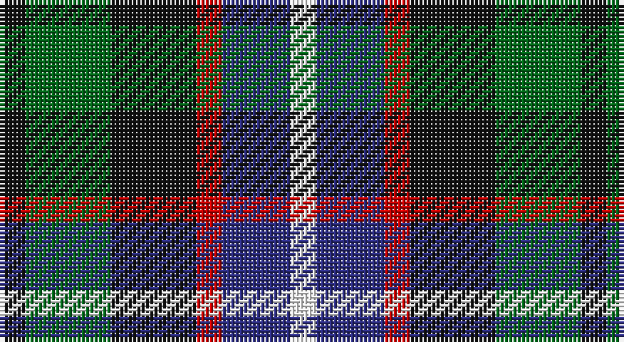

This page is one **sett** — a single exact thread-count. It belongs to the [tartan](/setts/k3g10k10r3db8w3/)
(the same proportion at any scale), whose colour order is pattern [KGKRBW](/stripes/kgkrbw/).

Sourced from tartans-authority.  It is a [6 stripe tartan](/stripes/stripes6/).

Original link http://www.tartansauthority.com/tartan-ferret/display/3179/

2 attestations — the source records this cloth was collapsed from (oldest owns this page)

<ul>
<li>1830-40 — Russell (Clan) (tartans-authority, <a href="http://www.tartansauthority.com/tartan-ferret/display/3179/">record</a>)</li>
<li>01/01/1892 — Russell (register-of-tartans, <a href="https://www.tartanregister.gov.uk/tartanDetails.aspx?ref=5146">record</a>)</li>
</ul>

## Register references

External register numbers recorded for this tartan.

- Scottish Register of Tartans: [5146](https://www.tartanregister.gov.uk/tartanDetails.aspx?ref=5146)
- Scottish Tartans Authority (ITI): 3179

## Thread count
K/6 G20 K20 R6 DB16 W/6

One full sett is **136 threads**.

## Palette

Palette: <strong>Tartan Register</strong>
<table><thead><tr><th>Colour</th><th>Threads</th><th>Shade</th><th>Base</th><th>OKLCh</th></tr></thead><tbody><tr><td>K/</td><td style="text-align:right;font-variant-numeric:tabular-nums">6</td><td><code style="background-color:#101010;">#101010</code> <small style="color:#888">#101010</small></td><td>K <code style="background-color:#000000;">#000000</code></td><td><small style="color:#888">oklch(17.3% 0.000 89.9)</small></td></tr><tr><td>G</td><td style="text-align:right;font-variant-numeric:tabular-nums">20</td><td><code style="background-color:#006818;">#006818</code> <small style="color:#888">#006818</small></td><td>G <code style="background-color:#006100;">#006100</code></td><td><small style="color:#888">oklch(45.0% 0.142 145.0)</small></td></tr><tr><td>K</td><td style="text-align:right;font-variant-numeric:tabular-nums">20</td><td><code style="background-color:#101010;">#101010</code> <small style="color:#888">#101010</small></td><td>K <code style="background-color:#000000;">#000000</code></td><td><small style="color:#888">oklch(17.3% 0.000 89.9)</small></td></tr><tr><td>R</td><td style="text-align:right;font-variant-numeric:tabular-nums">6</td><td><code style="background-color:#C80000;">#C80000</code> <small style="color:#888">#C80000</small></td><td>R <code style="background-color:#CC0000;">#CC0000</code></td><td><small style="color:#888">oklch(52.3% 0.215 29.2)</small></td></tr><tr><td>DB</td><td style="text-align:right;font-variant-numeric:tabular-nums">16</td><td><code style="background-color:#2C2C80;">#2C2C80</code> <small style="color:#888">#2C2C80</small></td><td>B <code style="background-color:#2A418A;">#2A418A</code></td><td><small style="color:#888">oklch(35.0% 0.138 276.6)</small></td></tr><tr><td>W/</td><td style="text-align:right;font-variant-numeric:tabular-nums">6</td><td><code style="background-color:#FCFCFC;">#FCFCFC</code> <small style="color:#888">#FCFCFC</small></td><td>W <code style="background-color:#F7F7F7;">#F7F7F7</code></td><td><small style="color:#888">oklch(99.1% 0.000 89.9)</small></td></tr></tbody></table>

# Sample pattern

## Nearest tartans

The nearest existing variants by ΔTartan distance, with this tartan at the top so the swatches line up against it.

ΔTartan

Tartan

Sett

—

<a href="/ttd/edit/#slug=k3g10k10r3db8w3~x2">Russell (Clan)</a> <a class="nn-out" href="/variants/s6/k3g10k10r3db8w3~x2/" title="open its dictionary page">↗</a>

0.57

<a href="/ttd/edit/#slug=k3g8k8r2db8w2~x2&amp;base=k3g10k10r3db8w3~x2">Mitchell Family Tartan</a> <a class="nn-out" href="/variants/s6/k3g8k8r2db8w2~x2/" title="open its dictionary page">↗</a>

0.85

<a href="/ttd/edit/#slug=k19t10dp19dg40ly10&amp;base=k3g10k10r3db8w3~x2">Gala Water Old</a> <a class="nn-out" href="/variants/s5/k19t10dp19dg40ly10/" title="open its dictionary page">↗</a>

0.86

<a href="/ttd/edit/#slug=t3g8k9db7r2db2~x2&amp;base=k3g10k10r3db8w3~x2">Wellington, or Waterloo</a> <a class="nn-out" href="/variants/s6/t3g8k9db7r2db2~x2/" title="open its dictionary page">↗</a>

0.88

<a href="/ttd/edit/#slug=r4g15k15db15w4~x2&amp;base=k3g10k10r3db8w3~x2">Dalmeny</a> <a class="nn-out" href="/variants/s5/r4g15k15db15w4~x2/" title="open its dictionary page">↗</a>

0.96

<a href="/ttd/edit/#slug=k3w2k3g8k8db8r2db3~x2&amp;base=k3g10k10r3db8w3~x2">Davidson, Double</a> <a class="nn-out" href="/variants/s8/k3w2k3g8k8db8r2db3~x2/" title="open its dictionary page">↗</a>

1.05

<a href="/ttd/edit/#slug=r4g11k11g2db11y3~x4&amp;base=k3g10k10r3db8w3~x2">Casely</a> <a class="nn-out" href="/variants/s6/r4g11k11g2db11y3~x4/" title="open its dictionary page">↗</a>

1.06

<a href="/ttd/edit/#slug=g15dg18db23w4r8~x2&amp;base=k3g10k10r3db8w3~x2">Friebe (2014)</a> <a class="nn-out" href="/variants/s5/g15dg18db23w4r8~x2/" title="open its dictionary page">↗</a>

1.06

<a href="/ttd/edit/#slug=k19t10dp19g40ly10&amp;base=k3g10k10r3db8w3~x2">Gallowater Old District Tartan</a> <a class="nn-out" href="/variants/s5/k19t10dp19g40ly10/" title="open its dictionary page">↗</a>

1.06

<a href="/ttd/edit/#slug=r1k2g4k1g1k2db3k1w1~x6&amp;base=k3g10k10r3db8w3~x2">MacKean Dress (Personal)</a> <a class="nn-out" href="/variants/s9/r1k2g4k1g1k2db3k1w1~x6/" title="open its dictionary page">↗</a>

1.08

<a href="/ttd/edit/#slug=k6b2db12g8r5k2g3~x4&amp;base=k3g10k10r3db8w3~x2">Cooke</a> <a class="nn-out" href="/variants/s7/k6b2db12g8r5k2g3~x4/" title="open its dictionary page">↗</a>

## Neighbour map

Every grey dot is one of 14360 variants placed by the first two principal components of the ΔTartan feature space (44% of its variance). Red is this tartan; blue dots are its nearest — click one to open its page.

<svg viewBox="0 0 640 380" role="img" style="max-width:100%;height:auto;border:1px solid #e0e0e0;border-radius:4px;display:block" xmlns="http://www.w3.org/2000/svg"><image href="/nn/cloud.v1.png" width="640" height="380"/><a href="/variants/s6/k3g8k8r2db8w2~x2/"><circle cx="94.7" cy="257.5" r="4" fill="#3465a4"><title>Mitchell Family Tartan</title></circle></a><a href="/variants/s5/k19t10dp19dg40ly10/"><circle cx="113.4" cy="262.7" r="4" fill="#3465a4"><title>Gala Water Old</title></circle></a><a href="/variants/s6/t3g8k9db7r2db2~x2/"><circle cx="57.1" cy="246.6" r="4" fill="#3465a4"><title>Wellington, or Waterloo</title></circle></a><a href="/variants/s5/r4g15k15db15w4~x2/"><circle cx="36.3" cy="260.2" r="4" fill="#3465a4"><title>Dalmeny</title></circle></a><a href="/variants/s8/k3w2k3g8k8db8r2db3~x2/"><circle cx="104.3" cy="244.0" r="4" fill="#3465a4"><title>Davidson, Double</title></circle></a><a href="/variants/s6/r4g11k11g2db11y3~x4/"><circle cx="73.4" cy="237.6" r="4" fill="#3465a4"><title>Casely</title></circle></a><a href="/variants/s5/g15dg18db23w4r8~x2/"><circle cx="91.0" cy="251.4" r="4" fill="#3465a4"><title>Friebe (2014)</title></circle></a><a href="/variants/s5/k19t10dp19g40ly10/"><circle cx="108.6" cy="257.2" r="4" fill="#3465a4"><title>Gallowater Old District Tartan</title></circle></a><a href="/variants/s9/r1k2g4k1g1k2db3k1w1~x6/"><circle cx="100.2" cy="238.0" r="4" fill="#3465a4"><title>MacKean Dress (Personal)</title></circle></a><a href="/variants/s7/k6b2db12g8r5k2g3~x4/"><circle cx="81.6" cy="220.6" r="4" fill="#3465a4"><title>Cooke</title></circle></a><circle cx="67.3" cy="259.1" r="5" fill="#c00000"/></svg>

ID: /variants/s6/k3g10k10r3db8w3~x2/
