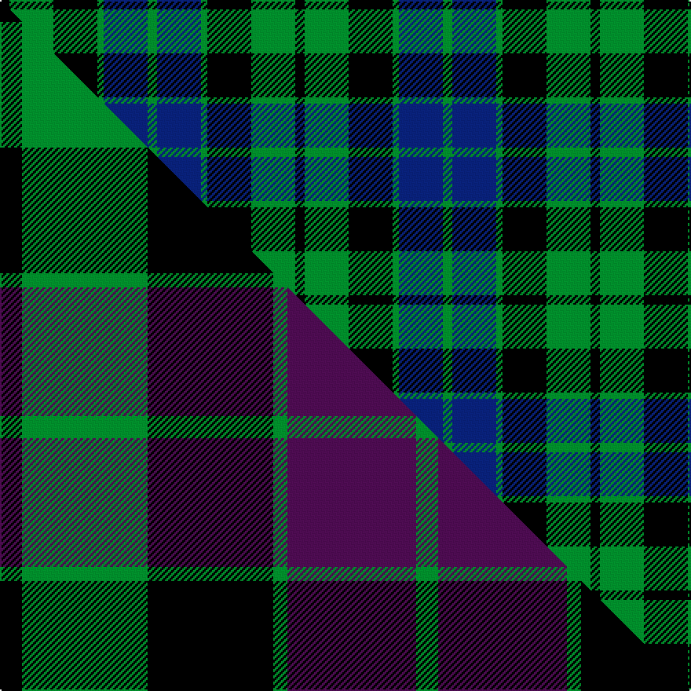

This is one **variant** — a specific cloth: this exact thread count and colourway, with its own
provenance below. It is one weaving of the [sett](/setts/k3g14k14g2db14g3/) (the scale-free proportion — the
same cloth at any scale or shade), whose colour order is pattern [GBGKGK](/stripes/gbgkgk/).

Part of the [MacKay](/tartans/m/ma/mackay-3/) tartan — the named design grouping this sett with its other cloths.

Sourced from house-of-tartan.  It is a [6 stripe tartan](/stripes/stripes6/).

Original link [http://www.house-of-tartan.scotland.net/house/TartanViewjs.asp?colr=Def&tnam=703](http://www.house-of-tartan.scotland.net/house/TartanViewjs.asp?colr=Def&tnam=703)

## Provenance

Earliest known date: 1816 Wilson's of Bannockburn (1819) record the same sett with blue changed to purple. Logan calls the colour 'corbeau' which is in fact a dark shade of green. The pattern shows a marked similarity to the Gunn tartan in all but colour, suggesting a territorial origin for both. Recently historians of Scottish dress have tended to stress the geographical sources, rather than the clan associations of the earliest Highland tartans. A sample was signed and sealed by the Chief for Highland Society of London in 1816.

3 attestations — the source records this cloth was collapsed from (oldest owns this page)

<ul>
<li>1816 — MacKay Clan Tartan (house-of-tartan, <a href="http://www.house-of-tartan.scotland.net/house/TartanViewjs.asp?colr=Def&tnam=703">record</a>) </li>
<li>undated — MacKay (weddslist, <a href="http://www.weddslist.com/cgi-bin/tartans/pg.pl?source=sts">record</a>) </li>
<li>undated — MacKay (weddslist, <a href="http://www.weddslist.com/cgi-bin/tartans/pg.pl?source=tinsel">record</a>) </li>
</ul>

Dataset <small>— provenance for this record, inherited from the source manifest</small>

<dl class="dataset-prov">
<dt>source</dt><dd><a href="/sources/house-of-tartan/">House of Tartan</a></dd>
<dt>data captured from</dt><dd><a href="https://github.com/thetartan/tartan-database/blob/master/data/house-of-tartan/data.csv">https://github.com/thetartan/tartan-database/blob/master/data/house-of-tartan/data.csv</a></dd>
<dt>data date</dt><dd>1816 <small>(this record)</small></dd>
<dt>licence</dt><dd><a href="https://creativecommons.org/licenses/by-nc-nd/4.0/">CC BY-NC-ND 4.0</a></dd>
</dl>

Capture chain <small>— the hands this data passed through, oldest first; each capture carries its own licence</small>

<ol class="capture-chain">
<li><a href="http://www.house-of-tartan.scotland.net/">House of Tartan</a> <small>the weaver/retailer's database — the site is now offline; the URL is kept as the ultimate source's identity</small></li>
<li><a href="https://github.com/thetartan/tartan-database">thetartan/tartan-database</a> <small>2016-2017</small> · <a href="https://creativecommons.org/licenses/by-nc-nd/4.0/">CC BY-NC-ND 4.0</a> <small>Levko Kravets's frozen compilation — the capture we vendored, and where its CC licence text came from</small></li>
<li>this dictionary <small>captured 2026-06-10 · commit 5bf86c7566</small> <small>each re-capture is a git commit to data/sources</small></li>
</ol>

## Thread count
K/6 G28 K28 G4 DB28 G/6

One full sett is **188 threads**.

## Palette
<table><thead><tr><th>Colour</th><th>Shade</th><th>OKLCh</th></tr></thead><tbody><tr><td>DB</td><td><code style="background-color:#082077;">#082077</code> <small style="color:#888">#082077</small></td><td><small style="color:#888">oklch(30.0% 0.149 265.1)</small></td></tr><tr><td>G</td><td><code style="background-color:#008B2A;">#008B2A</code> <small style="color:#888">#008B2A</small></td><td><small style="color:#888">oklch(55.4% 0.170 145.9)</small></td></tr><tr><td>K</td><td><code style="background-color:#000000;">#000000</code> <small style="color:#888">#000000</small></td><td><small style="color:#888">oklch(0.0% 0.000 0.0)</small></td></tr></tbody></table>

# Sample pattern

## Compared to the master

This cloth is one sett of its design; the master sett (the exemplar the design is anchored on) is below for comparison.

Its **ΔTartan distance** from the master is **1.24** — the same measure the nearest-tartans table ranks by (0 is identical; a re-scale of the same cloth is near 0, a recolour or a different proportion further).

<figure class="master-compare" style="margin:0">

this sett
master sett ★

<figcaption style="color:#888;font-size:smaller">One weave of this sett against the <a href="/setts/k14g80k80g9dp82g14/">master sett ★</a>, split on the diagonal: a shared proportion runs seamlessly across it with only the shades shifting; a different proportion breaks on it.</figcaption>
</figure>

## Nearest tartan variants

The nearest existing variants by ΔTartan distance, with this cloth at the top so the swatches line up against it.

ΔTartan

Threads

Variant

Sett

—

188

<a href="/variants/s6/k3g14k14g2db14g3~x2/">MacKay Clan Tartan</a>

<a href="/ttd/edit/#slug=k3g14k14g2db14g3&amp;base=k3g14k14g2db14g3~x2" title="compare in the TTD">0.00</a>

94

<a href="/variants/s6/k3g14k14g2db14g3/">MacKay</a>

<a href="/ttd/edit/#slug=k4g23k23g2t23g4~x2&amp;base=k3g14k14g2db14g3~x2" title="compare in the TTD">0.51</a>

300

<a href="/variants/s6/k4g23k23g2t23g4~x2/">MacKay (Logan)</a>

<a href="/ttd/edit/#slug=k3g14k14g2db14r3&amp;base=k3g14k14g2db14g3~x2" title="compare in the TTD">1.09</a>

94

<a href="/variants/s6/k3g14k14g2db14r3/">Morrison</a>

<a href="/ttd/edit/#slug=k3g14k14g2db14r3~x2&amp;base=k3g14k14g2db14g3~x2" title="compare in the TTD">1.09</a>

188

<a href="/variants/s6/k3g14k14g2db14r3~x2/">Morrison Clan Tartan</a>

<a href="/ttd/edit/#slug=k3g14k14g2t14r3~x2&amp;base=k3g14k14g2db14g3~x2" title="compare in the TTD">1.09</a>

188

<a href="/variants/s6/k3g14k14g2t14r3~x2/">Morrison Society</a>

<a href="/ttd/edit/#slug=k3g14k14g2db15y2~x2&amp;base=k3g14k14g2db14g3~x2" title="compare in the TTD">1.12</a>

190

<a href="/variants/s6/k3g14k14g2db15y2~x2/">Glenturret Corporate Tartan</a>

<a href="/ttd/edit/#slug=k4g25k24r3db24g4~x2&amp;base=k3g14k14g2db14g3~x2" title="compare in the TTD">1.22</a>

320

<a href="/variants/s6/k4g25k24r3db24g4~x2/">Ferguson of Balquhidder #2</a>

<a href="/ttd/edit/#slug=k4g19k16w2db15g4~x2&amp;base=k3g14k14g2db14g3~x2" title="compare in the TTD">1.24</a>

224

<a href="/variants/s6/k4g19k16w2db15g4~x2/">Graham of Montrose</a>

<a href="/ttd/edit/#slug=k14g80k80g9dp82g14&amp;base=k3g14k14g2db14g3~x2" title="compare in the TTD">1.24</a>

530

<a href="/variants/s6/k14g80k80g9dp82g14/">MacKay Plaid</a>

<a href="/ttd/edit/#slug=r4g12k12g2db12g3~x2&amp;base=k3g14k14g2db14g3~x2" title="compare in the TTD">1.29</a>

166

<a href="/variants/s6/r4g12k12g2db12g3~x2/">Gunn - 1810 (Clan)</a>

## Neighbour map

Every grey dot is one of 13621 variants placed by the first two principal components of the ΔTartan feature space (42% of its variance). Red is this tartan; blue dots are its nearest — click one to open its page. The map is a flat projection of a many-dimensional space — [how to read it](/posts/neighbourhood-maps/).

<svg viewBox="0 0 640 380" role="img" style="max-width:100%;height:auto;border:1px solid #e0e0e0;border-radius:4px;display:block" xmlns="http://www.w3.org/2000/svg"><image href="/nn/cloud.v1.png" width="640" height="380"/><a href="/variants/s6/k3g14k14g2db14g3/"><circle cx="169.8" cy="239.6" r="4" fill="#3465a4"><title>MacKay</title></circle></a><a href="/variants/s6/k4g23k23g2t23g4~x2/"><circle cx="178.5" cy="215.8" r="4" fill="#3465a4"><title>MacKay (Logan)</title></circle></a><a href="/variants/s6/k3g14k14g2db14r3/"><circle cx="126.6" cy="223.5" r="4" fill="#3465a4"><title>Morrison</title></circle></a><a href="/variants/s6/k3g14k14g2db14r3~x2/"><circle cx="126.6" cy="223.5" r="4" fill="#3465a4"><title>Morrison Clan Tartan</title></circle></a><a href="/variants/s6/k3g14k14g2t14r3~x2/"><circle cx="119.1" cy="224.2" r="4" fill="#3465a4"><title>Morrison Society</title></circle></a><a href="/variants/s6/k3g14k14g2db15y2~x2/"><circle cx="139.5" cy="220.3" r="4" fill="#3465a4"><title>Glenturret Corporate Tartan</title></circle></a><a href="/variants/s6/k4g25k24r3db24g4~x2/"><circle cx="142.8" cy="212.3" r="4" fill="#3465a4"><title>Ferguson of Balquhidder #2</title></circle></a><a href="/variants/s6/k4g19k16w2db15g4~x2/"><circle cx="149.5" cy="212.4" r="4" fill="#3465a4"><title>Graham of Montrose</title></circle></a><a href="/variants/s6/k14g80k80g9dp82g14/"><circle cx="181.6" cy="221.4" r="4" fill="#3465a4"><title>MacKay Plaid</title></circle></a><a href="/variants/s6/r4g12k12g2db12g3~x2/"><circle cx="125.8" cy="238.4" r="4" fill="#3465a4"><title>Gunn - 1810 (Clan)</title></circle></a><circle cx="169.8" cy="239.6" r="5" fill="#c00000"/><text x="320" y="376" text-anchor="middle" font-size="11" fill="#999">ground</text><text x="11" y="190" text-anchor="middle" font-size="11" fill="#999" transform="rotate(-90 11 190)">complexity</text></svg>

ID: /variants/s6/k3g14k14g2db14g3~x2/
