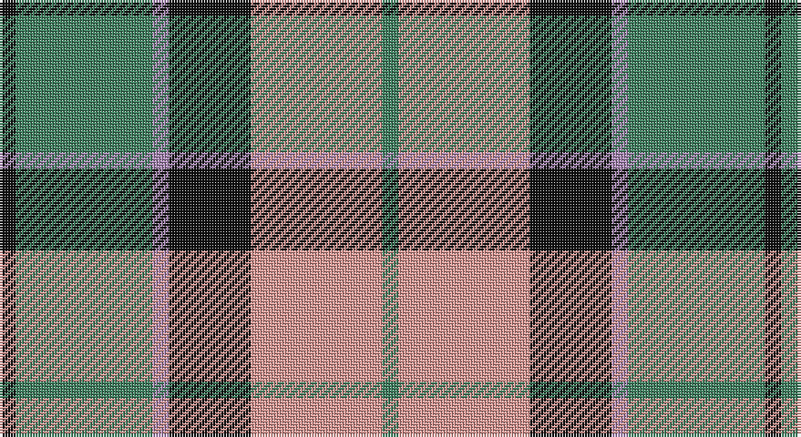

This page is one **sett** — a single exact thread-count. It belongs to the [tartan](/setts/k3g25o3k15lr24g3/)
(the same proportion at any scale), whose colour order is pattern [GYKRGK](/stripes/gykrgk/).

Part of the [Un-named](/tartans/un-named/) tartan — the named design grouping this sett with its other cloths.

Sourced from register-of-tartans.  It is a [6 stripe tartan](/stripes/stripes6/).

Original link https://www.tartanregister.gov.uk/tartanDetails.aspx?ref=4409

## Also known as

This cloth is also recorded under:

- Un-named #2
- Un-named #3
- Unnamed
- Unnamed Brown
- Unnamed Green

## Register references

External register numbers recorded for this tartan.

- Scottish Register of Tartans: [4409](https://www.tartanregister.gov.uk/tartanDetails.aspx?ref=4409)
- Scottish Tartans Authority (ITI): 7232

## Thread count
K/6 G50 N6 K30 LR48 G/6

One full sett is **280 threads**.

## Palette

Palette: <strong>Tartan Register</strong> <small style="color:#888">(2 of 4 colours)</small>
<table><thead><tr><th>Colour</th><th>Threads</th><th>Shade</th><th>Base</th><th>OKLCh</th></tr></thead><tbody><tr><td>K/</td><td style="text-align:right;font-variant-numeric:tabular-nums">6</td><td><code style="background-color:#101010;">#101010</code> <small style="color:#888">#101010</small></td><td>K <code style="background-color:#000000;">#000000</code></td><td><small style="color:#888">oklch(17.3% 0.000 89.9)</small></td></tr><tr><td>G</td><td style="text-align:right;font-variant-numeric:tabular-nums">50</td><td><code style="background-color:#408060;">#408060</code> <small style="color:#888">#408060</small></td><td>G <code style="background-color:#006100;">#006100</code></td><td><small style="color:#888">oklch(54.8% 0.084 160.1)</small></td></tr><tr><td>N</td><td style="text-align:right;font-variant-numeric:tabular-nums">6</td><td><code style="background-color:#A888B4;">#A888B4</code> <small style="color:#888">#A888B4</small></td><td>R <code style="background-color:#CC0000;">#CC0000</code></td><td><small style="color:#888">oklch(67.2% 0.073 316.7)</small></td></tr><tr><td>K</td><td style="text-align:right;font-variant-numeric:tabular-nums">30</td><td><code style="background-color:#101010;">#101010</code> <small style="color:#888">#101010</small></td><td>K <code style="background-color:#000000;">#000000</code></td><td><small style="color:#888">oklch(17.3% 0.000 89.9)</small></td></tr><tr><td>LR</td><td style="text-align:right;font-variant-numeric:tabular-nums">48</td><td><code style="background-color:#E09894;">#E09894</code> <small style="color:#888">#E09894</small></td><td>Y <code style="background-color:#F2BF00;">#F2BF00</code></td><td><small style="color:#888">oklch(75.0% 0.087 22.9)</small></td></tr><tr><td>G/</td><td style="text-align:right;font-variant-numeric:tabular-nums">6</td><td><code style="background-color:#408060;">#408060</code> <small style="color:#888">#408060</small></td><td>G <code style="background-color:#006100;">#006100</code></td><td><small style="color:#888">oklch(54.8% 0.084 160.1)</small></td></tr></tbody></table>

# Sample pattern

## Compared to the master

This cloth is one sett of its design; the master sett (the exemplar the design is anchored on) is below for comparison.

<figure style="margin:0"><figcaption style="color:#888;font-size:smaller">this sett</figcaption></figure>
<figure style="margin:0"><figcaption style="color:#888;font-size:smaller"><a href="/setts/b5lg2b2lg9k3b9g3b3g25lr2/">master sett →</a></figcaption></figure>

## Nearest tartans

The nearest existing variants by ΔTartan distance, with this tartan at the top so the swatches line up against it.

ΔTartan

Tartan

Sett

—

<a href="/ttd/edit/#slug=k3g25o3k15lr24g3~x2">Un-named (D C Dalgliesh) #3</a> <a class="nn-out" href="/variants/s6/k3g25o3k15lr24g3~x2/" title="open its dictionary page">↗</a>

0.68

<a href="/ttd/edit/#slug=r3w8db4dg14r4db2~x4&amp;base=k3g25o3k15lr24g3~x2">MacKintosh Dress (Scott Adie)</a> <a class="nn-out" href="/variants/s6/r3w8db4dg14r4db2~x4/" title="open its dictionary page">↗</a>

0.75

<a href="/ttd/edit/#slug=r3y27k6lo13k14r3~x2&amp;base=k3g25o3k15lr24g3~x2">Thompson/Thomson/MacTavish special grey</a> <a class="nn-out" href="/variants/s6/r3y27k6lo13k14r3~x2/" title="open its dictionary page">↗</a>

0.77

<a href="/ttd/edit/#slug=r2o20k5w10k10r2~x2&amp;base=k3g25o3k15lr24g3~x2">Thompson Grey Family Tartan</a> <a class="nn-out" href="/variants/s6/r2o20k5w10k10r2~x2/" title="open its dictionary page">↗</a>

0.83

<a href="/ttd/edit/#slug=r2lo20k5w10k10w2~x2&amp;base=k3g25o3k15lr24g3~x2">Thompson Camel Clan Tartan</a> <a class="nn-out" href="/variants/s6/r2lo20k5w10k10w2~x2/" title="open its dictionary page">↗</a>

0.92

<a href="/ttd/edit/#slug=r1o6k1w3k3r1~x8&amp;base=k3g25o3k15lr24g3~x2">Thompson Grey Dress</a> <a class="nn-out" href="/variants/s6/r1o6k1w3k3r1~x8/" title="open its dictionary page">↗</a>

0.92

<a href="/ttd/edit/#slug=r4lo30k6w13k13w3~x2&amp;base=k3g25o3k15lr24g3~x2">Thomson Camel</a> <a class="nn-out" href="/variants/s6/r4lo30k6w13k13w3~x2/" title="open its dictionary page">↗</a>

0.92

<a href="/ttd/edit/#slug=r2ly1b8r1g7ly1r2~x6&amp;base=k3g25o3k15lr24g3~x2">Cercle de Fermieres de St-Elie . . .</a> <a class="nn-out" href="/variants/s7/r2ly1b8r1g7ly1r2~x6/" title="open its dictionary page">↗</a>

0.94

<a href="/ttd/edit/#slug=t4o28g6t12k12t3~x2&amp;base=k3g25o3k15lr24g3~x2">MacTavish / Thom(p)son, hunting</a> <a class="nn-out" href="/variants/s6/t4o28g6t12k12t3~x2/" title="open its dictionary page">↗</a>

0.99

<a href="/ttd/edit/#slug=r3w8db4g14r4db2~x2&amp;base=k3g25o3k15lr24g3~x2">MacIntosh, dress</a> <a class="nn-out" href="/variants/s6/r3w8db4g14r4db2~x2/" title="open its dictionary page">↗</a>

0.99

<a href="/ttd/edit/#slug=ly5k5g17k6o24k6ly3~x2&amp;base=k3g25o3k15lr24g3~x2">Cape Breton District Tartan</a> <a class="nn-out" href="/variants/s7/ly5k5g17k6o24k6ly3~x2/" title="open its dictionary page">↗</a>

## Neighbour map

Every grey dot is one of 14360 variants placed by the first two principal components of the ΔTartan feature space (44% of its variance). Red is this tartan; blue dots are its nearest — click one to open its page.

<svg viewBox="0 0 640 380" role="img" style="max-width:100%;height:auto;border:1px solid #e0e0e0;border-radius:4px;display:block" xmlns="http://www.w3.org/2000/svg"><image href="/nn/cloud.v1.png" width="640" height="380"/><a href="/variants/s6/r3w8db4dg14r4db2~x4/"><circle cx="150.0" cy="215.1" r="4" fill="#3465a4"><title>MacKintosh Dress (Scott Adie)</title></circle></a><a href="/variants/s6/r3y27k6lo13k14r3~x2/"><circle cx="191.8" cy="207.7" r="4" fill="#3465a4"><title>Thompson/Thomson/MacTavish special grey</title></circle></a><a href="/variants/s6/r2o20k5w10k10r2~x2/"><circle cx="173.9" cy="193.4" r="4" fill="#3465a4"><title>Thompson Grey Family Tartan</title></circle></a><a href="/variants/s6/r2lo20k5w10k10w2~x2/"><circle cx="175.6" cy="191.0" r="4" fill="#3465a4"><title>Thompson Camel Clan Tartan</title></circle></a><a href="/variants/s6/r1o6k1w3k3r1~x8/"><circle cx="144.2" cy="215.5" r="4" fill="#3465a4"><title>Thompson Grey Dress</title></circle></a><a href="/variants/s6/r4lo30k6w13k13w3~x2/"><circle cx="189.7" cy="187.9" r="4" fill="#3465a4"><title>Thomson Camel</title></circle></a><a href="/variants/s7/r2ly1b8r1g7ly1r2~x6/"><circle cx="184.9" cy="204.3" r="4" fill="#3465a4"><title>Cercle de Fermieres de St-Elie . . .</title></circle></a><a href="/variants/s6/t4o28g6t12k12t3~x2/"><circle cx="202.1" cy="213.8" r="4" fill="#3465a4"><title>MacTavish / Thom(p)son, hunting</title></circle></a><a href="/variants/s6/r3w8db4g14r4db2~x2/"><circle cx="150.5" cy="217.2" r="4" fill="#3465a4"><title>MacIntosh, dress</title></circle></a><a href="/variants/s7/ly5k5g17k6o24k6ly3~x2/"><circle cx="152.1" cy="208.8" r="4" fill="#3465a4"><title>Cape Breton District Tartan</title></circle></a><circle cx="179.5" cy="206.9" r="5" fill="#c00000"/></svg>

ID: /variants/s6/k3g25o3k15lr24g3~x2/
