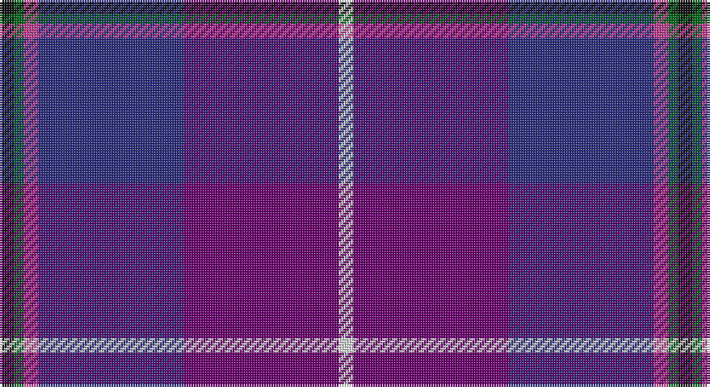

This page is one **sett** — a single exact thread-count. It belongs to the [tartan](/setts/k3g2m3db30dp32w3/)
(the same proportion at any scale), whose colour order is pattern [KGRBBW](/stripes/kgrbbw/).

Sourced from register-of-tartans.  It is a [6 stripe tartan](/stripes/stripes6/).

Original link https://www.tartanregister.gov.uk/tartanDetails.aspx?ref=3372

2 attestations — the source records this cloth was collapsed from (oldest owns this page)

<ul>
<li>01/11/2001 — Pride of Glencoe (register-of-tartans, <a href="https://www.tartanregister.gov.uk/tartanDetails.aspx?ref=3372">record</a>)</li>
<li>2001 — Pride of Glencoe (Fashion) (tartans-authority, <a href="http://www.tartansauthority.com/tartan-ferret/display/3446/">record</a>)</li>
</ul>

## Register references

External register numbers recorded for this tartan.

- Scottish Register of Tartans: [3372](https://www.tartanregister.gov.uk/tartanDetails.aspx?ref=3372)
- Scottish Tartans Authority (ITI): 3446
- Scottish Tartans World Register: 2865

## Thread count
K/6 G4 P6 DB60 Pa64 LN/6

One full sett is **280 threads**.

## Palette

Palette: <strong>Tartan Register</strong> <small style="color:#888">(5 of 6 colours)</small>
<table><thead><tr><th>Colour</th><th>Threads</th><th>Shade</th><th>Base</th><th>OKLCh</th></tr></thead><tbody><tr><td>K/</td><td style="text-align:right;font-variant-numeric:tabular-nums">6</td><td><code style="background-color:#101010;">#101010</code> <small style="color:#888">#101010</small></td><td>K <code style="background-color:#000000;">#000000</code></td><td><small style="color:#888">oklch(17.3% 0.000 89.9)</small></td></tr><tr><td>G</td><td style="text-align:right;font-variant-numeric:tabular-nums">4</td><td><code style="background-color:#006818;">#006818</code> <small style="color:#888">#006818</small></td><td>G <code style="background-color:#006100;">#006100</code></td><td><small style="color:#888">oklch(45.0% 0.142 145.0)</small></td></tr><tr><td>P</td><td style="text-align:right;font-variant-numeric:tabular-nums">6</td><td><code style="background-color:#C04094;">#C04094</code> <small style="color:#888">#C04094</small></td><td>R <code style="background-color:#CC0000;">#CC0000</code></td><td><small style="color:#888">oklch(57.9% 0.185 344.2)</small></td></tr><tr><td>DB</td><td style="text-align:right;font-variant-numeric:tabular-nums">60</td><td><code style="background-color:#2C2C80;">#2C2C80</code> <small style="color:#888">#2C2C80</small></td><td>B <code style="background-color:#2A418A;">#2A418A</code></td><td><small style="color:#888">oklch(35.0% 0.138 276.6)</small></td></tr><tr><td>Pa</td><td style="text-align:right;font-variant-numeric:tabular-nums">64</td><td><code style="background-color:#6C0070;">#6C0070</code> <small style="color:#888">#6C0070</small></td><td>B <code style="background-color:#2A418A;">#2A418A</code></td><td><small style="color:#888">oklch(37.6% 0.174 326.5)</small></td></tr><tr><td>LN/</td><td style="text-align:right;font-variant-numeric:tabular-nums">6</td><td><code style="background-color:#E0E0E0;">#E0E0E0</code> <small style="color:#888">#E0E0E0</small></td><td>W <code style="background-color:#F7F7F7;">#F7F7F7</code></td><td><small style="color:#888">oklch(90.7% 0.000 89.9)</small></td></tr></tbody></table>

# Sample pattern

## Nearest tartans

The nearest existing variants by ΔTartan distance, with this tartan at the top so the swatches line up against it.

ΔTartan

Tartan

Sett

—

<a href="/ttd/edit/#slug=k3g2m3db30dp32w3~x2">Pride of Glencoe</a> <a class="nn-out" href="/variants/s6/k3g2m3db30dp32w3~x2/" title="open its dictionary page">↗</a>

1.15

<a href="/ttd/edit/#slug=db20w1dp8t1r2k3r2t1dp20db8~x2&amp;base=k3g2m3db30dp32w3~x2">Custer (Personal)</a> <a class="nn-out" href="/variants/s10/db20w1dp8t1r2k3r2t1dp20db8~x2/" title="open its dictionary page">↗</a>

1.25

<a href="/ttd/edit/#slug=w3dp2lo2dp38db28m2db2r2~x2&amp;base=k3g2m3db30dp32w3~x2">Gretna Gold (Fashion)</a> <a class="nn-out" href="/variants/s8/w3dp2lo2dp38db28m2db2r2~x2/" title="open its dictionary page">↗</a>

1.59

<a href="/ttd/edit/#slug=m4dp1m1dp12k6dt16w1~x2&amp;base=k3g2m3db30dp32w3~x2">First (Corporate)</a> <a class="nn-out" href="/variants/s7/m4dp1m1dp12k6dt16w1~x2/" title="open its dictionary page">↗</a>

1.61

<a href="/ttd/edit/#slug=dp1m4dp1m1dp12k6dt16w1~x2&amp;base=k3g2m3db30dp32w3~x2">First</a> <a class="nn-out" href="/variants/s8/dp1m4dp1m1dp12k6dt16w1~x2/" title="open its dictionary page">↗</a>

1.64

<a href="/ttd/edit/#slug=dp24dt2g3m2g3k11dt29w2~x2&amp;base=k3g2m3db30dp32w3~x2">Alba</a> <a class="nn-out" href="/variants/s8/dp24dt2g3m2g3k11dt29w2~x2/" title="open its dictionary page">↗</a>

1.64

<a href="/ttd/edit/#slug=dp22lo10dp6lr18dp50db71k6&amp;base=k3g2m3db30dp32w3~x2">Charleston Police Department</a> <a class="nn-out" href="/variants/s7/dp22lo10dp6lr18dp50db71k6/" title="open its dictionary page">↗</a>

1.65

<a href="/ttd/edit/#slug=db20k4g5dp14w1db2~x2&amp;base=k3g2m3db30dp32w3~x2">Riley's Theme (Fashion)</a> <a class="nn-out" href="/variants/s6/db20k4g5dp14w1db2~x2/" title="open its dictionary page">↗</a>

1.71

<a href="/ttd/edit/#slug=dp10ly3dp8db42g5o5~x2&amp;base=k3g2m3db30dp32w3~x2">Cheadle (Personal)</a> <a class="nn-out" href="/variants/s6/dp10ly3dp8db42g5o5~x2/" title="open its dictionary page">↗</a>

1.73

<a href="/ttd/edit/#slug=k4dp2r7dp60y15db60b5w3&amp;base=k3g2m3db30dp32w3~x2">Albannach</a> <a class="nn-out" href="/variants/s8/k4dp2r7dp60y15db60b5w3/" title="open its dictionary page">↗</a>

1.79

<a href="/ttd/edit/#slug=k2m1db17m17dt1ly2~x4&amp;base=k3g2m3db30dp32w3~x2">Murdoch</a> <a class="nn-out" href="/variants/s6/k2m1db17m17dt1ly2~x4/" title="open its dictionary page">↗</a>

## Neighbour map

Every grey dot is one of 14360 variants placed by the first two principal components of the ΔTartan feature space (44% of its variance). Red is this tartan; blue dots are its nearest — click one to open its page.

<svg viewBox="0 0 640 380" role="img" style="max-width:100%;height:auto;border:1px solid #e0e0e0;border-radius:4px;display:block" xmlns="http://www.w3.org/2000/svg"><image href="/nn/cloud.v1.png" width="640" height="380"/><a href="/variants/s10/db20w1dp8t1r2k3r2t1dp20db8~x2/"><circle cx="304.0" cy="144.7" r="4" fill="#3465a4"><title>Custer (Personal)</title></circle></a><a href="/variants/s8/w3dp2lo2dp38db28m2db2r2~x2/"><circle cx="345.9" cy="130.5" r="4" fill="#3465a4"><title>Gretna Gold (Fashion)</title></circle></a><a href="/variants/s7/m4dp1m1dp12k6dt16w1~x2/"><circle cx="252.3" cy="184.0" r="4" fill="#3465a4"><title>First (Corporate)</title></circle></a><a href="/variants/s8/dp1m4dp1m1dp12k6dt16w1~x2/"><circle cx="254.6" cy="172.4" r="4" fill="#3465a4"><title>First</title></circle></a><a href="/variants/s8/dp24dt2g3m2g3k11dt29w2~x2/"><circle cx="236.9" cy="154.6" r="4" fill="#3465a4"><title>Alba</title></circle></a><a href="/variants/s7/dp22lo10dp6lr18dp50db71k6/"><circle cx="262.0" cy="200.9" r="4" fill="#3465a4"><title>Charleston Police Department</title></circle></a><a href="/variants/s6/db20k4g5dp14w1db2~x2/"><circle cx="311.3" cy="197.8" r="4" fill="#3465a4"><title>Riley's Theme (Fashion)</title></circle></a><a href="/variants/s6/dp10ly3dp8db42g5o5~x2/"><circle cx="356.2" cy="186.5" r="4" fill="#3465a4"><title>Cheadle (Personal)</title></circle></a><a href="/variants/s8/k4dp2r7dp60y15db60b5w3/"><circle cx="278.5" cy="116.7" r="4" fill="#3465a4"><title>Albannach</title></circle></a><a href="/variants/s6/k2m1db17m17dt1ly2~x4/"><circle cx="313.9" cy="172.4" r="4" fill="#3465a4"><title>Murdoch</title></circle></a><circle cx="301.8" cy="170.5" r="5" fill="#c00000"/></svg>

ID: /variants/s6/k3g2m3db30dp32w3~x2/
