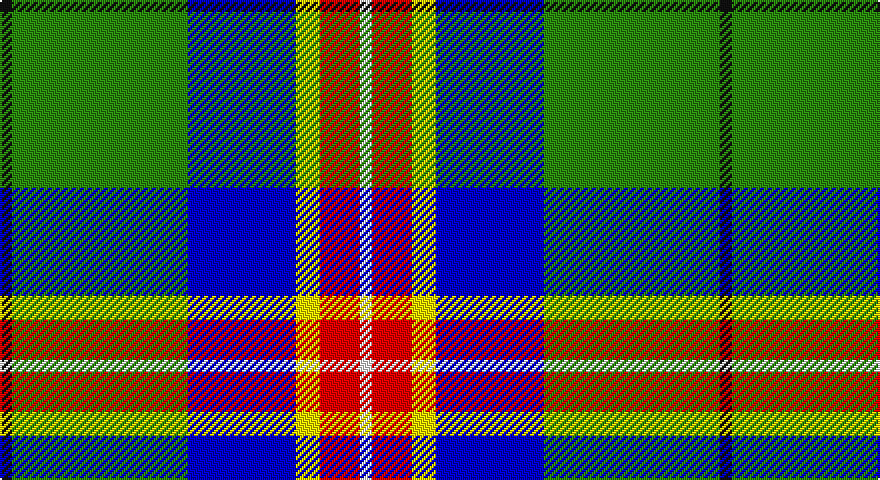

This page is one **sett** — a single exact thread-count. It belongs to the [tartan](/setts/k3g44db27ly6r10w3/)
(the same proportion at any scale), whose colour order is pattern [KGBYRW](/stripes/kgbyrw/).

Sourced from register-of-tartans.  It is a [6 stripe tartan](/stripes/stripes6/).

Original link https://www.tartanregister.gov.uk/tartanDetails.aspx?ref=10600

## Also known as

This cloth is also recorded under:

- Official Glasgow 2014, The

2 attestations — the source records this cloth was collapsed from (oldest owns this page)

<ul>
<li>14/02/2012 — Official Glasgow 2014, The (register-of-tartans, <a href="https://www.tartanregister.gov.uk/tartanDetails.aspx?ref=10600">record</a>)</li>
<li>14/02/2012 — Shawlands International (Commem.) (tartans-authority, <a href="http://www.tartansauthority.com/tartan-ferret/display/10600/">record</a>)</li>
</ul>

## Register references

External register numbers recorded for this tartan.

- Scottish Register of Tartans: [10600](https://www.tartanregister.gov.uk/tartanDetails?ref=10600)
- Scottish Tartans Authority (ITI): 10600

## Thread count
K/6 G88 B54 Y12 R20 W/6

One full sett is **360 threads**.

## Palette

Palette: <strong>Tartan Register</strong> <small style="color:#888">(5 of 6 colours)</small>
<table><thead><tr><th>Colour</th><th>Threads</th><th>Shade</th><th>Base</th><th>OKLCh</th></tr></thead><tbody><tr><td>K/</td><td style="text-align:right;font-variant-numeric:tabular-nums">6</td><td><code style="background-color:#101010;">#101010</code> <small style="color:#888">#101010</small></td><td>K <code style="background-color:#000000;">#000000</code></td><td><small style="color:#888">oklch(17.3% 0.000 89.9)</small></td></tr><tr><td>G</td><td style="text-align:right;font-variant-numeric:tabular-nums">88</td><td><code style="background-color:#2A8A0F;">#2A8A0F</code> <small style="color:#888">#2A8A0F</small></td><td>G <code style="background-color:#006100;">#006100</code></td><td><small style="color:#888">oklch(55.6% 0.174 140.4)</small></td></tr><tr><td>B</td><td style="text-align:right;font-variant-numeric:tabular-nums">54</td><td><code style="background-color:#0000CD;">#0000CD</code> <small style="color:#888">#0000CD</small></td><td>B <code style="background-color:#2A418A;">#2A418A</code></td><td><small style="color:#888">oklch(38.3% 0.266 264.1)</small></td></tr><tr><td>Y</td><td style="text-align:right;font-variant-numeric:tabular-nums">12</td><td><code style="background-color:#FFE600;">#FFE600</code> <small style="color:#888">#FFE600</small></td><td>Y <code style="background-color:#F2BF00;">#F2BF00</code></td><td><small style="color:#888">oklch(91.7% 0.192 101.4)</small></td></tr><tr><td>R</td><td style="text-align:right;font-variant-numeric:tabular-nums">20</td><td><code style="background-color:#FF0000;">#FF0000</code> <small style="color:#888">#FF0000</small></td><td>R <code style="background-color:#CC0000;">#CC0000</code></td><td><small style="color:#888">oklch(62.8% 0.258 29.2)</small></td></tr><tr><td>W/</td><td style="text-align:right;font-variant-numeric:tabular-nums">6</td><td><code style="background-color:#FFFFFF;">#FFFFFF</code> <small style="color:#888">#FFFFFF</small></td><td>W <code style="background-color:#F7F7F7;">#F7F7F7</code></td><td><small style="color:#888">oklch(100.0% 0.000 89.9)</small></td></tr></tbody></table>

# Sample pattern

## Nearest tartans

The nearest existing variants by ΔTartan distance, with this tartan at the top so the swatches line up against it.

ΔTartan

Tartan

Sett

—

<a href="/ttd/edit/#slug=k3g44db27ly6r10w3~x2">Official Glasgow 2014, The</a> <a class="nn-out" href="/variants/s6/k3g44db27ly6r10w3~x2/" title="open its dictionary page">↗</a>

1.05

<a href="/ttd/edit/#slug=dt36y20dg6w12k6r3~x2&amp;base=k3g44db27ly6r10w3~x2">Sirens &amp; Swords</a> <a class="nn-out" href="/variants/s6/dt36y20dg6w12k6r3~x2/" title="open its dictionary page">↗</a>

1.11

<a href="/ttd/edit/#slug=k16w4ly2g31t4dp4~x4&amp;base=k3g44db27ly6r10w3~x2">Lethcoe (Thousand Oaks) (Personal)</a> <a class="nn-out" href="/variants/s6/k16w4ly2g31t4dp4~x4/" title="open its dictionary page">↗</a>

1.18

<a href="/ttd/edit/#slug=r4g14k3lp3g12db36w4~x2&amp;base=k3g44db27ly6r10w3~x2">Vipont</a> <a class="nn-out" href="/variants/s7/r4g14k3lp3g12db36w4~x2/" title="open its dictionary page">↗</a>

1.20

<a href="/ttd/edit/#slug=o5dt30w3dg15ly8r4~x2&amp;base=k3g44db27ly6r10w3~x2">Carleton College Rugby</a> <a class="nn-out" href="/variants/s6/o5dt30w3dg15ly8r4~x2/" title="open its dictionary page">↗</a>

1.20

<a href="/ttd/edit/#slug=g11w11k3ly3dg36lo7~x2&amp;base=k3g44db27ly6r10w3~x2">Driver (Name)</a> <a class="nn-out" href="/variants/s6/g11w11k3ly3dg36lo7~x2/" title="open its dictionary page">↗</a>

1.22

<a href="/ttd/edit/#slug=db2r1db10w1y4g8lo1g2~x4&amp;base=k3g44db27ly6r10w3~x2">Ayrshire (District)</a> <a class="nn-out" href="/variants/s8/db2r1db10w1y4g8lo1g2~x4/" title="open its dictionary page">↗</a>

1.23

<a href="/ttd/edit/#slug=db20r2g9w6ly4k2g8~x2&amp;base=k3g44db27ly6r10w3~x2">Crofters (Personal)</a> <a class="nn-out" href="/variants/s7/db20r2g9w6ly4k2g8~x2/" title="open its dictionary page">↗</a>

1.24

<a href="/ttd/edit/#slug=lr2dg17w6b5r1~x4&amp;base=k3g44db27ly6r10w3~x2">Scotstown</a> <a class="nn-out" href="/variants/s5/lr2dg17w6b5r1~x4/" title="open its dictionary page">↗</a>

1.25

<a href="/ttd/edit/#slug=t6db17p4db2k11g33ly4~x2&amp;base=k3g44db27ly6r10w3~x2">East Lothian</a> <a class="nn-out" href="/variants/s7/t6db17p4db2k11g33ly4~x2/" title="open its dictionary page">↗</a>

1.29

<a href="/ttd/edit/#slug=db3g11w11r2g7db22ly2db2~x2&amp;base=k3g44db27ly6r10w3~x2">Bahamas</a> <a class="nn-out" href="/variants/s8/db3g11w11r2g7db22ly2db2~x2/" title="open its dictionary page">↗</a>

## Neighbour map

Every grey dot is one of 14360 variants placed by the first two principal components of the ΔTartan feature space (44% of its variance). Red is this tartan; blue dots are its nearest — click one to open its page.

<svg viewBox="0 0 640 380" role="img" style="max-width:100%;height:auto;border:1px solid #e0e0e0;border-radius:4px;display:block" xmlns="http://www.w3.org/2000/svg"><image href="/nn/cloud.v1.png" width="640" height="380"/><a href="/variants/s6/dt36y20dg6w12k6r3~x2/"><circle cx="153.7" cy="163.5" r="4" fill="#3465a4"><title>Sirens &amp; Swords</title></circle></a><a href="/variants/s6/k16w4ly2g31t4dp4~x4/"><circle cx="207.2" cy="134.0" r="4" fill="#3465a4"><title>Lethcoe (Thousand Oaks) (Personal)</title></circle></a><a href="/variants/s7/r4g14k3lp3g12db36w4~x2/"><circle cx="220.7" cy="154.8" r="4" fill="#3465a4"><title>Vipont</title></circle></a><a href="/variants/s6/o5dt30w3dg15ly8r4~x2/"><circle cx="171.4" cy="168.8" r="4" fill="#3465a4"><title>Carleton College Rugby</title></circle></a><a href="/variants/s6/g11w11k3ly3dg36lo7~x2/"><circle cx="201.4" cy="155.5" r="4" fill="#3465a4"><title>Driver (Name)</title></circle></a><a href="/variants/s8/db2r1db10w1y4g8lo1g2~x4/"><circle cx="152.4" cy="154.1" r="4" fill="#3465a4"><title>Ayrshire (District)</title></circle></a><a href="/variants/s7/db20r2g9w6ly4k2g8~x2/"><circle cx="130.0" cy="164.6" r="4" fill="#3465a4"><title>Crofters (Personal)</title></circle></a><a href="/variants/s5/lr2dg17w6b5r1~x4/"><circle cx="256.0" cy="165.5" r="4" fill="#3465a4"><title>Scotstown</title></circle></a><a href="/variants/s7/t6db17p4db2k11g33ly4~x2/"><circle cx="170.3" cy="145.3" r="4" fill="#3465a4"><title>East Lothian</title></circle></a><a href="/variants/s8/db3g11w11r2g7db22ly2db2~x2/"><circle cx="191.6" cy="167.1" r="4" fill="#3465a4"><title>Bahamas</title></circle></a><circle cx="191.1" cy="141.3" r="5" fill="#c00000"/></svg>

ID: /variants/s6/k3g44db27ly6r10w3~x2/
