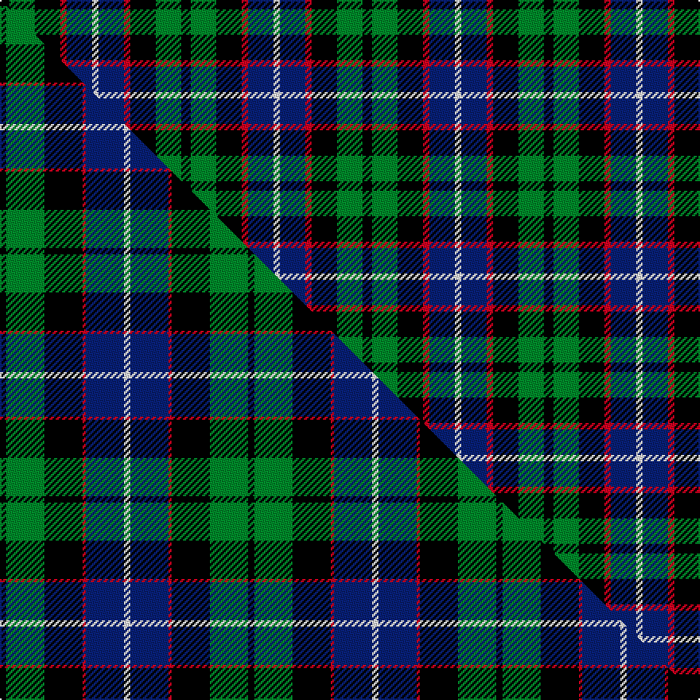

This is one **variant** — a specific cloth: this exact thread count and colourway, with its own
provenance below. It is one weaving of the [sett](/tartans/m/mi/mitchell-2/) (the scale-free proportion — the
same cloth at any scale or shade), whose colour order is pattern [KGKRBW](/stripes/kgkrbw/).

Part of the [Mitchell](/tartans/m/mi/mitchell-2/) tartan — the named design grouping this sett with its other cloths.

Sourced from house-of-tartan.  It is a [6 stripe tartan](/stripes/stripes6/).

Original link [http://www.house-of-tartan.scotland.net/house/TartanViewjs.asp?colr=Def&tnam=2142](http://www.house-of-tartan.scotland.net/house/TartanViewjs.asp?colr=Def&tnam=2142)

## Provenance

Earliest known date: 1816-20 Named in honour of General Billy Mitchell when it was adopted as the tartan of the United States Air Force pipe band. The sett is also known as Russell, Hunter and Galbraith. The earliest reference to the tartan is in the collection of the Highland Society of London where it is labelled Galbraith.

Dataset <small>— provenance for this record, inherited from the source manifest</small>

<dl class="dataset-prov">
<dt>source</dt><dd><a href="/sources/house-of-tartan/">House of Tartan</a></dd>
<dt>data captured from</dt><dd><a href="https://github.com/thetartan/tartan-database/blob/master/data/house-of-tartan/data.csv">https://github.com/thetartan/tartan-database/blob/master/data/house-of-tartan/data.csv</a></dd>
<dt>data date</dt><dd>1816-20 <small>(this record)</small></dd>
<dt>licence</dt><dd><a href="https://creativecommons.org/licenses/by-nc-nd/4.0/">CC BY-NC-ND 4.0</a></dd>
</dl>

Capture chain <small>— the hands this data passed through, oldest first; each capture carries its own licence</small>

<ol class="capture-chain">
<li><a href="http://www.house-of-tartan.scotland.net/">House of Tartan</a> <small>the weaver/retailer's database — the site is now offline; the URL is kept as the ultimate source's identity</small></li>
<li><a href="https://github.com/thetartan/tartan-database">thetartan/tartan-database</a> <small>2016-2017</small> · <a href="https://creativecommons.org/licenses/by-nc-nd/4.0/">CC BY-NC-ND 4.0</a> <small>Levko Kravets's frozen compilation — the capture we vendored, and where its CC licence text came from</small></li>
<li>this dictionary <small>captured 2026-06-10 · commit 5bf86c7566</small> <small>each re-capture is a git commit to data/sources</small></li>
</ol>

## Thread count
K/6 G16 K16 R4 DB16 W/4

One full sett is **114 threads**.

## Palette
<table><thead><tr><th>Colour</th><th>Shade</th><th>OKLCh</th></tr></thead><tbody><tr><td>DB</td><td><code style="background-color:#082077;">#082077</code> <small style="color:#888">#082077</small></td><td><small style="color:#888">oklch(30.0% 0.149 265.1)</small></td></tr><tr><td>G</td><td><code style="background-color:#008B2A;">#008B2A</code> <small style="color:#888">#008B2A</small></td><td><small style="color:#888">oklch(55.4% 0.170 145.9)</small></td></tr><tr><td>K</td><td><code style="background-color:#000000;">#000000</code> <small style="color:#888">#000000</small></td><td><small style="color:#888">oklch(0.0% 0.000 0.0)</small></td></tr><tr><td>W</td><td><code style="background-color:#F7F7F7;">#F7F7F7</code> <small style="color:#888">#F7F7F7</small></td><td><small style="color:#888">oklch(97.6% 0.000 89.9)</small></td></tr><tr><td>R</td><td><code style="background-color:#D60020;">#D60020</code> <small style="color:#888">#D60020</small></td><td><small style="color:#888">oklch(55.2% 0.224 25.5)</small></td></tr></tbody></table>

# Sample pattern

[Sample sheet (PDF)](swatch.pdf) — the woven sample, thread count and palette on one printable A4, rendered on demand (the same sheet the TTD print page downloads).

## Compared to the master

This cloth is one sett of its design; the master sett (the exemplar the design is anchored on) is below for comparison.

Its **ΔTartan distance** from the master is **0.63** — the same measure the nearest-tartans table ranks by (0 is identical; a re-scale of the same cloth is near 0, a recolour or a different proportion further).

<figure class="master-compare" style="margin:0">

this sett
master sett ★

<figcaption style="color:#888;font-size:smaller">One weave of this sett against the <a href="/setts/k2g12k12r1db12w2/">master sett ★</a>, split on the diagonal: a shared proportion runs seamlessly across it with only the shades shifting; a different proportion breaks on it.</figcaption>
</figure>

## Nearest tartan variants

The nearest existing variants by ΔTartan distance, with this cloth at the top so the swatches line up against it.

ΔTartan

Threads

Variant

Sett

—

114

<a href="/variants/s6/k3g8k8r2db8w2~x2/">Mitchell Family Tartan</a>

<a href="/ttd/edit/#slug=k3g10k10r3db8w3~x2&amp;base=k3g8k8r2db8w2~x2" title="compare in the TTD">0.29</a>

136

<a href="/variants/s6/k3g10k10r3db8w3~x2/">Russell (Clan)</a>

<a href="/ttd/edit/#slug=k1g3k3db3r1~x4&amp;base=k3g8k8r2db8w2~x2" title="compare in the TTD">0.76</a>

80

<a href="/variants/s5/k1g3k3db3r1~x4/">Durham District Tartan</a>

<a href="/ttd/edit/#slug=k5g20k18db20r5~x2&amp;base=k3g8k8r2db8w2~x2" title="compare in the TTD">0.77</a>

252

<a href="/variants/s5/k5g20k18db20r5~x2/">Denholm (Fashion)</a>

<a href="/ttd/edit/#slug=k2g8k7db8r2~x2&amp;base=k3g8k8r2db8w2~x2" title="compare in the TTD">0.77</a>

100

<a href="/variants/s5/k2g8k7db8r2~x2/">Denholme</a>

<a href="/ttd/edit/#slug=k4g16k14y3db16r4~x2&amp;base=k3g8k8r2db8w2~x2" title="compare in the TTD">0.86</a>

212

<a href="/variants/s6/k4g16k14y3db16r4~x2/">Birse Family Tartan</a>

<a href="/ttd/edit/#slug=k4dg16k14ly3t16r4~x2&amp;base=k3g8k8r2db8w2~x2" title="compare in the TTD">0.89</a>

212

<a href="/variants/s6/k4dg16k14ly3t16r4~x2/">Birse</a>

<a href="/ttd/edit/#slug=k2y1g6k6db6w1~x4&amp;base=k3g8k8r2db8w2~x2" title="compare in the TTD">0.98</a>

164

<a href="/variants/s6/k2y1g6k6db6w1~x4/">Dyce Family Tartan</a>

<a href="/ttd/edit/#slug=y3k2g12k12db14w3&amp;base=k3g8k8r2db8w2~x2" title="compare in the TTD">1.13</a>

86

<a href="/variants/s6/y3k2g12k12db14w3/">MacNeil of Barra</a>

<a href="/ttd/edit/#slug=y3k2g12k12db14w3~x2&amp;base=k3g8k8r2db8w2~x2" title="compare in the TTD">1.13</a>

172

<a href="/variants/s6/y3k2g12k12db14w3~x2/">MacNeil Clan Tartan</a>

<a href="/ttd/edit/#slug=dr1k1g6k6db6lr1~x4&amp;base=k3g8k8r2db8w2~x2" title="compare in the TTD">1.19</a>

160

<a href="/variants/s6/dr1k1g6k6db6lr1~x4/">Gaines Center for the Humanities</a>

## Neighbour map

Every grey dot is one of 13662 variants placed by the first two principal components of the ΔTartan feature space (42% of its variance). Red is this tartan; blue dots are its nearest — click one to open its page. The map is a flat projection of a many-dimensional space — [how to read it](/posts/neighbourhood-maps/).

<svg viewBox="0 0 640 380" role="img" style="max-width:100%;height:auto;border:1px solid #e0e0e0;border-radius:4px;display:block" xmlns="http://www.w3.org/2000/svg"><image href="/nn/cloud.v1.png" width="640" height="380"/><a href="/variants/s6/k3g10k10r3db8w3~x2/"><circle cx="47.1" cy="248.2" r="4" fill="#3465a4"><title>Russell (Clan)</title></circle></a><a href="/variants/s5/k1g3k3db3r1~x4/"><circle cx="85.4" cy="286.3" r="4" fill="#3465a4"><title>Durham District Tartan</title></circle></a><a href="/variants/s5/k5g20k18db20r5~x2/"><circle cx="96.5" cy="268.0" r="4" fill="#3465a4"><title>Denholm (Fashion)</title></circle></a><a href="/variants/s5/k2g8k7db8r2~x2/"><circle cx="94.8" cy="268.2" r="4" fill="#3465a4"><title>Denholme</title></circle></a><a href="/variants/s6/k4g16k14y3db16r4~x2/"><circle cx="78.4" cy="226.2" r="4" fill="#3465a4"><title>Birse Family Tartan</title></circle></a><a href="/variants/s6/k4dg16k14ly3t16r4~x2/"><circle cx="77.1" cy="225.9" r="4" fill="#3465a4"><title>Birse</title></circle></a><a href="/variants/s6/k2y1g6k6db6w1~x4/"><circle cx="98.1" cy="218.3" r="4" fill="#3465a4"><title>Dyce Family Tartan</title></circle></a><a href="/variants/s6/y3k2g12k12db14w3/"><circle cx="76.5" cy="211.6" r="4" fill="#3465a4"><title>MacNeil of Barra</title></circle></a><a href="/variants/s6/y3k2g12k12db14w3~x2/"><circle cx="76.5" cy="211.6" r="4" fill="#3465a4"><title>MacNeil Clan Tartan</title></circle></a><a href="/variants/s6/dr1k1g6k6db6lr1~x4/"><circle cx="99.5" cy="212.6" r="4" fill="#3465a4"><title>Gaines Center for the Humanities</title></circle></a><circle cx="63.0" cy="239.1" r="5" fill="#c00000"/><text x="320" y="376" text-anchor="middle" font-size="11" fill="#999">ground</text><text x="11" y="190" text-anchor="middle" font-size="11" fill="#999" transform="rotate(-90 11 190)">complexity</text></svg>

ID: /variants/s6/k3g8k8r2db8w2~x2/
