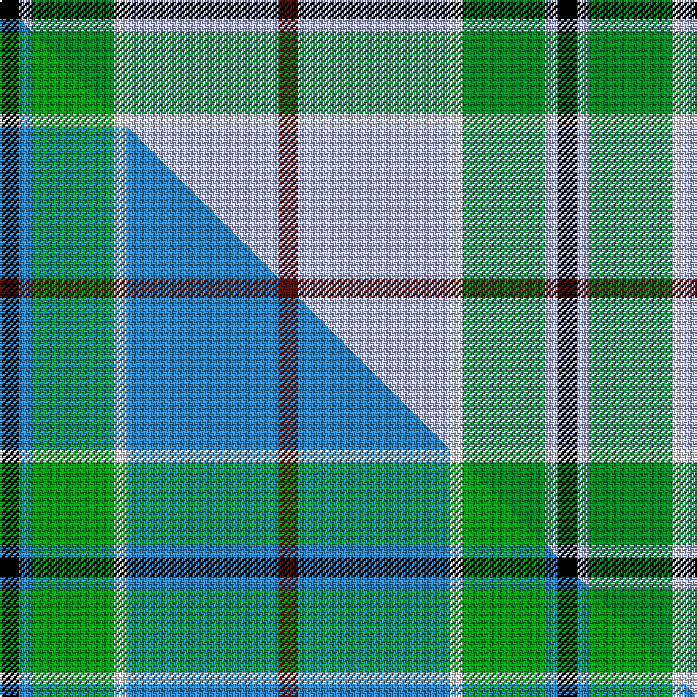

This is one **variant** — a specific cloth: this exact thread count and colourway, with its own
provenance below. It is one weaving of the [sett](/setts/k3lb2g13w2lb24dr3/) (the scale-free proportion — the
same cloth at any scale or shade), whose colour order is pattern [BWWGWK](/stripes/bwwgwk/).

Part of the [Vance](/tartans/v/va/vance/) tartan — the named design grouping this sett with its other cloths.

Sourced from tartans-authority.  It is a [6 stripe tartan](/stripes/stripes6/).

Original link [https://www.tartanregister.gov.uk/tartanDetails.aspx?ref=2208](https://www.tartanregister.gov.uk/tartanDetails.aspx?ref=2208)

Dataset <small>— provenance for this record, inherited from the source manifest</small>

<dl class="dataset-prov">
<dt>source</dt><dd><a href="/sources/tartans-authority/">Scottish Tartans Authority</a></dd>
<dt>data captured from</dt><dd><a href="https://github.com/thetartan/tartan-database/blob/master/data/tartans-authority/data.csv">https://github.com/thetartan/tartan-database/blob/master/data/tartans-authority/data.csv</a></dd>
<dt>data date</dt><dd>December 1994 <small>(this record)</small></dd>
<dt>licence</dt><dd><a href="https://creativecommons.org/licenses/by-nc-nd/4.0/">CC BY-NC-ND 4.0</a></dd>
</dl>

Capture chain <small>— the hands this data passed through, oldest first; each capture carries its own licence</small>

<ol class="capture-chain">
<li><a href="https://www.tartansauthority.com/">Scottish Tartans Authority</a> <small>the heritage body's archive — its tartan-ferret record browser is retired (links repaired to the SRT, above)</small></li>
<li><a href="https://github.com/thetartan/tartan-database">thetartan/tartan-database</a> <small>2016-2017</small> · <a href="https://creativecommons.org/licenses/by-nc-nd/4.0/">CC BY-NC-ND 4.0</a> <small>Levko Kravets's frozen compilation — the capture we vendored, and where its CC licence text came from</small></li>
<li>this dictionary <small>captured 2026-06-10 · commit 5bf86c7566</small> <small>each re-capture is a git commit to data/sources</small></li>
</ol>

## Register references

External register numbers recorded for this tartan.

- Scottish Tartans Authority (ITI): 2208

## Thread count
K/12 LB8 G52 W8 LB96 DR/12

One full sett is **352 threads**.

## Palette
<table><thead><tr><th>Colour</th><th>Shade</th><th>OKLCh</th></tr></thead><tbody><tr><td>LB</td><td><code style="background-color:#B5BBDE;">#B5BBDE</code> <small style="color:#888">#B5BBDE</small></td><td><small style="color:#888">oklch(79.9% 0.050 277.6)</small></td></tr><tr><td>DR</td><td><code style="background-color:#55120C;">#55120C</code> <small style="color:#888">#55120C</small></td><td><small style="color:#888">oklch(30.0% 0.099 29.3)</small></td></tr><tr><td>G</td><td><code style="background-color:#008B2A;">#008B2A</code> <small style="color:#888">#008B2A</small></td><td><small style="color:#888">oklch(55.4% 0.170 145.9)</small></td></tr><tr><td>K</td><td><code style="background-color:#000000;">#000000</code> <small style="color:#888">#000000</small></td><td><small style="color:#888">oklch(0.0% 0.000 0.0)</small></td></tr><tr><td>W</td><td><code style="background-color:#F7F7F7;">#F7F7F7</code> <small style="color:#888">#F7F7F7</small></td><td><small style="color:#888">oklch(97.6% 0.000 89.9)</small></td></tr></tbody></table>

# Sample pattern

## Compared to the master

This cloth is one sett of its design; the master sett (the exemplar the design is anchored on) is below for comparison.

Its **ΔTartan distance** from the master is **0.19** — the same measure the nearest-tartans table ranks by (0 is identical; a re-scale of the same cloth is near 0, a recolour or a different proportion further).

<figure class="master-compare" style="margin:0">

this sett
master sett ★

<figcaption style="color:#888;font-size:smaller">One weave of this sett against the <a href="/setts/k3t2g13w2t24dr3/">master sett ★</a>, split on the diagonal: a shared proportion runs seamlessly across it with only the shades shifting; a different proportion breaks on it.</figcaption>
</figure>

## Nearest tartan variants

The nearest existing variants by ΔTartan distance, with this cloth at the top so the swatches line up against it.

ΔTartan

Threads

Variant

Sett

—

352

<a href="/variants/s6/k3lb2g13w2lb24dr3~x4/">Vance (Name?)</a>

<a href="/ttd/edit/#slug=k3t2g13w2t24dr3~x4~t2405244-g2408144&amp;base=k3lb2g13w2lb24dr3~x4" title="compare in the TTD">0.19</a>

352

<a href="/variants/s6/k3t2g13w2t24dr3~x4~t2405244-g2408144/">Vance</a>

<a href="/ttd/edit/#slug=r1g9lb9k1lb1w1~x6&amp;base=k3lb2g13w2lb24dr3~x4" title="compare in the TTD">1.47</a>

252

<a href="/variants/s6/r1g9lb9k1lb1w1~x6/">Irving of Glentulchan (Personal)</a>

<a href="/ttd/edit/#slug=k2lb36g12w3r2~x2&amp;base=k3lb2g13w2lb24dr3~x4" title="compare in the TTD">1.70</a>

212

<a href="/variants/s5/k2lb36g12w3r2~x2/">Cleland</a>

<a href="/ttd/edit/#slug=k2lb28g7w3r2~x2&amp;base=k3lb2g13w2lb24dr3~x4" title="compare in the TTD">1.89</a>

160

<a href="/variants/s5/k2lb28g7w3r2~x2/">Cleland Corporate Tartan</a>

<a href="/ttd/edit/#slug=k2w1g5dr1lb18dr2~x2&amp;base=k3lb2g13w2lb24dr3~x4" title="compare in the TTD">1.95</a>

108

<a href="/variants/s6/k2w1g5dr1lb18dr2~x2/">Norris (1998) (Name)</a>

<a href="/ttd/edit/#slug=k3r1y1lb11g13lb5r1y1~x4&amp;base=k3lb2g13w2lb24dr3~x4" title="compare in the TTD">1.99</a>

272

<a href="/variants/s8/k3r1y1lb11g13lb5r1y1~x4/">Snodgrass (Clan)</a>

<a href="/ttd/edit/#slug=w4dr13lb54dg22k4ly20lb48dr13w4&amp;base=k3lb2g13w2lb24dr3~x4" title="compare in the TTD">2.12</a>

356

<a href="/variants/s9/w4dr13lb54dg22k4ly20lb48dr13w4/">Wynberg Boys' High School</a>

<a href="/ttd/edit/#slug=k2w1g5dr1lb18r2~x2&amp;base=k3lb2g13w2lb24dr3~x4" title="compare in the TTD">2.29</a>

108

<a href="/variants/s6/k2w1g5dr1lb18r2~x2/">Norris (1998)</a>

<a href="/ttd/edit/#slug=lb8w28ly3g3lb8k9lb4~x2&amp;base=k3lb2g13w2lb24dr3~x4" title="compare in the TTD">2.36</a>

228

<a href="/variants/s7/lb8w28ly3g3lb8k9lb4~x2/">MacTavish of Dunardry Dress</a>

<a href="/ttd/edit/#slug=k10lb30g3lb3g3lb3r6~x2&amp;base=k3lb2g13w2lb24dr3~x4" title="compare in the TTD">2.37</a>

200

<a href="/variants/s7/k10lb30g3lb3g3lb3r6~x2/">Kinding (Personal)</a>

## Neighbour map

Every grey dot is one of 13621 variants placed by the first two principal components of the ΔTartan feature space (42% of its variance). Red is this tartan; blue dots are its nearest — click one to open its page.

<svg viewBox="0 0 640 380" role="img" style="max-width:100%;height:auto;border:1px solid #e0e0e0;border-radius:4px;display:block" xmlns="http://www.w3.org/2000/svg"><image href="/nn/cloud.v1.png" width="640" height="380"/><a href="/variants/s6/k3t2g13w2t24dr3~x4~t2405244-g2408144/"><circle cx="275.0" cy="172.9" r="4" fill="#3465a4"><title>Vance</title></circle></a><a href="/variants/s6/r1g9lb9k1lb1w1~x6/"><circle cx="234.6" cy="188.2" r="4" fill="#3465a4"><title>Irving of Glentulchan (Personal)</title></circle></a><a href="/variants/s5/k2lb36g12w3r2~x2/"><circle cx="363.2" cy="148.3" r="4" fill="#3465a4"><title>Cleland</title></circle></a><a href="/variants/s5/k2lb28g7w3r2~x2/"><circle cx="352.4" cy="153.9" r="4" fill="#3465a4"><title>Cleland Corporate Tartan</title></circle></a><a href="/variants/s6/k2w1g5dr1lb18dr2~x2/"><circle cx="313.4" cy="132.1" r="4" fill="#3465a4"><title>Norris (1998) (Name)</title></circle></a><a href="/variants/s8/k3r1y1lb11g13lb5r1y1~x4/"><circle cx="198.5" cy="151.5" r="4" fill="#3465a4"><title>Snodgrass (Clan)</title></circle></a><a href="/variants/s9/w4dr13lb54dg22k4ly20lb48dr13w4/"><circle cx="217.0" cy="137.7" r="4" fill="#3465a4"><title>Wynberg Boys' High School</title></circle></a><a href="/variants/s6/k2w1g5dr1lb18r2~x2/"><circle cx="294.0" cy="115.1" r="4" fill="#3465a4"><title>Norris (1998)</title></circle></a><a href="/variants/s7/lb8w28ly3g3lb8k9lb4~x2/"><circle cx="170.6" cy="177.3" r="4" fill="#3465a4"><title>MacTavish of Dunardry Dress</title></circle></a><a href="/variants/s7/k10lb30g3lb3g3lb3r6~x2/"><circle cx="283.3" cy="158.0" r="4" fill="#3465a4"><title>Kinding (Personal)</title></circle></a><circle cx="260.8" cy="164.9" r="5" fill="#c00000"/><text x="320" y="376" text-anchor="middle" font-size="11" fill="#999">ground</text><text x="11" y="190" text-anchor="middle" font-size="11" fill="#999" transform="rotate(-90 11 190)">complexity</text></svg>

ID: /variants/s6/k3lb2g13w2lb24dr3~x4/
