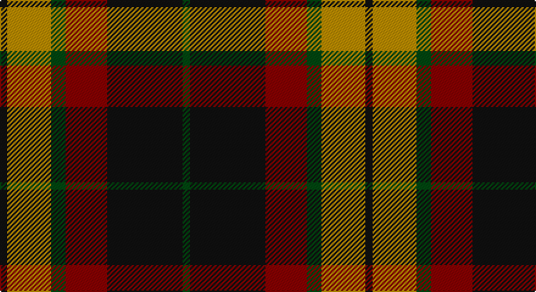

This page is one **sett** — a single exact thread-count. It belongs to the [tartan](/setts/k3lo18dg6r17k31dg3/)
(the same proportion at any scale), whose colour order is pattern [GKRGYK](/stripes/gkrgyk/).

Part of the [MacMillan](/tartans/macmillan/) tartan — the named design grouping this sett with its other cloths.

Sourced from tartans-authority.  It is a [6 stripe tartan](/stripes/stripes6/).

Original link http://www.tartansauthority.com/tartan-ferret/display/2581/

## Provenance

Earliest known date: pre 2002 This unauthorised and symmetrical version of the traditional asymmetrical MacMillan clan tartan is produced by Marton Mills of Yorkshire. Although not recognised as a MacMillan tartan by the Chief (Jan. 2008), it seems to have gained some popularity in the USA. Originally brought to light by a Graeme Ross of Aberdeen, there may be a sample in the Scottish Tartans Society archives.

## Also known as

This cloth is also recorded under:

- MacMillan Ancient
- MacMillan Black
- MacMillan Dress
- MacMillan Old
- MacMillan Varient
- MacMillan, Ancient

2 attestations — the source records this cloth was collapsed from (oldest owns this page)

<ul>
<li>pre 2002 — MacMillan - 2002 (Black - Unofficial (tartans-authority, <a href="http://www.tartansauthority.com/tartan-ferret/display/2581/">record</a>)</li>
<li>undated — MacMillan Black Fashion Tartan (house-of-tartan, <a href="http://www.house-of-tartan.scotland.net/house/TartanViewjs.asp?colr=Def&tnam=2581">record</a>)</li>
</ul>

## Register references

External register numbers recorded for this tartan.

- Scottish Tartans Authority (ITI): 2581

## Thread count
K/6 DY36 DG12 DR34 K62 DG/6

One full sett is **300 threads**.

## Palette

Palette: <strong>Tartan Register</strong> <small style="color:#888">(3 of 4 colours)</small>
<table><thead><tr><th>Colour</th><th>Threads</th><th>Shade</th><th>Base</th><th>OKLCh</th></tr></thead><tbody><tr><td>K/</td><td style="text-align:right;font-variant-numeric:tabular-nums">6</td><td><code style="background-color:#101010;">#101010</code> <small style="color:#888">#101010</small></td><td>K <code style="background-color:#000000;">#000000</code></td><td><small style="color:#888">oklch(17.3% 0.000 89.9)</small></td></tr><tr><td>DY</td><td style="text-align:right;font-variant-numeric:tabular-nums">36</td><td><code style="background-color:#BC8C00;">#BC8C00</code> <small style="color:#888">#BC8C00</small></td><td>Y <code style="background-color:#F2BF00;">#F2BF00</code></td><td><small style="color:#888">oklch(66.8% 0.137 84.1)</small></td></tr><tr><td>DG</td><td style="text-align:right;font-variant-numeric:tabular-nums">12</td><td><code style="background-color:#004810;">#004810</code> <small style="color:#888">#004810</small></td><td>G <code style="background-color:#006100;">#006100</code></td><td><small style="color:#888">oklch(34.9% 0.108 145.5)</small></td></tr><tr><td>DR</td><td style="text-align:right;font-variant-numeric:tabular-nums">34</td><td><code style="background-color:#880000;">#880000</code> <small style="color:#888">#880000</small></td><td>R <code style="background-color:#CC0000;">#CC0000</code></td><td><small style="color:#888">oklch(39.4% 0.162 29.2)</small></td></tr><tr><td>K</td><td style="text-align:right;font-variant-numeric:tabular-nums">62</td><td><code style="background-color:#101010;">#101010</code> <small style="color:#888">#101010</small></td><td>K <code style="background-color:#000000;">#000000</code></td><td><small style="color:#888">oklch(17.3% 0.000 89.9)</small></td></tr><tr><td>DG/</td><td style="text-align:right;font-variant-numeric:tabular-nums">6</td><td><code style="background-color:#004810;">#004810</code> <small style="color:#888">#004810</small></td><td>G <code style="background-color:#006100;">#006100</code></td><td><small style="color:#888">oklch(34.9% 0.108 145.5)</small></td></tr></tbody></table>

# Sample pattern

## Compared to the master

This cloth is one sett of its design; the master sett (the exemplar the design is anchored on) is below for comparison.

<figure style="margin:0"><figcaption style="color:#888;font-size:smaller">this sett</figcaption></figure>
<figure style="margin:0"><figcaption style="color:#888;font-size:smaller"><a href="/setts/dg2k1dg18k1dg2k1r12dg4ly6k1ly6k1/">master sett →</a></figcaption></figure>

## Nearest tartans

The nearest existing variants by ΔTartan distance, with this tartan at the top so the swatches line up against it.

ΔTartan

Tartan

Sett

—

<a href="/ttd/edit/#slug=k3lo18dg6r17k31dg3~x2">MacMillan - 2002 (Black - Unofficial</a> <a class="nn-out" href="/variants/s6/k3lo18dg6r17k31dg3~x2/" title="open its dictionary page">↗</a>

0.67

<a href="/ttd/edit/#slug=do2o11do2k11do16lb2~x4&amp;base=k3lo18dg6r17k31dg3~x2">Portrait, The</a> <a class="nn-out" href="/variants/s6/do2o11do2k11do16lb2~x4/" title="open its dictionary page">↗</a>

0.74

<a href="/ttd/edit/#slug=g3k15r8g2o8k2~x4&amp;base=k3lo18dg6r17k31dg3~x2">Thompson Black (Fashion)</a> <a class="nn-out" href="/variants/s6/g3k15r8g2o8k2~x4/" title="open its dictionary page">↗</a>

0.85

<a href="/ttd/edit/#slug=g1r9g3k3g3r1k9w1~x2&amp;base=k3lo18dg6r17k31dg3~x2">Manson Family Tartan</a> <a class="nn-out" href="/variants/s8/g1r9g3k3g3r1k9w1~x2/" title="open its dictionary page">↗</a>

0.88

<a href="/ttd/edit/#slug=g3r20g16k22lo6k3g2~x2&amp;base=k3lo18dg6r17k31dg3~x2">Wcwm 1062</a> <a class="nn-out" href="/variants/s7/g3r20g16k22lo6k3g2~x2/" title="open its dictionary page">↗</a>

0.91

<a href="/ttd/edit/#slug=k2o20k8dg18o3w2~x2&amp;base=k3lo18dg6r17k31dg3~x2">Celtic Combat</a> <a class="nn-out" href="/variants/s6/k2o20k8dg18o3w2~x2/" title="open its dictionary page">↗</a>

0.91

<a href="/ttd/edit/#slug=k9lr4k1lr4dg15r4k1~x4&amp;base=k3lo18dg6r17k31dg3~x2">Logan - 1797 (Dark)</a> <a class="nn-out" href="/variants/s7/k9lr4k1lr4dg15r4k1~x4/" title="open its dictionary page">↗</a>

0.92

<a href="/ttd/edit/#slug=g8r2g12k6g3db6r24k4~x2&amp;base=k3lo18dg6r17k31dg3~x2">Dickie</a> <a class="nn-out" href="/variants/s8/g8r2g12k6g3db6r24k4~x2/" title="open its dictionary page">↗</a>

0.93

<a href="/ttd/edit/#slug=k2r7k6g12ly1g1k2~x4&amp;base=k3lo18dg6r17k31dg3~x2">Blackstock Hunting</a> <a class="nn-out" href="/variants/s7/k2r7k6g12ly1g1k2~x4/" title="open its dictionary page">↗</a>

0.97

<a href="/ttd/edit/#slug=k4dg5k2dg5r17db2~x2&amp;base=k3lo18dg6r17k31dg3~x2">Denny Hunting</a> <a class="nn-out" href="/variants/s6/k4dg5k2dg5r17db2~x2/" title="open its dictionary page">↗</a>

0.98

<a href="/ttd/edit/#slug=r3db12r4g18r6k2~x2&amp;base=k3lo18dg6r17k31dg3~x2">Eyre (Personal)</a> <a class="nn-out" href="/variants/s6/r3db12r4g18r6k2~x2/" title="open its dictionary page">↗</a>

## Neighbour map

Every grey dot is one of 14360 variants placed by the first two principal components of the ΔTartan feature space (44% of its variance). Red is this tartan; blue dots are its nearest — click one to open its page.

<svg viewBox="0 0 640 380" role="img" style="max-width:100%;height:auto;border:1px solid #e0e0e0;border-radius:4px;display:block" xmlns="http://www.w3.org/2000/svg"><image href="/nn/cloud.v1.png" width="640" height="380"/><a href="/variants/s6/do2o11do2k11do16lb2~x4/"><circle cx="232.4" cy="227.0" r="4" fill="#3465a4"><title>Portrait, The</title></circle></a><a href="/variants/s6/g3k15r8g2o8k2~x4/"><circle cx="200.8" cy="224.2" r="4" fill="#3465a4"><title>Thompson Black (Fashion)</title></circle></a><a href="/variants/s8/g1r9g3k3g3r1k9w1~x2/"><circle cx="202.7" cy="193.3" r="4" fill="#3465a4"><title>Manson Family Tartan</title></circle></a><a href="/variants/s7/g3r20g16k22lo6k3g2~x2/"><circle cx="179.2" cy="197.8" r="4" fill="#3465a4"><title>Wcwm 1062</title></circle></a><a href="/variants/s6/k2o20k8dg18o3w2~x2/"><circle cx="236.7" cy="205.1" r="4" fill="#3465a4"><title>Celtic Combat</title></circle></a><a href="/variants/s7/k9lr4k1lr4dg15r4k1~x4/"><circle cx="214.9" cy="186.2" r="4" fill="#3465a4"><title>Logan - 1797 (Dark)</title></circle></a><a href="/variants/s8/g8r2g12k6g3db6r24k4~x2/"><circle cx="200.1" cy="181.3" r="4" fill="#3465a4"><title>Dickie</title></circle></a><a href="/variants/s7/k2r7k6g12ly1g1k2~x4/"><circle cx="229.0" cy="196.0" r="4" fill="#3465a4"><title>Blackstock Hunting</title></circle></a><a href="/variants/s6/k4dg5k2dg5r17db2~x2/"><circle cx="266.1" cy="216.9" r="4" fill="#3465a4"><title>Denny Hunting</title></circle></a><a href="/variants/s6/r3db12r4g18r6k2~x2/"><circle cx="215.3" cy="224.8" r="4" fill="#3465a4"><title>Eyre (Personal)</title></circle></a><circle cx="217.6" cy="211.7" r="5" fill="#c00000"/></svg>

ID: /variants/s6/k3lo18dg6r17k31dg3~x2/
