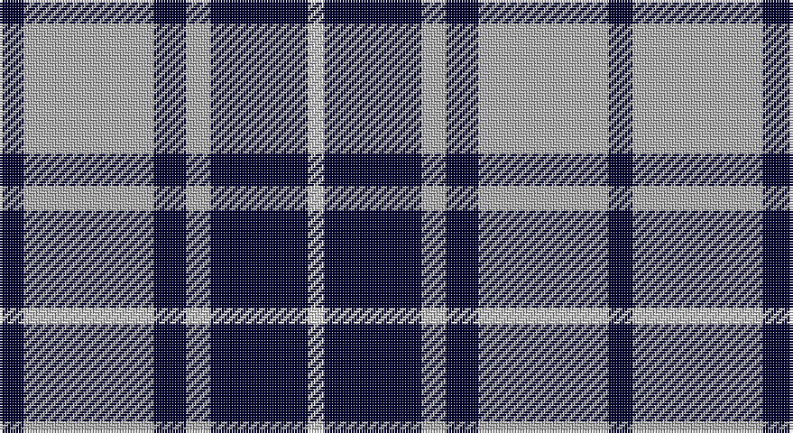

This page is one **sett** — a single exact thread-count. It belongs to the [tartan](/setts/k3lr16k4lr3k12w2/)
(the same proportion at any scale), whose colour order is pattern [KYKYKW](/stripes/kykykw/).

Part of the [MacMugen](/tartans/macmugen/) tartan — the named design grouping this sett with its other cloths.

Sourced from weddslist.  It is a [6 stripe tartan](/stripes/stripes6/).

Original link http://www.weddslist.com/cgi-bin/tartans/pg.pl?source=sts

## Thread count
DB/9 N48 DB12 N9 DB36 LN/6

One full sett is **225 threads**.

## Palette

Palette: <strong>Tartan Register</strong> <small style="color:#888">(2 of 3 colours)</small>
<table><thead><tr><th>Colour</th><th>Threads</th><th>Shade</th><th>Base</th><th>OKLCh</th></tr></thead><tbody><tr><td>DB/</td><td style="text-align:right;font-variant-numeric:tabular-nums">9</td><td><code style="background-color:#000030;">#000030</code> <small style="color:#888">#000030</small></td><td>K <code style="background-color:#000000;">#000000</code></td><td><small style="color:#888">oklch(14.0% 0.097 264.1)</small></td></tr><tr><td>N</td><td style="text-align:right;font-variant-numeric:tabular-nums">48</td><td><code style="background-color:#B0B0B0;">#B0B0B0</code> <small style="color:#888">#B0B0B0</small></td><td>Y <code style="background-color:#F2BF00;">#F2BF00</code></td><td><small style="color:#888">oklch(75.7% 0.000 89.9)</small></td></tr><tr><td>DB</td><td style="text-align:right;font-variant-numeric:tabular-nums">12</td><td><code style="background-color:#000030;">#000030</code> <small style="color:#888">#000030</small></td><td>K <code style="background-color:#000000;">#000000</code></td><td><small style="color:#888">oklch(14.0% 0.097 264.1)</small></td></tr><tr><td>N</td><td style="text-align:right;font-variant-numeric:tabular-nums">9</td><td><code style="background-color:#B0B0B0;">#B0B0B0</code> <small style="color:#888">#B0B0B0</small></td><td>Y <code style="background-color:#F2BF00;">#F2BF00</code></td><td><small style="color:#888">oklch(75.7% 0.000 89.9)</small></td></tr><tr><td>DB</td><td style="text-align:right;font-variant-numeric:tabular-nums">36</td><td><code style="background-color:#000030;">#000030</code> <small style="color:#888">#000030</small></td><td>K <code style="background-color:#000000;">#000000</code></td><td><small style="color:#888">oklch(14.0% 0.097 264.1)</small></td></tr><tr><td>LN/</td><td style="text-align:right;font-variant-numeric:tabular-nums">6</td><td><code style="background-color:#E0E0E0;">#E0E0E0</code> <small style="color:#888">#E0E0E0</small></td><td>W <code style="background-color:#F7F7F7;">#F7F7F7</code></td><td><small style="color:#888">oklch(90.7% 0.000 89.9)</small></td></tr></tbody></table>

# Sample pattern

## Compared to the master

This cloth is one sett of its design; the master sett (the exemplar the design is anchored on) is below for comparison.

<figure style="margin:0"><figcaption style="color:#888;font-size:smaller">this sett</figcaption></figure>
<figure style="margin:0"><figcaption style="color:#888;font-size:smaller"><a href="/setts/dt3w16dt4w3dt12w2/">master sett →</a></figcaption></figure>

## Nearest tartans

The nearest existing variants by ΔTartan distance, with this tartan at the top so the swatches line up against it.

ΔTartan

Tartan

Sett

—

<a href="/ttd/edit/#slug=k3lr16k4lr3k12w2~x3">MacMugen</a> <a class="nn-out" href="/variants/s6/k3lr16k4lr3k12w2~x3/" title="open its dictionary page">↗</a>

1.17

<a href="/ttd/edit/#slug=w4k26t26k2t5w2~x2&amp;base=k3lr16k4lr3k12w2~x3">Indian Pipe Band (Corporate)</a> <a class="nn-out" href="/variants/s6/w4k26t26k2t5w2~x2/" title="open its dictionary page">↗</a>

1.25

<a href="/ttd/edit/#slug=k1w3db2w4db8w1db1~x6&amp;base=k3lr16k4lr3k12w2~x3">Queen Margaret University (Corporate</a> <a class="nn-out" href="/variants/s7/k1w3db2w4db8w1db1~x6/" title="open its dictionary page">↗</a>

1.25

<a href="/ttd/edit/#slug=db8w3db28w32k3w4~x2&amp;base=k3lr16k4lr3k12w2~x3">Ailsa, Navy (Dance)</a> <a class="nn-out" href="/variants/s6/db8w3db28w32k3w4~x2/" title="open its dictionary page">↗</a>

1.25

<a href="/ttd/edit/#slug=lb5k4lb32k32lb5k4~x2&amp;base=k3lr16k4lr3k12w2~x3">Valley Forge (Artefact)</a> <a class="nn-out" href="/variants/s6/lb5k4lb32k32lb5k4~x2/" title="open its dictionary page">↗</a>

1.37

<a href="/ttd/edit/#slug=db10g4w27db40r4~x2&amp;base=k3lr16k4lr3k12w2~x3">Turnbull Dress, Bruce (Personal)</a> <a class="nn-out" href="/variants/s5/db10g4w27db40r4~x2/" title="open its dictionary page">↗</a>

1.52

<a href="/ttd/edit/#slug=k4ly18db44k3ly10k4&amp;base=k3lr16k4lr3k12w2~x3">Stutterheim (Corporate)</a> <a class="nn-out" href="/variants/s6/k4ly18db44k3ly10k4/" title="open its dictionary page">↗</a>

1.52

<a href="/ttd/edit/#slug=k2w1k9w9k1w2~x3&amp;base=k3lr16k4lr3k12w2~x3">Erskine BW MINI Design Tartan</a> <a class="nn-out" href="/variants/s6/k2w1k9w9k1w2~x3/" title="open its dictionary page">↗</a>

1.54

<a href="/ttd/edit/#slug=k10t1k2t1k4t10g1t2~x4&amp;base=k3lr16k4lr3k12w2~x3">Martin's Own</a> <a class="nn-out" href="/variants/s8/k10t1k2t1k4t10g1t2~x4/" title="open its dictionary page">↗</a>

1.55

<a href="/ttd/edit/#slug=db2ly1db7w1k7w2~x6&amp;base=k3lr16k4lr3k12w2~x3">Hawick Rugby Club (Corporate)</a> <a class="nn-out" href="/variants/s6/db2ly1db7w1k7w2~x6/" title="open its dictionary page">↗</a>

1.56

<a href="/ttd/edit/#slug=k2w1k8w8k1~x8&amp;base=k3lr16k4lr3k12w2~x3">Cairn (Marton Mills)</a> <a class="nn-out" href="/variants/s5/k2w1k8w8k1~x8/" title="open its dictionary page">↗</a>

## Neighbour map

Every grey dot is one of 14360 variants placed by the first two principal components of the ΔTartan feature space (44% of its variance). Red is this tartan; blue dots are its nearest — click one to open its page.

<svg viewBox="0 0 640 380" role="img" style="max-width:100%;height:auto;border:1px solid #e0e0e0;border-radius:4px;display:block" xmlns="http://www.w3.org/2000/svg"><image href="/nn/cloud.v1.png" width="640" height="380"/><a href="/variants/s6/w4k26t26k2t5w2~x2/"><circle cx="280.5" cy="194.7" r="4" fill="#3465a4"><title>Indian Pipe Band (Corporate)</title></circle></a><a href="/variants/s7/k1w3db2w4db8w1db1~x6/"><circle cx="279.6" cy="209.8" r="4" fill="#3465a4"><title>Queen Margaret University (Corporate</title></circle></a><a href="/variants/s6/db8w3db28w32k3w4~x2/"><circle cx="278.4" cy="190.9" r="4" fill="#3465a4"><title>Ailsa, Navy (Dance)</title></circle></a><a href="/variants/s6/lb5k4lb32k32lb5k4~x2/"><circle cx="303.7" cy="220.3" r="4" fill="#3465a4"><title>Valley Forge (Artefact)</title></circle></a><a href="/variants/s5/db10g4w27db40r4~x2/"><circle cx="287.5" cy="201.3" r="4" fill="#3465a4"><title>Turnbull Dress, Bruce (Personal)</title></circle></a><a href="/variants/s6/k4ly18db44k3ly10k4/"><circle cx="297.5" cy="177.6" r="4" fill="#3465a4"><title>Stutterheim (Corporate)</title></circle></a><a href="/variants/s6/k2w1k9w9k1w2~x3/"><circle cx="298.3" cy="218.6" r="4" fill="#3465a4"><title>Erskine BW MINI Design Tartan</title></circle></a><a href="/variants/s8/k10t1k2t1k4t10g1t2~x4/"><circle cx="309.6" cy="209.0" r="4" fill="#3465a4"><title>Martin's Own</title></circle></a><a href="/variants/s6/db2ly1db7w1k7w2~x6/"><circle cx="196.8" cy="218.7" r="4" fill="#3465a4"><title>Hawick Rugby Club (Corporate)</title></circle></a><a href="/variants/s5/k2w1k8w8k1~x8/"><circle cx="311.7" cy="238.5" r="4" fill="#3465a4"><title>Cairn (Marton Mills)</title></circle></a><circle cx="251.0" cy="222.2" r="5" fill="#c00000"/></svg>

ID: /variants/s6/k3lr16k4lr3k12w2~x3/
