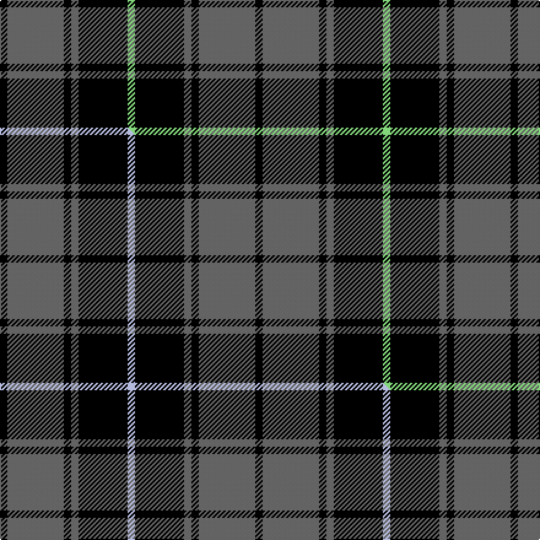

This page is one **sett** — a single exact thread-count. It belongs to the [tartan](/setts/k3n23k3n3k20lg3/)
(the same proportion at any scale), whose colour order is pattern [KBKBKY](/stripes/kbkbky/).

Part of the [Pride of the Forth](/tartans/pride-of-the-forth/) tartan — the named design grouping this sett with its other cloths.

Sourced from tartans-authority.  It is a [6 stripe tartan](/stripes/stripes6/).

Original link https://www.tartanregister.gov.uk/tartanDetails.aspx?ref=11060

Dataset <small>— provenance for this record, inherited from the source manifest</small>

<dl class="dataset-prov">
<dt>source</dt><dd><a href="/sources/tartans-authority/">Scottish Tartans Authority</a></dd>
<dt>data captured from</dt><dd><a href="https://github.com/thetartan/tartan-database/blob/master/data/tartans-authority/data.csv">https://github.com/thetartan/tartan-database/blob/master/data/tartans-authority/data.csv</a></dd>
<dt>data date</dt><dd>2014 <small>(this record)</small></dd>
<dt>licence</dt><dd><a href="https://creativecommons.org/licenses/by-nc-nd/4.0/">CC BY-NC-ND 4.0</a></dd>
</dl>

Capture chain <small>— the hands this data passed through, oldest first; each capture carries its own licence</small>

<ol class="capture-chain">
<li><a href="https://www.tartansauthority.com/">Scottish Tartans Authority</a> <small>the heritage body's archive — its tartan-ferret record browser is retired (links repaired to the SRT, above)</small></li>
<li><a href="https://github.com/thetartan/tartan-database">thetartan/tartan-database</a> <small>2016-2017</small> · <a href="https://creativecommons.org/licenses/by-nc-nd/4.0/">CC BY-NC-ND 4.0</a> <small>Levko Kravets's frozen compilation — the capture we vendored, and where its CC licence text came from</small></li>
<li>this dictionary <small>captured 2026-06-10 · commit 5bf86c7566</small> <small>each re-capture is a git commit to data/sources</small></li>
</ol>

## Register references

External register numbers recorded for this tartan.

- Scottish Register of Tartans: [11060](https://www.tartanregister.gov.uk/tartanDetails?ref=11060)
- Scottish Tartans Authority (ITI): 11060

## Thread count
K/6 N46 K6 N6 K40 LG/6

One full sett is **208 threads**.

## Palette
<table><thead><tr><th>Colour</th><th>Shade</th><th>OKLCh</th></tr></thead><tbody><tr><td>LG</td><td><code style="background-color:#82D67A;">#82D67A</code> <small style="color:#888">#82D67A</small></td><td><small style="color:#888">oklch(80.1% 0.150 142.2)</small></td></tr><tr><td>K</td><td><code style="background-color:#000000;">#000000</code> <small style="color:#888">#000000</small></td><td><small style="color:#888">oklch(0.0% 0.000 0.0)</small></td></tr><tr><td>N</td><td><code style="background-color:#636363;">#636363</code> <small style="color:#888">#636363</small></td><td><small style="color:#888">oklch(50.0% 0.000 89.9)</small></td></tr></tbody></table>

# Sample pattern

## Compared to the master

This cloth is one sett of its design; the master sett (the exemplar the design is anchored on) is below for comparison.

Its **ΔTartan distance** from the master is **0.30** — the same measure the nearest-tartans table ranks by (0 is identical; a re-scale of the same cloth is near 0, a recolour or a different proportion further).

<figure class="master-compare" style="margin:0">

this sett
master sett ★

<figcaption style="color:#888;font-size:smaller">One weave of this sett against the <a href="/setts/k3n23k3n3k20lb3/">master sett ★</a>, split on the diagonal: a shared proportion runs seamlessly across it with only the shades shifting; a different proportion breaks on it.</figcaption>
</figure>

## Nearest tartan variants

The nearest existing variants by ΔTartan distance, with this cloth at the top so the swatches line up against it.

ΔTartan

Threads

Variant

Sett

—

208

<a href="/variants/s6/k3n23k3n3k20lg3~x2/">Pride of the Forth</a>

<a href="/ttd/edit/#slug=k3n23k3n3k20lb3~x2&amp;base=k3n23k3n3k20lg3~x2" title="compare in the TTD">0.30</a>

208

<a href="/variants/s6/k3n23k3n3k20lb3~x2/">Pride of the Forth</a>

<a href="/ttd/edit/#slug=k3n31k3n3k27y3~x2&amp;base=k3n23k3n3k20lg3~x2" title="compare in the TTD">0.60</a>

268

<a href="/variants/s6/k3n31k3n3k27y3~x2/">Scottish National Party (Corporate)</a>

<a href="/ttd/edit/#slug=n58k22n8k17r5k14~x2&amp;base=k3n23k3n3k20lg3~x2" title="compare in the TTD">0.90</a>

352

<a href="/variants/s6/n58k22n8k17r5k14~x2/">Flynn</a>

<a href="/ttd/edit/#slug=k2n6k2n6k12r1~x4&amp;base=k3n23k3n3k20lg3~x2" title="compare in the TTD">0.92</a>

220

<a href="/variants/s6/k2n6k2n6k12r1~x4/">MacSween, Black (Personal)</a>

<a href="/ttd/edit/#slug=n50k4n12k23lo4k4~x2&amp;base=k3n23k3n3k20lg3~x2" title="compare in the TTD">1.02</a>

280

<a href="/variants/s6/n50k4n12k23lo4k4~x2/">Sligo Irish County Tartan</a>

<a href="/ttd/edit/#slug=k3n25k3n3k21n3~x2&amp;base=k3n23k3n3k20lg3~x2" title="compare in the TTD">1.15</a>

220

<a href="/variants/s6/k3n25k3n3k21n3~x2/">Slanj, Grey (Corporate)</a>

<a href="/ttd/edit/#slug=n34k7n12k39n3k4lg3~x2&amp;base=k3n23k3n3k20lg3~x2" title="compare in the TTD">1.58</a>

334

<a href="/variants/s7/n34k7n12k39n3k4lg3~x2/">Tartan Army Children's Charity (Corp</a>

<a href="/ttd/edit/#slug=n6k17n6k17n45k4~x2&amp;base=k3n23k3n3k20lg3~x2" title="compare in the TTD">1.77</a>

360

<a href="/variants/s6/n6k17n6k17n45k4~x2/">Grey Spirit (Fashion)</a>

<a href="/ttd/edit/#slug=n6k16n6k16n45k4~x2&amp;base=k3n23k3n3k20lg3~x2" title="compare in the TTD">1.79</a>

352

<a href="/variants/s6/n6k16n6k16n45k4~x2/">Grey Spirit Fashion Tartan</a>

<a href="/ttd/edit/#slug=n34k7n12k40n3k4lb3~x2&amp;base=k3n23k3n3k20lg3~x2" title="compare in the TTD">1.90</a>

338

<a href="/variants/s7/n34k7n12k40n3k4lb3~x2/">TACC</a>

## Neighbour map

Every grey dot is one of 13620 variants placed by the first two principal components of the ΔTartan feature space (42% of its variance). Red is this tartan; blue dots are its nearest — click one to open its page.

<svg viewBox="0 0 640 380" role="img" style="max-width:100%;height:auto;border:1px solid #e0e0e0;border-radius:4px;display:block" xmlns="http://www.w3.org/2000/svg"><image href="/nn/cloud.v1.png" width="640" height="380"/><a href="/variants/s6/k3n23k3n3k20lb3~x2/"><circle cx="261.4" cy="204.5" r="4" fill="#3465a4"><title>Pride of the Forth</title></circle></a><a href="/variants/s6/k3n31k3n3k27y3~x2/"><circle cx="287.5" cy="186.0" r="4" fill="#3465a4"><title>Scottish National Party (Corporate)</title></circle></a><a href="/variants/s6/n58k22n8k17r5k14~x2/"><circle cx="291.9" cy="193.2" r="4" fill="#3465a4"><title>Flynn</title></circle></a><a href="/variants/s6/k2n6k2n6k12r1~x4/"><circle cx="296.3" cy="197.3" r="4" fill="#3465a4"><title>MacSween, Black (Personal)</title></circle></a><a href="/variants/s6/n50k4n12k23lo4k4~x2/"><circle cx="359.1" cy="180.1" r="4" fill="#3465a4"><title>Sligo Irish County Tartan</title></circle></a><a href="/variants/s6/k3n25k3n3k21n3~x2/"><circle cx="326.2" cy="213.6" r="4" fill="#3465a4"><title>Slanj, Grey (Corporate)</title></circle></a><a href="/variants/s7/n34k7n12k39n3k4lg3~x2/"><circle cx="290.3" cy="178.2" r="4" fill="#3465a4"><title>Tartan Army Children's Charity (Corp</title></circle></a><a href="/variants/s6/n6k17n6k17n45k4~x2/"><circle cx="356.5" cy="209.1" r="4" fill="#3465a4"><title>Grey Spirit (Fashion)</title></circle></a><a href="/variants/s6/n6k16n6k16n45k4~x2/"><circle cx="363.8" cy="207.6" r="4" fill="#3465a4"><title>Grey Spirit Fashion Tartan</title></circle></a><a href="/variants/s7/n34k7n12k40n3k4lb3~x2/"><circle cx="293.9" cy="176.4" r="4" fill="#3465a4"><title>TACC</title></circle></a><circle cx="260.1" cy="204.8" r="5" fill="#c00000"/><text x="320" y="376" text-anchor="middle" font-size="11" fill="#999">ground</text><text x="11" y="190" text-anchor="middle" font-size="11" fill="#999" transform="rotate(-90 11 190)">complexity</text></svg>

ID: /variants/s6/k3n23k3n3k20lg3~x2/
