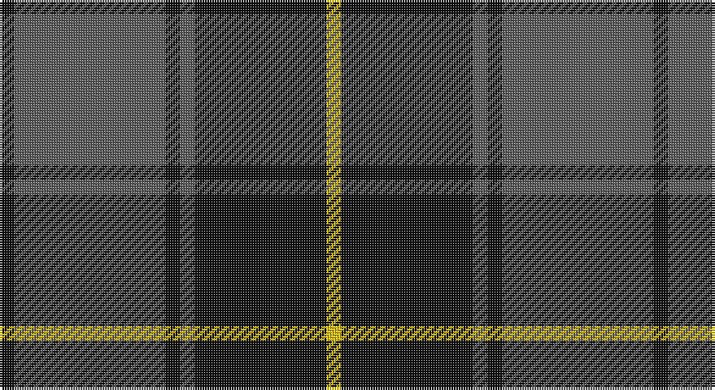

This page is one **sett** — a single exact thread-count. It belongs to the [tartan](/setts/k3n31k3n3k27ly3/)
(the same proportion at any scale), whose colour order is pattern [KBKBKY](/stripes/kbkbky/).

Sourced from tartans-authority.  It is a [6 stripe tartan](/stripes/stripes6/).

Original link http://www.tartansauthority.com/tartan-ferret/display/7839/

2 attestations — the source records this cloth was collapsed from (oldest owns this page)

<ul>
<li>Nov. 2008 — Scottish National Party (Corporate) (tartans-authority, <a href="http://www.tartansauthority.com/tartan-ferret/display/7839/">record</a>)</li>
<li>undated — Scottish National Party (register-of-tartans, <a href="https://www.tartanregister.gov.uk/tartanDetails.aspx?ref=5791">record</a>)</li>
</ul>

## Register references

External register numbers recorded for this tartan.

- Scottish Register of Tartans: [5791](https://www.tartanregister.gov.uk/tartanDetails.aspx?ref=5791)
- Scottish Tartans Authority (ITI): 7839

## Thread count
K/6 N62 K6 N6 K54 Y/6

One full sett is **268 threads**.

## Palette

Palette: <strong>Logan (The Scottish Gael, 1831)</strong> <small style="color:#888">(2 of 3 colours)</small>
<table><thead><tr><th>Colour</th><th>Threads</th><th>Shade</th><th>Base</th><th>OKLCh</th></tr></thead><tbody><tr><td>K/</td><td style="text-align:right;font-variant-numeric:tabular-nums">6</td><td><code style="background-color:#101010;">#101010</code> <small style="color:#888">#101010</small></td><td>K <code style="background-color:#000000;">#000000</code></td><td><small style="color:#888">oklch(17.3% 0.000 89.9)</small></td></tr><tr><td>N</td><td style="text-align:right;font-variant-numeric:tabular-nums">62</td><td><code style="background-color:#5C5C5C;">#5C5C5C</code> <small style="color:#888">#5C5C5C</small></td><td>B <code style="background-color:#2A418A;">#2A418A</code></td><td><small style="color:#888">oklch(47.5% 0.000 89.9)</small></td></tr><tr><td>K</td><td style="text-align:right;font-variant-numeric:tabular-nums">6</td><td><code style="background-color:#101010;">#101010</code> <small style="color:#888">#101010</small></td><td>K <code style="background-color:#000000;">#000000</code></td><td><small style="color:#888">oklch(17.3% 0.000 89.9)</small></td></tr><tr><td>N</td><td style="text-align:right;font-variant-numeric:tabular-nums">6</td><td><code style="background-color:#5C5C5C;">#5C5C5C</code> <small style="color:#888">#5C5C5C</small></td><td>B <code style="background-color:#2A418A;">#2A418A</code></td><td><small style="color:#888">oklch(47.5% 0.000 89.9)</small></td></tr><tr><td>K</td><td style="text-align:right;font-variant-numeric:tabular-nums">54</td><td><code style="background-color:#101010;">#101010</code> <small style="color:#888">#101010</small></td><td>K <code style="background-color:#000000;">#000000</code></td><td><small style="color:#888">oklch(17.3% 0.000 89.9)</small></td></tr><tr><td>Y/</td><td style="text-align:right;font-variant-numeric:tabular-nums">6</td><td><code style="background-color:#E8C000;">#E8C000</code> <small style="color:#888">#E8C000</small></td><td>Y <code style="background-color:#F2BF00;">#F2BF00</code></td><td><small style="color:#888">oklch(81.9% 0.168 93.7)</small></td></tr></tbody></table>

# Sample pattern

## Nearest tartans

The nearest existing variants by ΔTartan distance, with this tartan at the top so the swatches line up against it.

ΔTartan

Tartan

Sett

—

<a href="/ttd/edit/#slug=k3n31k3n3k27ly3~x2">Scottish National Party (Corporate)</a> <a class="nn-out" href="/variants/s6/k3n31k3n3k27ly3~x2/" title="open its dictionary page">↗</a>

0.68

<a href="/ttd/edit/#slug=k3n23k3n3k20lg3~x2&amp;base=k3n31k3n3k27ly3~x2">Pride of the Forth</a> <a class="nn-out" href="/variants/s6/k3n23k3n3k20lg3~x2/" title="open its dictionary page">↗</a>

0.77

<a href="/ttd/edit/#slug=n34k7n12k39n3k4lg3~x2&amp;base=k3n31k3n3k27ly3~x2">Tartan Army Children's Charity (Corp</a> <a class="nn-out" href="/variants/s7/n34k7n12k39n3k4lg3~x2/" title="open its dictionary page">↗</a>

0.86

<a href="/ttd/edit/#slug=k3n23k3n3k20t3~x2&amp;base=k3n31k3n3k27ly3~x2">Pride of the Forth</a> <a class="nn-out" href="/variants/s6/k3n23k3n3k20t3~x2/" title="open its dictionary page">↗</a>

0.87

<a href="/ttd/edit/#slug=n34k7n12k40n3k4t3~x2&amp;base=k3n31k3n3k27ly3~x2">TACC (Corporate)</a> <a class="nn-out" href="/variants/s7/n34k7n12k40n3k4t3~x2/" title="open its dictionary page">↗</a>

1.10

<a href="/ttd/edit/#slug=r3db1r1db11g10r2db2~x4&amp;base=k3n31k3n3k27ly3~x2">Robertson of Struan 1816</a> <a class="nn-out" href="/variants/s7/r3db1r1db11g10r2db2~x4/" title="open its dictionary page">↗</a>

1.14

<a href="/ttd/edit/#slug=n5r3n35k28n4k11n2~x2&amp;base=k3n31k3n3k27ly3~x2">Korner-MacPherson (Personal)</a> <a class="nn-out" href="/variants/s7/n5r3n35k28n4k11n2~x2/" title="open its dictionary page">↗</a>

1.20

<a href="/ttd/edit/#slug=n1k3n1k3n8r1~x8&amp;base=k3n31k3n3k27ly3~x2">Mackay (Blue)</a> <a class="nn-out" href="/variants/s6/n1k3n1k3n8r1~x8/" title="open its dictionary page">↗</a>

1.23

<a href="/ttd/edit/#slug=k3w2n27k31p3~x2&amp;base=k3n31k3n3k27ly3~x2">Kelley Oliphint</a> <a class="nn-out" href="/variants/s5/k3w2n27k31p3~x2/" title="open its dictionary page">↗</a>

1.24

<a href="/ttd/edit/#slug=k3w2n27k31lr3~x2&amp;base=k3n31k3n3k27ly3~x2">Kelley Oliphint (Commemorative)</a> <a class="nn-out" href="/variants/s5/k3w2n27k31lr3~x2/" title="open its dictionary page">↗</a>

1.27

<a href="/ttd/edit/#slug=r2db10g1db2g1db2g8r1g2~x4&amp;base=k3n31k3n3k27ly3~x2">Brown, Barnaby (Personal)</a> <a class="nn-out" href="/variants/s9/r2db10g1db2g1db2g8r1g2~x4/" title="open its dictionary page">↗</a>

## Neighbour map

Every grey dot is one of 14360 variants placed by the first two principal components of the ΔTartan feature space (44% of its variance). Red is this tartan; blue dots are its nearest — click one to open its page.

<svg viewBox="0 0 640 380" role="img" style="max-width:100%;height:auto;border:1px solid #e0e0e0;border-radius:4px;display:block" xmlns="http://www.w3.org/2000/svg"><image href="/nn/cloud.v1.png" width="640" height="380"/><a href="/variants/s6/k3n23k3n3k20lg3~x2/"><circle cx="325.0" cy="246.6" r="4" fill="#3465a4"><title>Pride of the Forth</title></circle></a><a href="/variants/s7/n34k7n12k39n3k4lg3~x2/"><circle cx="362.7" cy="223.8" r="4" fill="#3465a4"><title>Tartan Army Children's Charity (Corp</title></circle></a><a href="/variants/s6/k3n23k3n3k20t3~x2/"><circle cx="333.1" cy="250.8" r="4" fill="#3465a4"><title>Pride of the Forth</title></circle></a><a href="/variants/s7/n34k7n12k40n3k4t3~x2/"><circle cx="369.6" cy="224.2" r="4" fill="#3465a4"><title>TACC (Corporate)</title></circle></a><a href="/variants/s7/r3db1r1db11g10r2db2~x4/"><circle cx="295.1" cy="220.1" r="4" fill="#3465a4"><title>Robertson of Struan 1816</title></circle></a><a href="/variants/s7/n5r3n35k28n4k11n2~x2/"><circle cx="388.8" cy="212.5" r="4" fill="#3465a4"><title>Korner-MacPherson (Personal)</title></circle></a><a href="/variants/s6/n1k3n1k3n8r1~x8/"><circle cx="361.7" cy="247.5" r="4" fill="#3465a4"><title>Mackay (Blue)</title></circle></a><a href="/variants/s5/k3w2n27k31p3~x2/"><circle cx="340.6" cy="207.6" r="4" fill="#3465a4"><title>Kelley Oliphint</title></circle></a><a href="/variants/s5/k3w2n27k31lr3~x2/"><circle cx="328.3" cy="200.5" r="4" fill="#3465a4"><title>Kelley Oliphint (Commemorative)</title></circle></a><a href="/variants/s9/r2db10g1db2g1db2g8r1g2~x4/"><circle cx="319.2" cy="220.1" r="4" fill="#3465a4"><title>Brown, Barnaby (Personal)</title></circle></a><circle cx="341.5" cy="223.4" r="5" fill="#c00000"/></svg>

ID: /variants/s6/k3n31k3n3k27ly3~x2/
