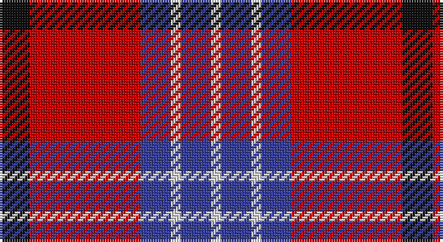

This page is one **sett** — a single exact thread-count. It belongs to the [tartan](/setts/k3r11db3w1db3w1/)
(the same proportion at any scale), whose colour order is pattern [KRBWBW](/stripes/krbwbw/).

Sourced from tartans-authority.  It is a [6 stripe tartan](/stripes/stripes6/).

Original link http://www.tartansauthority.com/tartan-ferret/display/8003/

## Register references

External register numbers recorded for this tartan.

- Scottish Register of Tartans: [8003](https://www.tartanregister.gov.uk/tartanDetails?ref=8003)
- Scottish Tartans Authority (ITI): 8003

## Thread count
K/12 R44 B12 LN4 B12 LN/4

One full sett is **160 threads**.

## Palette

Palette: <strong>Tartan Register</strong> <small style="color:#888">(3 of 4 colours)</small>
<table><thead><tr><th>Colour</th><th>Threads</th><th>Shade</th><th>Base</th><th>OKLCh</th></tr></thead><tbody><tr><td>K/</td><td style="text-align:right;font-variant-numeric:tabular-nums">12</td><td><code style="background-color:#101010;">#101010</code> <small style="color:#888">#101010</small></td><td>K <code style="background-color:#000000;">#000000</code></td><td><small style="color:#888">oklch(17.3% 0.000 89.9)</small></td></tr><tr><td>R</td><td style="text-align:right;font-variant-numeric:tabular-nums">44</td><td><code style="background-color:#C80000;">#C80000</code> <small style="color:#888">#C80000</small></td><td>R <code style="background-color:#CC0000;">#CC0000</code></td><td><small style="color:#888">oklch(52.3% 0.215 29.2)</small></td></tr><tr><td>B</td><td style="text-align:right;font-variant-numeric:tabular-nums">12</td><td><code style="background-color:#38409C;">#38409C</code> <small style="color:#888">#38409C</small></td><td>B <code style="background-color:#2A418A;">#2A418A</code></td><td><small style="color:#888">oklch(42.1% 0.148 274.4)</small></td></tr><tr><td>LN</td><td style="text-align:right;font-variant-numeric:tabular-nums">4</td><td><code style="background-color:#E0E0E0;">#E0E0E0</code> <small style="color:#888">#E0E0E0</small></td><td>W <code style="background-color:#F7F7F7;">#F7F7F7</code></td><td><small style="color:#888">oklch(90.7% 0.000 89.9)</small></td></tr><tr><td>B</td><td style="text-align:right;font-variant-numeric:tabular-nums">12</td><td><code style="background-color:#38409C;">#38409C</code> <small style="color:#888">#38409C</small></td><td>B <code style="background-color:#2A418A;">#2A418A</code></td><td><small style="color:#888">oklch(42.1% 0.148 274.4)</small></td></tr><tr><td>LN/</td><td style="text-align:right;font-variant-numeric:tabular-nums">4</td><td><code style="background-color:#E0E0E0;">#E0E0E0</code> <small style="color:#888">#E0E0E0</small></td><td>W <code style="background-color:#F7F7F7;">#F7F7F7</code></td><td><small style="color:#888">oklch(90.7% 0.000 89.9)</small></td></tr></tbody></table>

# Sample pattern

## Nearest tartans

The nearest existing variants by ΔTartan distance, with this tartan at the top so the swatches line up against it.

ΔTartan

Tartan

Sett

—

<a href="/ttd/edit/#slug=k3r11db3w1db3w1~x4">Suntan (Masai Shuka) (District?)</a> <a class="nn-out" href="/variants/s6/k3r11db3w1db3w1~x4/" title="open its dictionary page">↗</a>

0.72

<a href="/ttd/edit/#slug=db1r16db6ly4db6w1~x4&amp;base=k3r11db3w1db3w1~x4">Superfast Ferries (Corporate)</a> <a class="nn-out" href="/variants/s6/db1r16db6ly4db6w1~x4/" title="open its dictionary page">↗</a>

0.80

<a href="/ttd/edit/#slug=w2db3r24db15w6db3ly2~x2&amp;base=k3r11db3w1db3w1~x4">Fazzolettone (Fashion?)</a> <a class="nn-out" href="/variants/s7/w2db3r24db15w6db3ly2~x2/" title="open its dictionary page">↗</a>

0.85

<a href="/ttd/edit/#slug=r1db6r1dg6r12w1~x2&amp;base=k3r11db3w1db3w1~x4">Fraser Red Clan Tartan</a> <a class="nn-out" href="/variants/s6/r1db6r1dg6r12w1~x2/" title="open its dictionary page">↗</a>

0.89

<a href="/ttd/edit/#slug=r1db6r1dg6r12lb1&amp;base=k3r11db3w1db3w1~x4">Fraser VS</a> <a class="nn-out" href="/variants/s6/r1db6r1dg6r12lb1/" title="open its dictionary page">↗</a>

0.90

<a href="/ttd/edit/#slug=g3r2db22r22db2w3~x2&amp;base=k3r11db3w1db3w1~x4">Galloway Red</a> <a class="nn-out" href="/variants/s6/g3r2db22r22db2w3~x2/" title="open its dictionary page">↗</a>

1.02

<a href="/ttd/edit/#slug=r36lb3r5k21db24k3~x2&amp;base=k3r11db3w1db3w1~x4">Graham of Menteith (Red)</a> <a class="nn-out" href="/variants/s6/r36lb3r5k21db24k3~x2/" title="open its dictionary page">↗</a>

1.06

<a href="/ttd/edit/#slug=r3db15r3g8r20k2~x2&amp;base=k3r11db3w1db3w1~x4">Finnigan (Estimated threadcount)</a> <a class="nn-out" href="/variants/s6/r3db15r3g8r20k2~x2/" title="open its dictionary page">↗</a>

1.12

<a href="/ttd/edit/#slug=m3w1m20k8w8g2~x4&amp;base=k3r11db3w1db3w1~x4">Nisbet Dress Rose (Dance)</a> <a class="nn-out" href="/variants/s6/m3w1m20k8w8g2~x4/" title="open its dictionary page">↗</a>

1.12

<a href="/ttd/edit/#slug=t2r12db2t6k6t1~x4&amp;base=k3r11db3w1db3w1~x4">Thompson/Thomson/MacTavish</a> <a class="nn-out" href="/variants/s6/t2r12db2t6k6t1~x4/" title="open its dictionary page">↗</a>

1.16

<a href="/ttd/edit/#slug=r6lb3r37k16lb16g4~x2&amp;base=k3r11db3w1db3w1~x4">Nesbit, Rose</a> <a class="nn-out" href="/variants/s6/r6lb3r37k16lb16g4~x2/" title="open its dictionary page">↗</a>

## Neighbour map

Every grey dot is one of 14360 variants placed by the first two principal components of the ΔTartan feature space (44% of its variance). Red is this tartan; blue dots are its nearest — click one to open its page.

<svg viewBox="0 0 640 380" role="img" style="max-width:100%;height:auto;border:1px solid #e0e0e0;border-radius:4px;display:block" xmlns="http://www.w3.org/2000/svg"><image href="/nn/cloud.v1.png" width="640" height="380"/><a href="/variants/s6/db1r16db6ly4db6w1~x4/"><circle cx="278.6" cy="169.1" r="4" fill="#3465a4"><title>Superfast Ferries (Corporate)</title></circle></a><a href="/variants/s7/w2db3r24db15w6db3ly2~x2/"><circle cx="239.4" cy="159.2" r="4" fill="#3465a4"><title>Fazzolettone (Fashion?)</title></circle></a><a href="/variants/s6/r1db6r1dg6r12w1~x2/"><circle cx="292.6" cy="189.0" r="4" fill="#3465a4"><title>Fraser Red Clan Tartan</title></circle></a><a href="/variants/s6/r1db6r1dg6r12lb1/"><circle cx="280.6" cy="185.4" r="4" fill="#3465a4"><title>Fraser VS</title></circle></a><a href="/variants/s6/g3r2db22r22db2w3~x2/"><circle cx="276.5" cy="179.6" r="4" fill="#3465a4"><title>Galloway Red</title></circle></a><a href="/variants/s6/r36lb3r5k21db24k3~x2/"><circle cx="248.5" cy="195.7" r="4" fill="#3465a4"><title>Graham of Menteith (Red)</title></circle></a><a href="/variants/s6/r3db15r3g8r20k2~x2/"><circle cx="285.7" cy="208.5" r="4" fill="#3465a4"><title>Finnigan (Estimated threadcount)</title></circle></a><a href="/variants/s6/m3w1m20k8w8g2~x4/"><circle cx="300.2" cy="152.8" r="4" fill="#3465a4"><title>Nisbet Dress Rose (Dance)</title></circle></a><a href="/variants/s6/t2r12db2t6k6t1~x4/"><circle cx="215.9" cy="193.1" r="4" fill="#3465a4"><title>Thompson/Thomson/MacTavish</title></circle></a><a href="/variants/s6/r6lb3r37k16lb16g4~x2/"><circle cx="265.6" cy="172.9" r="4" fill="#3465a4"><title>Nesbit, Rose</title></circle></a><circle cx="264.9" cy="178.8" r="5" fill="#c00000"/></svg>

ID: /variants/s6/k3r11db3w1db3w1~x4/
