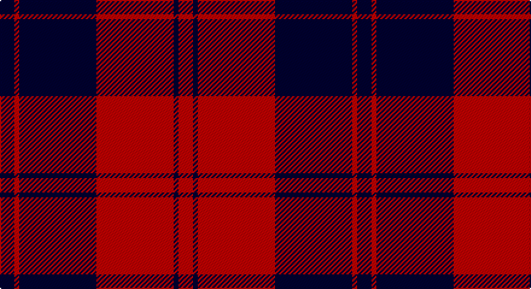

This page is one **sett** — a single exact thread-count. It belongs to the [tartan](/setts/k3r1k16r16k1r3/)
(the same proportion at any scale), whose colour order is pattern [KRKRKR](/stripes/krkrkr/).

Sourced from weddslist.  It is a [6 stripe tartan](/stripes/stripes6/).

Original link http://www.weddslist.com/cgi-bin/tartans/pg.pl?source=sts

## Thread count
DB/12 R4 DB64 R64 DB4 R/12

One full sett is **296 threads**.

## Palette

Palette: <strong>custom</strong>
<table><thead><tr><th>Colour</th><th>Threads</th><th>Shade</th><th>Base</th><th>OKLCh</th></tr></thead><tbody><tr><td>DB/</td><td style="text-align:right;font-variant-numeric:tabular-nums">12</td><td><code style="background-color:#000030;">#000030</code> <small style="color:#888">#000030</small></td><td>K <code style="background-color:#000000;">#000000</code></td><td><small style="color:#888">oklch(14.0% 0.097 264.1)</small></td></tr><tr><td>R</td><td style="text-align:right;font-variant-numeric:tabular-nums">4</td><td><code style="background-color:#C00000;">#C00000</code> <small style="color:#888">#C00000</small></td><td>R <code style="background-color:#CC0000;">#CC0000</code></td><td><small style="color:#888">oklch(50.7% 0.208 29.2)</small></td></tr><tr><td>DB</td><td style="text-align:right;font-variant-numeric:tabular-nums">64</td><td><code style="background-color:#000030;">#000030</code> <small style="color:#888">#000030</small></td><td>K <code style="background-color:#000000;">#000000</code></td><td><small style="color:#888">oklch(14.0% 0.097 264.1)</small></td></tr><tr><td>R</td><td style="text-align:right;font-variant-numeric:tabular-nums">64</td><td><code style="background-color:#C00000;">#C00000</code> <small style="color:#888">#C00000</small></td><td>R <code style="background-color:#CC0000;">#CC0000</code></td><td><small style="color:#888">oklch(50.7% 0.208 29.2)</small></td></tr><tr><td>DB</td><td style="text-align:right;font-variant-numeric:tabular-nums">4</td><td><code style="background-color:#000030;">#000030</code> <small style="color:#888">#000030</small></td><td>K <code style="background-color:#000000;">#000000</code></td><td><small style="color:#888">oklch(14.0% 0.097 264.1)</small></td></tr><tr><td>R/</td><td style="text-align:right;font-variant-numeric:tabular-nums">12</td><td><code style="background-color:#C00000;">#C00000</code> <small style="color:#888">#C00000</small></td><td>R <code style="background-color:#CC0000;">#CC0000</code></td><td><small style="color:#888">oklch(50.7% 0.208 29.2)</small></td></tr></tbody></table>

# Sample pattern

## Nearest tartans

The nearest existing variants by ΔTartan distance, with this tartan at the top so the swatches line up against it.

ΔTartan

Tartan

Sett

—

<a href="/ttd/edit/#slug=k3r1k16r16k1r3~x4">The Mary Erskine</a> <a class="nn-out" href="/variants/s6/k3r1k16r16k1r3~x4/" title="open its dictionary page">↗</a>

1.29

<a href="/variants/s6/k23r3k1r12~x4/">Ewing</a>

1.39

<a href="/ttd/edit/#slug=r19k3r19k32g3k8~x2&amp;base=k3r1k16r16k1r3~x4">Tartan TV</a> <a class="nn-out" href="/variants/s6/r19k3r19k32g3k8~x2/" title="open its dictionary page">↗</a>

1.41

<a href="/ttd/edit/#slug=k6r3k28r28k3r6~x2&amp;base=k3r1k16r16k1r3~x4">Erskine, Black &amp; Red (Clan)</a> <a class="nn-out" href="/variants/s6/k6r3k28r28k3r6~x2/" title="open its dictionary page">↗</a>

1.42

<a href="/ttd/edit/#slug=k16r2k2r12w1~x2&amp;base=k3r1k16r16k1r3~x4">MacIver</a> <a class="nn-out" href="/variants/s5/k16r2k2r12w1~x2/" title="open its dictionary page">↗</a>

1.43

<a href="/ttd/edit/#slug=db3o3db24o30db3o2~x2&amp;base=k3r1k16r16k1r3~x4">Auburn University (Alabama) (Corp)</a> <a class="nn-out" href="/variants/s6/db3o3db24o30db3o2~x2/" title="open its dictionary page">↗</a>

1.45

<a href="/ttd/edit/#slug=k6r1k24r28k1r4~x2&amp;base=k3r1k16r16k1r3~x4">Aragon (Erskine)</a> <a class="nn-out" href="/variants/s6/k6r1k24r28k1r4~x2/" title="open its dictionary page">↗</a>

1.47

<a href="/ttd/edit/#slug=r6w3r17k3r3k25r3~x2&amp;base=k3r1k16r16k1r3~x4">Bon Accord</a> <a class="nn-out" href="/variants/s7/r6w3r17k3r3k25r3~x2/" title="open its dictionary page">↗</a>

1.49

<a href="/ttd/edit/#slug=k3r2k30r28k2r2w3~x2&amp;base=k3r1k16r16k1r3~x4">Cunningham #2</a> <a class="nn-out" href="/variants/s7/k3r2k30r28k2r2w3~x2/" title="open its dictionary page">↗</a>

1.52

<a href="/ttd/edit/#slug=k2r16k8ly1k8r2~x4&amp;base=k3r1k16r16k1r3~x4">Brodie (Clan)</a> <a class="nn-out" href="/variants/s6/k2r16k8ly1k8r2~x4/" title="open its dictionary page">↗</a>

1.58

<a href="/ttd/edit/#slug=k30r3k2r3k2r27k30r4~x2&amp;base=k3r1k16r16k1r3~x4">Murray of Ochtertyre #2</a> <a class="nn-out" href="/variants/s8/k30r3k2r3k2r27k30r4~x2/" title="open its dictionary page">↗</a>

## Neighbour map

Every grey dot is one of 14360 variants placed by the first two principal components of the ΔTartan feature space (44% of its variance). Red is this tartan; blue dots are its nearest — click one to open its page.

<svg viewBox="0 0 640 380" role="img" style="max-width:100%;height:auto;border:1px solid #e0e0e0;border-radius:4px;display:block" xmlns="http://www.w3.org/2000/svg"><image href="/nn/cloud.v1.png" width="640" height="380"/><a href="/variants/s6/k23r3k1r12~x4/"><circle cx="429.9" cy="184.4" r="4" fill="#3465a4"><title>Ewing</title></circle></a><a href="/variants/s6/r19k3r19k32g3k8~x2/"><circle cx="310.7" cy="224.4" r="4" fill="#3465a4"><title>Tartan TV</title></circle></a><a href="/variants/s6/k6r3k28r28k3r6~x2/"><circle cx="360.7" cy="232.7" r="4" fill="#3465a4"><title>Erskine, Black &amp; Red (Clan)</title></circle></a><a href="/variants/s5/k16r2k2r12w1~x2/"><circle cx="359.3" cy="196.1" r="4" fill="#3465a4"><title>MacIver</title></circle></a><a href="/variants/s6/db3o3db24o30db3o2~x2/"><circle cx="410.9" cy="212.2" r="4" fill="#3465a4"><title>Auburn University (Alabama) (Corp)</title></circle></a><a href="/variants/s6/k6r1k24r28k1r4~x2/"><circle cx="415.7" cy="183.7" r="4" fill="#3465a4"><title>Aragon (Erskine)</title></circle></a><a href="/variants/s7/r6w3r17k3r3k25r3~x2/"><circle cx="295.2" cy="202.6" r="4" fill="#3465a4"><title>Bon Accord</title></circle></a><a href="/variants/s7/k3r2k30r28k2r2w3~x2/"><circle cx="349.9" cy="167.6" r="4" fill="#3465a4"><title>Cunningham #2</title></circle></a><a href="/variants/s6/k2r16k8ly1k8r2~x4/"><circle cx="340.2" cy="199.5" r="4" fill="#3465a4"><title>Brodie (Clan)</title></circle></a><a href="/variants/s8/k30r3k2r3k2r27k30r4~x2/"><circle cx="437.2" cy="205.4" r="4" fill="#3465a4"><title>Murray of Ochtertyre #2</title></circle></a><circle cx="375.2" cy="206.0" r="5" fill="#c00000"/></svg>

ID: /variants/s6/k3r1k16r16k1r3~x4/
