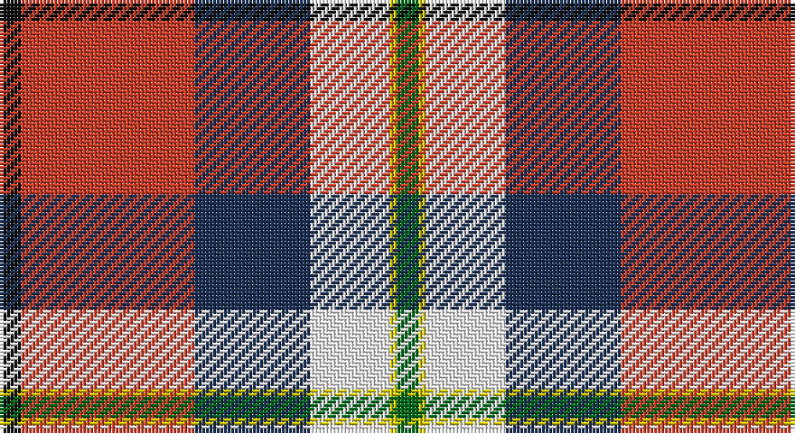

This page is one **sett** — a single exact thread-count. It belongs to the [tartan](/setts/k3r24dt16w11ly1g3/)
(the same proportion at any scale), whose colour order is pattern [GYWBRK](/stripes/gywbrk/).

Sourced from register-of-tartans.  It is a [6 stripe tartan](/stripes/stripes6/).

Original link https://www.tartanregister.gov.uk/tartanDetails.aspx?ref=387

2 attestations — the source records this cloth was collapsed from (oldest owns this page)

<ul>
<li>01/05/2005 — Bro-sant-Malou (register-of-tartans, <a href="https://www.tartanregister.gov.uk/tartanDetails.aspx?ref=387">record</a>)</li>
<li>2005 May — Bro-sant-Malou (Corporate) (tartans-authority, <a href="http://www.tartansauthority.com/tartan-ferret/display/6649/">record</a>)</li>
</ul>

## Register references

External register numbers recorded for this tartan.

- Scottish Register of Tartans: [387](https://www.tartanregister.gov.uk/tartanDetails.aspx?ref=387)
- Scottish Tartans Authority (ITI): 6649

## Thread count
K/6 R48 DB32 W22 Y2 G/6

One full sett is **220 threads**.

## Palette

Palette: <strong>Tartan Register</strong> <small style="color:#888">(3 of 6 colours)</small>
<table><thead><tr><th>Colour</th><th>Threads</th><th>Shade</th><th>Base</th><th>OKLCh</th></tr></thead><tbody><tr><td>K/</td><td style="text-align:right;font-variant-numeric:tabular-nums">6</td><td><code style="background-color:#101010;">#101010</code> <small style="color:#888">#101010</small></td><td>K <code style="background-color:#000000;">#000000</code></td><td><small style="color:#888">oklch(17.3% 0.000 89.9)</small></td></tr><tr><td>R</td><td style="text-align:right;font-variant-numeric:tabular-nums">48</td><td><code style="background-color:#C83C28;">#C83C28</code> <small style="color:#888">#C83C28</small></td><td>R <code style="background-color:#CC0000;">#CC0000</code></td><td><small style="color:#888">oklch(56.0% 0.180 31.2)</small></td></tr><tr><td>DB</td><td style="text-align:right;font-variant-numeric:tabular-nums">32</td><td><code style="background-color:#1C3054;">#1C3054</code> <small style="color:#888">#1C3054</small></td><td>B <code style="background-color:#2A418A;">#2A418A</code></td><td><small style="color:#888">oklch(31.2% 0.070 261.3)</small></td></tr><tr><td>W</td><td style="text-align:right;font-variant-numeric:tabular-nums">22</td><td><code style="background-color:#F8F8F8;">#F8F8F8</code> <small style="color:#888">#F8F8F8</small></td><td>W <code style="background-color:#F7F7F7;">#F7F7F7</code></td><td><small style="color:#888">oklch(97.9% 0.000 89.9)</small></td></tr><tr><td>Y</td><td style="text-align:right;font-variant-numeric:tabular-nums">2</td><td><code style="background-color:#D8C800;">#D8C800</code> <small style="color:#888">#D8C800</small></td><td>Y <code style="background-color:#F2BF00;">#F2BF00</code></td><td><small style="color:#888">oklch(82.0% 0.173 103.7)</small></td></tr><tr><td>G/</td><td style="text-align:right;font-variant-numeric:tabular-nums">6</td><td><code style="background-color:#006818;">#006818</code> <small style="color:#888">#006818</small></td><td>G <code style="background-color:#006100;">#006100</code></td><td><small style="color:#888">oklch(45.0% 0.142 145.0)</small></td></tr></tbody></table>

# Sample pattern

## Nearest tartans

The nearest existing variants by ΔTartan distance, with this tartan at the top so the swatches line up against it.

ΔTartan

Tartan

Sett

—

<a href="/ttd/edit/#slug=k3r24dt16w11ly1g3~x2">Bro-sant-Malou</a> <a class="nn-out" href="/variants/s6/k3r24dt16w11ly1g3~x2/" title="open its dictionary page">↗</a>

0.90

<a href="/ttd/edit/#slug=t4w4t4w5k8g2r19lo1~x2&amp;base=k3r24dt16w11ly1g3~x2">Edinburgh Napier University (Corp.)</a> <a class="nn-out" href="/variants/s8/t4w4t4w5k8g2r19lo1~x2/" title="open its dictionary page">↗</a>

1.21

<a href="/ttd/edit/#slug=ri50ly4w16db2w4db2w15g27r4~x2&amp;base=k3r24dt16w11ly1g3~x2">Rosevear</a> <a class="nn-out" href="/variants/s9/ri50ly4w16db2w4db2w15g27r4~x2/" title="open its dictionary page">↗</a>

1.29

<a href="/variants/s7/k3r3lo2r20ki16lb24w2~x2/">Oor Wullie Corporate Tartan</a>

1.29

<a href="/ttd/edit/#slug=w37k4db12g12w2lr2r23w4r6~x2&amp;base=k3r24dt16w11ly1g3~x2">Hebridean Arisaid, Red/White (Dance)</a> <a class="nn-out" href="/variants/s9/w37k4db12g12w2lr2r23w4r6~x2/" title="open its dictionary page">↗</a>

1.30

<a href="/ttd/edit/#slug=m50ly4w16db2w4db2w15g27r4~x2&amp;base=k3r24dt16w11ly1g3~x2">Rosevear</a> <a class="nn-out" href="/variants/s9/m50ly4w16db2w4db2w15g27r4~x2/" title="open its dictionary page">↗</a>

1.30

<a href="/ttd/edit/#slug=r48t16lo5dg17w8k3~x2&amp;base=k3r24dt16w11ly1g3~x2">Scottish American Society of Michigan (Official)</a> <a class="nn-out" href="/variants/s6/r48t16lo5dg17w8k3~x2/" title="open its dictionary page">↗</a>

1.31

<a href="/ttd/edit/#slug=r64k30g30db18w4db2w3&amp;base=k3r24dt16w11ly1g3~x2">Clyde Family (Hurleford) (Personal)</a> <a class="nn-out" href="/variants/s7/r64k30g30db18w4db2w3/" title="open its dictionary page">↗</a>

1.32

<a href="/ttd/edit/#slug=db4w8db8w10k16lg4r38ly1&amp;base=k3r24dt16w11ly1g3~x2">Edinburgh Napier University</a> <a class="nn-out" href="/variants/s8/db4w8db8w10k16lg4r38ly1/" title="open its dictionary page">↗</a>

1.32

<a href="/ttd/edit/#slug=lyi3r3ly2r20k16lb24w2~x2&amp;base=k3r24dt16w11ly1g3~x2">Oor Wullie (Corporate)</a> <a class="nn-out" href="/variants/s7/lyi3r3ly2r20k16lb24w2~x2/" title="open its dictionary page">↗</a>

1.33

<a href="/ttd/edit/#slug=lo13b8r5k3w2g1~x4&amp;base=k3r24dt16w11ly1g3~x2">Ball</a> <a class="nn-out" href="/variants/s6/lo13b8r5k3w2g1~x4/" title="open its dictionary page">↗</a>

## Neighbour map

Every grey dot is one of 14360 variants placed by the first two principal components of the ΔTartan feature space (44% of its variance). Red is this tartan; blue dots are its nearest — click one to open its page.

<svg viewBox="0 0 640 380" role="img" style="max-width:100%;height:auto;border:1px solid #e0e0e0;border-radius:4px;display:block" xmlns="http://www.w3.org/2000/svg"><image href="/nn/cloud.v1.png" width="640" height="380"/><a href="/variants/s8/t4w4t4w5k8g2r19lo1~x2/"><circle cx="160.8" cy="107.6" r="4" fill="#3465a4"><title>Edinburgh Napier University (Corp.)</title></circle></a><a href="/variants/s9/ri50ly4w16db2w4db2w15g27r4~x2/"><circle cx="194.0" cy="85.1" r="4" fill="#3465a4"><title>Rosevear</title></circle></a><a href="/variants/s7/k3r3lo2r20ki16lb24w2~x2/"><circle cx="127.2" cy="129.6" r="4" fill="#3465a4"><title>Oor Wullie Corporate Tartan</title></circle></a><a href="/variants/s9/w37k4db12g12w2lr2r23w4r6~x2/"><circle cx="164.6" cy="98.4" r="4" fill="#3465a4"><title>Hebridean Arisaid, Red/White (Dance)</title></circle></a><a href="/variants/s9/m50ly4w16db2w4db2w15g27r4~x2/"><circle cx="191.4" cy="85.8" r="4" fill="#3465a4"><title>Rosevear</title></circle></a><a href="/variants/s6/r48t16lo5dg17w8k3~x2/"><circle cx="231.2" cy="135.4" r="4" fill="#3465a4"><title>Scottish American Society of Michigan (Official)</title></circle></a><a href="/variants/s7/r64k30g30db18w4db2w3/"><circle cx="229.9" cy="118.0" r="4" fill="#3465a4"><title>Clyde Family (Hurleford) (Personal)</title></circle></a><a href="/variants/s8/db4w8db8w10k16lg4r38ly1/"><circle cx="189.5" cy="70.3" r="4" fill="#3465a4"><title>Edinburgh Napier University</title></circle></a><a href="/variants/s7/lyi3r3ly2r20k16lb24w2~x2/"><circle cx="128.5" cy="128.5" r="4" fill="#3465a4"><title>Oor Wullie (Corporate)</title></circle></a><a href="/variants/s6/lo13b8r5k3w2g1~x4/"><circle cx="150.2" cy="152.2" r="4" fill="#3465a4"><title>Ball</title></circle></a><circle cx="181.0" cy="117.8" r="5" fill="#c00000"/></svg>

ID: /variants/s6/k3r24dt16w11ly1g3~x2/
