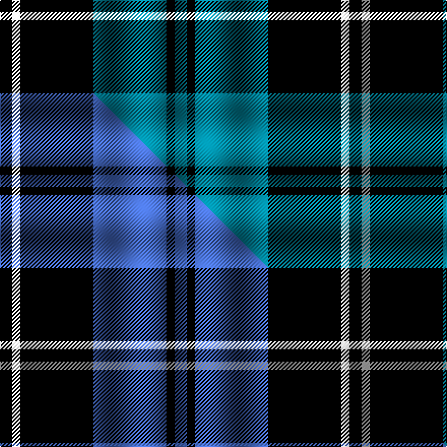

This page is one **sett** — a single exact thread-count. It belongs to the [tartan](/setts/k3w2k18t18k2t3/)
(the same proportion at any scale), whose colour order is pattern [BKBKWK](/stripes/bkbkwk/).

Part of the [Swan](/tartans/swan/) tartan — the named design grouping this sett with its other cloths.

Sourced from tartans-authority.  It is a [6 stripe tartan](/stripes/stripes6/).

Original link [https://www.tartanregister.gov.uk/tartanDetails.aspx?ref=5164](https://www.tartanregister.gov.uk/tartanDetails.aspx?ref=5164)

Dataset <small>— provenance for this record, inherited from the source manifest</small>

<dl class="dataset-prov">
<dt>source</dt><dd><a href="/sources/tartans-authority/">Scottish Tartans Authority</a></dd>
<dt>data captured from</dt><dd><a href="https://github.com/thetartan/tartan-database/blob/master/data/tartans-authority/data.csv">https://github.com/thetartan/tartan-database/blob/master/data/tartans-authority/data.csv</a></dd>
<dt>data date</dt><dd>pre 2002 <small>(this record)</small></dd>
<dt>licence</dt><dd><a href="https://creativecommons.org/licenses/by-nc-nd/4.0/">CC BY-NC-ND 4.0</a></dd>
</dl>

Capture chain <small>— the hands this data passed through, oldest first; each capture carries its own licence</small>

<ol class="capture-chain">
<li><a href="https://www.tartansauthority.com/">Scottish Tartans Authority</a> <small>the heritage body's archive — its tartan-ferret record browser is retired (links repaired to the SRT, above)</small></li>
<li><a href="https://github.com/thetartan/tartan-database">thetartan/tartan-database</a> <small>2016-2017</small> · <a href="https://creativecommons.org/licenses/by-nc-nd/4.0/">CC BY-NC-ND 4.0</a> <small>Levko Kravets's frozen compilation — the capture we vendored, and where its CC licence text came from</small></li>
<li>this dictionary <small>captured 2026-06-10 · commit 5bf86c7566</small> <small>each re-capture is a git commit to data/sources</small></li>
</ol>

## Register references

External register numbers recorded for this tartan.

- Scottish Tartans Authority (ITI): 5164

## Thread count
K/12 W8 K72 T72 K8 T/12

One full sett is **344 threads**.

## Palette
<table><thead><tr><th>Colour</th><th>Shade</th><th>OKLCh</th></tr></thead><tbody><tr><td>T</td><td><code style="background-color:#00879F;">#00879F</code> <small style="color:#888">#00879F</small></td><td><small style="color:#888">oklch(57.4% 0.102 216.1)</small></td></tr><tr><td>K</td><td><code style="background-color:#000000;">#000000</code> <small style="color:#888">#000000</small></td><td><small style="color:#888">oklch(0.0% 0.000 0.0)</small></td></tr><tr><td>W</td><td><code style="background-color:#F7F7F7;">#F7F7F7</code> <small style="color:#888">#F7F7F7</small></td><td><small style="color:#888">oklch(97.6% 0.000 89.9)</small></td></tr></tbody></table>

# Sample pattern

## Compared to the master

This cloth is one sett of its design; the master sett (the exemplar the design is anchored on) is below for comparison.

Its **ΔTartan distance** from the master is **0.10** — the same measure the nearest-tartans table ranks by (0 is identical; a re-scale of the same cloth is near 0, a recolour or a different proportion further).

<figure class="master-compare" style="margin:0">

this sett
master sett ★

<figcaption style="color:#888;font-size:smaller">One weave of this sett against the <a href="/setts/k3w2k18b18k2b3/">master sett ★</a>, split on the diagonal: a shared proportion runs seamlessly across it with only the shades shifting; a different proportion breaks on it.</figcaption>
</figure>

## Nearest tartan variants

The nearest existing variants by ΔTartan distance, with this cloth at the top so the swatches line up against it.

ΔTartan

Threads

Variant

Sett

—

344

<a href="/variants/s6/k3w2k18t18k2t3~x4/">Swan (Name)</a>

<a href="/ttd/edit/#slug=k3w2k18b18k2b3~x4&amp;base=k3w2k18t18k2t3~x4" title="compare in the TTD">0.10</a>

344

<a href="/variants/s6/k3w2k18b18k2b3~x4/">Swan</a>

<a href="/ttd/edit/#slug=k3b16k4b3k12w2~x3&amp;base=k3w2k18t18k2t3~x4" title="compare in the TTD">0.60</a>

225

<a href="/variants/s6/k3b16k4b3k12w2~x3/">MacMugen</a>

<a href="/ttd/edit/#slug=k4y1k20t20k1t4~x4&amp;base=k3w2k18t18k2t3~x4" title="compare in the TTD">0.84</a>

368

<a href="/variants/s6/k4y1k20t20k1t4~x4/">Oakleigh (Corporate)</a>

<a href="/ttd/edit/#slug=o4k28t3k3t25k3~x2&amp;base=k3w2k18t18k2t3~x4" title="compare in the TTD">0.89</a>

250

<a href="/variants/s6/o4k28t3k3t25k3~x2/">Slanj (Corporate)</a>

<a href="/ttd/edit/#slug=k4lb2k28t30k1t3~x2&amp;base=k3w2k18t18k2t3~x4" title="compare in the TTD">0.91</a>

258

<a href="/variants/s6/k4lb2k28t30k1t3~x2/">Ramsay Blue Hunting</a>

<a href="/ttd/edit/#slug=lb5k22db4k4db26k4~x2&amp;base=k3w2k18t18k2t3~x4" title="compare in the TTD">0.92</a>

242

<a href="/variants/s6/lb5k22db4k4db26k4~x2/">Slanj, The</a>

<a href="/ttd/edit/#slug=k32t2k6t2k13n30w2~x2&amp;base=k3w2k18t18k2t3~x4" title="compare in the TTD">1.28</a>

280

<a href="/variants/s7/k32t2k6t2k13n30w2~x2/">Mountain Rescue Association Honor Guard</a>

<a href="/ttd/edit/#slug=w4k26lb26k2lb5w2~x2&amp;base=k3w2k18t18k2t3~x4" title="compare in the TTD">1.47</a>

248

<a href="/variants/s6/w4k26lb26k2lb5w2~x2/">Indian Pipe Band (Corporate)</a>

<a href="/ttd/edit/#slug=n15k14t1y2t1k14n15k2~x4~n1802249-t2503227&amp;base=k3w2k18t18k2t3~x4" title="compare in the TTD">1.49</a>

444

<a href="/variants/s8/n15k14t1y2t1k14n15k2~x4~n1802249-t2503227/">South African Air Force</a>

<a href="/ttd/edit/#slug=k12t3k12t18w5~x2&amp;base=k3w2k18t18k2t3~x4" title="compare in the TTD">1.60</a>

166

<a href="/variants/s5/k12t3k12t18w5~x2/">Grampian Television</a>

## Neighbour map

Every grey dot is one of 13621 variants placed by the first two principal components of the ΔTartan feature space (42% of its variance). Red is this tartan; blue dots are its nearest — click one to open its page.

<svg viewBox="0 0 640 380" role="img" style="max-width:100%;height:auto;border:1px solid #e0e0e0;border-radius:4px;display:block" xmlns="http://www.w3.org/2000/svg"><image href="/nn/cloud.v1.png" width="640" height="380"/><a href="/variants/s6/k3w2k18b18k2b3~x4/"><circle cx="267.1" cy="196.6" r="4" fill="#3465a4"><title>Swan</title></circle></a><a href="/variants/s6/k3b16k4b3k12w2~x3/"><circle cx="243.3" cy="214.2" r="4" fill="#3465a4"><title>MacMugen</title></circle></a><a href="/variants/s6/k4y1k20t20k1t4~x4/"><circle cx="299.7" cy="165.8" r="4" fill="#3465a4"><title>Oakleigh (Corporate)</title></circle></a><a href="/variants/s6/o4k28t3k3t25k3~x2/"><circle cx="267.0" cy="190.2" r="4" fill="#3465a4"><title>Slanj (Corporate)</title></circle></a><a href="/variants/s6/k4lb2k28t30k1t3~x2/"><circle cx="311.9" cy="145.9" r="4" fill="#3465a4"><title>Ramsay Blue Hunting</title></circle></a><a href="/variants/s6/lb5k22db4k4db26k4~x2/"><circle cx="258.0" cy="224.2" r="4" fill="#3465a4"><title>Slanj, The</title></circle></a><a href="/variants/s7/k32t2k6t2k13n30w2~x2/"><circle cx="304.4" cy="153.0" r="4" fill="#3465a4"><title>Mountain Rescue Association Honor Guard</title></circle></a><a href="/variants/s6/w4k26lb26k2lb5w2~x2/"><circle cx="255.2" cy="182.2" r="4" fill="#3465a4"><title>Indian Pipe Band (Corporate)</title></circle></a><a href="/variants/s8/n15k14t1y2t1k14n15k2~x4~n1802249-t2503227/"><circle cx="261.8" cy="173.4" r="4" fill="#3465a4"><title>South African Air Force</title></circle></a><a href="/variants/s5/k12t3k12t18w5~x2/"><circle cx="209.3" cy="241.8" r="4" fill="#3465a4"><title>Grampian Television</title></circle></a><circle cx="263.0" cy="199.0" r="5" fill="#c00000"/><text x="320" y="376" text-anchor="middle" font-size="11" fill="#999">ground</text><text x="11" y="190" text-anchor="middle" font-size="11" fill="#999" transform="rotate(-90 11 190)">complexity</text></svg>

ID: /variants/s6/k3w2k18t18k2t3~x4/
