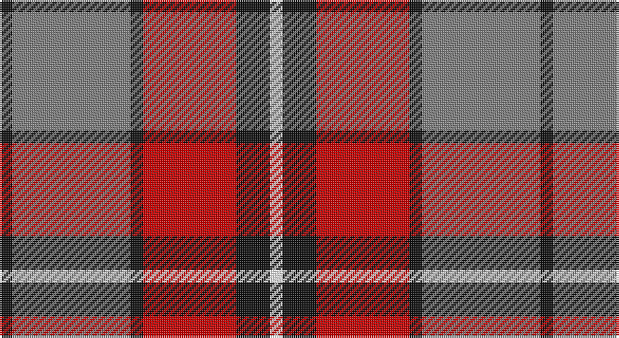

This page is one **sett** — a single exact thread-count. It belongs to the [tartan](/setts/k3y28k3r22k8w3/)
(the same proportion at any scale), whose colour order is pattern [KGKRKW](/stripes/kgkrkw/).

Part of the [Henkel](/tartans/henkel/) tartan — the named design grouping this sett with its other cloths.

Sourced from tartans-authority.  It is a [6 stripe tartan](/stripes/stripes6/).

Original link http://www.tartansauthority.com/tartan-ferret/display/6161/

## Register references

External register numbers recorded for this tartan.

- Scottish Tartans Authority (ITI): 6161

## Thread count
K/6 N56 K6 R44 K16 W/6

One full sett is **256 threads**.

## Palette

Palette: <strong>Tartan Register</strong>
<table><thead><tr><th>Colour</th><th>Threads</th><th>Shade</th><th>Base</th><th>OKLCh</th></tr></thead><tbody><tr><td>K/</td><td style="text-align:right;font-variant-numeric:tabular-nums">6</td><td><code style="background-color:#101010;">#101010</code> <small style="color:#888">#101010</small></td><td>K <code style="background-color:#000000;">#000000</code></td><td><small style="color:#888">oklch(17.3% 0.000 89.9)</small></td></tr><tr><td>N</td><td style="text-align:right;font-variant-numeric:tabular-nums">56</td><td><code style="background-color:#808080;">#808080</code> <small style="color:#888">#808080</small></td><td>G <code style="background-color:#006100;">#006100</code></td><td><small style="color:#888">oklch(60.0% 0.000 89.9)</small></td></tr><tr><td>K</td><td style="text-align:right;font-variant-numeric:tabular-nums">6</td><td><code style="background-color:#101010;">#101010</code> <small style="color:#888">#101010</small></td><td>K <code style="background-color:#000000;">#000000</code></td><td><small style="color:#888">oklch(17.3% 0.000 89.9)</small></td></tr><tr><td>R</td><td style="text-align:right;font-variant-numeric:tabular-nums">44</td><td><code style="background-color:#C80000;">#C80000</code> <small style="color:#888">#C80000</small></td><td>R <code style="background-color:#CC0000;">#CC0000</code></td><td><small style="color:#888">oklch(52.3% 0.215 29.2)</small></td></tr><tr><td>K</td><td style="text-align:right;font-variant-numeric:tabular-nums">16</td><td><code style="background-color:#101010;">#101010</code> <small style="color:#888">#101010</small></td><td>K <code style="background-color:#000000;">#000000</code></td><td><small style="color:#888">oklch(17.3% 0.000 89.9)</small></td></tr><tr><td>W/</td><td style="text-align:right;font-variant-numeric:tabular-nums">6</td><td><code style="background-color:#FCFCFC;">#FCFCFC</code> <small style="color:#888">#FCFCFC</small></td><td>W <code style="background-color:#F7F7F7;">#F7F7F7</code></td><td><small style="color:#888">oklch(99.1% 0.000 89.9)</small></td></tr></tbody></table>

# Sample pattern

## Compared to the master

This cloth is one sett of its design; the master sett (the exemplar the design is anchored on) is below for comparison.

<figure style="margin:0"><figcaption style="color:#888;font-size:smaller">this sett</figcaption></figure>
<figure style="margin:0"><figcaption style="color:#888;font-size:smaller"><a href="/setts/y28k3r22k8w3k8r22k3y28k3/">master sett →</a></figcaption></figure>

## Nearest tartans

The nearest existing variants by ΔTartan distance, with this tartan at the top so the swatches line up against it.

ΔTartan

Tartan

Sett

—

<a href="/ttd/edit/#slug=k3y28k3r22k8w3~x2">Henkel (Corporate)</a> <a class="nn-out" href="/variants/s6/k3y28k3r22k8w3~x2/" title="open its dictionary page">↗</a>

0.76

<a href="/ttd/edit/#slug=t2r12db2t6k6t1~x2&amp;base=k3y28k3r22k8w3~x2">MacTavish Thomson Clan Tartan</a> <a class="nn-out" href="/variants/s6/t2r12db2t6k6t1~x2/" title="open its dictionary page">↗</a>

0.79

<a href="/ttd/edit/#slug=t2r12db2t6k6t1~x4&amp;base=k3y28k3r22k8w3~x2">Thompson/Thomson/MacTavish</a> <a class="nn-out" href="/variants/s6/t2r12db2t6k6t1~x4/" title="open its dictionary page">↗</a>

0.89

<a href="/ttd/edit/#slug=w6g15db18r30g2r4~x2&amp;base=k3y28k3r22k8w3~x2">Ruthven (V.S.)</a> <a class="nn-out" href="/variants/s6/w6g15db18r30g2r4~x2/" title="open its dictionary page">↗</a>

0.95

<a href="/ttd/edit/#slug=db8r8dg17w3r35db10dg15w3~x2&amp;base=k3y28k3r22k8w3~x2">James of Glencarr (Personal)</a> <a class="nn-out" href="/variants/s8/db8r8dg17w3r35db10dg15w3~x2/" title="open its dictionary page">↗</a>

0.97

<a href="/ttd/edit/#slug=r3y27k6lo13k14r3~x2&amp;base=k3y28k3r22k8w3~x2">Thompson/Thomson/MacTavish special grey</a> <a class="nn-out" href="/variants/s6/r3y27k6lo13k14r3~x2/" title="open its dictionary page">↗</a>

1.06

<a href="/ttd/edit/#slug=dp8r3ly1r3g14r3ly1~x4&amp;base=k3y28k3r22k8w3~x2">Logan with Yellow</a> <a class="nn-out" href="/variants/s7/dp8r3ly1r3g14r3ly1~x4/" title="open its dictionary page">↗</a>

1.08

<a href="/ttd/edit/#slug=t4r28k6t12k12t3~x2&amp;base=k3y28k3r22k8w3~x2">Thomson, Red (Name)</a> <a class="nn-out" href="/variants/s6/t4r28k6t12k12t3~x2/" title="open its dictionary page">↗</a>

1.08

<a href="/ttd/edit/#slug=dp9ri4dp1ri4g15r4dp1~x2&amp;base=k3y28k3r22k8w3~x2">Logan Light</a> <a class="nn-out" href="/variants/s7/dp9ri4dp1ri4g15r4dp1~x2/" title="open its dictionary page">↗</a>

1.09

<a href="/ttd/edit/#slug=p9r4p1r4g15ri4p1~x2&amp;base=k3y28k3r22k8w3~x2">Logan, Light</a> <a class="nn-out" href="/variants/s7/p9r4p1r4g15ri4p1~x2/" title="open its dictionary page">↗</a>

1.09

<a href="/ttd/edit/#slug=w2db3r24db15w6db3ly2~x2&amp;base=k3y28k3r22k8w3~x2">Fazzolettone (Fashion?)</a> <a class="nn-out" href="/variants/s7/w2db3r24db15w6db3ly2~x2/" title="open its dictionary page">↗</a>

## Neighbour map

Every grey dot is one of 14360 variants placed by the first two principal components of the ΔTartan feature space (44% of its variance). Red is this tartan; blue dots are its nearest — click one to open its page.

<svg viewBox="0 0 640 380" role="img" style="max-width:100%;height:auto;border:1px solid #e0e0e0;border-radius:4px;display:block" xmlns="http://www.w3.org/2000/svg"><image href="/nn/cloud.v1.png" width="640" height="380"/><a href="/variants/s6/t2r12db2t6k6t1~x2/"><circle cx="220.0" cy="195.5" r="4" fill="#3465a4"><title>MacTavish Thomson Clan Tartan</title></circle></a><a href="/variants/s6/t2r12db2t6k6t1~x4/"><circle cx="215.9" cy="193.1" r="4" fill="#3465a4"><title>Thompson/Thomson/MacTavish</title></circle></a><a href="/variants/s6/w6g15db18r30g2r4~x2/"><circle cx="241.1" cy="185.6" r="4" fill="#3465a4"><title>Ruthven (V.S.)</title></circle></a><a href="/variants/s8/db8r8dg17w3r35db10dg15w3~x2/"><circle cx="227.4" cy="186.0" r="4" fill="#3465a4"><title>James of Glencarr (Personal)</title></circle></a><a href="/variants/s6/r3y27k6lo13k14r3~x2/"><circle cx="191.8" cy="207.7" r="4" fill="#3465a4"><title>Thompson/Thomson/MacTavish special grey</title></circle></a><a href="/variants/s7/dp8r3ly1r3g14r3ly1~x4/"><circle cx="246.7" cy="178.7" r="4" fill="#3465a4"><title>Logan with Yellow</title></circle></a><a href="/variants/s6/t4r28k6t12k12t3~x2/"><circle cx="242.5" cy="218.2" r="4" fill="#3465a4"><title>Thomson, Red (Name)</title></circle></a><a href="/variants/s7/dp9ri4dp1ri4g15r4dp1~x2/"><circle cx="209.9" cy="173.7" r="4" fill="#3465a4"><title>Logan Light</title></circle></a><a href="/variants/s7/p9r4p1r4g15ri4p1~x2/"><circle cx="218.0" cy="174.3" r="4" fill="#3465a4"><title>Logan, Light</title></circle></a><a href="/variants/s7/w2db3r24db15w6db3ly2~x2/"><circle cx="239.4" cy="159.2" r="4" fill="#3465a4"><title>Fazzolettone (Fashion?)</title></circle></a><circle cx="222.1" cy="190.4" r="5" fill="#c00000"/></svg>

ID: /variants/s6/k3y28k3r22k8w3~x2/
