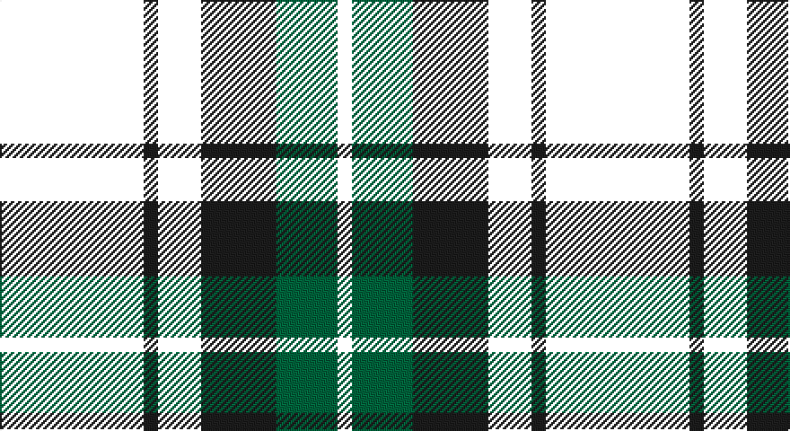

This page is one **sett** — a single exact thread-count. It belongs to the [tartan](/setts/k40dt4k12dt21g17k4/)
(the same proportion at any scale), whose colour order is pattern [KBKBGK](/stripes/kbkbgk/).

Part of the [Granger](/tartans/granger/) tartan — the named design grouping this sett with its other cloths.

Sourced from house-of-tartan.  It is a [6 stripe tartan](/stripes/stripes6/).

Original link http://www.house-of-tartan.scotland.net/house/TartanViewjs.asp?colr=Def&tnam=2226

## Provenance

Earliest known date: 1994 Designed by Steve Granger as a private family tartan.

## Thread count
B/80 K8 B24 K42 G34 W/8

One full sett is **304 threads**.

## Palette

Palette: <strong>Tartan Register</strong> <small style="color:#888">(3 of 5 colours)</small>
<table><thead><tr><th>Colour</th><th>Threads</th><th>Shade</th><th>Base</th><th>OKLCh</th></tr></thead><tbody><tr><td>/</td><td style="text-align:right;font-variant-numeric:tabular-nums">80</td><td><code style="background-color:;"></code> <small style="color:#888"></small></td><td> <code style="background-color:;"></code></td><td><small style="color:#888"></small></td></tr><tr><td>K</td><td style="text-align:right;font-variant-numeric:tabular-nums">8</td><td><code style="background-color:#1C1C1C;">#1C1C1C</code> <small style="color:#888">#1C1C1C</small></td><td>B <code style="background-color:#2A418A;">#2A418A</code></td><td><small style="color:#888">oklch(22.6% 0.000 89.9)</small></td></tr><tr><td></td><td style="text-align:right;font-variant-numeric:tabular-nums">24</td><td><code style="background-color:;"></code> <small style="color:#888"></small></td><td> <code style="background-color:;"></code></td><td><small style="color:#888"></small></td></tr><tr><td>K</td><td style="text-align:right;font-variant-numeric:tabular-nums">42</td><td><code style="background-color:#1C1C1C;">#1C1C1C</code> <small style="color:#888">#1C1C1C</small></td><td>B <code style="background-color:#2A418A;">#2A418A</code></td><td><small style="color:#888">oklch(22.6% 0.000 89.9)</small></td></tr><tr><td>G</td><td style="text-align:right;font-variant-numeric:tabular-nums">34</td><td><code style="background-color:#00643C;">#00643C</code> <small style="color:#888">#00643C</small></td><td>G <code style="background-color:#006100;">#006100</code></td><td><small style="color:#888">oklch(44.3% 0.104 157.7)</small></td></tr><tr><td>/</td><td style="text-align:right;font-variant-numeric:tabular-nums">8</td><td><code style="background-color:;"></code> <small style="color:#888"></small></td><td> <code style="background-color:;"></code></td><td><small style="color:#888"></small></td></tr></tbody></table>

# Sample pattern

## Compared to the master

This cloth is one sett of its design; the master sett (the exemplar the design is anchored on) is below for comparison.

<figure style="margin:0"><figcaption style="color:#888;font-size:smaller">this sett</figcaption></figure>
<figure style="margin:0"><figcaption style="color:#888;font-size:smaller"><a href="/setts/db40k4db12k21g27w4/">master sett →</a></figcaption></figure>

## Nearest tartans

The nearest existing variants by ΔTartan distance, with this tartan at the top so the swatches line up against it.

ΔTartan

Tartan

Sett

—

<a href="/ttd/edit/#slug=k40dt4k12dt21g17k4~x2">Granger Family Tartan</a> <a class="nn-out" href="/variants/s6/k40dt4k12dt21g17k4~x2/" title="open its dictionary page">↗</a>

1.24

<a href="/variants/s9/k15n2k5n5ki18y5k5y2k15~x2/">Laois Irish County Tartan</a>

1.26

<a href="/ttd/edit/#slug=db18k1db2k18ly2dg16k16~x2&amp;base=k40dt4k12dt21g17k4~x2">Mowat</a> <a class="nn-out" href="/variants/s7/db18k1db2k18ly2dg16k16~x2/" title="open its dictionary page">↗</a>

1.28

<a href="/ttd/edit/#slug=dg5k15dg5k15dg19r2dg10b4~x2&amp;base=k40dt4k12dt21g17k4~x2">Strath Halladale (Sutherland)</a> <a class="nn-out" href="/variants/s8/dg5k15dg5k15dg19r2dg10b4~x2/" title="open its dictionary page">↗</a>

1.31

<a href="/variants/s6/dg26ki3dg12k10dp15w2~x2/">Lossiemouth/Hersbruck</a>

1.35

<a href="/ttd/edit/#slug=db1k6db6k6dg6k1lr1~x2&amp;base=k40dt4k12dt21g17k4~x2">Forbes LC</a> <a class="nn-out" href="/variants/s7/db1k6db6k6dg6k1lr1~x2/" title="open its dictionary page">↗</a>

1.35

<a href="/ttd/edit/#slug=db1k6db6k6dg6k1lr1&amp;base=k40dt4k12dt21g17k4~x2">Forbes LC</a> <a class="nn-out" href="/variants/s7/db1k6db6k6dg6k1lr1/" title="open its dictionary page">↗</a>

1.38

<a href="/ttd/edit/#slug=db18k1db2k18ly2dg16k16&amp;base=k40dt4k12dt21g17k4~x2">Mowat</a> <a class="nn-out" href="/variants/s7/db18k1db2k18ly2dg16k16/" title="open its dictionary page">↗</a>

1.40

<a href="/ttd/edit/#slug=dg8k2b1dg4k6db6k1~x2&amp;base=k40dt4k12dt21g17k4~x2">MacCallum</a> <a class="nn-out" href="/variants/s7/dg8k2b1dg4k6db6k1~x2/" title="open its dictionary page">↗</a>

1.44

<a href="/ttd/edit/#slug=k42w5dg16k5k5db21~x2&amp;base=k40dt4k12dt21g17k4~x2">Givens (Arizona)</a> <a class="nn-out" href="/variants/s6/k42w5dg16k5k5db21~x2/" title="open its dictionary page">↗</a>

1.45

<a href="/ttd/edit/#slug=k42w5k5dg16k5db21~x2&amp;base=k40dt4k12dt21g17k4~x2">Givens (Arizona)</a> <a class="nn-out" href="/variants/s6/k42w5k5dg16k5db21~x2/" title="open its dictionary page">↗</a>

## Neighbour map

Every grey dot is one of 14360 variants placed by the first two principal components of the ΔTartan feature space (44% of its variance). Red is this tartan; blue dots are its nearest — click one to open its page.

<svg viewBox="0 0 640 380" role="img" style="max-width:100%;height:auto;border:1px solid #e0e0e0;border-radius:4px;display:block" xmlns="http://www.w3.org/2000/svg"><image href="/nn/cloud.v1.png" width="640" height="380"/><a href="/variants/s9/k15n2k5n5ki18y5k5y2k15~x2/"><circle cx="278.6" cy="232.4" r="4" fill="#3465a4"><title>Laois Irish County Tartan</title></circle></a><a href="/variants/s7/db18k1db2k18ly2dg16k16~x2/"><circle cx="278.4" cy="221.0" r="4" fill="#3465a4"><title>Mowat</title></circle></a><a href="/variants/s8/dg5k15dg5k15dg19r2dg10b4~x2/"><circle cx="281.4" cy="246.2" r="4" fill="#3465a4"><title>Strath Halladale (Sutherland)</title></circle></a><a href="/variants/s6/dg26ki3dg12k10dp15w2~x2/"><circle cx="301.9" cy="229.6" r="4" fill="#3465a4"><title>Lossiemouth/Hersbruck</title></circle></a><a href="/variants/s7/db1k6db6k6dg6k1lr1~x2/"><circle cx="223.1" cy="265.2" r="4" fill="#3465a4"><title>Forbes LC</title></circle></a><a href="/variants/s7/db1k6db6k6dg6k1lr1/"><circle cx="223.1" cy="265.2" r="4" fill="#3465a4"><title>Forbes LC</title></circle></a><a href="/variants/s7/db18k1db2k18ly2dg16k16/"><circle cx="267.7" cy="215.6" r="4" fill="#3465a4"><title>Mowat</title></circle></a><a href="/variants/s7/dg8k2b1dg4k6db6k1~x2/"><circle cx="216.6" cy="257.5" r="4" fill="#3465a4"><title>MacCallum</title></circle></a><a href="/variants/s6/k42w5dg16k5k5db21~x2/"><circle cx="306.2" cy="243.0" r="4" fill="#3465a4"><title>Givens (Arizona)</title></circle></a><a href="/variants/s6/k42w5k5dg16k5db21~x2/"><circle cx="309.2" cy="245.8" r="4" fill="#3465a4"><title>Givens (Arizona)</title></circle></a><circle cx="300.7" cy="252.3" r="5" fill="#c00000"/></svg>

ID: /variants/s6/k40dt4k12dt21g17k4~x2/
