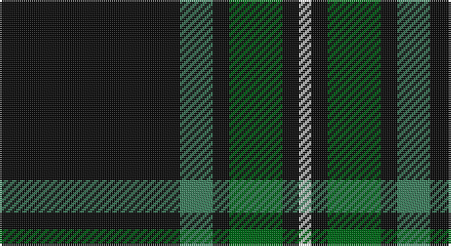

This page is one **sett** — a single exact thread-count. It belongs to the [tartan](/setts/k44g8k4gi13k4w3/)
(the same proportion at any scale), whose colour order is pattern [KGKGKW](/stripes/kgkgkw/).

Part of the [Childers](/tartans/childers/) tartan — the named design grouping this sett with its other cloths.

Sourced from tartans-authority.  It is a [6 stripe tartan](/stripes/stripes6/).

Original link http://www.tartansauthority.com/tartan-ferret/display/3861/

## Register references

External register numbers recorded for this tartan.

- Scottish Tartans Authority (ITI): 3861

## Thread count
K/88 G16 K8 Ga26 K8 LN/6

One full sett is **210 threads**.

## Palette

Palette: <strong>Tartan Register</strong>
<table><thead><tr><th>Colour</th><th>Threads</th><th>Shade</th><th>Base</th><th>OKLCh</th></tr></thead><tbody><tr><td>K/</td><td style="text-align:right;font-variant-numeric:tabular-nums">88</td><td><code style="background-color:#101010;">#101010</code> <small style="color:#888">#101010</small></td><td>K <code style="background-color:#000000;">#000000</code></td><td><small style="color:#888">oklch(17.3% 0.000 89.9)</small></td></tr><tr><td>G</td><td style="text-align:right;font-variant-numeric:tabular-nums">16</td><td><code style="background-color:#408060;">#408060</code> <small style="color:#888">#408060</small></td><td>G <code style="background-color:#006100;">#006100</code></td><td><small style="color:#888">oklch(54.8% 0.084 160.1)</small></td></tr><tr><td>K</td><td style="text-align:right;font-variant-numeric:tabular-nums">8</td><td><code style="background-color:#101010;">#101010</code> <small style="color:#888">#101010</small></td><td>K <code style="background-color:#000000;">#000000</code></td><td><small style="color:#888">oklch(17.3% 0.000 89.9)</small></td></tr><tr><td>Ga</td><td style="text-align:right;font-variant-numeric:tabular-nums">26</td><td><code style="background-color:#006818;">#006818</code> <small style="color:#888">#006818</small></td><td>G <code style="background-color:#006100;">#006100</code></td><td><small style="color:#888">oklch(45.0% 0.142 145.0)</small></td></tr><tr><td>K</td><td style="text-align:right;font-variant-numeric:tabular-nums">8</td><td><code style="background-color:#101010;">#101010</code> <small style="color:#888">#101010</small></td><td>K <code style="background-color:#000000;">#000000</code></td><td><small style="color:#888">oklch(17.3% 0.000 89.9)</small></td></tr><tr><td>LN/</td><td style="text-align:right;font-variant-numeric:tabular-nums">6</td><td><code style="background-color:#E0E0E0;">#E0E0E0</code> <small style="color:#888">#E0E0E0</small></td><td>W <code style="background-color:#F7F7F7;">#F7F7F7</code></td><td><small style="color:#888">oklch(90.7% 0.000 89.9)</small></td></tr></tbody></table>

# Sample pattern

## Compared to the master

This cloth is one sett of its design; the master sett (the exemplar the design is anchored on) is below for comparison.

<figure style="margin:0"><figcaption style="color:#888;font-size:smaller">this sett</figcaption></figure>
<figure style="margin:0"><figcaption style="color:#888;font-size:smaller"><a href="/setts/k4gi13k4g8k44g8k4gi13k4w3/">master sett →</a></figcaption></figure>

## Nearest tartans

The nearest existing variants by ΔTartan distance, with this tartan at the top so the swatches line up against it.

ΔTartan

Tartan

Sett

—

<a href="/ttd/edit/#slug=k44g8k4gi13k4w3~x2">Childers (Personal)</a> <a class="nn-out" href="/variants/s6/k44g8k4gi13k4w3~x2/" title="open its dictionary page">↗</a>

0.42

<a href="/ttd/edit/#slug=k88g17k8gi28k8r6~x2&amp;base=k44g8k4gi13k4w3~x2">Childers Regimental Tartan</a> <a class="nn-out" href="/variants/s6/k88g17k8gi28k8r6~x2/" title="open its dictionary page">↗</a>

1.31

<a href="/ttd/edit/#slug=k62dt24lo5w3~x2&amp;base=k44g8k4gi13k4w3~x2">Perry (Calgary), Alex (Personal)</a> <a class="nn-out" href="/variants/s4/k62dt24lo5w3~x2/" title="open its dictionary page">↗</a>

1.33

<a href="/ttd/edit/#slug=r1dg16k8dg3k4ly1~x2&amp;base=k44g8k4gi13k4w3~x2">Forbes VS</a> <a class="nn-out" href="/variants/s6/r1dg16k8dg3k4ly1~x2/" title="open its dictionary page">↗</a>

1.36

<a href="/ttd/edit/#slug=k88dg17k8y28k8r6&amp;base=k44g8k4gi13k4w3~x2">Childers (Gurkha Rifles) (Military)</a> <a class="nn-out" href="/variants/s6/k88dg17k8y28k8r6/" title="open its dictionary page">↗</a>

1.36

<a href="/ttd/edit/#slug=k36w3k10w3g28r6k18~x2&amp;base=k44g8k4gi13k4w3~x2">Wild Highlanders (Corporate)</a> <a class="nn-out" href="/variants/s7/k36w3k10w3g28r6k18~x2/" title="open its dictionary page">↗</a>

1.37

<a href="/ttd/edit/#slug=k61gi10g20w4~x2&amp;base=k44g8k4gi13k4w3~x2">Wesley Owen 2010 (Personal)</a> <a class="nn-out" href="/variants/s4/k61gi10g20w4~x2/" title="open its dictionary page">↗</a>

1.41

<a href="/ttd/edit/#slug=r3n12k50ly3~x2&amp;base=k44g8k4gi13k4w3~x2">Rogues (United States), The</a> <a class="nn-out" href="/variants/s4/r3n12k50ly3~x2/" title="open its dictionary page">↗</a>

1.42

<a href="/ttd/edit/#slug=y14k80y14ly5~x2&amp;base=k44g8k4gi13k4w3~x2">Westgate Fashion Tartan</a> <a class="nn-out" href="/variants/s4/y14k80y14ly5~x2/" title="open its dictionary page">↗</a>

1.42

<a href="/ttd/edit/#slug=oi4n6k4o8k49oi2&amp;base=k44g8k4gi13k4w3~x2">Harley Davidson (Corporate)</a> <a class="nn-out" href="/variants/s6/oi4n6k4o8k49oi2/" title="open its dictionary page">↗</a>

1.42

<a href="/ttd/edit/#slug=r3t12k50ly3~x2&amp;base=k44g8k4gi13k4w3~x2">Rogues, The (Corporate)</a> <a class="nn-out" href="/variants/s4/r3t12k50ly3~x2/" title="open its dictionary page">↗</a>

## Neighbour map

Every grey dot is one of 14360 variants placed by the first two principal components of the ΔTartan feature space (44% of its variance). Red is this tartan; blue dots are its nearest — click one to open its page.

<svg viewBox="0 0 640 380" role="img" style="max-width:100%;height:auto;border:1px solid #e0e0e0;border-radius:4px;display:block" xmlns="http://www.w3.org/2000/svg"><image href="/nn/cloud.v1.png" width="640" height="380"/><a href="/variants/s6/k88g17k8gi28k8r6~x2/"><circle cx="408.9" cy="197.5" r="4" fill="#3465a4"><title>Childers Regimental Tartan</title></circle></a><a href="/variants/s4/k62dt24lo5w3~x2/"><circle cx="420.9" cy="204.1" r="4" fill="#3465a4"><title>Perry (Calgary), Alex (Personal)</title></circle></a><a href="/variants/s6/r1dg16k8dg3k4ly1~x2/"><circle cx="352.9" cy="205.1" r="4" fill="#3465a4"><title>Forbes VS</title></circle></a><a href="/variants/s6/k88dg17k8y28k8r6/"><circle cx="397.8" cy="194.5" r="4" fill="#3465a4"><title>Childers (Gurkha Rifles) (Military)</title></circle></a><a href="/variants/s7/k36w3k10w3g28r6k18~x2/"><circle cx="328.7" cy="209.9" r="4" fill="#3465a4"><title>Wild Highlanders (Corporate)</title></circle></a><a href="/variants/s4/k61gi10g20w4~x2/"><circle cx="360.4" cy="212.1" r="4" fill="#3465a4"><title>Wesley Owen 2010 (Personal)</title></circle></a><a href="/variants/s4/r3n12k50ly3~x2/"><circle cx="465.1" cy="201.0" r="4" fill="#3465a4"><title>Rogues (United States), The</title></circle></a><a href="/variants/s4/y14k80y14ly5~x2/"><circle cx="475.0" cy="230.3" r="4" fill="#3465a4"><title>Westgate Fashion Tartan</title></circle></a><a href="/variants/s6/oi4n6k4o8k49oi2/"><circle cx="488.8" cy="164.8" r="4" fill="#3465a4"><title>Harley Davidson (Corporate)</title></circle></a><a href="/variants/s4/r3t12k50ly3~x2/"><circle cx="455.3" cy="196.8" r="4" fill="#3465a4"><title>Rogues, The (Corporate)</title></circle></a><circle cx="412.8" cy="193.5" r="5" fill="#c00000"/></svg>

ID: /variants/s6/k44g8k4gi13k4w3~x2/
