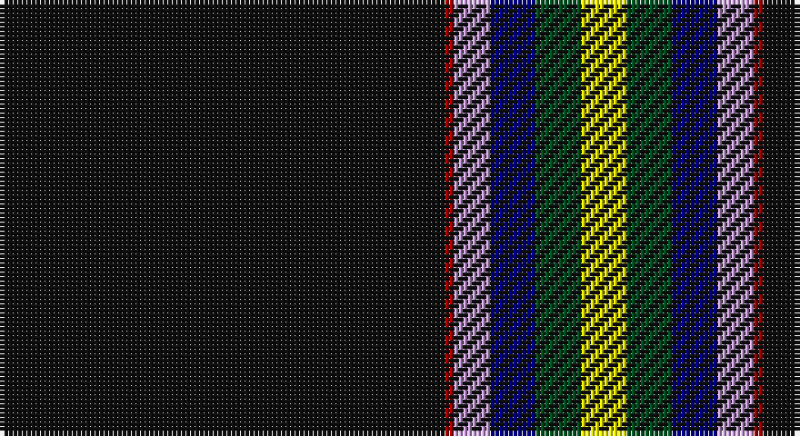

This page is one **sett** — a single exact thread-count. It belongs to the [tartan](/setts/k49r1lp4db5dg5ly5/)
(the same proportion at any scale), whose colour order is pattern [KRWBGY](/stripes/krwbgy/).

Sourced from register-of-tartans.  It is a [6 stripe tartan](/stripes/stripes6/).

Original link https://www.tartanregister.gov.uk/tartanDetails.aspx?ref=11327

## Register references

External register numbers recorded for this tartan.

- Scottish Register of Tartans: [11327](https://www.tartanregister.gov.uk/tartanDetails.aspx?ref=11327)

## Thread count
K/98 DR2 LP8 DB10 G10 Y/10

One full sett is **168 threads**.

## Palette

Palette: <strong>Tartan Register</strong> <small style="color:#888">(5 of 6 colours)</small>
<table><thead><tr><th>Colour</th><th>Threads</th><th>Shade</th><th>Base</th><th>OKLCh</th></tr></thead><tbody><tr><td>K/</td><td style="text-align:right;font-variant-numeric:tabular-nums">98</td><td><code style="background-color:#101010;">#101010</code> <small style="color:#888">#101010</small></td><td>K <code style="background-color:#000000;">#000000</code></td><td><small style="color:#888">oklch(17.3% 0.000 89.9)</small></td></tr><tr><td>DR</td><td style="text-align:right;font-variant-numeric:tabular-nums">2</td><td><code style="background-color:#A00000;">#A00000</code> <small style="color:#888">#A00000</small></td><td>R <code style="background-color:#CC0000;">#CC0000</code></td><td><small style="color:#888">oklch(44.3% 0.182 29.2)</small></td></tr><tr><td>LP</td><td style="text-align:right;font-variant-numeric:tabular-nums">8</td><td><code style="background-color:#C49CD8;">#C49CD8</code> <small style="color:#888">#C49CD8</small></td><td>W <code style="background-color:#F7F7F7;">#F7F7F7</code></td><td><small style="color:#888">oklch(75.0% 0.095 314.2)</small></td></tr><tr><td>DB</td><td style="text-align:right;font-variant-numeric:tabular-nums">10</td><td><code style="background-color:#000080;">#000080</code> <small style="color:#888">#000080</small></td><td>B <code style="background-color:#2A418A;">#2A418A</code></td><td><small style="color:#888">oklch(27.1% 0.188 264.1)</small></td></tr><tr><td>G</td><td style="text-align:right;font-variant-numeric:tabular-nums">10</td><td><code style="background-color:#005020;">#005020</code> <small style="color:#888">#005020</small></td><td>G <code style="background-color:#006100;">#006100</code></td><td><small style="color:#888">oklch(37.7% 0.105 149.6)</small></td></tr><tr><td>Y/</td><td style="text-align:right;font-variant-numeric:tabular-nums">10</td><td><code style="background-color:#FFFF00;">#FFFF00</code> <small style="color:#888">#FFFF00</small></td><td>Y <code style="background-color:#F2BF00;">#F2BF00</code></td><td><small style="color:#888">oklch(96.8% 0.211 109.8)</small></td></tr></tbody></table>

# Sample pattern

## Nearest tartans

The nearest existing variants by ΔTartan distance, with this tartan at the top so the swatches line up against it.

ΔTartan

Tartan

Sett

—

<a href="/ttd/edit/#slug=k49r1lp4db5dg5ly5~x2">CREATeGlasgow</a> <a class="nn-out" href="/variants/s6/k49r1lp4db5dg5ly5~x2/" title="open its dictionary page">↗</a>

0.78

<a href="/ttd/edit/#slug=k75r10g7ly3db2w5~x2&amp;base=k49r1lp4db5dg5ly5~x2">Charlotte Fire Department</a> <a class="nn-out" href="/variants/s6/k75r10g7ly3db2w5~x2/" title="open its dictionary page">↗</a>

0.82

<a href="/ttd/edit/#slug=k78r10dg7ly3t2w5~x2&amp;base=k49r1lp4db5dg5ly5~x2">Charlotte Fire Department</a> <a class="nn-out" href="/variants/s6/k78r10dg7ly3t2w5~x2/" title="open its dictionary page">↗</a>

1.16

<a href="/ttd/edit/#slug=t6k6t6db3w1k39ly3k3~x2&amp;base=k49r1lp4db5dg5ly5~x2">Washington County Sheriff’s Office (Oregon)</a> <a class="nn-out" href="/variants/s8/t6k6t6db3w1k39ly3k3~x2/" title="open its dictionary page">↗</a>

1.21

<a href="/ttd/edit/#slug=lb6k6lb6b3w1k39lo3k3~x2&amp;base=k49r1lp4db5dg5ly5~x2">Washington County Sheriff's Office</a> <a class="nn-out" href="/variants/s8/lb6k6lb6b3w1k39lo3k3~x2/" title="open its dictionary page">↗</a>

1.39

<a href="/ttd/edit/#slug=dg60w11r5b5k1lo4~x2&amp;base=k49r1lp4db5dg5ly5~x2">Christie Hunting (London) (Personal)</a> <a class="nn-out" href="/variants/s6/dg60w11r5b5k1lo4~x2/" title="open its dictionary page">↗</a>

1.40

<a href="/ttd/edit/#slug=g3db16k3p2k45r1k2lo3~x2&amp;base=k49r1lp4db5dg5ly5~x2">Cumnock</a> <a class="nn-out" href="/variants/s8/g3db16k3p2k45r1k2lo3~x2/" title="open its dictionary page">↗</a>

1.44

<a href="/ttd/edit/#slug=dy3k48dy5w3dy3g2gi5lb3~x2&amp;base=k49r1lp4db5dg5ly5~x2">Pavelka Ltd</a> <a class="nn-out" href="/variants/s8/dy3k48dy5w3dy3g2gi5lb3~x2/" title="open its dictionary page">↗</a>

1.52

<a href="/ttd/edit/#slug=g3db16k3dp2k45r1k2lo3~x2&amp;base=k49r1lp4db5dg5ly5~x2">Cumnock (District)</a> <a class="nn-out" href="/variants/s8/g3db16k3dp2k45r1k2lo3~x2/" title="open its dictionary page">↗</a>

1.54

<a href="/ttd/edit/#slug=w3k48lo5w3lo3gi2g5lt3~x2&amp;base=k49r1lp4db5dg5ly5~x2">Pavelka Limited</a> <a class="nn-out" href="/variants/s8/w3k48lo5w3lo3gi2g5lt3~x2/" title="open its dictionary page">↗</a>

1.65

<a href="/ttd/edit/#slug=r5k1w3k6n5k2ly3k45n4k2ly3~x2&amp;base=k49r1lp4db5dg5ly5~x2">Williams Dress (Personal)</a> <a class="nn-out" href="/variants/s11/r5k1w3k6n5k2ly3k45n4k2ly3~x2/" title="open its dictionary page">↗</a>

## Neighbour map

Every grey dot is one of 14360 variants placed by the first two principal components of the ΔTartan feature space (44% of its variance). Red is this tartan; blue dots are its nearest — click one to open its page.

<svg viewBox="0 0 640 380" role="img" style="max-width:100%;height:auto;border:1px solid #e0e0e0;border-radius:4px;display:block" xmlns="http://www.w3.org/2000/svg"><image href="/nn/cloud.v1.png" width="640" height="380"/><a href="/variants/s6/k75r10g7ly3db2w5~x2/"><circle cx="454.5" cy="97.1" r="4" fill="#3465a4"><title>Charlotte Fire Department</title></circle></a><a href="/variants/s6/k78r10dg7ly3t2w5~x2/"><circle cx="460.1" cy="93.5" r="4" fill="#3465a4"><title>Charlotte Fire Department</title></circle></a><a href="/variants/s8/t6k6t6db3w1k39ly3k3~x2/"><circle cx="446.4" cy="105.7" r="4" fill="#3465a4"><title>Washington County Sheriff’s Office (Oregon)</title></circle></a><a href="/variants/s8/lb6k6lb6b3w1k39lo3k3~x2/"><circle cx="437.2" cy="99.2" r="4" fill="#3465a4"><title>Washington County Sheriff's Office</title></circle></a><a href="/variants/s6/dg60w11r5b5k1lo4~x2/"><circle cx="419.4" cy="87.2" r="4" fill="#3465a4"><title>Christie Hunting (London) (Personal)</title></circle></a><a href="/variants/s8/g3db16k3p2k45r1k2lo3~x2/"><circle cx="415.0" cy="86.6" r="4" fill="#3465a4"><title>Cumnock</title></circle></a><a href="/variants/s8/dy3k48dy5w3dy3g2gi5lb3~x2/"><circle cx="386.8" cy="98.2" r="4" fill="#3465a4"><title>Pavelka Ltd</title></circle></a><a href="/variants/s8/g3db16k3dp2k45r1k2lo3~x2/"><circle cx="438.3" cy="96.2" r="4" fill="#3465a4"><title>Cumnock (District)</title></circle></a><a href="/variants/s8/w3k48lo5w3lo3gi2g5lt3~x2/"><circle cx="362.0" cy="85.9" r="4" fill="#3465a4"><title>Pavelka Limited</title></circle></a><a href="/variants/s11/r5k1w3k6n5k2ly3k45n4k2ly3~x2/"><circle cx="444.6" cy="69.1" r="4" fill="#3465a4"><title>Williams Dress (Personal)</title></circle></a><circle cx="432.9" cy="90.5" r="5" fill="#c00000"/></svg>

ID: /variants/s6/k49r1lp4db5dg5ly5~x2/
