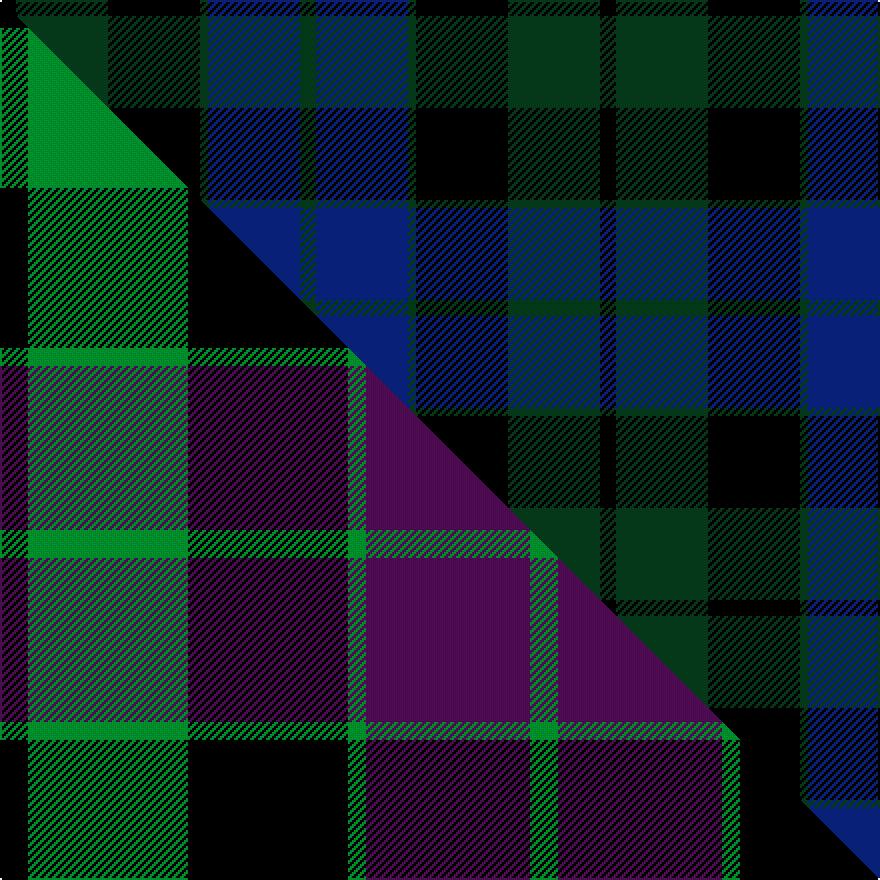

This is one **variant** — a specific cloth: this exact thread count and colourway, with its own
provenance below. It is one weaving of the [sett](/tartans/m/ma/mackay-3/) (the scale-free proportion — the
same cloth at any scale or shade), whose colour order is pattern [GBGKGK](/stripes/gbgkgk/).

Part of the [MacKay](/tartans/m/ma/mackay-3/) tartan — the named design grouping this sett with its other cloths.

Sourced from tartans-authority.  It is a [6 stripe tartan](/stripes/stripes6/).

Original link <code>http://www.tartansauthority.com/tartan-ferret/display/703/</code> — retired · [Internet Archive copy](https://web.archive.org/web/*/http://www.tartansauthority.com/tartan-ferret/display/703/*)

Dataset <small>— provenance for this record, inherited from the source manifest</small>

<dl class="dataset-prov">
<dt>source</dt><dd><a href="/sources/tartans-authority/">Scottish Tartans Authority</a></dd>
<dt>data captured from</dt><dd><a href="https://github.com/thetartan/tartan-database/blob/master/data/tartans-authority/data.csv">https://github.com/thetartan/tartan-database/blob/master/data/tartans-authority/data.csv</a></dd>
<dt>data date</dt><dd>1819 <small>(this record)</small></dd>
<dt>licence</dt><dd><a href="https://creativecommons.org/licenses/by-nc-nd/4.0/">CC BY-NC-ND 4.0</a></dd>
</dl>

Capture chain <small>— the hands this data passed through, oldest first; each capture carries its own licence</small>

<ol class="capture-chain">
<li><a href="https://www.tartansauthority.com/">Scottish Tartans Authority</a> <small>the heritage body’s archive — its tartan-ferret record browser is retired; dead record links are shown unlinked, with an Internet Archive copy (ITI numbers are not SRT references)</small></li>
<li><a href="https://github.com/thetartan/tartan-database">thetartan/tartan-database</a> <small>2016-2017</small> · <a href="https://creativecommons.org/licenses/by-nc-nd/4.0/">CC BY-NC-ND 4.0</a> <small>Levko Kravets's frozen compilation — the capture we vendored, and where its CC licence text came from</small></li>
<li>this dictionary <small>captured 2026-06-10 · commit 5bf86c7566</small> <small>each re-capture is a git commit to data/sources</small></li>
</ol>

## Register references

External register numbers recorded for this tartan.

- Scottish Tartans Authority (ITI): 703

## Thread count
K/8 DG46 K46 DG4 DB46 DG/8

One full sett is **300 threads**.

## Palette
<table><thead><tr><th>Colour</th><th>Shade</th><th>OKLCh</th></tr></thead><tbody><tr><td>DG</td><td><code style="background-color:#053819;">#053819</code> <small style="color:#888">#053819</small></td><td><small style="color:#888">oklch(30.0% 0.075 151.3)</small></td></tr><tr><td>K</td><td><code style="background-color:#000000;">#000000</code> <small style="color:#888">#000000</small></td><td><small style="color:#888">oklch(0.0% 0.000 0.0)</small></td></tr><tr><td>DB</td><td><code style="background-color:#082077;">#082077</code> <small style="color:#888">#082077</small></td><td><small style="color:#888">oklch(30.0% 0.149 265.1)</small></td></tr></tbody></table>

# Sample pattern

[Sample sheet (PDF)](swatch.pdf) — the woven sample, thread count and palette on one printable A4, rendered on demand (the same sheet the TTD print page downloads).

## Compared to the master

This cloth is one sett of its design; the master sett (the exemplar the design is anchored on) is below for comparison.

Its **ΔTartan distance** from the master is **1.29** — the same measure the nearest-tartans table ranks by (0 is identical; a re-scale of the same cloth is near 0, a recolour or a different proportion further).

<figure class="master-compare" style="margin:0">

this sett
master sett ★

<figcaption style="color:#888;font-size:smaller">One weave of this sett against the <a href="/setts/k14g80k80g9dp82g14/">master sett ★</a>, split on the diagonal: a shared proportion runs seamlessly across it with only the shades shifting; a different proportion breaks on it.</figcaption>
</figure>

## Nearest tartan variants

The nearest existing variants by ΔTartan distance, with this cloth at the top so the swatches line up against it.

ΔTartan

Threads

Variant

Sett

—

300

<a href="/variants/s6/k4dg23k23dg2db23dg4~x2/">MacKay - 1800 (Clan)</a>

<a href="/ttd/edit/#slug=dg2db12dg1k12dg12r2~x2&amp;base=k4dg23k23dg2db23dg4~x2" title="compare in the TTD">1.13</a>

156

<a href="/variants/s6/dg2db12dg1k12dg12r2~x2/">Gunn</a>

<a href="/ttd/edit/#slug=dg7db1dg1k4dp4k1~x4&amp;base=k4dg23k23dg2db23dg4~x2" title="compare in the TTD">1.79</a>

112

<a href="/variants/s6/dg7db1dg1k4dp4k1~x4/">MacArthur of Milton Hunting</a>

<a href="/ttd/edit/#slug=dr3dg2dr6dg20k15dg3db18w2~x2&amp;base=k4dg23k23dg2db23dg4~x2" title="compare in the TTD">2.05</a>

266

<a href="/variants/s8/dr3dg2dr6dg20k15dg3db18w2~x2/">Curry (Irish) (Name)</a>

<a href="/ttd/edit/#slug=k1db12k12g1k12db12g1~x4&amp;base=k4dg23k23dg2db23dg4~x2" title="compare in the TTD">2.56</a>

400

<a href="/variants/s7/k1db12k12g1k12db12g1~x4/">Marchmont (Personal)</a>

<a href="/ttd/edit/#slug=k20db50dg50r3k3~x2&amp;base=k4dg23k23dg2db23dg4~x2" title="compare in the TTD">2.92</a>

458

<a href="/variants/s5/k20db50dg50r3k3~x2/">Louisville Spaulding (Personal)</a>

<a href="/ttd/edit/#slug=k1dg6k6db6k1db1~x4~dg4112135-db2609279&amp;base=k4dg23k23dg2db23dg4~x2" title="compare in the TTD">2.99</a>

160

<a href="/variants/s6/k1dg6k6db6k1db1~x4~dg4112135-db2609279/">Black Watch (smallest sett)</a>

<a href="/ttd/edit/#slug=dg12k11dg1k1dg1db10dg1k1dg1~x4&amp;base=k4dg23k23dg2db23dg4~x2" title="compare in the TTD">3.05</a>

260

<a href="/variants/s9/dg12k11dg1k1dg1db10dg1k1dg1~x4/">Herron from Ulster (Personal)</a>

<a href="/ttd/edit/#slug=k2dg10y2k9dp8dg2~x2&amp;base=k4dg23k23dg2db23dg4~x2" title="compare in the TTD">3.29</a>

124

<a href="/variants/s6/k2dg10y2k9dp8dg2~x2/">Lennie</a>

<a href="/ttd/edit/#slug=k2dg7db2dg7db16r1~x6~k17-dg3809159-db1913264&amp;base=k4dg23k23dg2db23dg4~x2" title="compare in the TTD">3.31</a>

402

<a href="/variants/s6/k2dg7db2dg7db16r1~x6~k17-dg3809159-db1913264/">Hutton</a>

<a href="/ttd/edit/#slug=db28dg2r5dg2r5k21dg23k2~x2~db2508270&amp;base=k4dg23k23dg2db23dg4~x2" title="compare in the TTD">3.31</a>

292

<a href="/variants/s8/db28dg2r5dg2r5k21dg23k2~x2~db2508270/">Bentley</a>

## Neighbour map

Every grey dot is one of 13662 variants placed by the first two principal components of the ΔTartan feature space (42% of its variance). Red is this tartan; blue dots are its nearest — click one to open its page. The map is a flat projection of a many-dimensional space — [how to read it](/posts/neighbourhood-maps/).

<svg viewBox="0 0 640 380" role="img" style="max-width:100%;height:auto;border:1px solid #e0e0e0;border-radius:4px;display:block" xmlns="http://www.w3.org/2000/svg"><image href="/nn/cloud.v1.png" width="640" height="380"/><a href="/variants/s6/dg2db12dg1k12dg12r2~x2/"><circle cx="219.5" cy="213.6" r="4" fill="#3465a4"><title>Gunn</title></circle></a><a href="/variants/s6/dg7db1dg1k4dp4k1~x4/"><circle cx="262.2" cy="241.6" r="4" fill="#3465a4"><title>MacArthur of Milton Hunting</title></circle></a><a href="/variants/s8/dr3dg2dr6dg20k15dg3db18w2~x2/"><circle cx="175.1" cy="188.2" r="4" fill="#3465a4"><title>Curry (Irish) (Name)</title></circle></a><a href="/variants/s7/k1db12k12g1k12db12g1~x4/"><circle cx="310.8" cy="212.9" r="4" fill="#3465a4"><title>Marchmont (Personal)</title></circle></a><a href="/variants/s5/k20db50dg50r3k3~x2/"><circle cx="283.6" cy="206.9" r="4" fill="#3465a4"><title>Louisville Spaulding (Personal)</title></circle></a><a href="/variants/s6/k1dg6k6db6k1db1~x4~dg4112135-db2609279/"><circle cx="217.7" cy="252.6" r="4" fill="#3465a4"><title>Black Watch (smallest sett)</title></circle></a><a href="/variants/s9/dg12k11dg1k1dg1db10dg1k1dg1~x4/"><circle cx="292.7" cy="191.4" r="4" fill="#3465a4"><title>Herron from Ulster (Personal)</title></circle></a><a href="/variants/s6/k2dg10y2k9dp8dg2~x2/"><circle cx="185.5" cy="255.3" r="4" fill="#3465a4"><title>Lennie</title></circle></a><a href="/variants/s6/k2dg7db2dg7db16r1~x6~k17-dg3809159-db1913264/"><circle cx="364.5" cy="204.6" r="4" fill="#3465a4"><title>Hutton</title></circle></a><a href="/variants/s8/db28dg2r5dg2r5k21dg23k2~x2~db2508270/"><circle cx="201.0" cy="178.5" r="4" fill="#3465a4"><title>Bentley</title></circle></a><circle cx="262.2" cy="236.2" r="5" fill="#c00000"/><text x="320" y="376" text-anchor="middle" font-size="11" fill="#999">ground</text><text x="11" y="190" text-anchor="middle" font-size="11" fill="#999" transform="rotate(-90 11 190)">complexity</text></svg>

ID: /variants/s6/k4dg23k23dg2db23dg4~x2/
