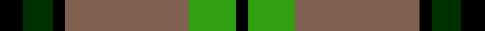
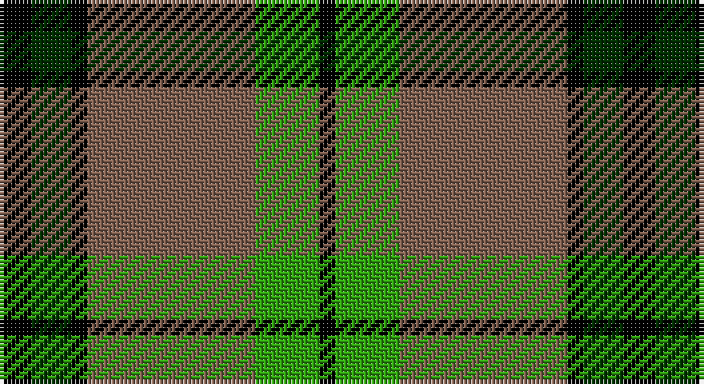

This page is one **sett** — a single exact thread-count. It belongs to the [tartan](/setts/k4dg5k2o21g8k2/)
(the same proportion at any scale), whose colour order is pattern [KGKRGK](/stripes/kgkrgk/).

Part of the [MacDuck](/tartans/macduck/) tartan — the named design grouping this sett with its other cloths.

Sourced from weddslist.  It is a [6 stripe tartan](/stripes/stripes6/).

Original link http://www.weddslist.com/cgi-bin/tartans/pg.pl?source=sts

## Also known as

This cloth is also recorded under:

- MacDuck #2
- MacDuck Final version
- MacDuck, Final version

## Thread count
K/8 DG10 K4 LT42 G16 K/4

One full sett is **156 threads**.

## Palette

Palette: <strong>Ingles Buchan</strong> <small style="color:#888">(1 of 4 colours)</small>
<table><thead><tr><th>Colour</th><th>Threads</th><th>Shade</th><th>Base</th><th>OKLCh</th></tr></thead><tbody><tr><td>K/</td><td style="text-align:right;font-variant-numeric:tabular-nums">8</td><td><code style="background-color:#000000;">#000000</code> <small style="color:#888">#000000</small></td><td>K <code style="background-color:#000000;">#000000</code></td><td><small style="color:#888">oklch(0.0% 0.000 0.0)</small></td></tr><tr><td>DG</td><td style="text-align:right;font-variant-numeric:tabular-nums">10</td><td><code style="background-color:#003000;">#003000</code> <small style="color:#888">#003000</small></td><td>G <code style="background-color:#006100;">#006100</code></td><td><small style="color:#888">oklch(26.8% 0.091 142.5)</small></td></tr><tr><td>K</td><td style="text-align:right;font-variant-numeric:tabular-nums">4</td><td><code style="background-color:#000000;">#000000</code> <small style="color:#888">#000000</small></td><td>K <code style="background-color:#000000;">#000000</code></td><td><small style="color:#888">oklch(0.0% 0.000 0.0)</small></td></tr><tr><td>LT</td><td style="text-align:right;font-variant-numeric:tabular-nums">42</td><td><code style="background-color:#806050;">#806050</code> <small style="color:#888">#806050</small></td><td>R <code style="background-color:#CC0000;">#CC0000</code></td><td><small style="color:#888">oklch(51.7% 0.049 47.8)</small></td></tr><tr><td>G</td><td style="text-align:right;font-variant-numeric:tabular-nums">16</td><td><code style="background-color:#30A010;">#30A010</code> <small style="color:#888">#30A010</small></td><td>G <code style="background-color:#006100;">#006100</code></td><td><small style="color:#888">oklch(61.9% 0.195 140.5)</small></td></tr><tr><td>K/</td><td style="text-align:right;font-variant-numeric:tabular-nums">4</td><td><code style="background-color:#000000;">#000000</code> <small style="color:#888">#000000</small></td><td>K <code style="background-color:#000000;">#000000</code></td><td><small style="color:#888">oklch(0.0% 0.000 0.0)</small></td></tr></tbody></table>

# Sample pattern

## Compared to the master

This cloth is one sett of its design; the master sett (the exemplar the design is anchored on) is below for comparison.

<figure style="margin:0"><figcaption style="color:#888;font-size:smaller">this sett</figcaption></figure>
<figure style="margin:0"><figcaption style="color:#888;font-size:smaller"><a href="/setts/k4r5k2ly21g8k2/">master sett →</a></figcaption></figure>

## Nearest tartans

The nearest existing variants by ΔTartan distance, with this tartan at the top so the swatches line up against it.

ΔTartan

Tartan

Sett

—

<a href="/ttd/edit/#slug=k4dg5k2o21g8k2~x2">MacDuck</a> <a class="nn-out" href="/variants/s6/k4dg5k2o21g8k2~x2/" title="open its dictionary page">↗</a>

0.91

<a href="/ttd/edit/#slug=k3dy3lo6k12lo1o2dy2~x4&amp;base=k4dg5k2o21g8k2~x2">Strummer, Joe (Commemorative)</a> <a class="nn-out" href="/variants/s7/k3dy3lo6k12lo1o2dy2~x4/" title="open its dictionary page">↗</a>

1.00

<a href="/ttd/edit/#slug=k2r7k6g12ly1g1k2~x4&amp;base=k4dg5k2o21g8k2~x2">Blackstock Hunting</a> <a class="nn-out" href="/variants/s7/k2r7k6g12ly1g1k2~x4/" title="open its dictionary page">↗</a>

1.02

<a href="/ttd/edit/#slug=k4lo17k2lo2g7k2lo2k22db4~x2&amp;base=k4dg5k2o21g8k2~x2">Bro-Leon</a> <a class="nn-out" href="/variants/s9/k4lo17k2lo2g7k2lo2k22db4~x2/" title="open its dictionary page">↗</a>

1.10

<a href="/ttd/edit/#slug=g5k2g28k10o26db4g4~x2&amp;base=k4dg5k2o21g8k2~x2">John Telfar, Dunbar hunting</a> <a class="nn-out" href="/variants/s7/g5k2g28k10o26db4g4~x2/" title="open its dictionary page">↗</a>

1.13

<a href="/ttd/edit/#slug=k17dg48ly4r10lb12dg4&amp;base=k4dg5k2o21g8k2~x2">Asheville Firefighters, The</a> <a class="nn-out" href="/variants/s6/k17dg48ly4r10lb12dg4/" title="open its dictionary page">↗</a>

1.14

<a href="/ttd/edit/#slug=r2w8k14dy25w2k2w2~x2&amp;base=k4dg5k2o21g8k2~x2">Merric Dark Camel.. Trade Tartan</a> <a class="nn-out" href="/variants/s7/r2w8k14dy25w2k2w2~x2/" title="open its dictionary page">↗</a>

1.15

<a href="/ttd/edit/#slug=ly5dg14o4db4o27dg3o4ly5~x2&amp;base=k4dg5k2o21g8k2~x2">Invertere</a> <a class="nn-out" href="/variants/s8/ly5dg14o4db4o27dg3o4ly5~x2/" title="open its dictionary page">↗</a>

1.15

<a href="/ttd/edit/#slug=dg28r4db25w5r22dg27r4db2~x2&amp;base=k4dg5k2o21g8k2~x2">New Glasgow (Canada)</a> <a class="nn-out" href="/variants/s8/dg28r4db25w5r22dg27r4db2~x2/" title="open its dictionary page">↗</a>

1.17

<a href="/ttd/edit/#slug=lo12dg4lo24k9lo8dg36r4&amp;base=k4dg5k2o21g8k2~x2">Harmer (Corporate)</a> <a class="nn-out" href="/variants/s7/lo12dg4lo24k9lo8dg36r4/" title="open its dictionary page">↗</a>

1.18

<a href="/ttd/edit/#slug=g24p3g3p3g3p7dg20r3~x2&amp;base=k4dg5k2o21g8k2~x2">Crantock</a> <a class="nn-out" href="/variants/s8/g24p3g3p3g3p7dg20r3~x2/" title="open its dictionary page">↗</a>

## Neighbour map

Every grey dot is one of 14360 variants placed by the first two principal components of the ΔTartan feature space (44% of its variance). Red is this tartan; blue dots are its nearest — click one to open its page.

<svg viewBox="0 0 640 380" role="img" style="max-width:100%;height:auto;border:1px solid #e0e0e0;border-radius:4px;display:block" xmlns="http://www.w3.org/2000/svg"><image href="/nn/cloud.v1.png" width="640" height="380"/><a href="/variants/s7/k3dy3lo6k12lo1o2dy2~x4/"><circle cx="264.1" cy="194.4" r="4" fill="#3465a4"><title>Strummer, Joe (Commemorative)</title></circle></a><a href="/variants/s7/k2r7k6g12ly1g1k2~x4/"><circle cx="229.0" cy="196.0" r="4" fill="#3465a4"><title>Blackstock Hunting</title></circle></a><a href="/variants/s9/k4lo17k2lo2g7k2lo2k22db4~x2/"><circle cx="248.4" cy="169.4" r="4" fill="#3465a4"><title>Bro-Leon</title></circle></a><a href="/variants/s7/g5k2g28k10o26db4g4~x2/"><circle cx="253.1" cy="191.6" r="4" fill="#3465a4"><title>John Telfar, Dunbar hunting</title></circle></a><a href="/variants/s6/k17dg48ly4r10lb12dg4/"><circle cx="261.5" cy="178.8" r="4" fill="#3465a4"><title>Asheville Firefighters, The</title></circle></a><a href="/variants/s7/r2w8k14dy25w2k2w2~x2/"><circle cx="233.4" cy="163.7" r="4" fill="#3465a4"><title>Merric Dark Camel.. Trade Tartan</title></circle></a><a href="/variants/s8/ly5dg14o4db4o27dg3o4ly5~x2/"><circle cx="270.4" cy="189.7" r="4" fill="#3465a4"><title>Invertere</title></circle></a><a href="/variants/s8/dg28r4db25w5r22dg27r4db2~x2/"><circle cx="227.8" cy="186.4" r="4" fill="#3465a4"><title>New Glasgow (Canada)</title></circle></a><a href="/variants/s7/lo12dg4lo24k9lo8dg36r4/"><circle cx="238.1" cy="208.2" r="4" fill="#3465a4"><title>Harmer (Corporate)</title></circle></a><a href="/variants/s8/g24p3g3p3g3p7dg20r3~x2/"><circle cx="219.4" cy="192.7" r="4" fill="#3465a4"><title>Crantock</title></circle></a><circle cx="244.6" cy="195.7" r="5" fill="#c00000"/></svg>

ID: /variants/s6/k4dg5k2o21g8k2~x2/
