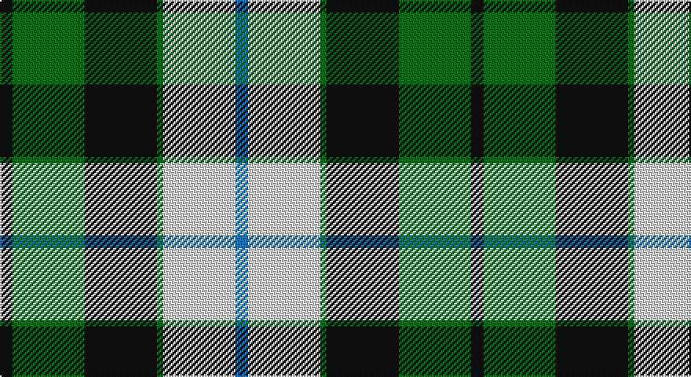

This page is one **sett** — a single exact thread-count. It belongs to the [tartan](/setts/k4g23k23g2w23b4/)
(the same proportion at any scale), whose colour order is pattern [BWGKGK](/stripes/bwgkgk/).

Part of the [MacKay Dress](/tartans/mackay-dress/) tartan — the named design grouping this sett with its other cloths.

Sourced from register-of-tartans.  It is a [6 stripe tartan](/stripes/stripes6/).

Original link https://www.tartanregister.gov.uk/tartanDetails.aspx?ref=2502

## Also known as

This cloth is also recorded under:

- MacKay, Dress

## Register references

External register numbers recorded for this tartan.

- Scottish Register of Tartans: [2502](https://www.tartanregister.gov.uk/tartanDetails.aspx?ref=2502)
- Scottish Tartans Authority (ITI): 7015

## Thread count
K/8 G46 K46 G4 LN46 B/8

One full sett is **300 threads**.

## Palette

Palette: <strong>Tartan Register</strong>
<table><thead><tr><th>Colour</th><th>Threads</th><th>Shade</th><th>Base</th><th>OKLCh</th></tr></thead><tbody><tr><td>K/</td><td style="text-align:right;font-variant-numeric:tabular-nums">8</td><td><code style="background-color:#101010;">#101010</code> <small style="color:#888">#101010</small></td><td>K <code style="background-color:#000000;">#000000</code></td><td><small style="color:#888">oklch(17.3% 0.000 89.9)</small></td></tr><tr><td>G</td><td style="text-align:right;font-variant-numeric:tabular-nums">46</td><td><code style="background-color:#006818;">#006818</code> <small style="color:#888">#006818</small></td><td>G <code style="background-color:#006100;">#006100</code></td><td><small style="color:#888">oklch(45.0% 0.142 145.0)</small></td></tr><tr><td>K</td><td style="text-align:right;font-variant-numeric:tabular-nums">46</td><td><code style="background-color:#101010;">#101010</code> <small style="color:#888">#101010</small></td><td>K <code style="background-color:#000000;">#000000</code></td><td><small style="color:#888">oklch(17.3% 0.000 89.9)</small></td></tr><tr><td>G</td><td style="text-align:right;font-variant-numeric:tabular-nums">4</td><td><code style="background-color:#006818;">#006818</code> <small style="color:#888">#006818</small></td><td>G <code style="background-color:#006100;">#006100</code></td><td><small style="color:#888">oklch(45.0% 0.142 145.0)</small></td></tr><tr><td>LN</td><td style="text-align:right;font-variant-numeric:tabular-nums">46</td><td><code style="background-color:#E0E0E0;">#E0E0E0</code> <small style="color:#888">#E0E0E0</small></td><td>W <code style="background-color:#F7F7F7;">#F7F7F7</code></td><td><small style="color:#888">oklch(90.7% 0.000 89.9)</small></td></tr><tr><td>B/</td><td style="text-align:right;font-variant-numeric:tabular-nums">8</td><td><code style="background-color:#1474B4;">#1474B4</code> <small style="color:#888">#1474B4</small></td><td>B <code style="background-color:#2A418A;">#2A418A</code></td><td><small style="color:#888">oklch(54.0% 0.129 245.1)</small></td></tr></tbody></table>

# Sample pattern

## Nearest tartans

The nearest existing variants by ΔTartan distance, with this tartan at the top so the swatches line up against it.

ΔTartan

Tartan

Sett

—

<a href="/ttd/edit/#slug=k4g23k23g2w23b4~x2">MacKay Dress</a> <a class="nn-out" href="/variants/s6/k4g23k23g2w23b4~x2/" title="open its dictionary page">↗</a>

0.85

<a href="/ttd/edit/#slug=k4g14k14g2w14b3~x2&amp;base=k4g23k23g2w23b4~x2">MacKay, Dress (Corporate)</a> <a class="nn-out" href="/variants/s6/k4g14k14g2w14b3~x2/" title="open its dictionary page">↗</a>

0.88

<a href="/ttd/edit/#slug=ly6k6y30k8lb18k6ly3~x2&amp;base=k4g23k23g2w23b4~x2">Cape Breton (yellow stripes)</a> <a class="nn-out" href="/variants/s7/ly6k6y30k8lb18k6ly3~x2/" title="open its dictionary page">↗</a>

0.98

<a href="/ttd/edit/#slug=ly5k5g17k6y24k6ly3~x2&amp;base=k4g23k23g2w23b4~x2">Cape Breton</a> <a class="nn-out" href="/variants/s7/ly5k5g17k6y24k6ly3~x2/" title="open its dictionary page">↗</a>

1.06

<a href="/ttd/edit/#slug=k3g2k10w11g1dy10g2dy3~x6&amp;base=k4g23k23g2w23b4~x2">Dalveen (1981)</a> <a class="nn-out" href="/variants/s8/k3g2k10w11g1dy10g2dy3~x6/" title="open its dictionary page">↗</a>

1.07

<a href="/ttd/edit/#slug=dg2dr8dg8o3dr1w12dg2dr1~x2&amp;base=k4g23k23g2w23b4~x2">National Trust</a> <a class="nn-out" href="/variants/s8/dg2dr8dg8o3dr1w12dg2dr1~x2/" title="open its dictionary page">↗</a>

1.10

<a href="/ttd/edit/#slug=db8w33k15dg17t3dg17t3~x2&amp;base=k4g23k23g2w23b4~x2">MacRobart Dress (Personal)</a> <a class="nn-out" href="/variants/s7/db8w33k15dg17t3dg17t3~x2/" title="open its dictionary page">↗</a>

1.14

<a href="/ttd/edit/#slug=k4ly2k13ly1w8o13ly2o4~x2&amp;base=k4g23k23g2w23b4~x2">Bannockbane Grey #1</a> <a class="nn-out" href="/variants/s8/k4ly2k13ly1w8o13ly2o4~x2/" title="open its dictionary page">↗</a>

1.15

<a href="/ttd/edit/#slug=dg3o2dg14o1w10y14o2y3~x2&amp;base=k4g23k23g2w23b4~x2">Bannockbane Hunting (MacBean and Bishop)</a> <a class="nn-out" href="/variants/s8/dg3o2dg14o1w10y14o2y3~x2/" title="open its dictionary page">↗</a>

1.16

<a href="/ttd/edit/#slug=ly5k5g17k6o24k6ly3~x2&amp;base=k4g23k23g2w23b4~x2">Cape Breton District Tartan</a> <a class="nn-out" href="/variants/s7/ly5k5g17k6o24k6ly3~x2/" title="open its dictionary page">↗</a>

1.17

<a href="/ttd/edit/#slug=db8w33k15g17t3g17t3~x2&amp;base=k4g23k23g2w23b4~x2">MacRobart, dress</a> <a class="nn-out" href="/variants/s7/db8w33k15g17t3g17t3~x2/" title="open its dictionary page">↗</a>

## Neighbour map

Every grey dot is one of 14360 variants placed by the first two principal components of the ΔTartan feature space (44% of its variance). Red is this tartan; blue dots are its nearest — click one to open its page.

<svg viewBox="0 0 640 380" role="img" style="max-width:100%;height:auto;border:1px solid #e0e0e0;border-radius:4px;display:block" xmlns="http://www.w3.org/2000/svg"><image href="/nn/cloud.v1.png" width="640" height="380"/><a href="/variants/s6/k4g14k14g2w14b3~x2/"><circle cx="120.0" cy="223.8" r="4" fill="#3465a4"><title>MacKay, Dress (Corporate)</title></circle></a><a href="/variants/s7/ly6k6y30k8lb18k6ly3~x2/"><circle cx="147.5" cy="180.5" r="4" fill="#3465a4"><title>Cape Breton (yellow stripes)</title></circle></a><a href="/variants/s7/ly5k5g17k6y24k6ly3~x2/"><circle cx="132.4" cy="201.1" r="4" fill="#3465a4"><title>Cape Breton</title></circle></a><a href="/variants/s8/k3g2k10w11g1dy10g2dy3~x6/"><circle cx="125.8" cy="182.7" r="4" fill="#3465a4"><title>Dalveen (1981)</title></circle></a><a href="/variants/s8/dg2dr8dg8o3dr1w12dg2dr1~x2/"><circle cx="143.4" cy="169.9" r="4" fill="#3465a4"><title>National Trust</title></circle></a><a href="/variants/s7/db8w33k15dg17t3dg17t3~x2/"><circle cx="114.3" cy="175.9" r="4" fill="#3465a4"><title>MacRobart Dress (Personal)</title></circle></a><a href="/variants/s8/k4ly2k13ly1w8o13ly2o4~x2/"><circle cx="151.5" cy="167.9" r="4" fill="#3465a4"><title>Bannockbane Grey #1</title></circle></a><a href="/variants/s8/dg3o2dg14o1w10y14o2y3~x2/"><circle cx="167.2" cy="168.1" r="4" fill="#3465a4"><title>Bannockbane Hunting (MacBean and Bishop)</title></circle></a><a href="/variants/s7/ly5k5g17k6o24k6ly3~x2/"><circle cx="152.1" cy="208.8" r="4" fill="#3465a4"><title>Cape Breton District Tartan</title></circle></a><a href="/variants/s7/db8w33k15g17t3g17t3~x2/"><circle cx="104.9" cy="173.9" r="4" fill="#3465a4"><title>MacRobart, dress</title></circle></a><circle cx="144.1" cy="195.9" r="5" fill="#c00000"/></svg>

ID: /variants/s6/k4g23k23g2w23b4~x2/
