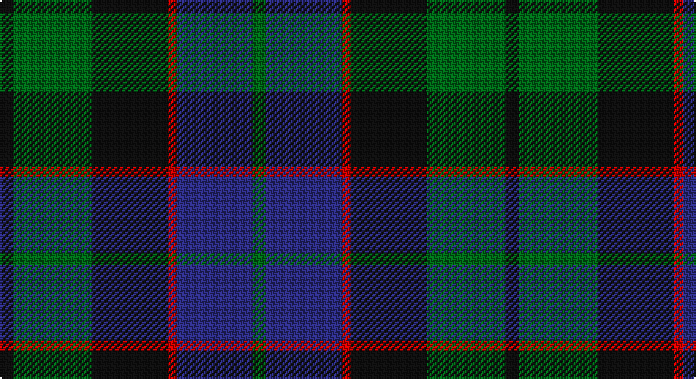

This page is one **sett** — a single exact thread-count. It belongs to the [tartan](/setts/k4g25k24r3db24g4/)
(the same proportion at any scale), whose colour order is pattern [GBRKGK](/stripes/gbrkgk/).

Part of the [Ferguson](/tartans/ferguson/) tartan — the named design grouping this sett with its other cloths.

Sourced from register-of-tartans.  It is a [6 stripe tartan](/stripes/stripes6/).

Original link https://www.tartanregister.gov.uk/tartanDetails.aspx?ref=1167

## Provenance

Earliest known date: 1977 (1831) Logan records only two threads for the red stripe. D.C. Stewart calls this Ferguson of Balquhidder to differenciate it from the Ferguson of Athol. Chiefs of the Clan are the Fergussons of Kilkerran, descended from Fergus of Dalriada, who brought the 'Stone of Scone' to Scotland. The Fergussons of Perthshire were recognised as the principal Highland branch of the clan and the chiefship belonged to 'MacFhearghuis' of Dunfallandy. The present day chief is Sir Charles Fergusson of Kilkerran, Bt.

## Also known as

This cloth is also recorded under:

- Ferguson of Balquhidder
- Ferguson of Balquhidder #2
- Ferguson,

4 attestations — the source records this cloth was collapsed from (oldest owns this page)

<ul>
<li>01/01/1831 — Ferguson of Balquhidder #2 (register-of-tartans, <a href="https://www.tartanregister.gov.uk/tartanDetails.aspx?ref=1167">record</a>)</li>
<li>1831 — Ferguson of Balquhidder - 1831 (Clan (tartans-authority, <a href="http://www.tartansauthority.com/tartan-ferret/display/738/">record</a>)</li>
<li>undated — Ferguson (weddslist, <a href="http://www.weddslist.com/cgi-bin/tartans/pg.pl?source=sts">record</a>)</li>
<li>undated — Ferguson of Balquhidder Clan Tartan (house-of-tartan, <a href="http://www.house-of-tartan.scotland.net/house/TartanViewjs.asp?colr=Def&tnam=738">record</a>)</li>
</ul>

## Register references

External register numbers recorded for this tartan.

- Scottish Register of Tartans: [1167](https://www.tartanregister.gov.uk/tartanDetails.aspx?ref=1167)
- Scottish Tartans Authority (ITI): 738
- Scottish Tartans World Register: 738

## Thread count
K/8 G50 K48 R6 DB48 G/8

One full sett is **320 threads**.

## Palette

Palette: <strong>Tartan Register</strong>
<table><thead><tr><th>Colour</th><th>Threads</th><th>Shade</th><th>Base</th><th>OKLCh</th></tr></thead><tbody><tr><td>K/</td><td style="text-align:right;font-variant-numeric:tabular-nums">8</td><td><code style="background-color:#101010;">#101010</code> <small style="color:#888">#101010</small></td><td>K <code style="background-color:#000000;">#000000</code></td><td><small style="color:#888">oklch(17.3% 0.000 89.9)</small></td></tr><tr><td>G</td><td style="text-align:right;font-variant-numeric:tabular-nums">50</td><td><code style="background-color:#006818;">#006818</code> <small style="color:#888">#006818</small></td><td>G <code style="background-color:#006100;">#006100</code></td><td><small style="color:#888">oklch(45.0% 0.142 145.0)</small></td></tr><tr><td>K</td><td style="text-align:right;font-variant-numeric:tabular-nums">48</td><td><code style="background-color:#101010;">#101010</code> <small style="color:#888">#101010</small></td><td>K <code style="background-color:#000000;">#000000</code></td><td><small style="color:#888">oklch(17.3% 0.000 89.9)</small></td></tr><tr><td>R</td><td style="text-align:right;font-variant-numeric:tabular-nums">6</td><td><code style="background-color:#C80000;">#C80000</code> <small style="color:#888">#C80000</small></td><td>R <code style="background-color:#CC0000;">#CC0000</code></td><td><small style="color:#888">oklch(52.3% 0.215 29.2)</small></td></tr><tr><td>DB</td><td style="text-align:right;font-variant-numeric:tabular-nums">48</td><td><code style="background-color:#2C2C80;">#2C2C80</code> <small style="color:#888">#2C2C80</small></td><td>B <code style="background-color:#2A418A;">#2A418A</code></td><td><small style="color:#888">oklch(35.0% 0.138 276.6)</small></td></tr><tr><td>G/</td><td style="text-align:right;font-variant-numeric:tabular-nums">8</td><td><code style="background-color:#006818;">#006818</code> <small style="color:#888">#006818</small></td><td>G <code style="background-color:#006100;">#006100</code></td><td><small style="color:#888">oklch(45.0% 0.142 145.0)</small></td></tr></tbody></table>

# Sample pattern

## Compared to the master

This cloth is one sett of its design; the master sett (the exemplar the design is anchored on) is below for comparison.

<figure style="margin:0"><figcaption style="color:#888;font-size:smaller">this sett</figcaption></figure>
<figure style="margin:0"><figcaption style="color:#888;font-size:smaller"><a href="/setts/g17r2db15/">master sett →</a></figcaption></figure>

## Nearest tartans

The nearest existing variants by ΔTartan distance, with this tartan at the top so the swatches line up against it.

ΔTartan

Tartan

Sett

—

<a href="/ttd/edit/#slug=k4g25k24r3db24g4~x2">Ferguson of Balquhidder #2</a> <a class="nn-out" href="/variants/s6/k4g25k24r3db24g4~x2/" title="open its dictionary page">↗</a>

0.50

<a href="/ttd/edit/#slug=g8t1g1k6db6k1~x4&amp;base=k4g25k24r3db24g4~x2">Graham of Menteith (Clan)</a> <a class="nn-out" href="/variants/s6/g8t1g1k6db6k1~x4/" title="open its dictionary page">↗</a>

0.56

<a href="/ttd/edit/#slug=k2g10k9db9r1k1db2~x2&amp;base=k4g25k24r3db24g4~x2">Reid and Taylor</a> <a class="nn-out" href="/variants/s7/k2g10k9db9r1k1db2~x2/" title="open its dictionary page">↗</a>

0.56

<a href="/ttd/edit/#slug=k4dg19k16w2db15dg4~x2&amp;base=k4g25k24r3db24g4~x2">Graham of Montrose</a> <a class="nn-out" href="/variants/s6/k4dg19k16w2db15dg4~x2/" title="open its dictionary page">↗</a>

0.57

<a href="/ttd/edit/#slug=db6k2db18k18g18k3r2~x2&amp;base=k4g25k24r3db24g4~x2">Renfrew</a> <a class="nn-out" href="/variants/s7/db6k2db18k18g18k3r2~x2/" title="open its dictionary page">↗</a>

0.59

<a href="/ttd/edit/#slug=g8b1g1k6db6k1~x4&amp;base=k4g25k24r3db24g4~x2">Graham of Menteith</a> <a class="nn-out" href="/variants/s6/g8b1g1k6db6k1~x4/" title="open its dictionary page">↗</a>

0.60

<a href="/ttd/edit/#slug=g1db6k6g6r1g1~x6&amp;base=k4g25k24r3db24g4~x2">Callum Beg (Fashion)</a> <a class="nn-out" href="/variants/s6/g1db6k6g6r1g1~x6/" title="open its dictionary page">↗</a>

0.60

<a href="/ttd/edit/#slug=k3db14r2k14g14k3~x2&amp;base=k4g25k24r3db24g4~x2">Gallamore</a> <a class="nn-out" href="/variants/s6/k3db14r2k14g14k3~x2/" title="open its dictionary page">↗</a>

0.66

<a href="/ttd/edit/#slug=g8t1g1k6dp6k1dp3~x4&amp;base=k4g25k24r3db24g4~x2">Unnamed 19th Century Plaid</a> <a class="nn-out" href="/variants/s7/g8t1g1k6dp6k1dp3~x4/" title="open its dictionary page">↗</a>

0.66

<a href="/ttd/edit/#slug=g24db6t3k6db12k15g4~x2&amp;base=k4g25k24r3db24g4~x2">Blaylock Annandale (Name)</a> <a class="nn-out" href="/variants/s7/g24db6t3k6db12k15g4~x2/" title="open its dictionary page">↗</a>

0.66

<a href="/ttd/edit/#slug=r2g12k12g1db12g2~x2&amp;base=k4g25k24r3db24g4~x2">Gunn</a> <a class="nn-out" href="/variants/s6/r2g12k12g1db12g2~x2/" title="open its dictionary page">↗</a>

## Neighbour map

Every grey dot is one of 14360 variants placed by the first two principal components of the ΔTartan feature space (44% of its variance). Red is this tartan; blue dots are its nearest — click one to open its page.

<svg viewBox="0 0 640 380" role="img" style="max-width:100%;height:auto;border:1px solid #e0e0e0;border-radius:4px;display:block" xmlns="http://www.w3.org/2000/svg"><image href="/nn/cloud.v1.png" width="640" height="380"/><a href="/variants/s6/g8t1g1k6db6k1~x4/"><circle cx="218.0" cy="249.8" r="4" fill="#3465a4"><title>Graham of Menteith (Clan)</title></circle></a><a href="/variants/s7/k2g10k9db9r1k1db2~x2/"><circle cx="221.4" cy="232.8" r="4" fill="#3465a4"><title>Reid and Taylor</title></circle></a><a href="/variants/s6/k4dg19k16w2db15dg4~x2/"><circle cx="223.0" cy="255.2" r="4" fill="#3465a4"><title>Graham of Montrose</title></circle></a><a href="/variants/s7/db6k2db18k18g18k3r2~x2/"><circle cx="219.4" cy="240.0" r="4" fill="#3465a4"><title>Renfrew</title></circle></a><a href="/variants/s6/g8b1g1k6db6k1~x4/"><circle cx="220.5" cy="251.3" r="4" fill="#3465a4"><title>Graham of Menteith</title></circle></a><a href="/variants/s6/g1db6k6g6r1g1~x6/"><circle cx="197.7" cy="261.3" r="4" fill="#3465a4"><title>Callum Beg (Fashion)</title></circle></a><a href="/variants/s6/k3db14r2k14g14k3~x2/"><circle cx="214.3" cy="261.9" r="4" fill="#3465a4"><title>Gallamore</title></circle></a><a href="/variants/s7/g8t1g1k6dp6k1dp3~x4/"><circle cx="203.2" cy="242.9" r="4" fill="#3465a4"><title>Unnamed 19th Century Plaid</title></circle></a><a href="/variants/s7/g24db6t3k6db12k15g4~x2/"><circle cx="212.9" cy="249.2" r="4" fill="#3465a4"><title>Blaylock Annandale (Name)</title></circle></a><a href="/variants/s6/r2g12k12g1db12g2~x2/"><circle cx="216.6" cy="231.7" r="4" fill="#3465a4"><title>Gunn</title></circle></a><circle cx="204.5" cy="249.5" r="5" fill="#c00000"/></svg>

ID: /variants/s6/k4g25k24r3db24g4~x2/
