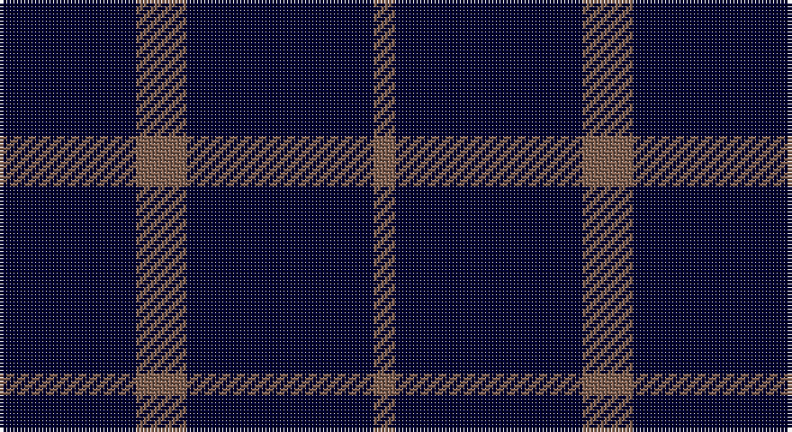

This page is one **sett** — a single exact thread-count. It belongs to the [tartan](/setts/k4k12k3o7k26o3/)
(the same proportion at any scale), whose colour order is pattern [KKKRKR](/stripes/kkkrkr/).

Part of the [Crombie House Check](/tartans/crombie-house-check/) tartan — the named design grouping this sett with its other cloths.

Sourced from weddslist.  It is a [6 stripe tartan](/stripes/stripes6/).

Original link http://www.weddslist.com/cgi-bin/tartans/pg.pl?source=sts

## Thread count
DB/8 DB24 DB6 LT14 DB52 LT/6

One full sett is **206 threads**.

## Palette

Palette: <strong>custom</strong>
<table><thead><tr><th>Colour</th><th>Threads</th><th>Shade</th><th>Base</th><th>OKLCh</th></tr></thead><tbody><tr><td>DB/</td><td style="text-align:right;font-variant-numeric:tabular-nums">8</td><td><code style="background-color:#000030;">#000030</code> <small style="color:#888">#000030</small></td><td>K <code style="background-color:#000000;">#000000</code></td><td><small style="color:#888">oklch(14.0% 0.097 264.1)</small></td></tr><tr><td>DB</td><td style="text-align:right;font-variant-numeric:tabular-nums">24</td><td><code style="background-color:#000030;">#000030</code> <small style="color:#888">#000030</small></td><td>K <code style="background-color:#000000;">#000000</code></td><td><small style="color:#888">oklch(14.0% 0.097 264.1)</small></td></tr><tr><td>DB</td><td style="text-align:right;font-variant-numeric:tabular-nums">6</td><td><code style="background-color:#000030;">#000030</code> <small style="color:#888">#000030</small></td><td>K <code style="background-color:#000000;">#000000</code></td><td><small style="color:#888">oklch(14.0% 0.097 264.1)</small></td></tr><tr><td>LT</td><td style="text-align:right;font-variant-numeric:tabular-nums">14</td><td><code style="background-color:#806050;">#806050</code> <small style="color:#888">#806050</small></td><td>R <code style="background-color:#CC0000;">#CC0000</code></td><td><small style="color:#888">oklch(51.7% 0.049 47.8)</small></td></tr><tr><td>DB</td><td style="text-align:right;font-variant-numeric:tabular-nums">52</td><td><code style="background-color:#000030;">#000030</code> <small style="color:#888">#000030</small></td><td>K <code style="background-color:#000000;">#000000</code></td><td><small style="color:#888">oklch(14.0% 0.097 264.1)</small></td></tr><tr><td>LT/</td><td style="text-align:right;font-variant-numeric:tabular-nums">6</td><td><code style="background-color:#806050;">#806050</code> <small style="color:#888">#806050</small></td><td>R <code style="background-color:#CC0000;">#CC0000</code></td><td><small style="color:#888">oklch(51.7% 0.049 47.8)</small></td></tr></tbody></table>

# Sample pattern

## Compared to the master

This cloth is one sett of its design; the master sett (the exemplar the design is anchored on) is below for comparison.

<figure style="margin:0"><figcaption style="color:#888;font-size:smaller">this sett</figcaption></figure>
<figure style="margin:0"><figcaption style="color:#888;font-size:smaller"><a href="/setts/k3lb10db2g6db18g2/">master sett →</a></figcaption></figure>

## Nearest tartans

The nearest existing variants by ΔTartan distance, with this tartan at the top so the swatches line up against it.

ΔTartan

Tartan

Sett

—

<a href="/ttd/edit/#slug=k4k12k3o7k26o3~x2">Crombie House Check</a> <a class="nn-out" href="/variants/s6/k4k12k3o7k26o3~x2/" title="open its dictionary page">↗</a>

1.59

<a href="/ttd/edit/#slug=r1db9lo2db9lo1~x4&amp;base=k4k12k3o7k26o3~x2">Brooks Brothers Tattersall Blue</a> <a class="nn-out" href="/variants/s5/r1db9lo2db9lo1~x4/" title="open its dictionary page">↗</a>

1.90

<a href="/ttd/edit/#slug=db16ri4db3r1~x2&amp;base=k4k12k3o7k26o3~x2">Elliott</a> <a class="nn-out" href="/variants/s4/db16ri4db3r1~x2/" title="open its dictionary page">↗</a>

1.96

<a href="/ttd/edit/#slug=dt50k12dt21w5~x2&amp;base=k4k12k3o7k26o3~x2">Coinean Dubh</a> <a class="nn-out" href="/variants/s4/dt50k12dt21w5~x2/" title="open its dictionary page">↗</a>

1.98

<a href="/ttd/edit/#slug=db24t6db10t6db32ly3~x2&amp;base=k4k12k3o7k26o3~x2">Sultan of Qaboo's Air Force</a> <a class="nn-out" href="/variants/s6/db24t6db10t6db32ly3~x2/" title="open its dictionary page">↗</a>

2.11

<a href="/ttd/edit/#slug=k15n7k6n11k50n4~x2&amp;base=k4k12k3o7k26o3~x2">Freedom of Scotland</a> <a class="nn-out" href="/variants/s6/k15n7k6n11k50n4~x2/" title="open its dictionary page">↗</a>

2.14

<a href="/ttd/edit/#slug=r3k16dg2k2dg2~x2&amp;base=k4k12k3o7k26o3~x2">Gadsden (Artefact)</a> <a class="nn-out" href="/variants/s5/r3k16dg2k2dg2~x2/" title="open its dictionary page">↗</a>

2.16

<a href="/ttd/edit/#slug=k10p3k6g1k6g1k6g2k6~x2&amp;base=k4k12k3o7k26o3~x2">GOLF (Wonderland Publications) Corporate Tartan</a> <a class="nn-out" href="/variants/s9/k10p3k6g1k6g1k6g2k6~x2/" title="open its dictionary page">↗</a>

2.19

<a href="/ttd/edit/#slug=db9k9db9k9db42w5~x2&amp;base=k4k12k3o7k26o3~x2">Dollar Academy (1930s) (Corporate)</a> <a class="nn-out" href="/variants/s6/db9k9db9k9db42w5~x2/" title="open its dictionary page">↗</a>

2.20

<a href="/ttd/edit/#slug=db9k9db9k9db42lb5~x2&amp;base=k4k12k3o7k26o3~x2">Dollar Academy</a> <a class="nn-out" href="/variants/s6/db9k9db9k9db42lb5~x2/" title="open its dictionary page">↗</a>

2.22

<a href="/ttd/edit/#slug=db1k12db1~x10&amp;base=k4k12k3o7k26o3~x2">Staines (2013)</a> <a class="nn-out" href="/variants/s3/db1k12db1~x10/" title="open its dictionary page">↗</a>

## Neighbour map

Every grey dot is one of 14360 variants placed by the first two principal components of the ΔTartan feature space (44% of its variance). Red is this tartan; blue dots are its nearest — click one to open its page.

<svg viewBox="0 0 640 380" role="img" style="max-width:100%;height:auto;border:1px solid #e0e0e0;border-radius:4px;display:block" xmlns="http://www.w3.org/2000/svg"><image href="/nn/cloud.v1.png" width="640" height="380"/><a href="/variants/s5/r1db9lo2db9lo1~x4/"><circle cx="543.1" cy="269.9" r="4" fill="#3465a4"><title>Brooks Brothers Tattersall Blue</title></circle></a><a href="/variants/s4/db16ri4db3r1~x2/"><circle cx="554.0" cy="251.9" r="4" fill="#3465a4"><title>Elliott</title></circle></a><a href="/variants/s4/dt50k12dt21w5~x2/"><circle cx="507.8" cy="277.4" r="4" fill="#3465a4"><title>Coinean Dubh</title></circle></a><a href="/variants/s6/db24t6db10t6db32ly3~x2/"><circle cx="510.5" cy="253.1" r="4" fill="#3465a4"><title>Sultan of Qaboo's Air Force</title></circle></a><a href="/variants/s6/k15n7k6n11k50n4~x2/"><circle cx="564.5" cy="266.5" r="4" fill="#3465a4"><title>Freedom of Scotland</title></circle></a><a href="/variants/s5/r3k16dg2k2dg2~x2/"><circle cx="448.0" cy="245.6" r="4" fill="#3465a4"><title>Gadsden (Artefact)</title></circle></a><a href="/variants/s9/k10p3k6g1k6g1k6g2k6~x2/"><circle cx="496.2" cy="256.6" r="4" fill="#3465a4"><title>GOLF (Wonderland Publications) Corporate Tartan</title></circle></a><a href="/variants/s6/db9k9db9k9db42w5~x2/"><circle cx="447.9" cy="250.6" r="4" fill="#3465a4"><title>Dollar Academy (1930s) (Corporate)</title></circle></a><a href="/variants/s6/db9k9db9k9db42lb5~x2/"><circle cx="463.7" cy="258.6" r="4" fill="#3465a4"><title>Dollar Academy</title></circle></a><a href="/variants/s3/db1k12db1~x10/"><circle cx="626.0" cy="300.4" r="4" fill="#3465a4"><title>Staines (2013)</title></circle></a><circle cx="552.3" cy="281.2" r="5" fill="#c00000"/></svg>

ID: /variants/s6/k4k12k3o7k26o3~x2/
