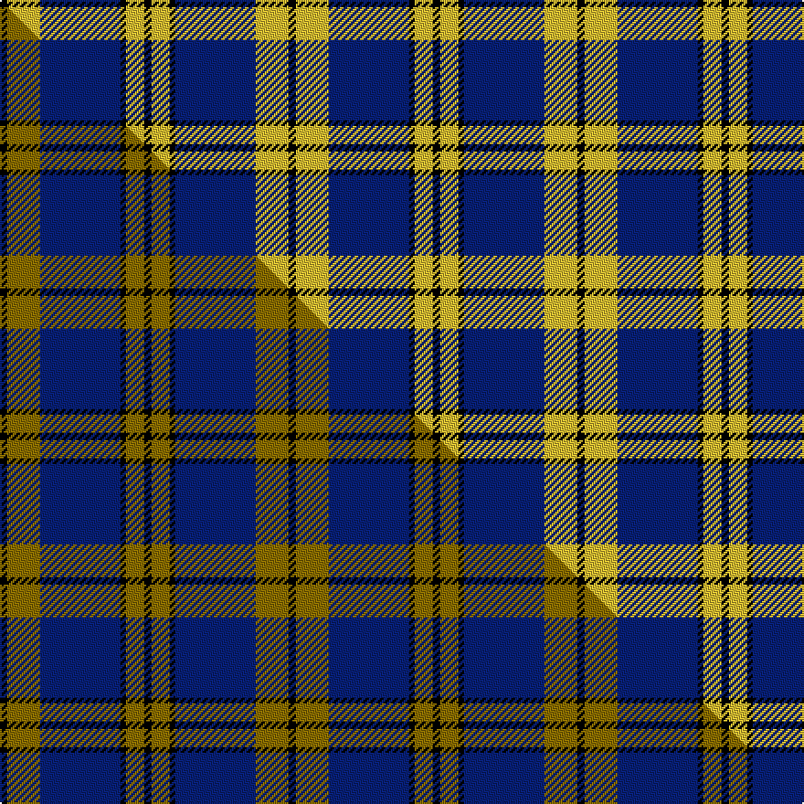

This page is one **sett** — a single exact thread-count. It belongs to the [tartan](/setts/k4ly18db44k3ly10k4/)
(the same proportion at any scale), whose colour order is pattern [KYBKYK](/stripes/kybkyk/).

Part of the [Stutterheim](/tartans/stutterheim/) tartan — the named design grouping this sett with its other cloths.

Sourced from tartans-authority.  It is a [6 stripe tartan](/stripes/stripes6/).

Original link http://www.tartansauthority.com/tartan-ferret/display/10572/

## Register references

External register numbers recorded for this tartan.

- Scottish Register of Tartans: [10572](https://www.tartanregister.gov.uk/tartanDetails?ref=10572)
- Scottish Tartans Authority (ITI): 10572

## Thread count
K/4 LY18 DB44 K3 LY10 K/4

One full sett is **158 threads**.

## Palette
<table><thead><tr><th>Colour</th><th>Shade</th><th>OKLCh</th></tr></thead><tbody><tr><td>DB</td><td><code style="background-color:#082077;">#082077</code> <small style="color:#888">#082077</small></td><td><small style="color:#888">oklch(30.0% 0.149 265.1)</small></td></tr><tr><td>K</td><td><code style="background-color:#000000;">#000000</code> <small style="color:#888">#000000</small></td><td><small style="color:#888">oklch(0.0% 0.000 0.0)</small></td></tr><tr><td>LY</td><td><code style="background-color:#DCBC32;">#DCBC32</code> <small style="color:#888">#DCBC32</small></td><td><small style="color:#888">oklch(80.0% 0.150 95.2)</small></td></tr></tbody></table>

# Sample pattern

## Compared to the master

This cloth is one sett of its design; the master sett (the exemplar the design is anchored on) is below for comparison.

Its **ΔTartan distance** from the master is **1.32** — the same measure the nearest-tartans table ranks by (0 is identical; a re-scale of the same cloth is near 0, a recolour or a different proportion further).

<figure class="master-compare" style="margin:0">

this sett
master sett ★

<figcaption style="color:#888;font-size:smaller">One weave of this sett against the <a href="/setts/k4y18db44k3y10k4/">master sett ★</a>, split on the diagonal: a shared proportion runs seamlessly across it with only the shades shifting; a different proportion breaks on it.</figcaption>
</figure>

## Nearest tartan variants

The nearest existing variants by ΔTartan distance, with this cloth at the top so the swatches line up against it.

ΔTartan

Threads

Variant

Sett

—

158

<a href="/variants/s6/k4ly18db44k3ly10k4/">Stutterheim (Corporate)</a>

<a href="/ttd/edit/#slug=k4y18db44k3y10k4&amp;base=k4ly18db44k3ly10k4" title="compare in the TTD">0.00</a>

158

<a href="/variants/s6/k4y18db44k3y10k4/">Stutterheim</a>

<a href="/ttd/edit/#slug=k4ly4lb32ly1k32ly4k2~x4&amp;base=k4ly18db44k3ly10k4" title="compare in the TTD">1.20</a>

608

<a href="/variants/s7/k4ly4lb32ly1k32ly4k2~x4/">Gleneagles Gold (Dalgleish)</a>

<a href="/ttd/edit/#slug=y8w3db40k12w3y3~x2&amp;base=k4ly18db44k3ly10k4" title="compare in the TTD">2.01</a>

254

<a href="/variants/s6/y8w3db40k12w3y3~x2/">Wolverine (Corporate)</a>

<a href="/ttd/edit/#slug=k3lb10dy5lb29k10r6k2~x2&amp;base=k4ly18db44k3ly10k4" title="compare in the TTD">2.72</a>

250

<a href="/variants/s7/k3lb10dy5lb29k10r6k2~x2/">Perkins 2015</a>

<a href="/ttd/edit/#slug=k3db30k8w8k2r3~x2&amp;base=k4ly18db44k3ly10k4" title="compare in the TTD">2.86</a>

204

<a href="/variants/s6/k3db30k8w8k2r3~x2/">Hydro-Electric</a>

<a href="/ttd/edit/#slug=db32k2db4k2db8ly29w2k2&amp;base=k4ly18db44k3ly10k4" title="compare in the TTD">2.87</a>

128

<a href="/variants/s8/db32k2db4k2db8ly29w2k2/">Southern Lakes</a>

<a href="/ttd/edit/#slug=k4y1k20t20k1t4~x4&amp;base=k4ly18db44k3ly10k4" title="compare in the TTD">2.98</a>

368

<a href="/variants/s6/k4y1k20t20k1t4~x4/">Oakleigh (Corporate)</a>

<a href="/ttd/edit/#slug=r1lb12k1w2k5r1~x4&amp;base=k4ly18db44k3ly10k4" title="compare in the TTD">3.00</a>

168

<a href="/variants/s6/r1lb12k1w2k5r1~x4/">Rui (Personal)</a>

## Neighbour map

Every grey dot is one of 13620 variants placed by the first two principal components of the ΔTartan feature space (42% of its variance). Red is this tartan; blue dots are its nearest — click one to open its page.

<svg viewBox="0 0 640 380" role="img" style="max-width:100%;height:auto;border:1px solid #e0e0e0;border-radius:4px;display:block" xmlns="http://www.w3.org/2000/svg"><image href="/nn/cloud.v1.png" width="640" height="380"/><a href="/variants/s6/k4y18db44k3y10k4/"><circle cx="309.2" cy="177.6" r="4" fill="#3465a4"><title>Stutterheim</title></circle></a><a href="/variants/s7/k4ly4lb32ly1k32ly4k2~x4/"><circle cx="270.1" cy="120.8" r="4" fill="#3465a4"><title>Gleneagles Gold (Dalgleish)</title></circle></a><a href="/variants/s6/y8w3db40k12w3y3~x2/"><circle cx="290.4" cy="159.3" r="4" fill="#3465a4"><title>Wolverine (Corporate)</title></circle></a><a href="/variants/s7/k3lb10dy5lb29k10r6k2~x2/"><circle cx="264.4" cy="150.7" r="4" fill="#3465a4"><title>Perkins 2015</title></circle></a><a href="/variants/s6/k3db30k8w8k2r3~x2/"><circle cx="259.9" cy="148.8" r="4" fill="#3465a4"><title>Hydro-Electric</title></circle></a><a href="/variants/s8/db32k2db4k2db8ly29w2k2/"><circle cx="274.9" cy="136.1" r="4" fill="#3465a4"><title>Southern Lakes</title></circle></a><a href="/variants/s6/k4y1k20t20k1t4~x4/"><circle cx="299.7" cy="165.4" r="4" fill="#3465a4"><title>Oakleigh (Corporate)</title></circle></a><a href="/variants/s6/r1lb12k1w2k5r1~x4/"><circle cx="242.1" cy="154.5" r="4" fill="#3465a4"><title>Rui (Personal)</title></circle></a><circle cx="270.3" cy="166.9" r="5" fill="#c00000"/><text x="320" y="376" text-anchor="middle" font-size="11" fill="#999">ground</text><text x="11" y="190" text-anchor="middle" font-size="11" fill="#999" transform="rotate(-90 11 190)">complexity</text></svg>

ID: /variants/s6/k4ly18db44k3ly10k4/
