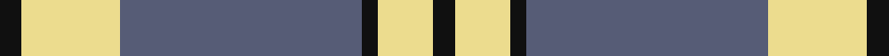
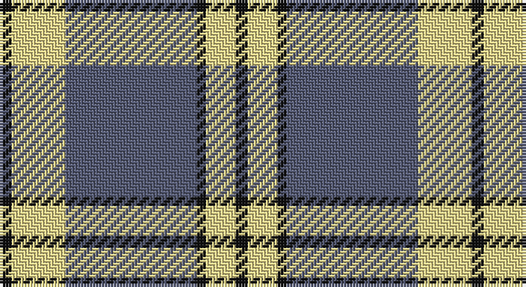

This page is one **sett** — a single exact thread-count. It belongs to the [tartan](/setts/k4ly18n44k3ly10k4/)
(the same proportion at any scale), whose colour order is pattern [KYBKYK](/stripes/kybkyk/).

Sourced from register-of-tartans.  It is a [6 stripe tartan](/stripes/stripes6/).

Original link https://www.tartanregister.gov.uk/tartanDetails.aspx?ref=10572

## Register references

External register numbers recorded for this tartan.

- Scottish Register of Tartans: [10572](https://www.tartanregister.gov.uk/tartanDetails.aspx?ref=10572)

## Thread count
K/4 LY18 N44 K3 LY10 K/4

One full sett is **158 threads**.

## Palette

Palette: <strong>Logan (The Scottish Gael, 1831)</strong> <small style="color:#888">(1 of 3 colours)</small>
<table><thead><tr><th>Colour</th><th>Threads</th><th>Shade</th><th>Base</th><th>OKLCh</th></tr></thead><tbody><tr><td>K/</td><td style="text-align:right;font-variant-numeric:tabular-nums">4</td><td><code style="background-color:#101010;">#101010</code> <small style="color:#888">#101010</small></td><td>K <code style="background-color:#000000;">#000000</code></td><td><small style="color:#888">oklch(17.3% 0.000 89.9)</small></td></tr><tr><td>LY</td><td style="text-align:right;font-variant-numeric:tabular-nums">18</td><td><code style="background-color:#ECDC8E;">#ECDC8E</code> <small style="color:#888">#ECDC8E</small></td><td>Y <code style="background-color:#F2BF00;">#F2BF00</code></td><td><small style="color:#888">oklch(89.0% 0.100 98.0)</small></td></tr><tr><td>N</td><td style="text-align:right;font-variant-numeric:tabular-nums">44</td><td><code style="background-color:#565C76;">#565C76</code> <small style="color:#888">#565C76</small></td><td>B <code style="background-color:#2A418A;">#2A418A</code></td><td><small style="color:#888">oklch(48.0% 0.043 274.6)</small></td></tr><tr><td>K</td><td style="text-align:right;font-variant-numeric:tabular-nums">3</td><td><code style="background-color:#101010;">#101010</code> <small style="color:#888">#101010</small></td><td>K <code style="background-color:#000000;">#000000</code></td><td><small style="color:#888">oklch(17.3% 0.000 89.9)</small></td></tr><tr><td>LY</td><td style="text-align:right;font-variant-numeric:tabular-nums">10</td><td><code style="background-color:#ECDC8E;">#ECDC8E</code> <small style="color:#888">#ECDC8E</small></td><td>Y <code style="background-color:#F2BF00;">#F2BF00</code></td><td><small style="color:#888">oklch(89.0% 0.100 98.0)</small></td></tr><tr><td>K/</td><td style="text-align:right;font-variant-numeric:tabular-nums">4</td><td><code style="background-color:#101010;">#101010</code> <small style="color:#888">#101010</small></td><td>K <code style="background-color:#000000;">#000000</code></td><td><small style="color:#888">oklch(17.3% 0.000 89.9)</small></td></tr></tbody></table>

# Sample pattern

## Nearest tartans

The nearest existing variants by ΔTartan distance, with this tartan at the top so the swatches line up against it.

ΔTartan

Tartan

Sett

—

<a href="/ttd/edit/#slug=k4ly18n44k3ly10k4">Stutterheim</a> <a class="nn-out" href="/variants/s6/k4ly18n44k3ly10k4/" title="open its dictionary page">↗</a>

0.79

<a href="/ttd/edit/#slug=lb40k3lb3k3lb3o8k24o8~x2&amp;base=k4ly18n44k3ly10k4">O'Sullivan-Beare (Family)</a> <a class="nn-out" href="/variants/s8/lb40k3lb3k3lb3o8k24o8~x2/" title="open its dictionary page">↗</a>

0.94

<a href="/ttd/edit/#slug=k4ly18db44k3ly10k4&amp;base=k4ly18n44k3ly10k4">Stutterheim (Corporate)</a> <a class="nn-out" href="/variants/s6/k4ly18db44k3ly10k4/" title="open its dictionary page">↗</a>

1.06

<a href="/ttd/edit/#slug=lb3k3lb3k3o15r1~x4&amp;base=k4ly18n44k3ly10k4">Tiree Grey</a> <a class="nn-out" href="/variants/s6/lb3k3lb3k3o15r1~x4/" title="open its dictionary page">↗</a>

1.09

<a href="/ttd/edit/#slug=w6b3w20k2w3k25w3~x2&amp;base=k4ly18n44k3ly10k4">Forbes Dress (Clans Originaux)</a> <a class="nn-out" href="/variants/s7/w6b3w20k2w3k25w3~x2/" title="open its dictionary page">↗</a>

1.13

<a href="/ttd/edit/#slug=w5r3w35k28w4k11w2~x2&amp;base=k4ly18n44k3ly10k4">MacPherson of Cluny (Black and White)</a> <a class="nn-out" href="/variants/s7/w5r3w35k28w4k11w2~x2/" title="open its dictionary page">↗</a>

1.14

<a href="/ttd/edit/#slug=db19w1db6w1db2w2ly2w1ly18~x4&amp;base=k4ly18n44k3ly10k4">Highland Park High School (Texas)</a> <a class="nn-out" href="/variants/s9/db19w1db6w1db2w2ly2w1ly18~x4/" title="open its dictionary page">↗</a>

1.20

<a href="/ttd/edit/#slug=w1m2w17k11w2k4ly1~x4&amp;base=k4ly18n44k3ly10k4">MacPherson - 1842 (VS) Dress</a> <a class="nn-out" href="/variants/s7/w1m2w17k11w2k4ly1~x4/" title="open its dictionary page">↗</a>

1.22

<a href="/ttd/edit/#slug=dp2k1dp16g17w2~x4&amp;base=k4ly18n44k3ly10k4">Kansai Highland Games</a> <a class="nn-out" href="/variants/s5/dp2k1dp16g17w2~x4/" title="open its dictionary page">↗</a>

1.24

<a href="/ttd/edit/#slug=lo72dt16w9dt4w5dt16~x2&amp;base=k4ly18n44k3ly10k4">Machair</a> <a class="nn-out" href="/variants/s6/lo72dt16w9dt4w5dt16~x2/" title="open its dictionary page">↗</a>

1.25

<a href="/ttd/edit/#slug=dp2k1dp16g16w2~x4&amp;base=k4ly18n44k3ly10k4">Kansai Highland Games Corporate Tartan</a> <a class="nn-out" href="/variants/s5/dp2k1dp16g16w2~x4/" title="open its dictionary page">↗</a>

## Neighbour map

Every grey dot is one of 14360 variants placed by the first two principal components of the ΔTartan feature space (44% of its variance). Red is this tartan; blue dots are its nearest — click one to open its page.

<svg viewBox="0 0 640 380" role="img" style="max-width:100%;height:auto;border:1px solid #e0e0e0;border-radius:4px;display:block" xmlns="http://www.w3.org/2000/svg"><image href="/nn/cloud.v1.png" width="640" height="380"/><a href="/variants/s8/lb40k3lb3k3lb3o8k24o8~x2/"><circle cx="272.9" cy="162.1" r="4" fill="#3465a4"><title>O'Sullivan-Beare (Family)</title></circle></a><a href="/variants/s6/k4ly18db44k3ly10k4/"><circle cx="297.5" cy="177.6" r="4" fill="#3465a4"><title>Stutterheim (Corporate)</title></circle></a><a href="/variants/s6/lb3k3lb3k3o15r1~x4/"><circle cx="290.6" cy="171.5" r="4" fill="#3465a4"><title>Tiree Grey</title></circle></a><a href="/variants/s7/w6b3w20k2w3k25w3~x2/"><circle cx="281.1" cy="170.5" r="4" fill="#3465a4"><title>Forbes Dress (Clans Originaux)</title></circle></a><a href="/variants/s7/w5r3w35k28w4k11w2~x2/"><circle cx="300.9" cy="158.2" r="4" fill="#3465a4"><title>MacPherson of Cluny (Black and White)</title></circle></a><a href="/variants/s9/db19w1db6w1db2w2ly2w1ly18~x4/"><circle cx="305.4" cy="136.7" r="4" fill="#3465a4"><title>Highland Park High School (Texas)</title></circle></a><a href="/variants/s7/w1m2w17k11w2k4ly1~x4/"><circle cx="280.8" cy="140.6" r="4" fill="#3465a4"><title>MacPherson - 1842 (VS) Dress</title></circle></a><a href="/variants/s5/dp2k1dp16g17w2~x4/"><circle cx="287.5" cy="176.9" r="4" fill="#3465a4"><title>Kansai Highland Games</title></circle></a><a href="/variants/s6/lo72dt16w9dt4w5dt16~x2/"><circle cx="381.1" cy="179.0" r="4" fill="#3465a4"><title>Machair</title></circle></a><a href="/variants/s5/dp2k1dp16g16w2~x4/"><circle cx="292.1" cy="181.0" r="4" fill="#3465a4"><title>Kansai Highland Games Corporate Tartan</title></circle></a><circle cx="305.0" cy="178.3" r="5" fill="#c00000"/></svg>

ID: /variants/s6/k4ly18n44k3ly10k4/
