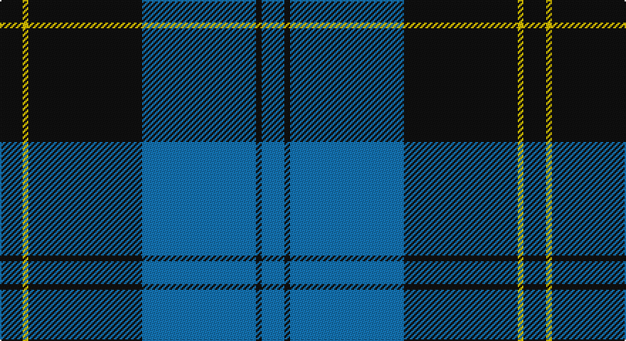

This page is one **sett** — a single exact thread-count. It belongs to the [tartan](/setts/k4ly1k20b20k1b4/)
(the same proportion at any scale), whose colour order is pattern [BKBKYK](/stripes/bkbkyk/).

Sourced from tartans-authority.  It is a [6 stripe tartan](/stripes/stripes6/).

Original link http://www.tartansauthority.com/tartan-ferret/display/6017/

## Register references

External register numbers recorded for this tartan.

- Scottish Tartans Authority (ITI): 6017

## Thread count
K/16 Y4 K80 B80 K4 B/16

One full sett is **368 threads**.

## Palette

Palette: <strong>Tartan Register</strong>
<table><thead><tr><th>Colour</th><th>Threads</th><th>Shade</th><th>Base</th><th>OKLCh</th></tr></thead><tbody><tr><td>K/</td><td style="text-align:right;font-variant-numeric:tabular-nums">16</td><td><code style="background-color:#101010;">#101010</code> <small style="color:#888">#101010</small></td><td>K <code style="background-color:#000000;">#000000</code></td><td><small style="color:#888">oklch(17.3% 0.000 89.9)</small></td></tr><tr><td>Y</td><td style="text-align:right;font-variant-numeric:tabular-nums">4</td><td><code style="background-color:#E8C000;">#E8C000</code> <small style="color:#888">#E8C000</small></td><td>Y <code style="background-color:#F2BF00;">#F2BF00</code></td><td><small style="color:#888">oklch(81.9% 0.168 93.7)</small></td></tr><tr><td>K</td><td style="text-align:right;font-variant-numeric:tabular-nums">80</td><td><code style="background-color:#101010;">#101010</code> <small style="color:#888">#101010</small></td><td>K <code style="background-color:#000000;">#000000</code></td><td><small style="color:#888">oklch(17.3% 0.000 89.9)</small></td></tr><tr><td>B</td><td style="text-align:right;font-variant-numeric:tabular-nums">80</td><td><code style="background-color:#1474B4;">#1474B4</code> <small style="color:#888">#1474B4</small></td><td>B <code style="background-color:#2A418A;">#2A418A</code></td><td><small style="color:#888">oklch(54.0% 0.129 245.1)</small></td></tr><tr><td>K</td><td style="text-align:right;font-variant-numeric:tabular-nums">4</td><td><code style="background-color:#101010;">#101010</code> <small style="color:#888">#101010</small></td><td>K <code style="background-color:#000000;">#000000</code></td><td><small style="color:#888">oklch(17.3% 0.000 89.9)</small></td></tr><tr><td>B/</td><td style="text-align:right;font-variant-numeric:tabular-nums">16</td><td><code style="background-color:#1474B4;">#1474B4</code> <small style="color:#888">#1474B4</small></td><td>B <code style="background-color:#2A418A;">#2A418A</code></td><td><small style="color:#888">oklch(54.0% 0.129 245.1)</small></td></tr></tbody></table>

# Sample pattern

## Nearest tartans

The nearest existing variants by ΔTartan distance, with this tartan at the top so the swatches line up against it.

ΔTartan

Tartan

Sett

—

<a href="/ttd/edit/#slug=k4ly1k20b20k1b4~x4">Oakleigh (Corporate)</a> <a class="nn-out" href="/variants/s6/k4ly1k20b20k1b4~x4/" title="open its dictionary page">↗</a>

0.70

<a href="/ttd/edit/#slug=k4lb2k28b30k1b3~x2&amp;base=k4ly1k20b20k1b4~x4">Ramsay Blue Hunting</a> <a class="nn-out" href="/variants/s6/k4lb2k28b30k1b3~x2/" title="open its dictionary page">↗</a>

1.10

<a href="/ttd/edit/#slug=r1b1k17b17k1w1~x4&amp;base=k4ly1k20b20k1b4~x4">Sorbie (Name)</a> <a class="nn-out" href="/variants/s6/r1b1k17b17k1w1~x4/" title="open its dictionary page">↗</a>

1.22

<a href="/ttd/edit/#slug=m4k28b3k3b25k3~x2&amp;base=k4ly1k20b20k1b4~x4">Slanj (Corporate)</a> <a class="nn-out" href="/variants/s6/m4k28b3k3b25k3~x2/" title="open its dictionary page">↗</a>

1.26

<a href="/ttd/edit/#slug=db52k28w5k3w2k10&amp;base=k4ly1k20b20k1b4~x4">St Andrews, Earl of</a> <a class="nn-out" href="/variants/s6/db52k28w5k3w2k10/" title="open its dictionary page">↗</a>

1.31

<a href="/ttd/edit/#slug=k30b40ly3b5w2b6~x2&amp;base=k4ly1k20b20k1b4~x4">Micron</a> <a class="nn-out" href="/variants/s6/k30b40ly3b5w2b6~x2/" title="open its dictionary page">↗</a>

1.31

<a href="/ttd/edit/#slug=r3k1b27k27w3~x2&amp;base=k4ly1k20b20k1b4~x4">Bro-Spirit of Northmen (Corporate)</a> <a class="nn-out" href="/variants/s5/r3k1b27k27w3~x2/" title="open its dictionary page">↗</a>

1.34

<a href="/variants/s8/g47r3g6db35lo3~x2/">Gracie</a>

1.35

<a href="/ttd/edit/#slug=k36r3k3r3k9b36g3b2~x2&amp;base=k4ly1k20b20k1b4~x4">Home (Clan)</a> <a class="nn-out" href="/variants/s8/k36r3k3r3k9b36g3b2~x2/" title="open its dictionary page">↗</a>

1.35

<a href="/ttd/edit/#slug=db23w1db1w1db8g22r1db3~x4&amp;base=k4ly1k20b20k1b4~x4">Roxburgh, Green (District)</a> <a class="nn-out" href="/variants/s8/db23w1db1w1db8g22r1db3~x4/" title="open its dictionary page">↗</a>

1.38

<a href="/ttd/edit/#slug=k1ly2k3n12k18w1~x2&amp;base=k4ly1k20b20k1b4~x4">Jon's Theme</a> <a class="nn-out" href="/variants/s6/k1ly2k3n12k18w1~x2/" title="open its dictionary page">↗</a>

## Neighbour map

Every grey dot is one of 14360 variants placed by the first two principal components of the ΔTartan feature space (44% of its variance). Red is this tartan; blue dots are its nearest — click one to open its page.

<svg viewBox="0 0 640 380" role="img" style="max-width:100%;height:auto;border:1px solid #e0e0e0;border-radius:4px;display:block" xmlns="http://www.w3.org/2000/svg"><image href="/nn/cloud.v1.png" width="640" height="380"/><a href="/variants/s6/k4lb2k28b30k1b3~x2/"><circle cx="365.8" cy="178.8" r="4" fill="#3465a4"><title>Ramsay Blue Hunting</title></circle></a><a href="/variants/s6/r1b1k17b17k1w1~x4/"><circle cx="315.5" cy="173.3" r="4" fill="#3465a4"><title>Sorbie (Name)</title></circle></a><a href="/variants/s6/m4k28b3k3b25k3~x2/"><circle cx="323.2" cy="228.3" r="4" fill="#3465a4"><title>Slanj (Corporate)</title></circle></a><a href="/variants/s6/db52k28w5k3w2k10/"><circle cx="368.9" cy="189.4" r="4" fill="#3465a4"><title>St Andrews, Earl of</title></circle></a><a href="/variants/s6/k30b40ly3b5w2b6~x2/"><circle cx="354.9" cy="175.7" r="4" fill="#3465a4"><title>Micron</title></circle></a><a href="/variants/s5/r3k1b27k27w3~x2/"><circle cx="303.4" cy="174.7" r="4" fill="#3465a4"><title>Bro-Spirit of Northmen (Corporate)</title></circle></a><a href="/variants/s8/g47r3g6db35lo3~x2/"><circle cx="326.0" cy="190.4" r="4" fill="#3465a4"><title>Gracie</title></circle></a><a href="/variants/s8/k36r3k3r3k9b36g3b2~x2/"><circle cx="318.2" cy="161.4" r="4" fill="#3465a4"><title>Home (Clan)</title></circle></a><a href="/variants/s8/db23w1db1w1db8g22r1db3~x4/"><circle cx="374.5" cy="158.4" r="4" fill="#3465a4"><title>Roxburgh, Green (District)</title></circle></a><a href="/variants/s6/k1ly2k3n12k18w1~x2/"><circle cx="366.0" cy="187.5" r="4" fill="#3465a4"><title>Jon's Theme</title></circle></a><circle cx="352.7" cy="200.8" r="5" fill="#c00000"/></svg>

ID: /variants/s6/k4ly1k20b20k1b4~x4/
