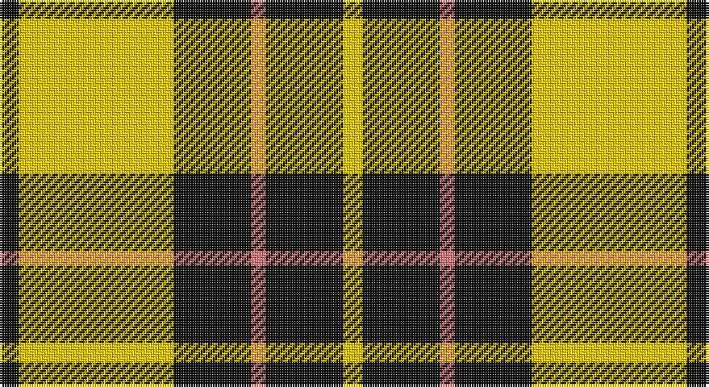

This page is one **sett** — a single exact thread-count. It belongs to the [tartan](/setts/k4ly32k16r3k16ly4/)
(the same proportion at any scale), whose colour order is pattern [KYKRKY](/stripes/kykrky/).

Part of the [Unnamed C21st](/tartans/unnamed-c21st/) tartan — the named design grouping this sett with its other cloths.

Sourced from tartans-authority.  It is a [6 stripe tartan](/stripes/stripes6/).

Original link http://www.tartansauthority.com/tartan-ferret/display/8723/

## Register references

External register numbers recorded for this tartan.

- Scottish Register of Tartans: [8723](https://www.tartanregister.gov.uk/tartanDetails?ref=8723)
- Scottish Tartans Authority (ITI): 8723

## Thread count
K/8 Y64 K32 LR6 K32 Y/8

One full sett is **284 threads**.

## Palette

Palette: <strong>Tartan Register</strong>
<table><thead><tr><th>Colour</th><th>Threads</th><th>Shade</th><th>Base</th><th>OKLCh</th></tr></thead><tbody><tr><td>K/</td><td style="text-align:right;font-variant-numeric:tabular-nums">8</td><td><code style="background-color:#101010;">#101010</code> <small style="color:#888">#101010</small></td><td>K <code style="background-color:#000000;">#000000</code></td><td><small style="color:#888">oklch(17.3% 0.000 89.9)</small></td></tr><tr><td>Y</td><td style="text-align:right;font-variant-numeric:tabular-nums">64</td><td><code style="background-color:#FCCC00;">#FCCC00</code> <small style="color:#888">#FCCC00</small></td><td>Y <code style="background-color:#F2BF00;">#F2BF00</code></td><td><small style="color:#888">oklch(86.2% 0.176 91.5)</small></td></tr><tr><td>K</td><td style="text-align:right;font-variant-numeric:tabular-nums">32</td><td><code style="background-color:#101010;">#101010</code> <small style="color:#888">#101010</small></td><td>K <code style="background-color:#000000;">#000000</code></td><td><small style="color:#888">oklch(17.3% 0.000 89.9)</small></td></tr><tr><td>LR</td><td style="text-align:right;font-variant-numeric:tabular-nums">6</td><td><code style="background-color:#E87878;">#E87878</code> <small style="color:#888">#E87878</small></td><td>R <code style="background-color:#CC0000;">#CC0000</code></td><td><small style="color:#888">oklch(70.0% 0.139 21.2)</small></td></tr><tr><td>K</td><td style="text-align:right;font-variant-numeric:tabular-nums">32</td><td><code style="background-color:#101010;">#101010</code> <small style="color:#888">#101010</small></td><td>K <code style="background-color:#000000;">#000000</code></td><td><small style="color:#888">oklch(17.3% 0.000 89.9)</small></td></tr><tr><td>Y/</td><td style="text-align:right;font-variant-numeric:tabular-nums">8</td><td><code style="background-color:#FCCC00;">#FCCC00</code> <small style="color:#888">#FCCC00</small></td><td>Y <code style="background-color:#F2BF00;">#F2BF00</code></td><td><small style="color:#888">oklch(86.2% 0.176 91.5)</small></td></tr></tbody></table>

# Sample pattern

## Nearest tartans

The nearest existing variants by ΔTartan distance, with this tartan at the top so the swatches line up against it.

ΔTartan

Tartan

Sett

—

<a href="/ttd/edit/#slug=k4ly32k16r3k16ly4~x2">Unnamed C21st - Fashion</a> <a class="nn-out" href="/variants/s6/k4ly32k16r3k16ly4~x2/" title="open its dictionary page">↗</a>

0.54

<a href="/ttd/edit/#slug=k6ly1k6ly9r1ly2~x2&amp;base=k4ly32k16r3k16ly4~x2">MacLeod #3</a> <a class="nn-out" href="/variants/s6/k6ly1k6ly9r1ly2~x2/" title="open its dictionary page">↗</a>

0.77

<a href="/ttd/edit/#slug=k2ly6k2ly11k9r1~x2&amp;base=k4ly32k16r3k16ly4~x2">Porter Drinkers', The</a> <a class="nn-out" href="/variants/s6/k2ly6k2ly11k9r1~x2/" title="open its dictionary page">↗</a>

1.05

<a href="/ttd/edit/#slug=k8ly1k8ly12r1~x4&amp;base=k4ly32k16r3k16ly4~x2">MacLeod of Lewis (Vestiarium Scoticum)</a> <a class="nn-out" href="/variants/s5/k8ly1k8ly12r1~x4/" title="open its dictionary page">↗</a>

1.21

<a href="/ttd/edit/#slug=k10ly2k10w2k2ly13w3~x2&amp;base=k4ly32k16r3k16ly4~x2">Nooten-Boom (Personal)</a> <a class="nn-out" href="/variants/s7/k10ly2k10w2k2ly13w3~x2/" title="open its dictionary page">↗</a>

1.29

<a href="/ttd/edit/#slug=w5ly32dt32ly5~x2&amp;base=k4ly32k16r3k16ly4~x2">Barclay Dress</a> <a class="nn-out" href="/variants/s4/w5ly32dt32ly5~x2/" title="open its dictionary page">↗</a>

1.32

<a href="/ttd/edit/#slug=w1ly6k6ly1~x8&amp;base=k4ly32k16r3k16ly4~x2">Barclay Dress Clan Tartan</a> <a class="nn-out" href="/variants/s4/w1ly6k6ly1~x8/" title="open its dictionary page">↗</a>

1.32

<a href="/ttd/edit/#slug=k6ly2k21ly2k6ly24k2ly6~x2&amp;base=k4ly32k16r3k16ly4~x2">MacLachlan (Chief's Dress)</a> <a class="nn-out" href="/variants/s8/k6ly2k21ly2k6ly24k2ly6~x2/" title="open its dictionary page">↗</a>

1.32

<a href="/ttd/edit/#slug=ly1k4ly1k4ly11m1ly1~x4&amp;base=k4ly32k16r3k16ly4~x2">Baillieville</a> <a class="nn-out" href="/variants/s7/ly1k4ly1k4ly11m1ly1~x4/" title="open its dictionary page">↗</a>

1.37

<a href="/ttd/edit/#slug=k4ly1k4ly6r1~x4&amp;base=k4ly32k16r3k16ly4~x2">MacLeod Dress Clan Tartan</a> <a class="nn-out" href="/variants/s5/k4ly1k4ly6r1~x4/" title="open its dictionary page">↗</a>

1.40

<a href="/ttd/edit/#slug=ly1k4ly1k4ly11r1ly1~x4&amp;base=k4ly32k16r3k16ly4~x2">Baileville (Personal)</a> <a class="nn-out" href="/variants/s7/ly1k4ly1k4ly11r1ly1~x4/" title="open its dictionary page">↗</a>

## Neighbour map

Every grey dot is one of 14360 variants placed by the first two principal components of the ΔTartan feature space (44% of its variance). Red is this tartan; blue dots are its nearest — click one to open its page.

<svg viewBox="0 0 640 380" role="img" style="max-width:100%;height:auto;border:1px solid #e0e0e0;border-radius:4px;display:block" xmlns="http://www.w3.org/2000/svg"><image href="/nn/cloud.v1.png" width="640" height="380"/><a href="/variants/s6/k6ly1k6ly9r1ly2~x2/"><circle cx="255.3" cy="217.7" r="4" fill="#3465a4"><title>MacLeod #3</title></circle></a><a href="/variants/s6/k2ly6k2ly11k9r1~x2/"><circle cx="286.5" cy="202.7" r="4" fill="#3465a4"><title>Porter Drinkers', The</title></circle></a><a href="/variants/s5/k8ly1k8ly12r1~x4/"><circle cx="296.0" cy="220.8" r="4" fill="#3465a4"><title>MacLeod of Lewis (Vestiarium Scoticum)</title></circle></a><a href="/variants/s7/k10ly2k10w2k2ly13w3~x2/"><circle cx="234.8" cy="220.3" r="4" fill="#3465a4"><title>Nooten-Boom (Personal)</title></circle></a><a href="/variants/s4/w5ly32dt32ly5~x2/"><circle cx="248.2" cy="242.4" r="4" fill="#3465a4"><title>Barclay Dress</title></circle></a><a href="/variants/s4/w1ly6k6ly1~x8/"><circle cx="240.6" cy="245.8" r="4" fill="#3465a4"><title>Barclay Dress Clan Tartan</title></circle></a><a href="/variants/s8/k6ly2k21ly2k6ly24k2ly6~x2/"><circle cx="321.8" cy="196.7" r="4" fill="#3465a4"><title>MacLachlan (Chief's Dress)</title></circle></a><a href="/variants/s7/ly1k4ly1k4ly11m1ly1~x4/"><circle cx="329.7" cy="174.1" r="4" fill="#3465a4"><title>Baillieville</title></circle></a><a href="/variants/s5/k4ly1k4ly6r1~x4/"><circle cx="233.8" cy="251.7" r="4" fill="#3465a4"><title>MacLeod Dress Clan Tartan</title></circle></a><a href="/variants/s7/ly1k4ly1k4ly11r1ly1~x4/"><circle cx="334.4" cy="174.5" r="4" fill="#3465a4"><title>Baileville (Personal)</title></circle></a><circle cx="266.6" cy="199.1" r="5" fill="#c00000"/></svg>

ID: /variants/s6/k4ly32k16r3k16ly4~x2/
