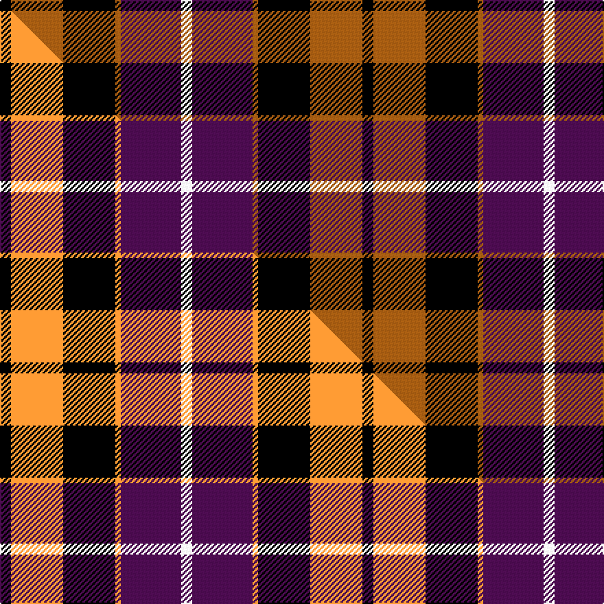

This is one **variant** — a specific cloth: this exact thread count and colourway, with its own
provenance below. It is one weaving of the [sett](/tartans/d/du/dutch/) (the scale-free proportion — the
same cloth at any scale or shade), whose colour order is pattern [KRKRBW](/stripes/krkrbw/).

Part of the [Dutch](/tartans/d/du/dutch/) tartan — the named design grouping this sett with its other cloths.

Sourced from tartans-authority.  It is a [6 stripe tartan](/stripes/stripes6/).

Original link <code>http://www.tartansauthority.com/tartan-ferret/display/1134/</code> — retired · [Internet Archive copy](https://web.archive.org/web/*/http://www.tartansauthority.com/tartan-ferret/display/1134/*)

Dataset <small>— provenance for this record, inherited from the source manifest</small>

<dl class="dataset-prov">
<dt>source</dt><dd><a href="/sources/tartans-authority/">Scottish Tartans Authority</a></dd>
<dt>data captured from</dt><dd><a href="https://github.com/thetartan/tartan-database/blob/master/data/tartans-authority/data.csv">https://github.com/thetartan/tartan-database/blob/master/data/tartans-authority/data.csv</a></dd>
<dt>data date</dt><dd>1965 <small>(this record)</small></dd>
<dt>licence</dt><dd><a href="https://creativecommons.org/licenses/by-nc-nd/4.0/">CC BY-NC-ND 4.0</a></dd>
</dl>

Capture chain <small>— the hands this data passed through, oldest first; each capture carries its own licence</small>

<ol class="capture-chain">
<li><a href="https://www.tartansauthority.com/">Scottish Tartans Authority</a> <small>the heritage body’s archive — its tartan-ferret record browser is retired; dead record links are shown unlinked, with an Internet Archive copy (ITI numbers are not SRT references)</small></li>
<li><a href="https://github.com/thetartan/tartan-database">thetartan/tartan-database</a> <small>2016-2017</small> · <a href="https://creativecommons.org/licenses/by-nc-nd/4.0/">CC BY-NC-ND 4.0</a> <small>Levko Kravets's frozen compilation — the capture we vendored, and where its CC licence text came from</small></li>
<li>this dictionary <small>captured 2026-06-10 · commit 5bf86c7566</small> <small>each re-capture is a git commit to data/sources</small></li>
</ol>

## Register references

External register numbers recorded for this tartan.

- Scottish Tartans Authority (ITI): 1134

## Thread count
K/8 O38 K38 O4 DP44 W/8

One full sett is **264 threads**.

## Palette
<table><thead><tr><th>Colour</th><th>Shade</th><th>OKLCh</th></tr></thead><tbody><tr><td>O</td><td><code style="background-color:#A65C11;">#A65C11</code> <small style="color:#888">#A65C11</small></td><td><small style="color:#888">oklch(55.0% 0.125 58.3)</small></td></tr><tr><td>DP</td><td><code style="background-color:#4B0B4F;">#4B0B4F</code> <small style="color:#888">#4B0B4F</small></td><td><small style="color:#888">oklch(30.1% 0.125 325.4)</small></td></tr><tr><td>K</td><td><code style="background-color:#000000;">#000000</code> <small style="color:#888">#000000</small></td><td><small style="color:#888">oklch(0.0% 0.000 0.0)</small></td></tr><tr><td>W</td><td><code style="background-color:#F7F7F7;">#F7F7F7</code> <small style="color:#888">#F7F7F7</small></td><td><small style="color:#888">oklch(97.6% 0.000 89.9)</small></td></tr></tbody></table>

# Sample pattern

[Sample sheet (PDF)](swatch.pdf) — the woven sample, thread count and palette on one printable A4, rendered on demand (the same sheet the TTD print page downloads).

## Compared to the master

This cloth is one sett of its design; the master sett (the exemplar the design is anchored on) is below for comparison.

Its **ΔTartan distance** from the master is **0.13** — the same measure the nearest-tartans table ranks by (0 is identical; a re-scale of the same cloth is near 0, a recolour or a different proportion further).

<figure class="master-compare" style="margin:0">

this sett
master sett ★

<figcaption style="color:#888;font-size:smaller">One weave of this sett against the <a href="/setts/k4lo19k19lo2dp22w4/">master sett ★</a>, split on the diagonal: a shared proportion runs seamlessly across it with only the shades shifting; a different proportion breaks on it.</figcaption>
</figure>

## Nearest tartan variants

The nearest existing variants by ΔTartan distance, with this cloth at the top so the swatches line up against it.

ΔTartan

Threads

Variant

Sett

—

264

<a href="/variants/s6/k4o19k19o2dp22w4~x2/">Dutch (District)</a>

<a href="/ttd/edit/#slug=k4lo19k19lo2dp22w4~x2&amp;base=k4o19k19o2dp22w4~x2" title="compare in the TTD">0.13</a>

264

<a href="/variants/s6/k4lo19k19lo2dp22w4~x2/">Dutch</a>

<a href="/ttd/edit/#slug=w2db12lo1k12lo12k1~x2&amp;base=k4o19k19o2dp22w4~x2" title="compare in the TTD">1.49</a>

154

<a href="/variants/s6/w2db12lo1k12lo12k1~x2/">Dutch District Tartan</a>

<a href="/ttd/edit/#slug=k60w8lo15dp74k14&amp;base=k4o19k19o2dp22w4~x2" title="compare in the TTD">1.88</a>

268

<a href="/variants/s5/k60w8lo15dp74k14/">Gingles (Personal)</a>

<a href="/ttd/edit/#slug=r3db3r20k20db20g3~x2&amp;base=k4o19k19o2dp22w4~x2" title="compare in the TTD">1.95</a>

264

<a href="/variants/s6/r3db3r20k20db20g3~x2/">Unidentified #65</a>

<a href="/ttd/edit/#slug=y5db2k2db12k16r20k2r4~x2&amp;base=k4o19k19o2dp22w4~x2" title="compare in the TTD">2.07</a>

234

<a href="/variants/s8/y5db2k2db12k16r20k2r4~x2/">Aitken</a>

<a href="/ttd/edit/#slug=ly3db22k3db3k11r20ly3~x2&amp;base=k4o19k19o2dp22w4~x2" title="compare in the TTD">2.36</a>

248

<a href="/variants/s7/ly3db22k3db3k11r20ly3~x2/">Biffy Clyro</a>

<a href="/ttd/edit/#slug=y3db22k3db3k11r20y3~x2&amp;base=k4o19k19o2dp22w4~x2" title="compare in the TTD">2.43</a>

248

<a href="/variants/s7/y3db22k3db3k11r20y3~x2/">Biffy Clyro</a>

<a href="/ttd/edit/#slug=n32w4n4k24dp29k4&amp;base=k4o19k19o2dp22w4~x2" title="compare in the TTD">2.45</a>

158

<a href="/variants/s6/n32w4n4k24dp29k4/">Grammar School at Leeds (School)</a>

<a href="/ttd/edit/#slug=r2dp8k8w1r2~x2&amp;base=k4o19k19o2dp22w4~x2" title="compare in the TTD">2.50</a>

76

<a href="/variants/s5/r2dp8k8w1r2~x2/">Inder (Corporate)</a>

<a href="/ttd/edit/#slug=r26lb3r4k16db16k4~x2&amp;base=k4o19k19o2dp22w4~x2" title="compare in the TTD">2.55</a>

216

<a href="/variants/s6/r26lb3r4k16db16k4~x2/">Graham of Menteith, (Red)</a>

## Neighbour map

Every grey dot is one of 13662 variants placed by the first two principal components of the ΔTartan feature space (42% of its variance). Red is this tartan; blue dots are its nearest — click one to open its page. The map is a flat projection of a many-dimensional space — [how to read it](/posts/neighbourhood-maps/).

<svg viewBox="0 0 640 380" role="img" style="max-width:100%;height:auto;border:1px solid #e0e0e0;border-radius:4px;display:block" xmlns="http://www.w3.org/2000/svg"><image href="/nn/cloud.v1.png" width="640" height="380"/><a href="/variants/s6/k4lo19k19lo2dp22w4~x2/"><circle cx="136.3" cy="193.6" r="4" fill="#3465a4"><title>Dutch</title></circle></a><a href="/variants/s6/w2db12lo1k12lo12k1~x2/"><circle cx="140.8" cy="186.2" r="4" fill="#3465a4"><title>Dutch District Tartan</title></circle></a><a href="/variants/s5/k60w8lo15dp74k14/"><circle cx="203.5" cy="193.6" r="4" fill="#3465a4"><title>Gingles (Personal)</title></circle></a><a href="/variants/s6/r3db3r20k20db20g3~x2/"><circle cx="138.8" cy="210.3" r="4" fill="#3465a4"><title>Unidentified #65</title></circle></a><a href="/variants/s8/y5db2k2db12k16r20k2r4~x2/"><circle cx="160.8" cy="169.6" r="4" fill="#3465a4"><title>Aitken</title></circle></a><a href="/variants/s7/ly3db22k3db3k11r20ly3~x2/"><circle cx="152.5" cy="188.8" r="4" fill="#3465a4"><title>Biffy Clyro</title></circle></a><a href="/variants/s7/y3db22k3db3k11r20y3~x2/"><circle cx="162.7" cy="191.3" r="4" fill="#3465a4"><title>Biffy Clyro</title></circle></a><a href="/variants/s6/n32w4n4k24dp29k4/"><circle cx="171.2" cy="209.6" r="4" fill="#3465a4"><title>Grammar School at Leeds (School)</title></circle></a><a href="/variants/s5/r2dp8k8w1r2~x2/"><circle cx="176.0" cy="209.9" r="4" fill="#3465a4"><title>Inder (Corporate)</title></circle></a><a href="/variants/s6/r26lb3r4k16db16k4~x2/"><circle cx="180.9" cy="194.0" r="4" fill="#3465a4"><title>Graham of Menteith, (Red)</title></circle></a><circle cx="141.8" cy="191.7" r="5" fill="#c00000"/><text x="320" y="376" text-anchor="middle" font-size="11" fill="#999">ground</text><text x="11" y="190" text-anchor="middle" font-size="11" fill="#999" transform="rotate(-90 11 190)">complexity</text></svg>

ID: /variants/s6/k4o19k19o2dp22w4~x2/
