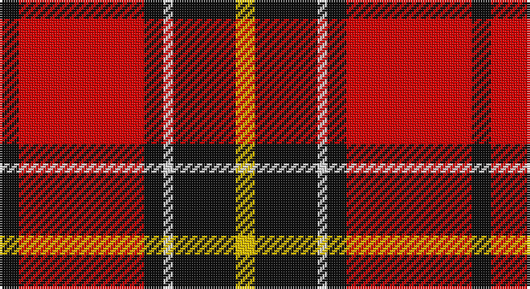

This page is one **sett** — a single exact thread-count. It belongs to the [tartan](/setts/k4r26k4w2k13ly4/)
(the same proportion at any scale), whose colour order is pattern [KRKWKY](/stripes/krkwky/).

Part of the [Dunbar](/tartans/dunbar/) tartan — the named design grouping this sett with its other cloths.

Sourced from register-of-tartans.  It is a [6 stripe tartan](/stripes/stripes6/).

Original link https://www.tartanregister.gov.uk/tartanDetails.aspx?ref=1015

## Also known as

This cloth is also recorded under:

- Dunbar #2
- Dunbar Ancient
- Dunbar Plaid
- Dunbar, Plaid

2 attestations — the source records this cloth was collapsed from (oldest owns this page)

<ul>
<li>undated — Dunbar #2 (register-of-tartans, <a href="https://www.tartanregister.gov.uk/tartanDetails.aspx?ref=1015">record</a>)</li>
<li>undated — Dunbar (weddslist, <a href="http://www.weddslist.com/cgi-bin/tartans/pg.pl?source=sts">record</a>)</li>
</ul>

## Register references

External register numbers recorded for this tartan.

- Scottish Register of Tartans: [1015](https://www.tartanregister.gov.uk/tartanDetails.aspx?ref=1015)
- Scottish Tartans World Register: 2045

## Thread count
K/8 R52 K8 LN4 K26 Y/8

One full sett is **196 threads**.

## Palette

Palette: <strong>Tartan Register</strong>
<table><thead><tr><th>Colour</th><th>Threads</th><th>Shade</th><th>Base</th><th>OKLCh</th></tr></thead><tbody><tr><td>K/</td><td style="text-align:right;font-variant-numeric:tabular-nums">8</td><td><code style="background-color:#101010;">#101010</code> <small style="color:#888">#101010</small></td><td>K <code style="background-color:#000000;">#000000</code></td><td><small style="color:#888">oklch(17.3% 0.000 89.9)</small></td></tr><tr><td>R</td><td style="text-align:right;font-variant-numeric:tabular-nums">52</td><td><code style="background-color:#DC0000;">#DC0000</code> <small style="color:#888">#DC0000</small></td><td>R <code style="background-color:#CC0000;">#CC0000</code></td><td><small style="color:#888">oklch(56.2% 0.230 29.2)</small></td></tr><tr><td>K</td><td style="text-align:right;font-variant-numeric:tabular-nums">8</td><td><code style="background-color:#101010;">#101010</code> <small style="color:#888">#101010</small></td><td>K <code style="background-color:#000000;">#000000</code></td><td><small style="color:#888">oklch(17.3% 0.000 89.9)</small></td></tr><tr><td>LN</td><td style="text-align:right;font-variant-numeric:tabular-nums">4</td><td><code style="background-color:#E0E0E0;">#E0E0E0</code> <small style="color:#888">#E0E0E0</small></td><td>W <code style="background-color:#F7F7F7;">#F7F7F7</code></td><td><small style="color:#888">oklch(90.7% 0.000 89.9)</small></td></tr><tr><td>K</td><td style="text-align:right;font-variant-numeric:tabular-nums">26</td><td><code style="background-color:#101010;">#101010</code> <small style="color:#888">#101010</small></td><td>K <code style="background-color:#000000;">#000000</code></td><td><small style="color:#888">oklch(17.3% 0.000 89.9)</small></td></tr><tr><td>Y/</td><td style="text-align:right;font-variant-numeric:tabular-nums">8</td><td><code style="background-color:#E8C000;">#E8C000</code> <small style="color:#888">#E8C000</small></td><td>Y <code style="background-color:#F2BF00;">#F2BF00</code></td><td><small style="color:#888">oklch(81.9% 0.168 93.7)</small></td></tr></tbody></table>

# Sample pattern

## Compared to the master

This cloth is one sett of its design; the master sett (the exemplar the design is anchored on) is below for comparison.

<figure style="margin:0"><figcaption style="color:#888;font-size:smaller">this sett</figcaption></figure>
<figure style="margin:0"><figcaption style="color:#888;font-size:smaller"><a href="/setts/r28k4w2k13/">master sett →</a></figcaption></figure>

## Nearest tartans

The nearest existing variants by ΔTartan distance, with this tartan at the top so the swatches line up against it.

ΔTartan

Tartan

Sett

—

<a href="/ttd/edit/#slug=k4r26k4w2k13ly4~x2">Dunbar #2</a> <a class="nn-out" href="/variants/s6/k4r26k4w2k13ly4~x2/" title="open its dictionary page">↗</a>

0.65

<a href="/ttd/edit/#slug=r6k3r29k23w4k7ly3~x2&amp;base=k4r26k4w2k13ly4~x2">MacPherson Red Cluny</a> <a class="nn-out" href="/variants/s7/r6k3r29k23w4k7ly3~x2/" title="open its dictionary page">↗</a>

0.91

<a href="/ttd/edit/#slug=r5w2r28k12dg16r3~x2&amp;base=k4r26k4w2k13ly4~x2">MacKintosh #4</a> <a class="nn-out" href="/variants/s6/r5w2r28k12dg16r3~x2/" title="open its dictionary page">↗</a>

0.95

<a href="/ttd/edit/#slug=r5m2r30k28w2k4~x2&amp;base=k4r26k4w2k13ly4~x2">Ramsay Red Clan Tartan</a> <a class="nn-out" href="/variants/s6/r5m2r30k28w2k4~x2/" title="open its dictionary page">↗</a>

0.99

<a href="/ttd/edit/#slug=r5w2r28k12g16r3~x2&amp;base=k4r26k4w2k13ly4~x2">MacKintosh 6</a> <a class="nn-out" href="/variants/s6/r5w2r28k12g16r3~x2/" title="open its dictionary page">↗</a>

1.09

<a href="/ttd/edit/#slug=db1r12k6ly1k6db1~x4&amp;base=k4r26k4w2k13ly4~x2">Cetoloni (Personal)</a> <a class="nn-out" href="/variants/s6/db1r12k6ly1k6db1~x4/" title="open its dictionary page">↗</a>

1.13

<a href="/ttd/edit/#slug=r1db6r1dg6r12lb1&amp;base=k4r26k4w2k13ly4~x2">Fraser VS</a> <a class="nn-out" href="/variants/s6/r1db6r1dg6r12lb1/" title="open its dictionary page">↗</a>

1.14

<a href="/ttd/edit/#slug=g1r13k8ly1~x6&amp;base=k4r26k4w2k13ly4~x2">Billy Apple® Red</a> <a class="nn-out" href="/variants/s4/g1r13k8ly1~x6/" title="open its dictionary page">↗</a>

1.18

<a href="/variants/s6/r28k4w2k13~x2/">Dunbar Ancient</a>

1.20

<a href="/ttd/edit/#slug=r4k2r24k6db6g16r3~x2&amp;base=k4r26k4w2k13ly4~x2">MacDuff</a> <a class="nn-out" href="/variants/s7/r4k2r24k6db6g16r3~x2/" title="open its dictionary page">↗</a>

1.21

<a href="/ttd/edit/#slug=r80k52w7o12&amp;base=k4r26k4w2k13ly4~x2">Oklahoma State University (Corporate</a> <a class="nn-out" href="/variants/s4/r80k52w7o12/" title="open its dictionary page">↗</a>

## Neighbour map

Every grey dot is one of 14360 variants placed by the first two principal components of the ΔTartan feature space (44% of its variance). Red is this tartan; blue dots are its nearest — click one to open its page.

<svg viewBox="0 0 640 380" role="img" style="max-width:100%;height:auto;border:1px solid #e0e0e0;border-radius:4px;display:block" xmlns="http://www.w3.org/2000/svg"><image href="/nn/cloud.v1.png" width="640" height="380"/><a href="/variants/s7/r6k3r29k23w4k7ly3~x2/"><circle cx="260.4" cy="175.4" r="4" fill="#3465a4"><title>MacPherson Red Cluny</title></circle></a><a href="/variants/s6/r5w2r28k12dg16r3~x2/"><circle cx="300.2" cy="181.9" r="4" fill="#3465a4"><title>MacKintosh #4</title></circle></a><a href="/variants/s6/r5m2r30k28w2k4~x2/"><circle cx="324.6" cy="169.5" r="4" fill="#3465a4"><title>Ramsay Red Clan Tartan</title></circle></a><a href="/variants/s6/r5w2r28k12g16r3~x2/"><circle cx="282.9" cy="178.5" r="4" fill="#3465a4"><title>MacKintosh 6</title></circle></a><a href="/variants/s6/db1r12k6ly1k6db1~x4/"><circle cx="272.6" cy="188.5" r="4" fill="#3465a4"><title>Cetoloni (Personal)</title></circle></a><a href="/variants/s6/r1db6r1dg6r12lb1/"><circle cx="280.6" cy="185.4" r="4" fill="#3465a4"><title>Fraser VS</title></circle></a><a href="/variants/s4/g1r13k8ly1~x6/"><circle cx="328.8" cy="192.0" r="4" fill="#3465a4"><title>Billy Apple® Red</title></circle></a><a href="/variants/s6/r28k4w2k13~x2/"><circle cx="333.3" cy="177.6" r="4" fill="#3465a4"><title>Dunbar Ancient</title></circle></a><a href="/variants/s7/r4k2r24k6db6g16r3~x2/"><circle cx="260.4" cy="179.1" r="4" fill="#3465a4"><title>MacDuff</title></circle></a><a href="/variants/s4/r80k52w7o12/"><circle cx="288.5" cy="206.7" r="4" fill="#3465a4"><title>Oklahoma State University (Corporate</title></circle></a><circle cx="280.3" cy="166.4" r="5" fill="#c00000"/></svg>

ID: /variants/s6/k4r26k4w2k13ly4~x2/
