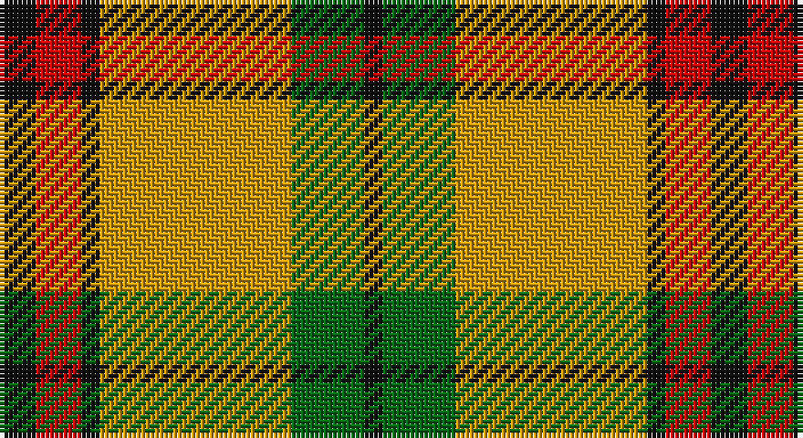

This page is one **sett** — a single exact thread-count. It belongs to the [tartan](/setts/k4r5k2lo21g8k2/)
(the same proportion at any scale), whose colour order is pattern [KGYKRK](/stripes/kgykrk/).

Sourced from register-of-tartans.  It is a [6 stripe tartan](/stripes/stripes6/).

Original link https://www.tartanregister.gov.uk/tartanDetails.aspx?ref=2412

## Register references

External register numbers recorded for this tartan.

- Scottish Register of Tartans: [2412](https://www.tartanregister.gov.uk/tartanDetails.aspx?ref=2412)
- Scottish Tartans Authority (ITI): 1121
- Scottish Tartans World Register: 1121

## Thread count
K/8 R10 K4 DY42 G16 K/4

One full sett is **156 threads**.

## Palette

Palette: <strong>Tartan Register</strong> <small style="color:#888">(3 of 4 colours)</small>
<table><thead><tr><th>Colour</th><th>Threads</th><th>Shade</th><th>Base</th><th>OKLCh</th></tr></thead><tbody><tr><td>K/</td><td style="text-align:right;font-variant-numeric:tabular-nums">8</td><td><code style="background-color:#101010;">#101010</code> <small style="color:#888">#101010</small></td><td>K <code style="background-color:#000000;">#000000</code></td><td><small style="color:#888">oklch(17.3% 0.000 89.9)</small></td></tr><tr><td>R</td><td style="text-align:right;font-variant-numeric:tabular-nums">10</td><td><code style="background-color:#C80000;">#C80000</code> <small style="color:#888">#C80000</small></td><td>R <code style="background-color:#CC0000;">#CC0000</code></td><td><small style="color:#888">oklch(52.3% 0.215 29.2)</small></td></tr><tr><td>K</td><td style="text-align:right;font-variant-numeric:tabular-nums">4</td><td><code style="background-color:#101010;">#101010</code> <small style="color:#888">#101010</small></td><td>K <code style="background-color:#000000;">#000000</code></td><td><small style="color:#888">oklch(17.3% 0.000 89.9)</small></td></tr><tr><td>DY</td><td style="text-align:right;font-variant-numeric:tabular-nums">42</td><td><code style="background-color:#D09800;">#D09800</code> <small style="color:#888">#D09800</small></td><td>Y <code style="background-color:#F2BF00;">#F2BF00</code></td><td><small style="color:#888">oklch(71.4% 0.147 82.1)</small></td></tr><tr><td>G</td><td style="text-align:right;font-variant-numeric:tabular-nums">16</td><td><code style="background-color:#006818;">#006818</code> <small style="color:#888">#006818</small></td><td>G <code style="background-color:#006100;">#006100</code></td><td><small style="color:#888">oklch(45.0% 0.142 145.0)</small></td></tr><tr><td>K/</td><td style="text-align:right;font-variant-numeric:tabular-nums">4</td><td><code style="background-color:#101010;">#101010</code> <small style="color:#888">#101010</small></td><td>K <code style="background-color:#000000;">#000000</code></td><td><small style="color:#888">oklch(17.3% 0.000 89.9)</small></td></tr></tbody></table>

# Sample pattern

## Nearest tartans

The nearest existing variants by ΔTartan distance, with this tartan at the top so the swatches line up against it.

ΔTartan

Tartan

Sett

—

<a href="/ttd/edit/#slug=k4r5k2lo21g8k2~x2">MacDuck #2</a> <a class="nn-out" href="/variants/s6/k4r5k2lo21g8k2~x2/" title="open its dictionary page">↗</a>

0.79

<a href="/ttd/edit/#slug=k4r5k2ly21g8k2~x2&amp;base=k4r5k2lo21g8k2~x2">MacDuck (Corporate)</a> <a class="nn-out" href="/variants/s6/k4r5k2ly21g8k2~x2/" title="open its dictionary page">↗</a>

0.94

<a href="/ttd/edit/#slug=k2r4w1r10g12r2w2~x4&amp;base=k4r5k2lo21g8k2~x2">Starr (1978) (Name)</a> <a class="nn-out" href="/variants/s7/k2r4w1r10g12r2w2~x4/" title="open its dictionary page">↗</a>

1.23

<a href="/ttd/edit/#slug=g9r2g9r14k1w2~x4&amp;base=k4r5k2lo21g8k2~x2">MacGregor of Balquidder - 1831 (Clan</a> <a class="nn-out" href="/variants/s6/g9r2g9r14k1w2~x4/" title="open its dictionary page">↗</a>

1.24

<a href="/ttd/edit/#slug=r16k3r16g44k3g8k3ly20k4~x2&amp;base=k4r5k2lo21g8k2~x2">MacMillan Society of Glasgow</a> <a class="nn-out" href="/variants/s9/r16k3r16g44k3g8k3ly20k4~x2/" title="open its dictionary page">↗</a>

1.25

<a href="/ttd/edit/#slug=r4k2lb10k10y28k3~x2&amp;base=k4r5k2lo21g8k2~x2">Thomson Camel (Jedburgh Mill)</a> <a class="nn-out" href="/variants/s6/r4k2lb10k10y28k3~x2/" title="open its dictionary page">↗</a>

1.25

<a href="/ttd/edit/#slug=do4g25lo10g3lo18r4~x2&amp;base=k4r5k2lo21g8k2~x2">Unidentfied (Ligioner Highland Games</a> <a class="nn-out" href="/variants/s6/do4g25lo10g3lo18r4~x2/" title="open its dictionary page">↗</a>

1.26

<a href="/ttd/edit/#slug=k5lyi2dy7ly18dy2w2~x4&amp;base=k4r5k2lo21g8k2~x2">Shepherd Piping (Personal)</a> <a class="nn-out" href="/variants/s6/k5lyi2dy7ly18dy2w2~x4/" title="open its dictionary page">↗</a>

1.27

<a href="/ttd/edit/#slug=do5lo4do26loi26do4loi3w5~x2&amp;base=k4r5k2lo21g8k2~x2">Elgin District Tartan</a> <a class="nn-out" href="/variants/s7/do5lo4do26loi26do4loi3w5~x2/" title="open its dictionary page">↗</a>

1.27

<a href="/ttd/edit/#slug=t12lo75k22w12k22w16t8&amp;base=k4r5k2lo21g8k2~x2">Orange Fanaticos (Corporate)</a> <a class="nn-out" href="/variants/s7/t12lo75k22w12k22w16t8/" title="open its dictionary page">↗</a>

1.29

<a href="/ttd/edit/#slug=k2o20k8dg18o3w2~x2&amp;base=k4r5k2lo21g8k2~x2">Celtic Combat</a> <a class="nn-out" href="/variants/s6/k2o20k8dg18o3w2~x2/" title="open its dictionary page">↗</a>

## Neighbour map

Every grey dot is one of 14360 variants placed by the first two principal components of the ΔTartan feature space (44% of its variance). Red is this tartan; blue dots are its nearest — click one to open its page.

<svg viewBox="0 0 640 380" role="img" style="max-width:100%;height:auto;border:1px solid #e0e0e0;border-radius:4px;display:block" xmlns="http://www.w3.org/2000/svg"><image href="/nn/cloud.v1.png" width="640" height="380"/><a href="/variants/s6/k4r5k2ly21g8k2~x2/"><circle cx="226.9" cy="172.7" r="4" fill="#3465a4"><title>MacDuck (Corporate)</title></circle></a><a href="/variants/s7/k2r4w1r10g12r2w2~x4/"><circle cx="263.8" cy="177.8" r="4" fill="#3465a4"><title>Starr (1978) (Name)</title></circle></a><a href="/variants/s6/g9r2g9r14k1w2~x4/"><circle cx="288.3" cy="194.9" r="4" fill="#3465a4"><title>MacGregor of Balquidder - 1831 (Clan</title></circle></a><a href="/variants/s9/r16k3r16g44k3g8k3ly20k4~x2/"><circle cx="236.8" cy="160.3" r="4" fill="#3465a4"><title>MacMillan Society of Glasgow</title></circle></a><a href="/variants/s6/r4k2lb10k10y28k3~x2/"><circle cx="260.4" cy="177.6" r="4" fill="#3465a4"><title>Thomson Camel (Jedburgh Mill)</title></circle></a><a href="/variants/s6/do4g25lo10g3lo18r4~x2/"><circle cx="221.4" cy="206.0" r="4" fill="#3465a4"><title>Unidentfied (Ligioner Highland Games</title></circle></a><a href="/variants/s6/k5lyi2dy7ly18dy2w2~x4/"><circle cx="207.0" cy="162.7" r="4" fill="#3465a4"><title>Shepherd Piping (Personal)</title></circle></a><a href="/variants/s7/do5lo4do26loi26do4loi3w5~x2/"><circle cx="262.4" cy="189.3" r="4" fill="#3465a4"><title>Elgin District Tartan</title></circle></a><a href="/variants/s7/t12lo75k22w12k22w16t8/"><circle cx="197.7" cy="173.0" r="4" fill="#3465a4"><title>Orange Fanaticos (Corporate)</title></circle></a><a href="/variants/s6/k2o20k8dg18o3w2~x2/"><circle cx="236.7" cy="205.1" r="4" fill="#3465a4"><title>Celtic Combat</title></circle></a><circle cx="246.2" cy="182.2" r="5" fill="#c00000"/></svg>

ID: /variants/s6/k4r5k2lo21g8k2~x2/
