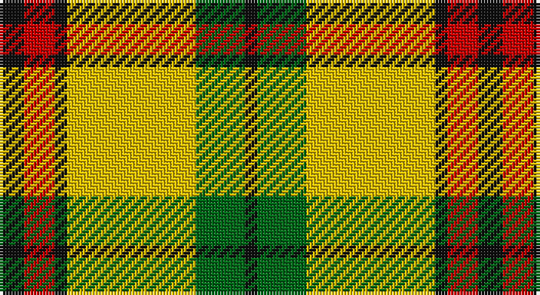

This page is one **sett** — a single exact thread-count. It belongs to the [tartan](/setts/k4r5k2ly21g8k2/)
(the same proportion at any scale), whose colour order is pattern [KGYKRK](/stripes/kgykrk/).

Part of the [MacDuck](/tartans/macduck/) tartan — the named design grouping this sett with its other cloths.

Sourced from tartans-authority.  It is a [6 stripe tartan](/stripes/stripes6/).

Original link http://www.tartansauthority.com/tartan-ferret/display/1121/

## Provenance

Earliest known date: 1942 Ancient MacDuck, old colours, as worn by Scrooge MacDuck, uncle to the famous cartoon character Donald Duck and great uncle to Huey, Duey and Luey.

## Also known as

This cloth is also recorded under:

- MacDuck #2
- MacDuck Final version
- MacDuck, Final version

3 attestations — the source records this cloth was collapsed from (oldest owns this page)

<ul>
<li>1942 — MacDuck (Corporate) (tartans-authority, <a href="http://www.tartansauthority.com/tartan-ferret/display/1121/">record</a>)</li>
<li>undated — MacDuck, Final version (weddslist, <a href="http://www.weddslist.com/cgi-bin/tartans/pg.pl?source=sts">record</a>)</li>
<li>undated — MacDuck Final version Corporate Tartan (house-of-tartan, <a href="http://www.house-of-tartan.scotland.net/house/TartanViewjs.asp?colr=Def&tnam=1121">record</a>)</li>
</ul>

## Register references

External register numbers recorded for this tartan.

- Scottish Tartans Authority (ITI): 1121

## Thread count
K/8 R10 K4 Y42 G16 K/4

One full sett is **156 threads**.

## Palette

Palette: <strong>Tartan Register</strong>
<table><thead><tr><th>Colour</th><th>Threads</th><th>Shade</th><th>Base</th><th>OKLCh</th></tr></thead><tbody><tr><td>K/</td><td style="text-align:right;font-variant-numeric:tabular-nums">8</td><td><code style="background-color:#101010;">#101010</code> <small style="color:#888">#101010</small></td><td>K <code style="background-color:#000000;">#000000</code></td><td><small style="color:#888">oklch(17.3% 0.000 89.9)</small></td></tr><tr><td>R</td><td style="text-align:right;font-variant-numeric:tabular-nums">10</td><td><code style="background-color:#C80000;">#C80000</code> <small style="color:#888">#C80000</small></td><td>R <code style="background-color:#CC0000;">#CC0000</code></td><td><small style="color:#888">oklch(52.3% 0.215 29.2)</small></td></tr><tr><td>K</td><td style="text-align:right;font-variant-numeric:tabular-nums">4</td><td><code style="background-color:#101010;">#101010</code> <small style="color:#888">#101010</small></td><td>K <code style="background-color:#000000;">#000000</code></td><td><small style="color:#888">oklch(17.3% 0.000 89.9)</small></td></tr><tr><td>Y</td><td style="text-align:right;font-variant-numeric:tabular-nums">42</td><td><code style="background-color:#E8C000;">#E8C000</code> <small style="color:#888">#E8C000</small></td><td>Y <code style="background-color:#F2BF00;">#F2BF00</code></td><td><small style="color:#888">oklch(81.9% 0.168 93.7)</small></td></tr><tr><td>G</td><td style="text-align:right;font-variant-numeric:tabular-nums">16</td><td><code style="background-color:#006818;">#006818</code> <small style="color:#888">#006818</small></td><td>G <code style="background-color:#006100;">#006100</code></td><td><small style="color:#888">oklch(45.0% 0.142 145.0)</small></td></tr><tr><td>K/</td><td style="text-align:right;font-variant-numeric:tabular-nums">4</td><td><code style="background-color:#101010;">#101010</code> <small style="color:#888">#101010</small></td><td>K <code style="background-color:#000000;">#000000</code></td><td><small style="color:#888">oklch(17.3% 0.000 89.9)</small></td></tr></tbody></table>

# Sample pattern

## Nearest tartans

The nearest existing variants by ΔTartan distance, with this tartan at the top so the swatches line up against it.

ΔTartan

Tartan

Sett

—

<a href="/ttd/edit/#slug=k4r5k2ly21g8k2~x2">MacDuck (Corporate)</a> <a class="nn-out" href="/variants/s6/k4r5k2ly21g8k2~x2/" title="open its dictionary page">↗</a>

0.79

<a href="/ttd/edit/#slug=k4r5k2lo21g8k2~x2&amp;base=k4r5k2ly21g8k2~x2">MacDuck #2</a> <a class="nn-out" href="/variants/s6/k4r5k2lo21g8k2~x2/" title="open its dictionary page">↗</a>

0.93

<a href="/ttd/edit/#slug=k5lyi2dy7ly18dy2w2~x4&amp;base=k4r5k2ly21g8k2~x2">Shepherd Piping (Personal)</a> <a class="nn-out" href="/variants/s6/k5lyi2dy7ly18dy2w2~x4/" title="open its dictionary page">↗</a>

1.20

<a href="/ttd/edit/#slug=do4g25lo10g3lo18r4~x2&amp;base=k4r5k2ly21g8k2~x2">Unidentfied (Ligioner Highland Games</a> <a class="nn-out" href="/variants/s6/do4g25lo10g3lo18r4~x2/" title="open its dictionary page">↗</a>

1.34

<a href="/ttd/edit/#slug=ly9dg4ly22k9ly9dg36r4~x2&amp;base=k4r5k2ly21g8k2~x2">Harmer</a> <a class="nn-out" href="/variants/s7/ly9dg4ly22k9ly9dg36r4~x2/" title="open its dictionary page">↗</a>

1.37

<a href="/ttd/edit/#slug=r2w2ly27dg14ly2db14ly2~x2&amp;base=k4r5k2ly21g8k2~x2">Fraser Yellow</a> <a class="nn-out" href="/variants/s7/r2w2ly27dg14ly2db14ly2~x2/" title="open its dictionary page">↗</a>

1.41

<a href="/ttd/edit/#slug=r2w2ly27g14ly2db14ly2~x2&amp;base=k4r5k2ly21g8k2~x2">Fraser, Yellow</a> <a class="nn-out" href="/variants/s7/r2w2ly27g14ly2db14ly2~x2/" title="open its dictionary page">↗</a>

1.43

<a href="/ttd/edit/#slug=k5ly2dy7lyi18dy2w2~x4&amp;base=k4r5k2ly21g8k2~x2">Shepherd, Derek (Piping)</a> <a class="nn-out" href="/variants/s6/k5ly2dy7lyi18dy2w2~x4/" title="open its dictionary page">↗</a>

1.45

<a href="/ttd/edit/#slug=ly70k30w3dg30k3ly10&amp;base=k4r5k2ly21g8k2~x2">Jacobite #2</a> <a class="nn-out" href="/variants/s6/ly70k30w3dg30k3ly10/" title="open its dictionary page">↗</a>

1.46

<a href="/ttd/edit/#slug=w1ly8dg3ly1db3ly1~x4&amp;base=k4r5k2ly21g8k2~x2">Fraser Yellow #2</a> <a class="nn-out" href="/variants/s6/w1ly8dg3ly1db3ly1~x4/" title="open its dictionary page">↗</a>

1.49

<a href="/ttd/edit/#slug=k2r4w1r10g12r2w2~x4&amp;base=k4r5k2ly21g8k2~x2">Starr (1978) (Name)</a> <a class="nn-out" href="/variants/s7/k2r4w1r10g12r2w2~x4/" title="open its dictionary page">↗</a>

## Neighbour map

Every grey dot is one of 14360 variants placed by the first two principal components of the ΔTartan feature space (44% of its variance). Red is this tartan; blue dots are its nearest — click one to open its page.

<svg viewBox="0 0 640 380" role="img" style="max-width:100%;height:auto;border:1px solid #e0e0e0;border-radius:4px;display:block" xmlns="http://www.w3.org/2000/svg"><image href="/nn/cloud.v1.png" width="640" height="380"/><a href="/variants/s6/k4r5k2lo21g8k2~x2/"><circle cx="246.2" cy="182.2" r="4" fill="#3465a4"><title>MacDuck #2</title></circle></a><a href="/variants/s6/k5lyi2dy7ly18dy2w2~x4/"><circle cx="207.0" cy="162.7" r="4" fill="#3465a4"><title>Shepherd Piping (Personal)</title></circle></a><a href="/variants/s6/do4g25lo10g3lo18r4~x2/"><circle cx="221.4" cy="206.0" r="4" fill="#3465a4"><title>Unidentfied (Ligioner Highland Games</title></circle></a><a href="/variants/s7/ly9dg4ly22k9ly9dg36r4~x2/"><circle cx="195.6" cy="188.3" r="4" fill="#3465a4"><title>Harmer</title></circle></a><a href="/variants/s7/r2w2ly27dg14ly2db14ly2~x2/"><circle cx="223.1" cy="142.7" r="4" fill="#3465a4"><title>Fraser Yellow</title></circle></a><a href="/variants/s7/r2w2ly27g14ly2db14ly2~x2/"><circle cx="227.8" cy="143.9" r="4" fill="#3465a4"><title>Fraser, Yellow</title></circle></a><a href="/variants/s6/k5ly2dy7lyi18dy2w2~x4/"><circle cx="191.4" cy="151.5" r="4" fill="#3465a4"><title>Shepherd, Derek (Piping)</title></circle></a><a href="/variants/s6/ly70k30w3dg30k3ly10/"><circle cx="287.0" cy="146.1" r="4" fill="#3465a4"><title>Jacobite #2</title></circle></a><a href="/variants/s6/w1ly8dg3ly1db3ly1~x4/"><circle cx="271.1" cy="192.3" r="4" fill="#3465a4"><title>Fraser Yellow #2</title></circle></a><a href="/variants/s7/k2r4w1r10g12r2w2~x4/"><circle cx="263.8" cy="177.8" r="4" fill="#3465a4"><title>Starr (1978) (Name)</title></circle></a><circle cx="226.9" cy="172.7" r="5" fill="#c00000"/></svg>

ID: /variants/s6/k4r5k2ly21g8k2~x2/
