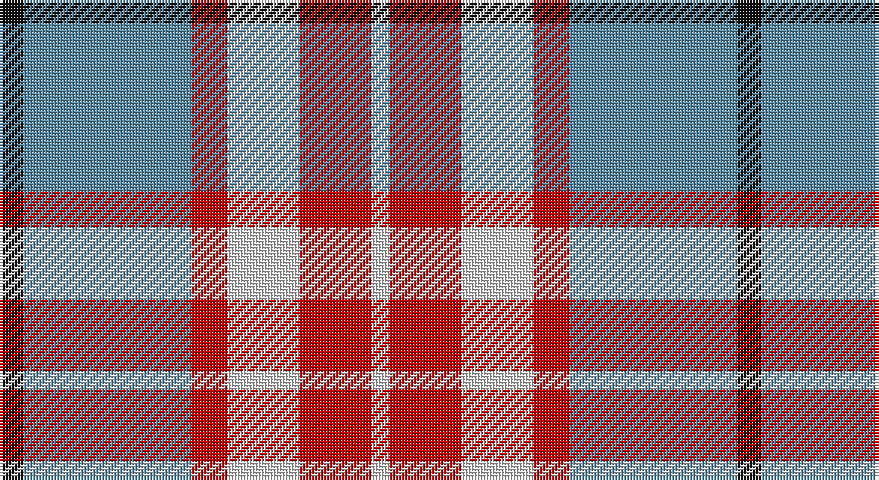

This page is one **sett** — a single exact thread-count. It belongs to the [tartan](/setts/k4t28r6w12r12w3/)
(the same proportion at any scale), whose colour order is pattern [KBRWRW](/stripes/kbrwrw/).

Part of the [Thompson](/tartans/thompson/) tartan — the named design grouping this sett with its other cloths.

Sourced from register-of-tartans.  It is a [6 stripe tartan](/stripes/stripes6/).

Original link https://www.tartanregister.gov.uk/tartanDetails.aspx?ref=4113

## Also known as

This cloth is also recorded under:

- Thompson Grey
- Thompson Grey Small
- Thompson, D.C.

2 attestations — the source records this cloth was collapsed from (oldest owns this page)

<ul>
<li>01/05/1998 — Thompson, D.C. (Personal) (register-of-tartans, <a href="https://www.tartanregister.gov.uk/tartanDetails.aspx?ref=4113">record</a>)</li>
<li>1998 — Thompson (Personal) (tartans-authority, <a href="http://www.tartansauthority.com/tartan-ferret/display/2484/">record</a>)</li>
</ul>

## Register references

External register numbers recorded for this tartan.

- Scottish Register of Tartans: [4113](https://www.tartanregister.gov.uk/tartanDetails.aspx?ref=4113)
- Scottish Tartans Authority (ITI): 2484
- Scottish Tartans World Register: 2484

## Thread count
K/8 B56 R12 LN24 R24 LN/6

One full sett is **246 threads**.

## Palette

Palette: <strong>Tartan Register</strong>
<table><thead><tr><th>Colour</th><th>Threads</th><th>Shade</th><th>Base</th><th>OKLCh</th></tr></thead><tbody><tr><td>K/</td><td style="text-align:right;font-variant-numeric:tabular-nums">8</td><td><code style="background-color:#101010;">#101010</code> <small style="color:#888">#101010</small></td><td>K <code style="background-color:#000000;">#000000</code></td><td><small style="color:#888">oklch(17.3% 0.000 89.9)</small></td></tr><tr><td>B</td><td style="text-align:right;font-variant-numeric:tabular-nums">56</td><td><code style="background-color:#5C8CA8;">#5C8CA8</code> <small style="color:#888">#5C8CA8</small></td><td>B <code style="background-color:#2A418A;">#2A418A</code></td><td><small style="color:#888">oklch(61.7% 0.067 235.0)</small></td></tr><tr><td>R</td><td style="text-align:right;font-variant-numeric:tabular-nums">12</td><td><code style="background-color:#C80000;">#C80000</code> <small style="color:#888">#C80000</small></td><td>R <code style="background-color:#CC0000;">#CC0000</code></td><td><small style="color:#888">oklch(52.3% 0.215 29.2)</small></td></tr><tr><td>LN</td><td style="text-align:right;font-variant-numeric:tabular-nums">24</td><td><code style="background-color:#E0E0E0;">#E0E0E0</code> <small style="color:#888">#E0E0E0</small></td><td>W <code style="background-color:#F7F7F7;">#F7F7F7</code></td><td><small style="color:#888">oklch(90.7% 0.000 89.9)</small></td></tr><tr><td>R</td><td style="text-align:right;font-variant-numeric:tabular-nums">24</td><td><code style="background-color:#C80000;">#C80000</code> <small style="color:#888">#C80000</small></td><td>R <code style="background-color:#CC0000;">#CC0000</code></td><td><small style="color:#888">oklch(52.3% 0.215 29.2)</small></td></tr><tr><td>LN/</td><td style="text-align:right;font-variant-numeric:tabular-nums">6</td><td><code style="background-color:#E0E0E0;">#E0E0E0</code> <small style="color:#888">#E0E0E0</small></td><td>W <code style="background-color:#F7F7F7;">#F7F7F7</code></td><td><small style="color:#888">oklch(90.7% 0.000 89.9)</small></td></tr></tbody></table>

# Sample pattern

## Compared to the master

This cloth is one sett of its design; the master sett (the exemplar the design is anchored on) is below for comparison.

<figure style="margin:0"><figcaption style="color:#888;font-size:smaller">this sett</figcaption></figure>
<figure style="margin:0"><figcaption style="color:#888;font-size:smaller"><a href="/setts/b15w13dy6b2dy2r2dy2b2dy6w13b15r3/">master sett →</a></figcaption></figure>

## Nearest tartans

The nearest existing variants by ΔTartan distance, with this tartan at the top so the swatches line up against it.

ΔTartan

Tartan

Sett

—

<a href="/ttd/edit/#slug=k4t28r6w12r12w3~x2">Thompson, D.C. (Personal)</a> <a class="nn-out" href="/variants/s6/k4t28r6w12r12w3~x2/" title="open its dictionary page">↗</a>

1.07

<a href="/ttd/edit/#slug=r12dt2ly2lb2dt4lb3~x2&amp;base=k4t28r6w12r12w3~x2">Winnipeg Embroiders' Guild (Corp.)</a> <a class="nn-out" href="/variants/s6/r12dt2ly2lb2dt4lb3~x2/" title="open its dictionary page">↗</a>

1.10

<a href="/ttd/edit/#slug=r4ly30k6w13k13w3~x2&amp;base=k4t28r6w12r12w3~x2">Thomson, Camel (Fashion)</a> <a class="nn-out" href="/variants/s6/r4ly30k6w13k13w3~x2/" title="open its dictionary page">↗</a>

1.12

<a href="/ttd/edit/#slug=m30k7o20ly4k4~x2&amp;base=k4t28r6w12r12w3~x2">Drumfintley (Fashion)</a> <a class="nn-out" href="/variants/s5/m30k7o20ly4k4~x2/" title="open its dictionary page">↗</a>

1.17

<a href="/ttd/edit/#slug=r2o20k5w10k10r2~x2&amp;base=k4t28r6w12r12w3~x2">Thompson Grey Family Tartan</a> <a class="nn-out" href="/variants/s6/r2o20k5w10k10r2~x2/" title="open its dictionary page">↗</a>

1.17

<a href="/ttd/edit/#slug=r4o41k5w14k18r4~x2&amp;base=k4t28r6w12r12w3~x2">Downside (Corporate)</a> <a class="nn-out" href="/variants/s6/r4o41k5w14k18r4~x2/" title="open its dictionary page">↗</a>

1.20

<a href="/ttd/edit/#slug=r4lo30k6w13k13w3~x2&amp;base=k4t28r6w12r12w3~x2">Thomson Camel</a> <a class="nn-out" href="/variants/s6/r4lo30k6w13k13w3~x2/" title="open its dictionary page">↗</a>

1.28

<a href="/ttd/edit/#slug=dy5r5lb11r1dy1~x4&amp;base=k4t28r6w12r12w3~x2">O'Connor Dress</a> <a class="nn-out" href="/variants/s5/dy5r5lb11r1dy1~x4/" title="open its dictionary page">↗</a>

1.28

<a href="/ttd/edit/#slug=w4t32w12k5r9lo8r4w4~x2&amp;base=k4t28r6w12r12w3~x2">Brunnbauer (2015)</a> <a class="nn-out" href="/variants/s8/w4t32w12k5r9lo8r4w4~x2/" title="open its dictionary page">↗</a>

1.29

<a href="/ttd/edit/#slug=r2lo20k5w10k10w2~x2&amp;base=k4t28r6w12r12w3~x2">Thompson Camel Clan Tartan</a> <a class="nn-out" href="/variants/s6/r2lo20k5w10k10w2~x2/" title="open its dictionary page">↗</a>

1.30

<a href="/ttd/edit/#slug=r3w33dp8dg18r9g3~x2&amp;base=k4t28r6w12r12w3~x2">MacKintosh Dress (Dance)</a> <a class="nn-out" href="/variants/s6/r3w33dp8dg18r9g3~x2/" title="open its dictionary page">↗</a>

## Neighbour map

Every grey dot is one of 14360 variants placed by the first two principal components of the ΔTartan feature space (44% of its variance). Red is this tartan; blue dots are its nearest — click one to open its page.

<svg viewBox="0 0 640 380" role="img" style="max-width:100%;height:auto;border:1px solid #e0e0e0;border-radius:4px;display:block" xmlns="http://www.w3.org/2000/svg"><image href="/nn/cloud.v1.png" width="640" height="380"/><a href="/variants/s6/r12dt2ly2lb2dt4lb3~x2/"><circle cx="220.6" cy="202.6" r="4" fill="#3465a4"><title>Winnipeg Embroiders' Guild (Corp.)</title></circle></a><a href="/variants/s6/r4ly30k6w13k13w3~x2/"><circle cx="185.0" cy="184.4" r="4" fill="#3465a4"><title>Thomson, Camel (Fashion)</title></circle></a><a href="/variants/s5/m30k7o20ly4k4~x2/"><circle cx="233.4" cy="220.5" r="4" fill="#3465a4"><title>Drumfintley (Fashion)</title></circle></a><a href="/variants/s6/r2o20k5w10k10r2~x2/"><circle cx="173.9" cy="193.4" r="4" fill="#3465a4"><title>Thompson Grey Family Tartan</title></circle></a><a href="/variants/s6/r4o41k5w14k18r4~x2/"><circle cx="223.5" cy="182.6" r="4" fill="#3465a4"><title>Downside (Corporate)</title></circle></a><a href="/variants/s6/r4lo30k6w13k13w3~x2/"><circle cx="189.7" cy="187.9" r="4" fill="#3465a4"><title>Thomson Camel</title></circle></a><a href="/variants/s5/dy5r5lb11r1dy1~x4/"><circle cx="272.2" cy="218.6" r="4" fill="#3465a4"><title>O'Connor Dress</title></circle></a><a href="/variants/s8/w4t32w12k5r9lo8r4w4~x2/"><circle cx="151.1" cy="156.4" r="4" fill="#3465a4"><title>Brunnbauer (2015)</title></circle></a><a href="/variants/s6/r2lo20k5w10k10w2~x2/"><circle cx="175.6" cy="191.0" r="4" fill="#3465a4"><title>Thompson Camel Clan Tartan</title></circle></a><a href="/variants/s6/r3w33dp8dg18r9g3~x2/"><circle cx="175.2" cy="158.8" r="4" fill="#3465a4"><title>MacKintosh Dress (Dance)</title></circle></a><circle cx="203.0" cy="196.3" r="5" fill="#c00000"/></svg>

ID: /variants/s6/k4t28r6w12r12w3~x2/
