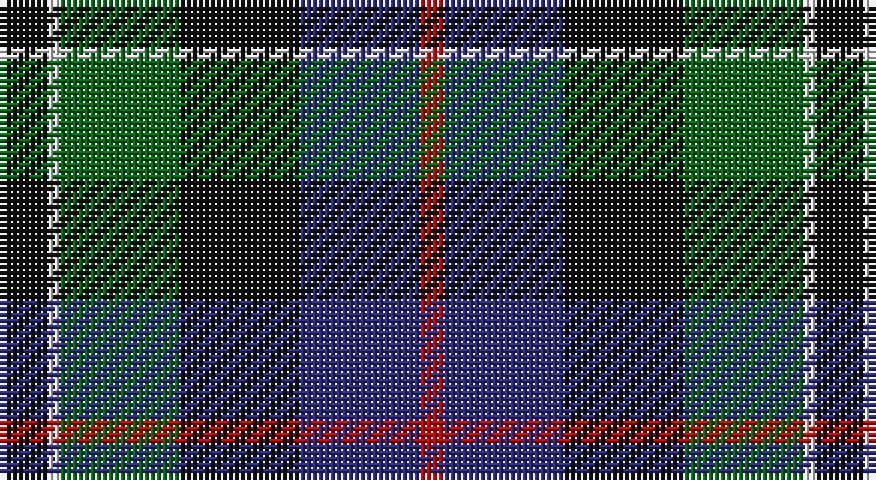

This page is one **sett** — a single exact thread-count. It belongs to the [tartan](/setts/k4w1g10k10db10r2/)
(the same proportion at any scale), whose colour order is pattern [KWGKBR](/stripes/kwgkbr/).

Part of the [Rose Hunting](/tartans/rose-hunting/) tartan — the named design grouping this sett with its other cloths.

Sourced from house-of-tartan.  It is a [6 stripe tartan](/stripes/stripes6/).

Original link http://www.house-of-tartan.scotland.net/house/TartanViewjs.asp?colr=Def&tnam=1226

## Provenance

Earliest known date: 1831 First recorded in James Logan's, 'The Scottish Gael' in 1831.

## Also known as

This cloth is also recorded under:

- Rose Htg

## Thread count
K/8 LN2 G20 K20 DB20 R/4

One full sett is **136 threads**.

## Palette

Palette: <strong>Tartan Register</strong>
<table><thead><tr><th>Colour</th><th>Threads</th><th>Shade</th><th>Base</th><th>OKLCh</th></tr></thead><tbody><tr><td>K/</td><td style="text-align:right;font-variant-numeric:tabular-nums">8</td><td><code style="background-color:#101010;">#101010</code> <small style="color:#888">#101010</small></td><td>K <code style="background-color:#000000;">#000000</code></td><td><small style="color:#888">oklch(17.3% 0.000 89.9)</small></td></tr><tr><td>LN</td><td style="text-align:right;font-variant-numeric:tabular-nums">2</td><td><code style="background-color:#E0E0E0;">#E0E0E0</code> <small style="color:#888">#E0E0E0</small></td><td>W <code style="background-color:#F7F7F7;">#F7F7F7</code></td><td><small style="color:#888">oklch(90.7% 0.000 89.9)</small></td></tr><tr><td>G</td><td style="text-align:right;font-variant-numeric:tabular-nums">20</td><td><code style="background-color:#006818;">#006818</code> <small style="color:#888">#006818</small></td><td>G <code style="background-color:#006100;">#006100</code></td><td><small style="color:#888">oklch(45.0% 0.142 145.0)</small></td></tr><tr><td>K</td><td style="text-align:right;font-variant-numeric:tabular-nums">20</td><td><code style="background-color:#101010;">#101010</code> <small style="color:#888">#101010</small></td><td>K <code style="background-color:#000000;">#000000</code></td><td><small style="color:#888">oklch(17.3% 0.000 89.9)</small></td></tr><tr><td>DB</td><td style="text-align:right;font-variant-numeric:tabular-nums">20</td><td><code style="background-color:#2C2C80;">#2C2C80</code> <small style="color:#888">#2C2C80</small></td><td>B <code style="background-color:#2A418A;">#2A418A</code></td><td><small style="color:#888">oklch(35.0% 0.138 276.6)</small></td></tr><tr><td>R/</td><td style="text-align:right;font-variant-numeric:tabular-nums">4</td><td><code style="background-color:#C80000;">#C80000</code> <small style="color:#888">#C80000</small></td><td>R <code style="background-color:#CC0000;">#CC0000</code></td><td><small style="color:#888">oklch(52.3% 0.215 29.2)</small></td></tr></tbody></table>

# Sample pattern

## Nearest tartans

The nearest existing variants by ΔTartan distance, with this tartan at the top so the swatches line up against it.

ΔTartan

Tartan

Sett

—

<a href="/ttd/edit/#slug=k4w1g10k10db10r2~x2">Rose Hunting Clan Tartan</a> <a class="nn-out" href="/variants/s6/k4w1g10k10db10r2~x2/" title="open its dictionary page">↗</a>

0.14

<a href="/ttd/edit/#slug=k4w1g10k10db10r2~x4&amp;base=k4w1g10k10db10r2~x2">Rose Hunting</a> <a class="nn-out" href="/variants/s6/k4w1g10k10db10r2~x4/" title="open its dictionary page">↗</a>

0.70

<a href="/ttd/edit/#slug=k2dg12k12r1db12w2~x2&amp;base=k4w1g10k10db10r2~x2">Russell or Mitchell or Hunter or Galbraith</a> <a class="nn-out" href="/variants/s6/k2dg12k12r1db12w2~x2/" title="open its dictionary page">↗</a>

0.73

<a href="/ttd/edit/#slug=k4w1g13k11db11lb3~x4&amp;base=k4w1g10k10db10r2~x2">New York Fire Department Pipe Band</a> <a class="nn-out" href="/variants/s6/k4w1g13k11db11lb3~x4/" title="open its dictionary page">↗</a>

0.73

<a href="/ttd/edit/#slug=r4db24k12g14k4lb3~x2&amp;base=k4w1g10k10db10r2~x2">MacPhail Hunting #2</a> <a class="nn-out" href="/variants/s6/r4db24k12g14k4lb3~x2/" title="open its dictionary page">↗</a>

0.76

<a href="/ttd/edit/#slug=k1g8w1k8db8r1~x4&amp;base=k4w1g10k10db10r2~x2">Leslie Hunting</a> <a class="nn-out" href="/variants/s6/k1g8w1k8db8r1~x4/" title="open its dictionary page">↗</a>

0.76

<a href="/ttd/edit/#slug=g16lb3g3k10db12r2db3~x2&amp;base=k4w1g10k10db10r2~x2">MacLean, Donald (Personal)</a> <a class="nn-out" href="/variants/s7/g16lb3g3k10db12r2db3~x2/" title="open its dictionary page">↗</a>

0.77

<a href="/ttd/edit/#slug=dg5db2dg9dbi19dr9ly2~x2&amp;base=k4w1g10k10db10r2~x2">Lyle and Scott</a> <a class="nn-out" href="/variants/s6/dg5db2dg9dbi19dr9ly2~x2/" title="open its dictionary page">↗</a>

0.78

<a href="/ttd/edit/#slug=r4k2db24k20g20lo3~x2&amp;base=k4w1g10k10db10r2~x2">Loudoun's Highlanders - 1747 #1 (Mil</a> <a class="nn-out" href="/variants/s6/r4k2db24k20g20lo3~x2/" title="open its dictionary page">↗</a>

0.79

<a href="/ttd/edit/#slug=dg17ly2k14r2db9r2db10~x2&amp;base=k4w1g10k10db10r2~x2">MacDonald (Flora.. )</a> <a class="nn-out" href="/variants/s7/dg17ly2k14r2db9r2db10~x2/" title="open its dictionary page">↗</a>

0.82

<a href="/ttd/edit/#slug=k18db12k5g4r6g12k2lo4~x2&amp;base=k4w1g10k10db10r2~x2">MacLeish</a> <a class="nn-out" href="/variants/s8/k18db12k5g4r6g12k2lo4~x2/" title="open its dictionary page">↗</a>

## Neighbour map

Every grey dot is one of 14360 variants placed by the first two principal components of the ΔTartan feature space (44% of its variance). Red is this tartan; blue dots are its nearest — click one to open its page.

<svg viewBox="0 0 640 380" role="img" style="max-width:100%;height:auto;border:1px solid #e0e0e0;border-radius:4px;display:block" xmlns="http://www.w3.org/2000/svg"><image href="/nn/cloud.v1.png" width="640" height="380"/><a href="/variants/s6/k4w1g10k10db10r2~x4/"><circle cx="166.4" cy="224.3" r="4" fill="#3465a4"><title>Rose Hunting</title></circle></a><a href="/variants/s6/k2dg12k12r1db12w2~x2/"><circle cx="180.5" cy="212.1" r="4" fill="#3465a4"><title>Russell or Mitchell or Hunter or Galbraith</title></circle></a><a href="/variants/s6/k4w1g13k11db11lb3~x4/"><circle cx="153.6" cy="210.2" r="4" fill="#3465a4"><title>New York Fire Department Pipe Band</title></circle></a><a href="/variants/s6/r4db24k12g14k4lb3~x2/"><circle cx="172.4" cy="221.9" r="4" fill="#3465a4"><title>MacPhail Hunting #2</title></circle></a><a href="/variants/s6/k1g8w1k8db8r1~x4/"><circle cx="160.6" cy="222.5" r="4" fill="#3465a4"><title>Leslie Hunting</title></circle></a><a href="/variants/s7/g16lb3g3k10db12r2db3~x2/"><circle cx="164.3" cy="216.4" r="4" fill="#3465a4"><title>MacLean, Donald (Personal)</title></circle></a><a href="/variants/s6/dg5db2dg9dbi19dr9ly2~x2/"><circle cx="202.9" cy="222.8" r="4" fill="#3465a4"><title>Lyle and Scott</title></circle></a><a href="/variants/s6/r4k2db24k20g20lo3~x2/"><circle cx="173.5" cy="211.7" r="4" fill="#3465a4"><title>Loudoun's Highlanders - 1747 #1 (Mil</title></circle></a><a href="/variants/s7/dg17ly2k14r2db9r2db10~x2/"><circle cx="160.9" cy="221.6" r="4" fill="#3465a4"><title>MacDonald (Flora.. )</title></circle></a><a href="/variants/s8/k18db12k5g4r6g12k2lo4~x2/"><circle cx="156.4" cy="211.0" r="4" fill="#3465a4"><title>MacLeish</title></circle></a><circle cx="170.5" cy="226.5" r="5" fill="#c00000"/></svg>

ID: /variants/s6/k4w1g10k10db10r2~x2/
