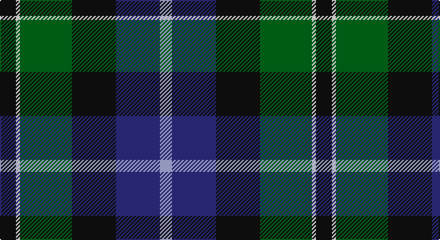

This page is one **sett** — a single exact thread-count. It belongs to the [tartan](/setts/k4w1g13k11db11lb3/)
(the same proportion at any scale), whose colour order is pattern [KWGKBW](/stripes/kwgkbw/).

Sourced from register-of-tartans.  It is a [6 stripe tartan](/stripes/stripes6/).

Original link https://www.tartanregister.gov.uk/tartanDetails.aspx?ref=3121

## Also known as

This cloth is also recorded under:

- New York Fire Dept.

2 attestations — the source records this cloth was collapsed from (oldest owns this page)

<ul>
<li>01/01/1963 — New York Fire Department Pipe Band (register-of-tartans, <a href="https://www.tartanregister.gov.uk/tartanDetails.aspx?ref=3121">record</a>)</li>
<li>Feb 1964 — New York Fire Dept. (Corporate) (tartans-authority, <a href="http://www.tartansauthority.com/tartan-ferret/display/60/">record</a>)</li>
</ul>

## Register references

External register numbers recorded for this tartan.

- Scottish Register of Tartans: [3121](https://www.tartanregister.gov.uk/tartanDetails.aspx?ref=3121)
- Scottish Tartans Authority (ITI): 60
- Scottish Tartans World Register: 60

## Thread count
K/16 W4 G52 K44 DB44 LP/12

One full sett is **316 threads**.

## Palette

Palette: <strong>Tartan Register</strong>
<table><thead><tr><th>Colour</th><th>Threads</th><th>Shade</th><th>Base</th><th>OKLCh</th></tr></thead><tbody><tr><td>K/</td><td style="text-align:right;font-variant-numeric:tabular-nums">16</td><td><code style="background-color:#101010;">#101010</code> <small style="color:#888">#101010</small></td><td>K <code style="background-color:#000000;">#000000</code></td><td><small style="color:#888">oklch(17.3% 0.000 89.9)</small></td></tr><tr><td>W</td><td style="text-align:right;font-variant-numeric:tabular-nums">4</td><td><code style="background-color:#F8F8F8;">#F8F8F8</code> <small style="color:#888">#F8F8F8</small></td><td>W <code style="background-color:#F7F7F7;">#F7F7F7</code></td><td><small style="color:#888">oklch(97.9% 0.000 89.9)</small></td></tr><tr><td>G</td><td style="text-align:right;font-variant-numeric:tabular-nums">52</td><td><code style="background-color:#006818;">#006818</code> <small style="color:#888">#006818</small></td><td>G <code style="background-color:#006100;">#006100</code></td><td><small style="color:#888">oklch(45.0% 0.142 145.0)</small></td></tr><tr><td>K</td><td style="text-align:right;font-variant-numeric:tabular-nums">44</td><td><code style="background-color:#101010;">#101010</code> <small style="color:#888">#101010</small></td><td>K <code style="background-color:#000000;">#000000</code></td><td><small style="color:#888">oklch(17.3% 0.000 89.9)</small></td></tr><tr><td>DB</td><td style="text-align:right;font-variant-numeric:tabular-nums">44</td><td><code style="background-color:#2C2C80;">#2C2C80</code> <small style="color:#888">#2C2C80</small></td><td>B <code style="background-color:#2A418A;">#2A418A</code></td><td><small style="color:#888">oklch(35.0% 0.138 276.6)</small></td></tr><tr><td>LP/</td><td style="text-align:right;font-variant-numeric:tabular-nums">12</td><td><code style="background-color:#A8ACE8;">#A8ACE8</code> <small style="color:#888">#A8ACE8</small></td><td>W <code style="background-color:#F7F7F7;">#F7F7F7</code></td><td><small style="color:#888">oklch(76.3% 0.086 281.2)</small></td></tr></tbody></table>

# Sample pattern

## Nearest tartans

The nearest existing variants by ΔTartan distance, with this tartan at the top so the swatches line up against it.

ΔTartan

Tartan

Sett

—

<a href="/ttd/edit/#slug=k4w1g13k11db11lb3~x4">New York Fire Department Pipe Band</a> <a class="nn-out" href="/variants/s6/k4w1g13k11db11lb3~x4/" title="open its dictionary page">↗</a>

0.65

<a href="/ttd/edit/#slug=k4w1g10k10db10r2~x4&amp;base=k4w1g13k11db11lb3~x4">Rose Hunting</a> <a class="nn-out" href="/variants/s6/k4w1g10k10db10r2~x4/" title="open its dictionary page">↗</a>

0.73

<a href="/ttd/edit/#slug=k4w1g10k10db10r2~x2&amp;base=k4w1g13k11db11lb3~x4">Rose Hunting Clan Tartan</a> <a class="nn-out" href="/variants/s6/k4w1g10k10db10r2~x2/" title="open its dictionary page">↗</a>

0.82

<a href="/ttd/edit/#slug=k2dg12k12r1db12w2~x2&amp;base=k4w1g13k11db11lb3~x4">Russell or Mitchell or Hunter or Galbraith</a> <a class="nn-out" href="/variants/s6/k2dg12k12r1db12w2~x2/" title="open its dictionary page">↗</a>

0.90

<a href="/ttd/edit/#slug=r2db16r1k10g12o2~x2&amp;base=k4w1g13k11db11lb3~x4">MacWilliam</a> <a class="nn-out" href="/variants/s6/r2db16r1k10g12o2~x2/" title="open its dictionary page">↗</a>

0.90

<a href="/ttd/edit/#slug=k2g17k16r2db17w2~x2&amp;base=k4w1g13k11db11lb3~x4">Galbraith</a> <a class="nn-out" href="/variants/s6/k2g17k16r2db17w2~x2/" title="open its dictionary page">↗</a>

0.91

<a href="/ttd/edit/#slug=r4k2db24k20g20lo3~x2&amp;base=k4w1g13k11db11lb3~x4">Loudoun's Highlanders - 1747 #1 (Mil</a> <a class="nn-out" href="/variants/s6/r4k2db24k20g20lo3~x2/" title="open its dictionary page">↗</a>

0.93

<a href="/ttd/edit/#slug=t3db18k20g20k1ly3~x2&amp;base=k4w1g13k11db11lb3~x4">Smith, Sir William (?)</a> <a class="nn-out" href="/variants/s6/t3db18k20g20k1ly3~x2/" title="open its dictionary page">↗</a>

0.93

<a href="/ttd/edit/#slug=g3db12w1k12g13r2g2~x4&amp;base=k4w1g13k11db11lb3~x4">MacFadzean/MacPhedran</a> <a class="nn-out" href="/variants/s7/g3db12w1k12g13r2g2~x4/" title="open its dictionary page">↗</a>

0.96

<a href="/ttd/edit/#slug=k14w3g42k36db40t10&amp;base=k4w1g13k11db11lb3~x4">New York, Firemen's Pipe Band</a> <a class="nn-out" href="/variants/s6/k14w3g42k36db40t10/" title="open its dictionary page">↗</a>

0.97

<a href="/ttd/edit/#slug=k7lb3g18db18w2~x2&amp;base=k4w1g13k11db11lb3~x4">Bhatti (Name)</a> <a class="nn-out" href="/variants/s5/k7lb3g18db18w2~x2/" title="open its dictionary page">↗</a>

## Neighbour map

Every grey dot is one of 14360 variants placed by the first two principal components of the ΔTartan feature space (44% of its variance). Red is this tartan; blue dots are its nearest — click one to open its page.

<svg viewBox="0 0 640 380" role="img" style="max-width:100%;height:auto;border:1px solid #e0e0e0;border-radius:4px;display:block" xmlns="http://www.w3.org/2000/svg"><image href="/nn/cloud.v1.png" width="640" height="380"/><a href="/variants/s6/k4w1g10k10db10r2~x4/"><circle cx="166.4" cy="224.3" r="4" fill="#3465a4"><title>Rose Hunting</title></circle></a><a href="/variants/s6/k4w1g10k10db10r2~x2/"><circle cx="170.5" cy="226.5" r="4" fill="#3465a4"><title>Rose Hunting Clan Tartan</title></circle></a><a href="/variants/s6/k2dg12k12r1db12w2~x2/"><circle cx="180.5" cy="212.1" r="4" fill="#3465a4"><title>Russell or Mitchell or Hunter or Galbraith</title></circle></a><a href="/variants/s6/r2db16r1k10g12o2~x2/"><circle cx="170.2" cy="180.4" r="4" fill="#3465a4"><title>MacWilliam</title></circle></a><a href="/variants/s6/k2g17k16r2db17w2~x2/"><circle cx="151.3" cy="214.4" r="4" fill="#3465a4"><title>Galbraith</title></circle></a><a href="/variants/s6/r4k2db24k20g20lo3~x2/"><circle cx="173.5" cy="211.7" r="4" fill="#3465a4"><title>Loudoun's Highlanders - 1747 #1 (Mil</title></circle></a><a href="/variants/s6/t3db18k20g20k1ly3~x2/"><circle cx="179.8" cy="185.0" r="4" fill="#3465a4"><title>Smith, Sir William (?)</title></circle></a><a href="/variants/s7/g3db12w1k12g13r2g2~x4/"><circle cx="193.7" cy="188.3" r="4" fill="#3465a4"><title>MacFadzean/MacPhedran</title></circle></a><a href="/variants/s6/k14w3g42k36db40t10/"><circle cx="132.7" cy="199.9" r="4" fill="#3465a4"><title>New York, Firemen's Pipe Band</title></circle></a><a href="/variants/s5/k7lb3g18db18w2~x2/"><circle cx="167.8" cy="221.7" r="4" fill="#3465a4"><title>Bhatti (Name)</title></circle></a><circle cx="153.6" cy="210.2" r="5" fill="#c00000"/></svg>

ID: /variants/s6/k4w1g13k11db11lb3~x4/
