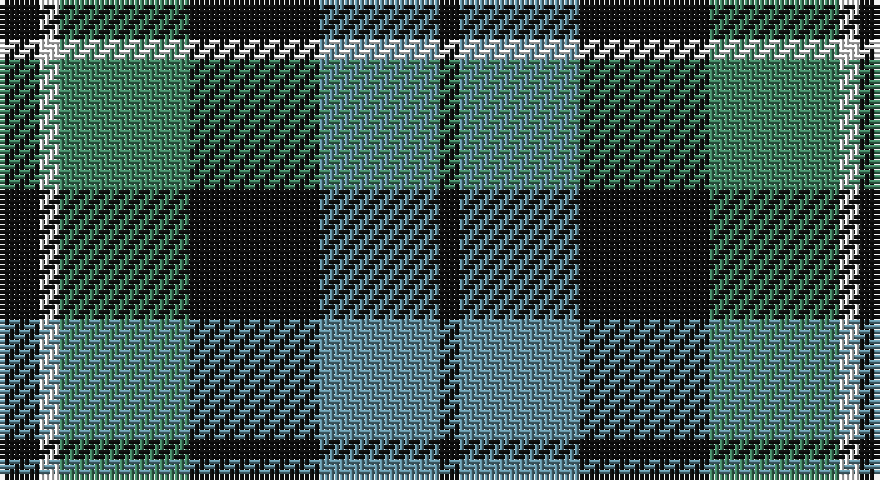

This page is one **sett** — a single exact thread-count. It belongs to the [tartan](/setts/k4w2g13k13t12k2/)
(the same proportion at any scale), whose colour order is pattern [KBKGWK](/stripes/kbkgwk/).

Part of the [Melville](/tartans/melville/) tartan — the named design grouping this sett with its other cloths.

Sourced from register-of-tartans.  It is a [6 stripe tartan](/stripes/stripes6/).

Original link https://www.tartanregister.gov.uk/tartanDetails.aspx?ref=2914

2 attestations — the source records this cloth was collapsed from (oldest owns this page)

<ul>
<li>01/01/1847 — Melville (register-of-tartans, <a href="https://www.tartanregister.gov.uk/tartanDetails.aspx?ref=2914">record</a>)</li>
<li>pre 1847 — Melville (Clan) (tartans-authority, <a href="http://www.tartansauthority.com/tartan-ferret/display/6328/">record</a>)</li>
</ul>

## Register references

External register numbers recorded for this tartan.

- Scottish Register of Tartans: [2914](https://www.tartanregister.gov.uk/tartanDetails.aspx?ref=2914)
- Scottish Tartans Authority (ITI): 6328

## Thread count
K/8 W4 G26 K26 B24 K/4

One full sett is **172 threads**.

## Palette

Palette: <strong>Tartan Register</strong> <small style="color:#888">(3 of 4 colours)</small>
<table><thead><tr><th>Colour</th><th>Threads</th><th>Shade</th><th>Base</th><th>OKLCh</th></tr></thead><tbody><tr><td>K/</td><td style="text-align:right;font-variant-numeric:tabular-nums">8</td><td><code style="background-color:#101010;">#101010</code> <small style="color:#888">#101010</small></td><td>K <code style="background-color:#000000;">#000000</code></td><td><small style="color:#888">oklch(17.3% 0.000 89.9)</small></td></tr><tr><td>W</td><td style="text-align:right;font-variant-numeric:tabular-nums">4</td><td><code style="background-color:#FCFCFC;">#FCFCFC</code> <small style="color:#888">#FCFCFC</small></td><td>W <code style="background-color:#F7F7F7;">#F7F7F7</code></td><td><small style="color:#888">oklch(99.1% 0.000 89.9)</small></td></tr><tr><td>G</td><td style="text-align:right;font-variant-numeric:tabular-nums">26</td><td><code style="background-color:#408060;">#408060</code> <small style="color:#888">#408060</small></td><td>G <code style="background-color:#006100;">#006100</code></td><td><small style="color:#888">oklch(54.8% 0.084 160.1)</small></td></tr><tr><td>K</td><td style="text-align:right;font-variant-numeric:tabular-nums">26</td><td><code style="background-color:#101010;">#101010</code> <small style="color:#888">#101010</small></td><td>K <code style="background-color:#000000;">#000000</code></td><td><small style="color:#888">oklch(17.3% 0.000 89.9)</small></td></tr><tr><td>B</td><td style="text-align:right;font-variant-numeric:tabular-nums">24</td><td><code style="background-color:#608C9C;">#608C9C</code> <small style="color:#888">#608C9C</small></td><td>B <code style="background-color:#2A418A;">#2A418A</code></td><td><small style="color:#888">oklch(61.4% 0.054 222.7)</small></td></tr><tr><td>K/</td><td style="text-align:right;font-variant-numeric:tabular-nums">4</td><td><code style="background-color:#101010;">#101010</code> <small style="color:#888">#101010</small></td><td>K <code style="background-color:#000000;">#000000</code></td><td><small style="color:#888">oklch(17.3% 0.000 89.9)</small></td></tr></tbody></table>

# Sample pattern

## Compared to the master

This cloth is one sett of its design; the master sett (the exemplar the design is anchored on) is below for comparison.

<figure style="margin:0"><figcaption style="color:#888;font-size:smaller">this sett</figcaption></figure>
<figure style="margin:0"><figcaption style="color:#888;font-size:smaller"><a href="/setts/dg4w1dg26b26k2b4/">master sett →</a></figcaption></figure>

## Nearest tartans

The nearest existing variants by ΔTartan distance, with this tartan at the top so the swatches line up against it.

ΔTartan

Tartan

Sett

—

<a href="/ttd/edit/#slug=k4w2g13k13t12k2~x2">Melville</a> <a class="nn-out" href="/variants/s6/k4w2g13k13t12k2~x2/" title="open its dictionary page">↗</a>

0.74

<a href="/ttd/edit/#slug=r1g8k8r1k8t8r1~x4&amp;base=k4w2g13k13t12k2~x2">Triad Highland Games Proposed</a> <a class="nn-out" href="/variants/s7/r1g8k8r1k8t8r1~x4/" title="open its dictionary page">↗</a>

0.74

<a href="/ttd/edit/#slug=t3g6k6t4r1t1~x2&amp;base=k4w2g13k13t12k2~x2">Wellington, or Waterloo</a> <a class="nn-out" href="/variants/s6/t3g6k6t4r1t1~x2/" title="open its dictionary page">↗</a>

0.77

<a href="/ttd/edit/#slug=y3dg6k6y4r1y1~x2&amp;base=k4w2g13k13t12k2~x2">Waterloo</a> <a class="nn-out" href="/variants/s6/y3dg6k6y4r1y1~x2/" title="open its dictionary page">↗</a>

0.89

<a href="/ttd/edit/#slug=r5g12dbi4db4dbi22g18dbi4r5&amp;base=k4w2g13k13t12k2~x2">Daks, Navy</a> <a class="nn-out" href="/variants/s8/r5g12dbi4db4dbi22g18dbi4r5/" title="open its dictionary page">↗</a>

0.90

<a href="/ttd/edit/#slug=db3g12k13w2db13w3~x2&amp;base=k4w2g13k13t12k2~x2">Herd/Hurd</a> <a class="nn-out" href="/variants/s6/db3g12k13w2db13w3~x2/" title="open its dictionary page">↗</a>

0.92

<a href="/ttd/edit/#slug=t3g12k14t11r3t3~x2&amp;base=k4w2g13k13t12k2~x2">Wellington, or Waterloo</a> <a class="nn-out" href="/variants/s6/t3g12k14t11r3t3~x2/" title="open its dictionary page">↗</a>

0.93

<a href="/ttd/edit/#slug=db2k2db12k8g11r2~x2&amp;base=k4w2g13k13t12k2~x2">Murray</a> <a class="nn-out" href="/variants/s6/db2k2db12k8g11r2~x2/" title="open its dictionary page">↗</a>

0.95

<a href="/ttd/edit/#slug=t4o28g6t12k12t3~x2&amp;base=k4w2g13k13t12k2~x2">MacTavish / Thom(p)son, hunting</a> <a class="nn-out" href="/variants/s6/t4o28g6t12k12t3~x2/" title="open its dictionary page">↗</a>

0.96

<a href="/ttd/edit/#slug=t3dg12k14t11r3t3~x2&amp;base=k4w2g13k13t12k2~x2">Wellington or Waterloo</a> <a class="nn-out" href="/variants/s6/t3dg12k14t11r3t3~x2/" title="open its dictionary page">↗</a>

0.99

<a href="/ttd/edit/#slug=g14db2g2k8p9k2~x2&amp;base=k4w2g13k13t12k2~x2">MacArthur of Milton, hunting</a> <a class="nn-out" href="/variants/s6/g14db2g2k8p9k2~x2/" title="open its dictionary page">↗</a>

## Neighbour map

Every grey dot is one of 14360 variants placed by the first two principal components of the ΔTartan feature space (44% of its variance). Red is this tartan; blue dots are its nearest — click one to open its page.

<svg viewBox="0 0 640 380" role="img" style="max-width:100%;height:auto;border:1px solid #e0e0e0;border-radius:4px;display:block" xmlns="http://www.w3.org/2000/svg"><image href="/nn/cloud.v1.png" width="640" height="380"/><a href="/variants/s7/r1g8k8r1k8t8r1~x4/"><circle cx="194.7" cy="226.6" r="4" fill="#3465a4"><title>Triad Highland Games Proposed</title></circle></a><a href="/variants/s6/t3g6k6t4r1t1~x2/"><circle cx="128.4" cy="245.2" r="4" fill="#3465a4"><title>Wellington, or Waterloo</title></circle></a><a href="/variants/s6/y3dg6k6y4r1y1~x2/"><circle cx="157.3" cy="255.4" r="4" fill="#3465a4"><title>Waterloo</title></circle></a><a href="/variants/s8/r5g12dbi4db4dbi22g18dbi4r5/"><circle cx="175.0" cy="232.4" r="4" fill="#3465a4"><title>Daks, Navy</title></circle></a><a href="/variants/s6/db3g12k13w2db13w3~x2/"><circle cx="126.2" cy="237.8" r="4" fill="#3465a4"><title>Herd/Hurd</title></circle></a><a href="/variants/s6/t3g12k14t11r3t3~x2/"><circle cx="115.5" cy="249.6" r="4" fill="#3465a4"><title>Wellington, or Waterloo</title></circle></a><a href="/variants/s6/db2k2db12k8g11r2~x2/"><circle cx="152.3" cy="241.4" r="4" fill="#3465a4"><title>Murray</title></circle></a><a href="/variants/s6/t4o28g6t12k12t3~x2/"><circle cx="202.1" cy="213.8" r="4" fill="#3465a4"><title>MacTavish / Thom(p)son, hunting</title></circle></a><a href="/variants/s6/t3dg12k14t11r3t3~x2/"><circle cx="149.5" cy="265.5" r="4" fill="#3465a4"><title>Wellington or Waterloo</title></circle></a><a href="/variants/s6/g14db2g2k8p9k2~x2/"><circle cx="177.6" cy="225.8" r="4" fill="#3465a4"><title>MacArthur of Milton, hunting</title></circle></a><circle cx="166.3" cy="239.3" r="5" fill="#c00000"/></svg>

ID: /variants/s6/k4w2g13k13t12k2~x2/
