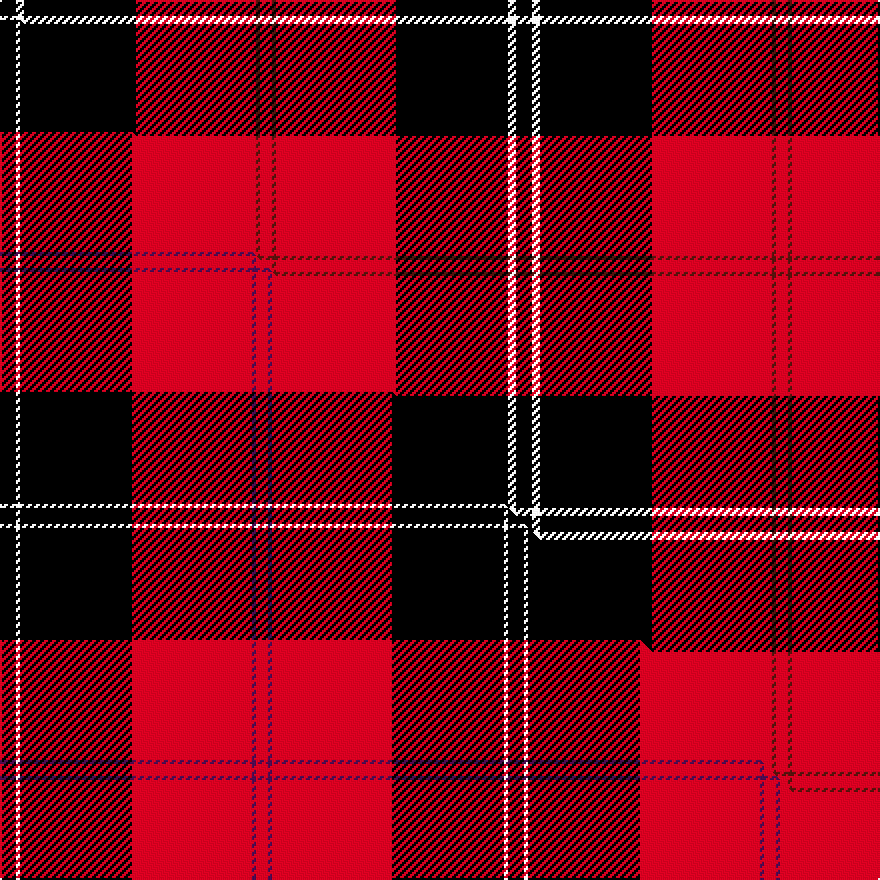

This is one **variant** — a specific cloth: this exact thread count and colourway, with its own
provenance below. It is one weaving of the [sett](/setts/k4w2k28r30dr1r3/) (the scale-free proportion — the
same cloth at any scale or shade), whose colour order is pattern [KWKRBR](/stripes/kwkrbr/).

Part of the [Ramsay](/tartans/r/ra/ramsay-6/) tartan — the named design grouping this sett with its other cloths.

Sourced from weddslist.  It is a [6 stripe tartan](/stripes/stripes6/).

Original link [http://www.weddslist.com/cgi-bin/tartans/pg.pl?source=tinsel](http://www.weddslist.com/cgi-bin/tartans/pg.pl?source=tinsel)

2 attestations — the source records this cloth was collapsed from (oldest owns this page)

<ul>
<li>undated — Ramsay (weddslist, <a href="http://www.weddslist.com/cgi-bin/tartans/pg.pl?source=tinsel">record</a>) </li>
<li>undated — Ramsay (weddslist, <a href="http://www.weddslist.com/cgi-bin/tartans/pg.pl?source=x">record</a>) </li>
</ul>

Dataset <small>— provenance for this record, inherited from the source manifest</small>

<dl class="dataset-prov">
<dt>source</dt><dd><a href="/sources/weddslist/">Weddslist</a></dd>
<dt>data captured from</dt><dd><a href="https://github.com/thetartan/tartan-database/blob/master/data/weddslist/data.csv">https://github.com/thetartan/tartan-database/blob/master/data/weddslist/data.csv</a></dd>
<dt>data date</dt><dd>2016-11-17 <small>(dataset default)</small></dd>
<dt>licence</dt><dd><a href="https://creativecommons.org/licenses/by-nc-nd/4.0/">CC BY-NC-ND 4.0</a></dd>
</dl>

Capture chain <small>— the hands this data passed through, oldest first; each capture carries its own licence</small>

<ol class="capture-chain">
<li><a href="https://www.weddslist.com/tartans/">Weddslist</a> <small>the living privately compiled reference</small></li>
<li><a href="https://github.com/thetartan/tartan-database">thetartan/tartan-database</a> <small>2016-2017</small> · <a href="https://creativecommons.org/licenses/by-nc-nd/4.0/">CC BY-NC-ND 4.0</a> <small>Levko Kravets's frozen compilation — the capture we vendored, and where its CC licence text came from</small></li>
<li>this dictionary <small>captured 2026-06-10 · commit 5bf86c7566</small> <small>each re-capture is a git commit to data/sources</small></li>
</ol>

## Thread count
K/8 W4 K56 R60 DR2 R/6

One full sett is **258 threads**.

## Palette
<table><thead><tr><th>Colour</th><th>Shade</th><th>OKLCh</th></tr></thead><tbody><tr><td>R</td><td><code style="background-color:#D60020;">#D60020</code> <small style="color:#888">#D60020</small></td><td><small style="color:#888">oklch(55.2% 0.224 25.5)</small></td></tr><tr><td>K</td><td><code style="background-color:#000000;">#000000</code> <small style="color:#888">#000000</small></td><td><small style="color:#888">oklch(0.0% 0.000 0.0)</small></td></tr><tr><td>DR</td><td><code style="background-color:#55120C;">#55120C</code> <small style="color:#888">#55120C</small></td><td><small style="color:#888">oklch(30.0% 0.099 29.3)</small></td></tr><tr><td>W</td><td><code style="background-color:#F7F7F7;">#F7F7F7</code> <small style="color:#888">#F7F7F7</small></td><td><small style="color:#888">oklch(97.6% 0.000 89.9)</small></td></tr></tbody></table>

# Sample pattern

## Compared to the master

This cloth is one sett of its design; the master sett (the exemplar the design is anchored on) is below for comparison.

Its **ΔTartan distance** from the master is **2.20** — the same measure the nearest-tartans table ranks by (0 is identical; a re-scale of the same cloth is near 0, a recolour or a different proportion further).

<figure class="master-compare" style="margin:0">

this sett
master sett ★

<figcaption style="color:#888;font-size:smaller">One weave of this sett against the <a href="/setts/k4w1k28r30dp1r3/">master sett ★</a>, split on the diagonal: a shared proportion runs seamlessly across it with only the shades shifting; a different proportion breaks on it.</figcaption>
</figure>

## Nearest tartan variants

The nearest existing variants by ΔTartan distance, with this cloth at the top so the swatches line up against it.

ΔTartan

Threads

Variant

Sett

—

258

<a href="/variants/s6/k4w2k28r30dr1r3~x2/">Ramsay</a>

<a href="/ttd/edit/#slug=ri5r2ri30k28w2k4~x2~ri2109032-r1807008&amp;base=k4w2k28r30dr1r3~x2" title="compare in the TTD">0.64</a>

266

<a href="/variants/s6/ri5r2ri30k28w2k4~x2~ri2109032-r1807008/">Ramsay Red Clan Tartan</a>

<a href="/ttd/edit/#slug=k3r1k30r28db1r1w3~x2&amp;base=k4w2k28r30dr1r3~x2" title="compare in the TTD">1.35</a>

256

<a href="/variants/s7/k3r1k30r28db1r1w3~x2/">Cunningham (VS) Clan Tartan</a>

<a href="/ttd/edit/#slug=y1k3r24k3r3k24r3k3w1~x2&amp;base=k4w2k28r30dr1r3~x2" title="compare in the TTD">2.14</a>

256

<a href="/variants/s9/y1k3r24k3r3k24r3k3w1~x2/">Maciver of Strathendry Castle Dress (Personal)</a>

<a href="/ttd/edit/#slug=k4w2k28r30k1r3~x2&amp;base=k4w2k28r30dr1r3~x2" title="compare in the TTD">2.17</a>

258

<a href="/variants/s6/k4w2k28r30k1r3~x2/">Ramsay of Dalhousie</a>

<a href="/ttd/edit/#slug=k4w1k28r30dp1r3~x2&amp;base=k4w2k28r30dr1r3~x2" title="compare in the TTD">2.20</a>

254

<a href="/variants/s6/k4w1k28r30dp1r3~x2/">Ramsay (Red)</a>

<a href="/ttd/edit/#slug=k3r1k30r28k1r1w3~x2&amp;base=k4w2k28r30dr1r3~x2" title="compare in the TTD">2.22</a>

256

<a href="/variants/s7/k3r1k30r28k1r1w3~x2/">Cunningham</a>

<a href="/ttd/edit/#slug=k4w2k28r30db1r3~x2&amp;base=k4w2k28r30dr1r3~x2" title="compare in the TTD">2.22</a>

258

<a href="/variants/s6/k4w2k28r30db1r3~x2/">Ramsay</a>

<a href="/ttd/edit/#slug=k4w2k28r30b1r3~x2&amp;base=k4w2k28r30dr1r3~x2" title="compare in the TTD">2.22</a>

258

<a href="/variants/s6/k4w2k28r30b1r3~x2/">Ramsay</a>

<a href="/ttd/edit/#slug=r4k12w1k12r4k4r24g1r4~x4&amp;base=k4w2k28r30dr1r3~x2" title="compare in the TTD">2.43</a>

496

<a href="/variants/s9/r4k12w1k12r4k4r24g1r4~x4/">Wemyss</a>

<a href="/ttd/edit/#slug=r4k12w1k12r4k4r24g1r4~x2&amp;base=k4w2k28r30dr1r3~x2" title="compare in the TTD">2.43</a>

248

<a href="/variants/s9/r4k12w1k12r4k4r24g1r4~x2/">Wemyss Clan Tartan</a>

## Neighbour map

Every grey dot is one of 13621 variants placed by the first two principal components of the ΔTartan feature space (42% of its variance). Red is this tartan; blue dots are its nearest — click one to open its page.

<svg viewBox="0 0 640 380" role="img" style="max-width:100%;height:auto;border:1px solid #e0e0e0;border-radius:4px;display:block" xmlns="http://www.w3.org/2000/svg"><image href="/nn/cloud.v1.png" width="640" height="380"/><a href="/variants/s6/ri5r2ri30k28w2k4~x2~ri2109032-r1807008/"><circle cx="269.8" cy="145.3" r="4" fill="#3465a4"><title>Ramsay Red Clan Tartan</title></circle></a><a href="/variants/s7/k3r1k30r28db1r1w3~x2/"><circle cx="292.6" cy="96.5" r="4" fill="#3465a4"><title>Cunningham (VS) Clan Tartan</title></circle></a><a href="/variants/s9/y1k3r24k3r3k24r3k3w1~x2/"><circle cx="295.1" cy="97.4" r="4" fill="#3465a4"><title>Maciver of Strathendry Castle Dress (Personal)</title></circle></a><a href="/variants/s6/k4w2k28r30k1r3~x2/"><circle cx="313.5" cy="126.9" r="4" fill="#3465a4"><title>Ramsay of Dalhousie</title></circle></a><a href="/variants/s6/k4w1k28r30dp1r3~x2/"><circle cx="304.6" cy="112.9" r="4" fill="#3465a4"><title>Ramsay (Red)</title></circle></a><a href="/variants/s7/k3r1k30r28k1r1w3~x2/"><circle cx="318.3" cy="109.4" r="4" fill="#3465a4"><title>Cunningham</title></circle></a><a href="/variants/s6/k4w2k28r30db1r3~x2/"><circle cx="294.1" cy="114.7" r="4" fill="#3465a4"><title>Ramsay</title></circle></a><a href="/variants/s6/k4w2k28r30b1r3~x2/"><circle cx="293.8" cy="114.6" r="4" fill="#3465a4"><title>Ramsay</title></circle></a><a href="/variants/s9/r4k12w1k12r4k4r24g1r4~x4/"><circle cx="295.3" cy="114.7" r="4" fill="#3465a4"><title>Wemyss</title></circle></a><a href="/variants/s9/r4k12w1k12r4k4r24g1r4~x2/"><circle cx="295.3" cy="114.7" r="4" fill="#3465a4"><title>Wemyss Clan Tartan</title></circle></a><circle cx="294.5" cy="114.6" r="5" fill="#c00000"/><text x="320" y="376" text-anchor="middle" font-size="11" fill="#999">ground</text><text x="11" y="190" text-anchor="middle" font-size="11" fill="#999" transform="rotate(-90 11 190)">complexity</text></svg>

ID: /variants/s6/k4w2k28r30dr1r3~x2/
