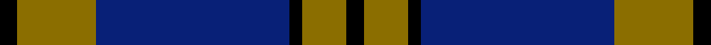

This page is one **sett** — a single exact thread-count. It belongs to the [tartan](/setts/k4y18db44k3y10k4/)
(the same proportion at any scale), whose colour order is pattern [KGBKGK](/stripes/kgbkgk/).

Part of the [Stutterheim](/tartans/stutterheim/) tartan — the named design grouping this sett with its other cloths.

Sourced from register-of-tartans.  It is a [6 stripe tartan](/stripes/stripes6/).

Original link https://www.tartanregister.gov.uk/tartanDetails.aspx?ref=10572

## Register references

External register numbers recorded for this tartan.

- Scottish Register of Tartans: [10572](https://www.tartanregister.gov.uk/tartanDetails.aspx?ref=10572)

## Thread count
K/4 Y18 DB44 K3 Y10 K/4

One full sett is **158 threads**.

## Palette
<table><thead><tr><th>Colour</th><th>Shade</th><th>OKLCh</th></tr></thead><tbody><tr><td>K</td><td><code style="background-color:#000000;">#000000</code> <small style="color:#888">#000000</small></td><td><small style="color:#888">oklch(0.0% 0.000 0.0)</small></td></tr><tr><td>Y</td><td><code style="background-color:#8B6E00;">#8B6E00</code> <small style="color:#888">#8B6E00</small></td><td><small style="color:#888">oklch(55.1% 0.113 90.4)</small></td></tr><tr><td>DB</td><td><code style="background-color:#082077;">#082077</code> <small style="color:#888">#082077</small></td><td><small style="color:#888">oklch(30.0% 0.149 265.1)</small></td></tr></tbody></table>

# Sample pattern

## Nearest variants

The nearest existing variants by ΔTartan distance, with this cloth at the top so the swatches line up against it.

ΔTartan

Threads

Variant

Sett

—

158

<a href="/variants/s6/k4y18db44k3y10k4/">Stutterheim</a>

<a href="/ttd/edit/#slug=k4ly18db44k3ly10k4&amp;base=k4y18db44k3y10k4" title="compare in the TTD">0.00</a>

158

<a href="/variants/s6/k4ly18db44k3ly10k4/">Stutterheim (Corporate)</a>

<a href="/ttd/edit/#slug=y8w3db40k12w3y3~x2&amp;base=k4y18db44k3y10k4" title="compare in the TTD">2.01</a>

254

<a href="/variants/s6/y8w3db40k12w3y3~x2/">Wolverine (Corporate)</a>

<a href="/ttd/edit/#slug=y2k9w3k9db35w2~x2&amp;base=k4y18db44k3y10k4" title="compare in the TTD">2.39</a>

232

<a href="/variants/s6/y2k9w3k9db35w2~x2/">Hannah (Personal)</a>

<a href="/ttd/edit/#slug=y8k3db40k15y3~x2&amp;base=k4y18db44k3y10k4" title="compare in the TTD">2.69</a>

254

<a href="/variants/s5/y8k3db40k15y3~x2/">Wolverine Corporate Tartan</a>

<a href="/ttd/edit/#slug=k3db10y5db29k10r6k2~x2&amp;base=k4y18db44k3y10k4" title="compare in the TTD">2.72</a>

250

<a href="/variants/s7/k3db10y5db29k10r6k2~x2/">Perkins (2015)</a>

<a href="/ttd/edit/#slug=k3db30k8w8k2r3~x2&amp;base=k4y18db44k3y10k4" title="compare in the TTD">2.86</a>

204

<a href="/variants/s6/k3db30k8w8k2r3~x2/">Hydro-Electric</a>

<a href="/ttd/edit/#slug=k2db11k26g11k2~x2&amp;base=k4y18db44k3y10k4" title="compare in the TTD">2.95</a>

200

<a href="/variants/s5/k2db11k26g11k2~x2/">Campbell of Loch Awe</a>

<a href="/ttd/edit/#slug=k4y1k20t20k1t4~x4&amp;base=k4y18db44k3y10k4" title="compare in the TTD">2.98</a>

368

<a href="/variants/s6/k4y1k20t20k1t4~x4/">Oakleigh (Corporate)</a>

## Neighbour map

Every grey dot is one of 13620 variants placed by the first two principal components of the ΔTartan feature space (42% of its variance). Red is this tartan; blue dots are its nearest — click one to open its page.

<svg viewBox="0 0 640 380" role="img" style="max-width:100%;height:auto;border:1px solid #e0e0e0;border-radius:4px;display:block" xmlns="http://www.w3.org/2000/svg"><image href="/nn/cloud.v1.png" width="640" height="380"/><a href="/variants/s6/k4ly18db44k3ly10k4/"><circle cx="270.3" cy="166.9" r="4" fill="#3465a4"><title>Stutterheim (Corporate)</title></circle></a><a href="/variants/s6/y8w3db40k12w3y3~x2/"><circle cx="290.4" cy="159.3" r="4" fill="#3465a4"><title>Wolverine (Corporate)</title></circle></a><a href="/variants/s6/y2k9w3k9db35w2~x2/"><circle cx="311.4" cy="146.0" r="4" fill="#3465a4"><title>Hannah (Personal)</title></circle></a><a href="/variants/s5/y8k3db40k15y3~x2/"><circle cx="312.8" cy="161.7" r="4" fill="#3465a4"><title>Wolverine Corporate Tartan</title></circle></a><a href="/variants/s7/k3db10y5db29k10r6k2~x2/"><circle cx="310.3" cy="164.0" r="4" fill="#3465a4"><title>Perkins (2015)</title></circle></a><a href="/variants/s6/k3db30k8w8k2r3~x2/"><circle cx="259.9" cy="148.8" r="4" fill="#3465a4"><title>Hydro-Electric</title></circle></a><a href="/variants/s5/k2db11k26g11k2~x2/"><circle cx="294.3" cy="197.8" r="4" fill="#3465a4"><title>Campbell of Loch Awe</title></circle></a><a href="/variants/s6/k4y1k20t20k1t4~x4/"><circle cx="299.7" cy="165.4" r="4" fill="#3465a4"><title>Oakleigh (Corporate)</title></circle></a><circle cx="309.2" cy="177.6" r="5" fill="#c00000"/><text x="320" y="376" text-anchor="middle" font-size="11" fill="#999">ground</text><text x="11" y="190" text-anchor="middle" font-size="11" fill="#999" transform="rotate(-90 11 190)">complexity</text></svg>

ID: /variants/s6/k4y18db44k3y10k4/
