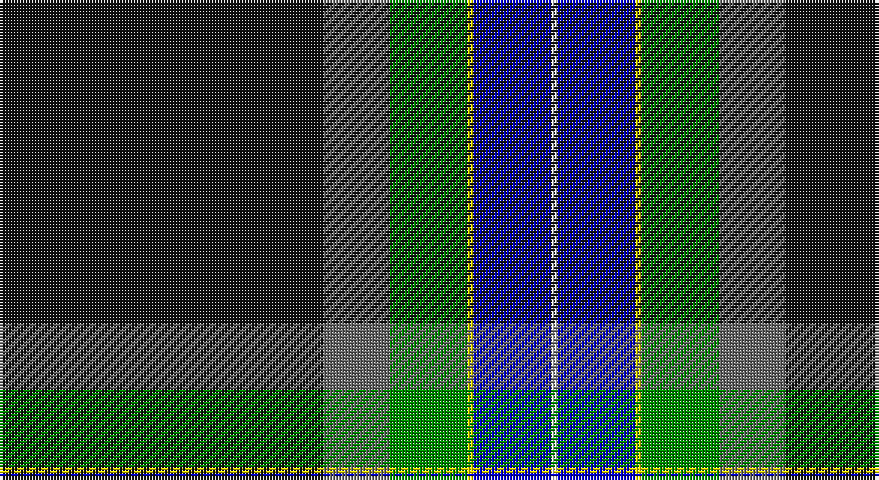

This page is one **sett** — a single exact thread-count. It belongs to the [tartan](/setts/k54n11g13ly1db13w1/)
(the same proportion at any scale), whose colour order is pattern [KBGYBW](/stripes/kbgybw/).

Sourced from register-of-tartans.  It is a [6 stripe tartan](/stripes/stripes6/).

Original link https://www.tartanregister.gov.uk/tartanDetails.aspx?ref=10423

## Register references

External register numbers recorded for this tartan.

- Scottish Register of Tartans: [10423](https://www.tartanregister.gov.uk/tartanDetails.aspx?ref=10423)

## Thread count
K/108 N22 G26 Y2 B26 W/2

One full sett is **262 threads**.

## Palette

Palette: <strong>Tartan Register</strong> <small style="color:#888">(4 of 6 colours)</small>
<table><thead><tr><th>Colour</th><th>Threads</th><th>Shade</th><th>Base</th><th>OKLCh</th></tr></thead><tbody><tr><td>K/</td><td style="text-align:right;font-variant-numeric:tabular-nums">108</td><td><code style="background-color:#101010;">#101010</code> <small style="color:#888">#101010</small></td><td>K <code style="background-color:#000000;">#000000</code></td><td><small style="color:#888">oklch(17.3% 0.000 89.9)</small></td></tr><tr><td>N</td><td style="text-align:right;font-variant-numeric:tabular-nums">22</td><td><code style="background-color:#666666;">#666666</code> <small style="color:#888">#666666</small></td><td>B <code style="background-color:#2A418A;">#2A418A</code></td><td><small style="color:#888">oklch(51.0% 0.000 89.9)</small></td></tr><tr><td>G</td><td style="text-align:right;font-variant-numeric:tabular-nums">26</td><td><code style="background-color:#008B00;">#008B00</code> <small style="color:#888">#008B00</small></td><td>G <code style="background-color:#006100;">#006100</code></td><td><small style="color:#888">oklch(55.2% 0.188 142.5)</small></td></tr><tr><td>Y</td><td style="text-align:right;font-variant-numeric:tabular-nums">2</td><td><code style="background-color:#FFE700;">#FFE700</code> <small style="color:#888">#FFE700</small></td><td>Y <code style="background-color:#F2BF00;">#F2BF00</code></td><td><small style="color:#888">oklch(91.9% 0.192 101.8)</small></td></tr><tr><td>B</td><td style="text-align:right;font-variant-numeric:tabular-nums">26</td><td><code style="background-color:#0000CD;">#0000CD</code> <small style="color:#888">#0000CD</small></td><td>B <code style="background-color:#2A418A;">#2A418A</code></td><td><small style="color:#888">oklch(38.3% 0.266 264.1)</small></td></tr><tr><td>W/</td><td style="text-align:right;font-variant-numeric:tabular-nums">2</td><td><code style="background-color:#FFFFFF;">#FFFFFF</code> <small style="color:#888">#FFFFFF</small></td><td>W <code style="background-color:#F7F7F7;">#F7F7F7</code></td><td><small style="color:#888">oklch(100.0% 0.000 89.9)</small></td></tr></tbody></table>

# Sample pattern

## Nearest tartans

The nearest existing variants by ΔTartan distance, with this tartan at the top so the swatches line up against it.

ΔTartan

Tartan

Sett

—

<a href="/ttd/edit/#slug=k54n11g13ly1db13w1~x2">Kilmaine Saints</a> <a class="nn-out" href="/variants/s6/k54n11g13ly1db13w1~x2/" title="open its dictionary page">↗</a>

0.42

<a href="/ttd/edit/#slug=k54o11g13lo1b13w1~x2&amp;base=k54n11g13ly1db13w1~x2">Kilmaine Saints (Corporate)</a> <a class="nn-out" href="/variants/s6/k54o11g13lo1b13w1~x2/" title="open its dictionary page">↗</a>

1.25

<a href="/ttd/edit/#slug=db50dg25lo3o8r1w1r1~x2&amp;base=k54n11g13ly1db13w1~x2">Wells (2014)</a> <a class="nn-out" href="/variants/s7/db50dg25lo3o8r1w1r1~x2/" title="open its dictionary page">↗</a>

1.28

<a href="/ttd/edit/#slug=db36k10g3r3g6k1ly2~x2&amp;base=k54n11g13ly1db13w1~x2">MacLaurin, of Brioch</a> <a class="nn-out" href="/variants/s7/db36k10g3r3g6k1ly2~x2/" title="open its dictionary page">↗</a>

1.34

<a href="/ttd/edit/#slug=k43ly3dg1w1db1ly3db25r2~x2&amp;base=k54n11g13ly1db13w1~x2">Royal Yacht Britannia</a> <a class="nn-out" href="/variants/s8/k43ly3dg1w1db1ly3db25r2~x2/" title="open its dictionary page">↗</a>

1.35

<a href="/ttd/edit/#slug=t23w3k10r2dt45ly1~x2&amp;base=k54n11g13ly1db13w1~x2">Kirkcaldy Name Tartan</a> <a class="nn-out" href="/variants/s6/t23w3k10r2dt45ly1~x2/" title="open its dictionary page">↗</a>

1.50

<a href="/ttd/edit/#slug=r4k2w6k2db40k80dg10w6r3&amp;base=k54n11g13ly1db13w1~x2">Italian American</a> <a class="nn-out" href="/variants/s9/r4k2w6k2db40k80dg10w6r3/" title="open its dictionary page">↗</a>

1.50

<a href="/ttd/edit/#slug=k40dg21w3r1ly2k12dt12k10~x2&amp;base=k54n11g13ly1db13w1~x2">MacNeill, Royce (Personal)</a> <a class="nn-out" href="/variants/s8/k40dg21w3r1ly2k12dt12k10~x2/" title="open its dictionary page">↗</a>

1.51

<a href="/ttd/edit/#slug=db64k11r2k4r2k4g32y4~x2&amp;base=k54n11g13ly1db13w1~x2">Sinclair-Brown</a> <a class="nn-out" href="/variants/s8/db64k11r2k4r2k4g32y4~x2/" title="open its dictionary page">↗</a>

1.54

<a href="/ttd/edit/#slug=r4k2w6k2b40k80g10w6r3&amp;base=k54n11g13ly1db13w1~x2">Italian American (Corporate)</a> <a class="nn-out" href="/variants/s9/r4k2w6k2b40k80g10w6r3/" title="open its dictionary page">↗</a>

1.56

<a href="/ttd/edit/#slug=db46lyi1ly3dg13lyi1r7g3lyi1~x2&amp;base=k54n11g13ly1db13w1~x2">Victorian Highland Pipe Band Assoc</a> <a class="nn-out" href="/variants/s8/db46lyi1ly3dg13lyi1r7g3lyi1~x2/" title="open its dictionary page">↗</a>

## Neighbour map

Every grey dot is one of 14360 variants placed by the first two principal components of the ΔTartan feature space (44% of its variance). Red is this tartan; blue dots are its nearest — click one to open its page.

<svg viewBox="0 0 640 380" role="img" style="max-width:100%;height:auto;border:1px solid #e0e0e0;border-radius:4px;display:block" xmlns="http://www.w3.org/2000/svg"><image href="/nn/cloud.v1.png" width="640" height="380"/><a href="/variants/s6/k54o11g13lo1b13w1~x2/"><circle cx="342.1" cy="110.7" r="4" fill="#3465a4"><title>Kilmaine Saints (Corporate)</title></circle></a><a href="/variants/s7/db50dg25lo3o8r1w1r1~x2/"><circle cx="371.3" cy="104.0" r="4" fill="#3465a4"><title>Wells (2014)</title></circle></a><a href="/variants/s7/db36k10g3r3g6k1ly2~x2/"><circle cx="352.6" cy="116.1" r="4" fill="#3465a4"><title>MacLaurin, of Brioch</title></circle></a><a href="/variants/s8/k43ly3dg1w1db1ly3db25r2~x2/"><circle cx="353.7" cy="90.9" r="4" fill="#3465a4"><title>Royal Yacht Britannia</title></circle></a><a href="/variants/s6/t23w3k10r2dt45ly1~x2/"><circle cx="331.8" cy="121.2" r="4" fill="#3465a4"><title>Kirkcaldy Name Tartan</title></circle></a><a href="/variants/s9/r4k2w6k2db40k80dg10w6r3/"><circle cx="341.0" cy="97.3" r="4" fill="#3465a4"><title>Italian American</title></circle></a><a href="/variants/s8/k40dg21w3r1ly2k12dt12k10~x2/"><circle cx="365.7" cy="133.6" r="4" fill="#3465a4"><title>MacNeill, Royce (Personal)</title></circle></a><a href="/variants/s8/db64k11r2k4r2k4g32y4~x2/"><circle cx="312.4" cy="116.1" r="4" fill="#3465a4"><title>Sinclair-Brown</title></circle></a><a href="/variants/s9/r4k2w6k2b40k80g10w6r3/"><circle cx="328.1" cy="89.0" r="4" fill="#3465a4"><title>Italian American (Corporate)</title></circle></a><a href="/variants/s8/db46lyi1ly3dg13lyi1r7g3lyi1~x2/"><circle cx="390.7" cy="88.4" r="4" fill="#3465a4"><title>Victorian Highland Pipe Band Assoc</title></circle></a><circle cx="335.8" cy="109.3" r="5" fill="#c00000"/></svg>

ID: /variants/s6/k54n11g13ly1db13w1~x2/
